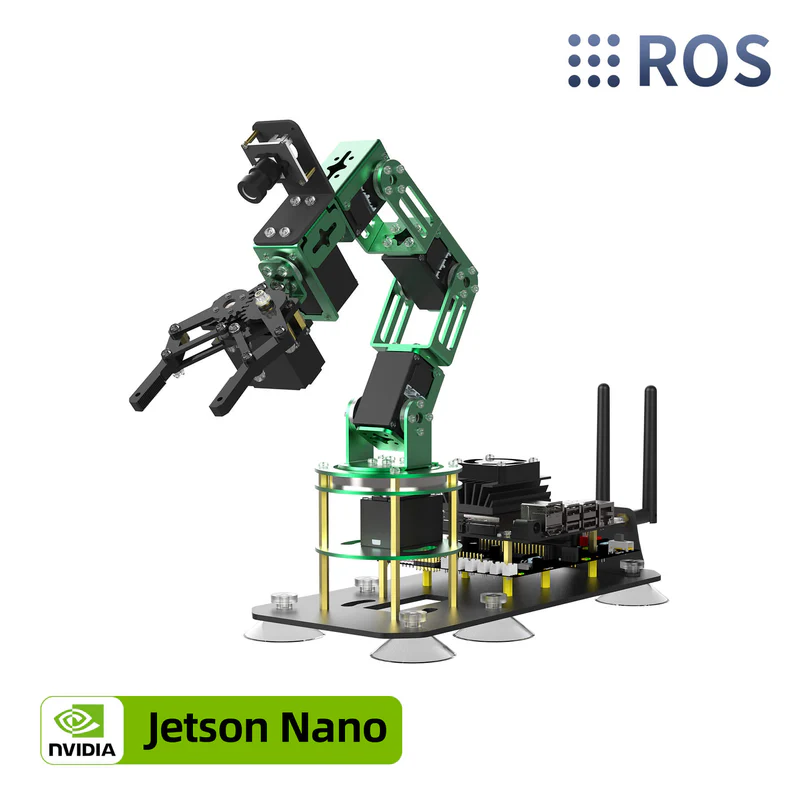

# DOFBOT JETSON NANO

**[ACCUEIL](../README.md)  -                                                                                                               [SYSTEMES](../README.md)**                                                                                  

## Abstract / Objectif

Au c�ur de notre dispositif, le bras robotique�**DOFBOT**�orchestre les op�rations de manipulation et de tri. Cette unit� articul�e �**5 degr�s de libert�**, dot�e d'une pince haute pr�cision, est pilot�e par un syst�me de vision par ordinateur s'appuyant sur l'architecture�**YOLO**. Cette synergie entre m�canique et intelligence artificielle permet une identification instantan�e et un tri s�lectif rigoureux des flux de d�chets.

## Introduction

Dans le cadre du **TEKBOT Robotics Challenge 2025 (TRC25)**, le projet ***EcoCity*** vise � simuler un syst�me intelligent de gestion des d�chets urbains reposant sur la robotique collaborative et la vision artificielle.

Le ***DOFBOT Jetson Nano*** constitue un �l�ment central de ce syst�me. Il est utilis� comme **bras robotique** intelligent de tri automatique, int�gr� au niveau de la ***station de tri***, en interaction directe avec un robot mobile collecteur et un convoyeur de d�chets.

Son r�le principal est d'*identifier, saisir et trier automatiquement les d�chets* en fonction de leur cat�gorie, gr�ce � une combinaison de :

- Vision par ordinateur (YOLOv8)
- Planification de mouvements (MoveIt)
- Communication robotique (ROS)
- Calcul de position 3D dans l'espace du bras



## **1. Sp�cifications Techniques**

| Caract�ristiques | Valeur |
| --- | --- |
| Degr�s de libert� | **6 DOF**�(5 articulations + 1 pince motoris�e) |
| Charge utile | **200g**�(poids levable bras tendu) /�**500g**�(poids max en manipulation/pince) |
| Rayon d'action | Environ�**350 mm**�(port�e maximale du bras) / Rayon efficace de�**300 mm** |
| Pr�cision | **�0,5 mm**�(r�p�tabilit� de positionnement) |
| Unit� de calcul | **NVIDIA Jetson Nano 4GB**�(CPU Quad-core A57 + GPU Maxwell 128 c�urs) |
| Framework | **ROS**�(Robot Operating System),�**Python 3**, OpenCV, MediaPipe |
| Vision  | Cam�ra�**HD USB (0.3 MP)**�grand angle avec traitement d'image IA en temps r�el |
| Temps de cycle | **Variable**�(d�pend de l'algorithme d'IA utilis� ; les servos bus sont rapides avec une r�ponse fluide |

## 2. Mise en place mat�rielle et logicielle

### 2.1 R�ception et assemblage du DOFBOT

Apr�s la r�ception du kit **DOFBOT Jetson Nano (Yahboom)**, les op�rations suivantes ont �t� r�alis�es :

### **a. Assemblage m�canique**

- V�rification de l�ensemble des composants :
    - structure m�canique,
    - servomoteurs,
    - carte d�extension,
    - pince de pr�hension,
    - cam�ra.
- Montage complet du bras robotique conform�ment � la **documentation officielle Yahboom**.
- V�rification du c�blage et de la fixation des articulations.

### **b. Installation du Jetson Nano**

- Configuration du syst�me d�exploitation JetPack.
- Connexion r�seau et mise � jour du syst�me.
- Installation des d�pendances n�cessaires au projet, notamment :
    - Python 3,
    - ROS,
    - biblioth�ques de vision et d�IA (Ultralytics, OpenCV),
    - biblioth�ques sp�cifiques au DOFBOT (Arm_lib).

### 2.2 Tests fonctionnels de base

Avant le d�veloppement des modules intelligents, plusieurs tests ont �t� effectu�s :

- Test de communication entre le Jetson Nano et la carte de contr�le du DOFBOT.
- Calibration des servomoteurs.
- Test individuel de chaque articulation :
    - rotation de la base,
    - �l�vation du bras,
    - flexion,
    - ouverture et fermeture de la pince.

Ces tests ont permis de **valider l�int�grit� mat�rielle** et de garantir une base stable pour la suite du d�veloppement.

## 3. Architecture globale du syst�me de tri

Le syst�me de tri intelligent repose sur trois sous-syst�mes principaux :

### 3.1 Convoyeur de d�chets

- Con�u et fabriqu� par les �quipes.
- Transporte les d�chets jusqu�� la zone de d�tection situ�e sous la cam�ra du DOFBOT.
- Sert de d�clencheur pour la phase de d�tection.

### 3.2 Bras robotique DOFBOT Jetson Nano

- �quip� d�une cam�ra embarqu�e.
- R�alise la d�tection, la saisie et le d�p�t des d�chets.
- Ex�cute les trajectoires calcul�es par MoveIt.

### 3.3 Corbeilles de tri

Trois corbeilles color�es repr�sentent les cat�gories de d�chets :

- **Bleue** : d�chets m�nagers
- **Verte** : d�chets recyclables
- **Rouge** : d�chets dangereux

## 4. Missions fonctionnelles du DOFBOT

Le DOFBOT ex�cute les t�ches suivantes de mani�re autonome :

1. **R�ception du d�chet**
    - D�tection de la pr�sence d�un objet sous la cam�ra.
    - Synchronisation avec le convoyeur.
2. **Identification du type de d�chet**
    - Acquisition d�images via la cam�ra.
    - Classification � l�aide d�un mod�le **YOLOv8**.
3. **D�termination de la position de l�objet**
    - Utilisation de **YOLOv8 OBB (Oriented Bounding Boxes)** pour obtenir :
        - la position dans le plan (X, Y),
        - l�orientation de l�objet,
    - Estimation de la distance (axe Z) � partir du principe de la distance focale.
4. **Planification et ex�cution du mouvement**
    - G�n�ration de trajectoires avec **MoveIt**.
    - D�placement du bras vers la position de pr�hension.
5. **Tri et d�p�t**
    - Saisie du d�chet avec la pince.
    - D�p�t dans la corbeille correspondant � la cat�gorie d�tect�e.
6. **Retour en position initiale**
    - Retour � la position de repos.
    - Pr�paration pour le d�chet suivant.

## 5. R�alisation

Cette section pr�sente l�ensemble des travaux effectu�s dans le cadre du d�veloppement et de l�int�gration du **DOFBOT Jetson Nano** au sein de la station de tri intelligente EcoCity. Les travaux ont port� � la fois sur la **vision artificielle**, la **communication robotique**, le **contr�le du bras**, ainsi que sur la **r�solution de probl�mes mat�riels critiques**.

## 5.0 Constitution de la base de donn�es et annotation

Cette �tape constitue le **socle fondamental** du module de reconnaissance visuelle. Elle a consist� en la **collecte d�images r�elles des d�chets**, suivie de leur **annotation rigoureuse**, en vue de l�entra�nement du mod�le de d�tection bas� sur **YOLOv8 OBB**.

### 5.0.1 Nature des d�chets utilis�s

Les d�chets sont repr�sent�s par des **cubes de 3 cm d�ar�te**, sur lesquels sont coll�es des images de d�chets courants que l�on retrouve dans l�environnement urbain. Ces visuels ont �t� fournis par les **organisateurs du TEKBOT Robotics Challenge** et sont pr�sent�s en annexe.

Chaque cube correspond � un **motif de d�chet distinct**, permettant de simuler un large �ventail de cas r�els tout en conservant une g�om�trie compatible avec la pince du DOFBOT.

### 5.0.2 Prise des images

Les images ont �t� acquises **exclusivement � l�aide de la cam�ra embarqu�e du DOFBOT**, afin de garantir une parfaite coh�rence entre les conditions d�entra�nement et les conditions r�elles de d�tection.

Les prises de vue ont �t� r�alis�es :

- sur le **tapis du convoyeur**,
- avec le DOFBOT plac� dans sa **position r�elle de d�tection**,
- en variant volontairement :
    - la luminosit�,
    - la position du cube,
    - son orientation.

Cette diversit� vise � am�liorer la robustesse du mod�le face aux variations environnementales.

Le mod�le devant d�tecter **126 motifs distincts de d�chets**, une premi�re version de la base de donn�es a �t� constitu�e avec **environ 22 images par motif**, soit un total d�environ **2772 images**.

Les images ont �t� captur�es � l�aide d�**OpenCV**, via un script Python d�di� permettant une sauvegarde manuelle contr�l�e.

```python
# Capture Images Camera avec OpenCV
import cv2 
import os

# Cr�er dossier pour stocker les images
save_dir = 'Nom_du_dossier'  # adapte ce chemin si n�cessaire (ex: 'images_dataset')
os.makedirs(save_dir, exist_ok=True)

# Initialiser la cam�ra USB (0 = premi�re cam�ra d�tect�e)
camera = cv2.VideoCapture(1)
camera.set(cv2.CAP_PROP_FRAME_WIDTH, 640)
camera.set(cv2.CAP_PROP_FRAME_HEIGHT, 480)
camera.set(cv2.CAP_PROP_FPS, 30)

i = 0
while True:
    ret, frame = camera.read()
    if not ret:
        print("Impossible de lire la cam�ra.")
        break

    cv2.imshow('Frame', frame)

    # Appuyer sur 's' pour sauvegarder une image
    key = cv2.waitKey(1) & 0xFF
    if key == ord('s'):
        filename = os.path.join(save_dir, f'image_{i:04d}.jpg')
        cv2.imwrite(filename, frame)
        print(f'Saved {filename}')
        i += 1

    # Appuyer sur 'q' pour quitter
    if key == ord('q'):
        break

# Lib�rer la cam�ra et fermer les fen�tres
camera.release()
cv2.destroyAllWindows()

```

Les images finales ont ensuite �t� **r�parties en trois dossiers**, correspondant aux classes :

- d�chets m�nagers,
- d�chets recyclables,
- d�chets dangereux.

Voici-ci dessous quelques images prises. 

### Quelques images du dataset
<table>
  <tr>
    <td></td>
    <td></td>
    <td></td>
  </tr>
  <tr>
    <td></td>
    <td></td>
    <td></td>
  </tr>
  <tr>
    <td></td>
    <td></td>
    <td></td>
  </tr>
</table>


### 5.0.3 Annotation des donn�es

L�annotation des images a �t� r�alis�e � l�aide de la plateforme cloud **Roboflow**, sp�cialis�e dans la gestion des donn�es pour la vision par ordinateur.

Dans le cadre de ce projet, Roboflow a �t� utilis� **uniquement pour l�annotation**, l�entra�nement �tant assur� localement � l�aide de YOLOv8 OBB.

Le processus d�annotation s�est d�roul� selon les �tapes suivantes :

- cr�ation d�un **espace de travail collaboratif** permettant d�inviter jusqu�� cinq annotateurs,
- cr�ation d�un **nouveau projet** d�di� � la d�tection des d�chets,
- t�l�versement des images par classe,
- annotation manuelle de chaque image par **encadrement polygonal de la face sup�rieure du cube**,
- assignation de la classe correspondante (m�nager, recyclable ou dangereux).

Ce choix d�annotation polygonale est justifi� par l�utilisation de **YOLOv8 OBB**, qui exploite des bo�tes orient�es afin d�am�liorer la pr�cision de la d�tection et de la pr�hension.

Une fois l�annotation termin�e, les images ont �t� :

- ajout�es � la dataset par lots,
- r�parties en ensembles :
    - 60 % pour l�entra�nement,
    - 20 % pour les tests,
    - 20 % pour la validation,
- soumises � plusieurs �tapes de pr�traitement, notamment :
    - rotation al�atoire (�45�),
    - augmentation du contraste,
    - ajout de bruit,

ce qui a permis de **tripler la taille effective de la base de donn�es**.

<<<<<<< HEAD:docs/finale/dofbot-jetson-nano.md
[Video d�mo](./assets/dofbot-jetson-nano/Video%20d%C3%A9mo%202e74f1c8b94c81489c5df536bd9be013.md)

La dataset finale a ensuite �t� t�l�charg�e sous forme d�archive compatible avec YOLO.
=======
La dataset finale a ensuite été téléchargée sous forme d’archive compatible avec YOLO.
>>>>>>> 5b5edbd (update finale documentation):docs/finale/trc2025-finale/dofbot-jetson-nano.md

### 5.0.4 Probl�mes rencontr�s et am�liorations apport�es

Apr�s les premiers entra�nements, plusieurs limites ont �t� identifi�es :

- une sensibilit� excessive � la luminosit�,
- une incapacit� � d�tecter certains motifs,
- un d�s�quilibre entre les classes.

Pour corriger ces probl�mes, les am�liorations suivantes ont �t� apport�es :

1. **�quilibrage du nombre d�images par objet**
    
    Le nombre d�images a �t� fix� � **20 images par objet**, avec un ajustement sp�cifique pour les d�chets dangereux afin d�obtenir un nombre �quivalent d�images par classe.
    
2. **Am�lioration des conditions de luminosit�**
    
    Les prises de vue ont �t� r�p�t�es sous des conditions lumineuses plus vari�es.
    
3. **T�l�versement s�par� par objet**
    
    Les images de chaque motif ont �t� t�l�vers�es s�par�ment sur Roboflow, garantissant que les ensembles d�entra�nement, de test et de validation contiennent des images de **tous les objets**, �vitant ainsi tout biais d�apprentissage.
    

Ces ajustements ont permis d�obtenir une base de donn�es **plus robuste, �quilibr�e et repr�sentative**, am�liorant significativement les performances finales du mod�le.

## 5.1 D�veloppement du module de reconnaissance visuelle

### Technologies et biblioth�ques utilis�es

- **Ultralytics YOLOv8**
- **YOLOv8 OBB (Oriented Bounding Boxes)**
- **Python 3**
- **OpenCV (acquisition et pr�traitement des images)**

### Description du travail r�alis�

Le module de reconnaissance visuelle a �t� con�u pour identifier automatiquement les d�chets pr�sents sur le convoyeur et d�terminer leur cat�gorie (m�nager, recyclable ou dangereux). Ce module constitue l��l�ment d�cisionnel central du syst�me de tri.

Le choix de **YOLOv8** s�explique par sa capacit� � effectuer des d�tections rapides et pr�cises en temps r�el, m�me sur une plateforme embarqu�e comme le **Jetson Nano**. L�utilisation de la variante **OBB** permet d�obtenir des bo�tes englobantes orient�es, fournissant non seulement la position de l�objet dans l�image, mais �galement son orientation, information essentielle pour une pr�hension correcte par le bras robotique.

Un mod�le pr�-entra�n� (yolov8n-obb.pt) a �t� utilis� afin de b�n�ficier du transfert d�apprentissage. Cette approche permet d�am�liorer la convergence du mod�le tout en r�duisant le temps d�entra�nement.

### Code d�entra�nement du mod�le YOLOv8 OBB

```python
from ultralytics import YOLO

# Charger le mod�le pr�-entra�n� OBB
model = YOLO("yolov8n-obb.pt")

# Lancer l'entra�nement avec early stopping automatique
metrics = model.train(
    data="data.yaml",
    epochs=50,
    imgsz=640,
    batch=4,
    name="yolov8_cube_obb_model",
    patience=5
)

# Afficher toutes les m�triques finales
print("Toutes les m�triques :")
for k, v in metrics.items():
    print(f"{k}: {v}")
```

### R�sultats obtenus

Les performances obtenues d�montrent l�efficacit� du mod�le :

- **Precision** : 0.976
- **Recall** : 0.966

**M�triques de validation :**

- Precision : 0.9760
- Recall : 0.9658
- mAP@50 : 0.9842
- mAP@50�95 : 0.9019

Ces r�sultats indiquent une excellente capacit� de g�n�ralisation du mod�le, avec un tr�s faible taux de faux positifs et de faux n�gatifs, ce qui est crucial pour un syst�me de tri automatique.

## 5.2 D�tection des d�chets et calcul de leur position 3D

Apr�s l�entra�nement du mod�le YOLOv8, une **architecture ROS distribu�e** a �t� mise en place afin de transformer les r�sultats de d�tection en une position exploitable par le bras robotique.

Cette architecture repose sur **deux n�uds ROS compl�mentaires** :

- `yolo_node` : d�tection et calcul de la position du d�chet dans le rep�re cam�ra
- `waste_tf_node` : transformation de cette position vers le rep�re du bras robotique

### 5.2.1 N�ud `yolo_node` � D�tection et publication dans le rep�re cam�ra

### R�le du n�ud

Le n�ud `yolo_node` est responsable de :

- la r�ception des images de la cam�ra,
- l�ex�cution du mod�le YOLOv8,
- l�estimation de la position 3D du d�chet dans le rep�re **camera_link**,
- la publication de la classe du d�chet et de sa position.

### Topics utilis�s

- **Abonnements** :
    - `/usb_cam/image_raw` (Image) � flux vid�o
    - `/dofbot/execution_status` (String) � synchronisation avec l�ex�cution du bras
- **Publications** :
    - `/waste/pos_cam` (PointStamped) � position du d�chet dans le rep�re cam�ra
    - `/cls_publisher` (String) � classe du d�chet d�tect�

### Principe de fonctionnement

Le n�ud `yolo_node` constitue le **point d�entr�e de la cha�ne de perception visuelle** du syst�me. Il assure la transition entre les donn�es brutes issues de la cam�ra et une information g�om�trique exploitable par les modules robotiques.

Apr�s son initialisation, le n�ud se met en attente de deux flux d�information distincts :

le flux vid�o provenant de la cam�ra USB et le statut d�ex�cution du bras robotique. Cette synchronisation garantit que la d�tection n�est effectu�e que lorsque le bras est dans un �tat stable, �vitant ainsi des incoh�rences dues � des mouvements en cours.

Les images re�ues sous forme de messages ROS `sensor_msgs/Image` sont converties en images OpenCV gr�ce � la fonction `rosimg_to_cv2`. Cette conversion g�re explicitement les diff�rents encodages possibles (`rgb8` ou `bgr8`) afin d�assurer une compatibilit� totale avec la librairie de vision utilis�e.

Une fois le statut `Success` re�u, le n�ud applique le mod�le YOLOv8 � l�image courante � l�aide de la fonction `next_waste_pos`. Cette fonction retourne :

- le vecteur de translation 3D (`tvec`) repr�sentant la position estim�e du d�chet par rapport � la cam�ra,
- la classe du d�chet d�tect�.

Si aucune d�tection valide n�est trouv�e, le n�ud ignore l�image et attend le cycle suivant. Dans le cas contraire, la classe du d�chet est publi�e sur le topic `/cls_publisher`, permettant aux modules d�cisionnels de conna�tre la nature de l�objet � manipuler.

La position 3D du d�chet est ensuite encapsul�e dans un message `geometry_msgs/PointStamped`. L�utilisation de ce type de message permet :

- d�associer explicitement la position au rep�re `camera_link`,
- d�inclure un horodatage pr�cis,
- de faciliter les transformations ult�rieures via le syst�me TF de ROS.

Une fois la publication effectu�e, le statut est r�initialis� afin d��viter des d�tections multiples pour un m�me cycle de manipulation. Ce m�canisme assure un fonctionnement d�terministe et synchronis� entre la perception et l�action.

```python
#!/home/jetson/miniforge3/envs/yolo2/bin/python3.10
# -*- coding: utf-8 -*-
import rospy
from std_msgs.msg import String
from sensor_msgs.msg import Image
from geometry_msgs.msg import PointStamped
import numpy as np
import cv2
from detect_waste_lib_v2 import next_waste_pos

pub = rospy.Publisher("/waste/pos_cam", PointStamped, queue_size=1)
pub1 = rospy.Publisher('/cls_publisher', String, queue_size=1)
rospy.loginfo("Node YOLO lanc�. En attente d'images et de statut Success...")

        
def rosimg_to_cv2(msg):
    """Convert ROS Image message to OpenCV BGR image"""
    if msg.encoding not in ["rgb8", "bgr8"]:
        rospy.logwarn(f"Unexpected encoding {msg.encoding}, converting to rgb8")
    arr = np.frombuffer(msg.data, dtype=np.uint8).reshape((msg.height, msg.width, -1))
    # Convert RGB to BGR if needed
    if msg.encoding == "rgb8":
        arr = cv2.cvtColor(arr, cv2.COLOR_RGB2BGR)
    return arr

statut = "Success"
def callback(msg):
    global statut
    if msg is None:
        rospy.logwarn("Aucune image re�ue encore !")
        return
    frame = rosimg_to_cv2(msg)
    if statut == "Success":
        #print(type(cls),cls)
        tvec,cls = next_waste_pos(frame)
        if tvec is None:
            return
        pub1.publish(String(cls))
        rospy.loginfo("Classe publiee apres statut success recu")
        rate = rospy.Rate(50) # 10hz
        rate.sleep()  
        point = PointStamped()
        point.header.stamp = rospy.Time.now()
        point.header.frame_id = "camera_link"
        point.point.x, point.point.y, point.point.z = tvec
        pub.publish(point)
        rospy.loginfo("Point publie dans le repere de la camera")
        statut = None

def callback_success(data):
    global statut 
    statut = data.data 

rospy.init_node("yolo_detector")
rospy.Subscriber("/usb_cam/image_raw", Image, callback, queue_size=1)
rospy.Subscriber("/dofbot/execution_status", String, callback_success, queue_size=1)
rospy.spin()
```

### 5.2.2 N�ud `waste_tf_node` � Transformation vers le rep�re du bras

### R�le du n�ud

Le n�ud `waste_tf_node` assure le **passage entre la vision et la robotique**. Il transforme la position du d�chet depuis le rep�re cam�ra (`camera_link`) vers le rep�re de base du bras (`base_link`).

### Technologies utilis�es

- `tf.TransformListener`
- `geometry_msgs/PointStamped`
- `visualization_msgs/Marker`

### Topics utilis�s

- **Abonnement** :
    - `/waste/pos_cam` (PointStamped)
- **Publications** :
    - `/waste/pose` (PointStamped)
    - `/visualization_marker` (Marker)

### Principe de fonctionnement

Le n�ud `waste_tf_node` joue un r�le fondamental d�**interface entre la vision et le contr�le du bras robotique**. Il permet de convertir une position d�tect�e dans le rep�re cam�ra en une position exprim�e dans le rep�re de base du bras, indispensable pour la planification de trajectoires.

� la r�ception d�un message `PointStamped` sur le topic `/waste/pos_cam`, le n�ud v�rifie d�abord que le point est bien exprim� dans le rep�re `camera_link`. Cette v�rification constitue une mesure de s�curit� permettant d��viter des erreurs de transformation li�es � un mauvais r�f�rentiel.

Le n�ud utilise ensuite un objet `tf.TransformListener` pour attendre la disponibilit� de la transformation TF entre `camera_link` et `base_link`. Cette attente est synchronis�e avec l�horodatage du message re�u, garantissant une coh�rence temporelle entre la position d�tect�e et l��tat courant du syst�me de transformation.

Une fois la transformation disponible, la position du d�chet est convertie vers le rep�re `base_link`. Le point transform� est alors publi� sur le topic `/waste/pose`, rendant cette information directement exploitable par les modules de planification et de contr�le du bras robotique.

En parall�le, un message de type `visualization_msgs/Marker` est g�n�r�. Ce marqueur, repr�sent� sous forme de sph�re, est publi� dans le rep�re `base_link` et permet de visualiser la position cible du d�chet dans RViz. Les param�tres de taille, de couleur et de position sont configur�s de mani�re � offrir une visualisation claire et intuitive.

Ce m�canisme de visualisation constitue un outil essentiel pour le d�bogage et la validation exp�rimentale. Il permet de v�rifier en temps r�el la coh�rence entre la d�tection visuelle, les transformations de rep�res et la position r�ellement utilis�e par le bras robotique.

```python
#!/usr/bin/env python
import rospy
import tf
from geometry_msgs.msg import PointStamped
from visualization_msgs.msg import Marker

rospy.init_node("waste_tf_node")

pub = rospy.Publisher("/waste/pose", PointStamped, queue_size=1)
marker_pub = rospy.Publisher('/visualization_marker', Marker, queue_size=1)
listener = tf.TransformListener()

def callback(msg):

    rospy.loginfo("Frame recu : %s" % msg.header.frame_id)

    if msg.header.frame_id != "camera_link":
        rospy.logwarn("Le point recu n'est pas dans camera_link !")
        return

    try:
        # important : se synchroniser au timestamp du message
        listener.waitForTransform("base_link", msg.header.frame_id,
                                  msg.header.stamp, rospy.Duration(1.0))

        point_base = listener.transformPoint("base_link", msg)

        pub.publish(point_base)

        marker = Marker()
        marker.header.frame_id = "base_link"
        marker.header.stamp = rospy.Time.now()
        marker.ns = "target_marker"
        marker.id = 0
        marker.type = Marker.SPHERE
        marker.action = Marker.ADD

        marker.pose.position.x = point_base.point.x
        marker.pose.position.y = point_base.point.y
        marker.pose.position.z = point_base.point.z
        marker.pose.orientation.w = 1

        marker.scale.x = marker.scale.y = marker.scale.z = 0.02

        marker.color.b = 1.0
        marker.color.a = 1.0

        marker_pub.publish(marker)

    except Exception as e:
        rospy.logwarn("TF transform error: %s" % e)

rospy.Subscriber("/waste/pos_cam", PointStamped, callback, queue_size=1)
rospy.spin()
```

## 5.3 Communication et contr�le du bras robotique avec ROS

### Technologies et biblioth�ques utilis�es

- **ROS (Robot Operating System)**
- **rospy**
- **robot_state_publisher**
- **URDF (Unified Robot Description Format)**

### Description du travail r�alis�

ROS a �t� utilis� comme middleware principal pour assurer la communication entre les diff�rents modules du syst�me robotique. Il permet une architecture modulaire et �volutive, essentielle pour l�int�gration de la vision artificielle, du contr�le moteur et de la planification de mouvements.

Un n�ud ROS sp�cifique, nomm� **dofbot_state_publisher**, a �t� d�velopp� afin de lire les angles des servomoteurs du DOFBOT et de publier ces informations sur des topics ROS. Ces donn�es sont utilis�es pour :

- repr�senter l��tat du bras dans l�espace,
- alimenter le mod�le cin�matique,
- permettre la planification de trajectoires avec MoveIt.

```python
#!/usr/bin/env python3
import rospy
from sensor_msgs.msg import JointState
import math
from Arm_Lib import Arm_Device  # Librairie officielle

# Initialisation du bras
arm = Arm_Device()

def get_servo_positions():
    """
    Lit les positions r�elles des 6 servos.
    Retourne une liste d'angles en degr�s.
    """
    positions = []
    for i in range(1, 6):
        angle = arm.Arm_serial_servo_read(i)  # 0-180 pour S1-S4,S6 ; 0-270 pour S5
        if angle is None:
            angle = 0
        positions.append(angle)
    return positions

def talker():
    rospy.init_node('dofbot_joint_publisher', anonymous=True)
    pub = rospy.Publisher('/joint_states', JointState, queue_size=10)
    rate = rospy.Rate(2)  # 10 Hz
    joint_names = ['joint1','joint2','joint3','joint4','joint5']

    while not rospy.is_shutdown():
        msg = JointState()
        msg.header.stamp = rospy.Time.now()
        msg.name = joint_names
        positions = get_servo_positions()
        # Conversion en radians et limitation [-pi/2, pi/2]
        msg.position = [(math.radians(p) - math.pi/2) for p in positions]
        pub.publish(msg)
        #rospy.loginfo(f"Positions publi�es (radians) : {msg.position}")
        rate.sleep()

if __name__ == '__main__':
    try:
        talker()
    except rospy.ROSInterruptException:
        pass

```

Le script pr�sent� ci-dessus impl�mente le n�ud ROS `dofbot_state_publisher` ****charg� de publier l��tat instantan� des articulations du bras robotique DOFBOT sous forme de messages `JointState`. Ce n�ud joue un r�le central dans la synchronisation entre le mat�riel r�el et l�environnement logiciel ROS.

Tout d�abord, la librairie officielle `Arm_Lib` est utilis�e pour �tablir la communication avec les servomoteurs du bras. L�objet `Arm_Device` permet d�acc�der directement aux positions r�elles de chaque servo via une liaison s�rie, garantissant ainsi une lecture fid�le de l��tat physique du robot.

La fonction `get_servo_positions()` interroge successivement les servomoteurs du bras et r�cup�re leurs angles de rotation exprim�s en degr�s. Une valeur par d�faut est appliqu�e lorsque la lecture �choue, afin d�assurer la continuit� de fonctionnement du n�ud et d��viter des erreurs lors de la publication des donn�es.

Le n�ud ROS, nomm� `dofbot_joint_publisher`, est initialis� � l�aide de `rospy.init_node`. Il publie p�riodiquement des messages sur le topic standard `/joint_states`, utilis� par ROS pour repr�senter l��tat cin�matique des robots. Le type de message `sensor_msgs/JointState` contient notamment :

- les noms des articulations,
- leurs positions angulaires,
- un horodatage assurant la coh�rence temporelle des donn�es.

Avant la publication, les angles mesur�s en degr�s sont convertis en radians, conform�ment aux conventions de ROS et de MoveIt. Un d�calage de `p/2` est appliqu� afin d�aligner le r�f�rentiel des servomoteurs avec celui du mod�le cin�matique d�fini dans l�URDF.

La boucle principale du n�ud fonctionne � une fr�quence d�finie (2 Hz), permettant une mise � jour r�guli�re de l��tat du bras tout en limitant la charge de communication. Chaque it�ration publie un message `JointState` actualis�, assurant ainsi une repr�sentation coh�rente du bras robotique dans les outils de visualisation tels que RViz.

Gr�ce � ce m�canisme, le mod�le URDF, le `robot_state_publisher` et les modules de planification de trajectoires (MoveIt) disposent en permanence d�une information fiable sur l��tat r�el du robot. Cela garantit la coh�rence entre le bras physique, sa repr�sentation virtuelle et les algorithmes de contr�le et de planification.

Ce m�canisme est indispensable pour la coh�rence entre la perception visuelle, la cin�matique du bras et la planification de trajectoires.

### 5.3 Planification de trajectoires et d�placement r�el du bras DOFBOT

Apr�s avoir obtenu la **position 3D de l�objet** ainsi que sa **classe**, l��tape suivante consiste � **planifier une trajectoire valide** puis � **d�placer physiquement le bras DOFBOT** afin de saisir l�objet et le d�poser dans la **corbeille correspondante**.

Cette partie est **la plus critique de tout le projet**, car elle fait le lien direct entre :

- la perception (vision + TF),
- la d�cision (planification),
- et l�action r�elle (moteurs).

Pour cela, nous utilisons le package **MoveIt** de ROS, qui repose sur la biblioth�que **OMPL (Open Motion Planning Library)** pour la planification de trajectoires.

### 5.3.1 Planification de trajectoires avec MoveIt

### OMPL � Open Motion Planning Library

OMPL est la **biblioth�que de planification de mouvement** utilis�e par d�faut par MoveIt. Elle regroupe plusieurs algorithmes permettant de rechercher un chemin valide dans l�**espace de configuration (C-space)** du robot.

Ces algorithmes fonctionnent par **�chantillonnage al�atoire** de configurations possibles jusqu�� trouver une trajectoire :

- atteignable cin�matiquement,
- respectant les limites articulaires,
- �vitant les collisions.

OMPL est stochastique : pour un m�me sc�nario, la planification peut r�ussir ou �chouer selon les tirages al�atoires.

### Algorithme RRT-Connect

L�algorithme **RRT-Connect (Rapidly-exploring Random Tree � Connect)** est celui utilis� dans ce projet.

Principe :

- cr�ation de deux arbres de recherche :
    - un depuis la position de d�part,
    - un depuis la position cible,
- tentative de connexion des deux arbres.

Cet algorithme est bien adapt� aux **robots manipulateurs � 6 degr�s de libert�**, comme le DOFBOT.

### 5.3.2 Premi�re impl�mentation : `node_moveit_1.py`

### Objectif du n�ud

Ce n�ud r�alise une **planification MoveIt vers un point cible fixe** afin de valider :

- la communication avec MoveIt,
- la g�n�ration de trajectoires,
- l�ex�cution en simulation (RViz).

### Logique g�n�rale du script

Le script :

1. Initialise un n�ud ROS Python.
2. Cr�e une interface `MoveGroupCommander` pour le groupe **dofbot**.
3. D�finit une pose cible (position + orientation).
4. Lance la planification MoveIt.
5. Publie la trajectoire calcul�e.
6. R�utilise la trajectoire si la cible n�a pas chang�.

```python
#!/usr/bin/env python
# coding: utf-8
import rospy
from math import pi
from geometry_msgs.msg import Pose
from std_msgs.msg import String
from trajectory_msgs.msg import JointTrajectory, JointTrajectoryPoint
from moveit_commander.move_group import MoveGroupCommander
from tf.transformations import quaternion_from_euler

#convert degrees to radians
DE2RA=pi / 180

#Convert radians to degrees 
RA2DE=180 / pi

status_received = "Success"
precedent_trajectory = None
precedent_pose = Pose()

def callback(data):
    global status_received
    rospy.loginfo(" Statut d'ex�cution re�u : %s", data.data )
    status_received = data.data

def node_moveit_1():
    global status_received,precedent_trajectory
    #Initialize ROS node
    rospy.init_node("dofbot_motion_plan_py",anonymous=True)
    angle_pub = rospy.Publisher("/dofbot/trajectory",JointTrajectory,queue_size=10)

    #Suscribe to the execution status topic
    rospy.Subscriber("/dofbot/execution_status",String, callback)

    # Initialize the robotic arm motion planning group
    dofbot = MoveGroupCommander("dofbot")
    # Allow replanning when motion planning fails
    dofbot.allow_replanning(True)
    dofbot.set_planning_time(5)
    
    # number of attempts to plan
    dofbot.set_num_planning_attempts(10)
    
    # Set allowable target position error
    dofbot.set_goal_position_tolerance(0.01)
    
    # Set the allowable target attitude error
    dofbot.set_goal_orientation_tolerance(0.01)
    
    # Set allowable target error
    dofbot.set_goal_tolerance(0.01)
    
    # set maximum speed
    dofbot.set_max_velocity_scaling_factor(1.0)
    
    # set maximum acceleration
    dofbot.set_max_acceleration_scaling_factor(1.0)
    
    # Create a pose instance
    pos = Pose()
    diff_pos= Pose()
    # Set a specific location
    pos.position.x = 0.0
    pos.position.y = 0.0597016
    pos.position.z = 0.168051
    
    # The unit of RPY is the angle value
    roll = -140.0
    pitch = 0.0
    yaw = 0.0
    # RPY to Quaternion
    q = quaternion_from_euler(roll * DE2RA, pitch * DE2RA, yaw * DE2RA)
    # pos.orientation.x = 0.940132
    # pos.orientation.y = -0.000217502
    # pos.orientation.z = 0.000375234
    # pos.orientation.w = -0.340811
    pos.orientation.x = q[0]
    pos.orientation.y = q[1]
    pos.orientation.z = q[2]
    pos.orientation.w = q[3]
    
    while not rospy.is_shutdown() :
        while not rospy.is_shutdown() and status_received != "Success":
            rospy.loginfo(" En attente du statut Success...")
            rospy.sleep(0.1)
    
        if rospy.is_shutdown():
            return
        rospy.loginfo(" Planification du mouvement pour la position cible...")

        # V�rification si la position est la m�me ou n'est pas trop differente de l

        diff_pos.position.x=pos.position.x-precedent_pose.position.x
        diff_pos.position.y=pos.position.y-precedent_pose.position.y
        diff_pos.position.z=pos.position.z-precedent_pose.position.z
        diff_pos1=(diff_pos.position.x**2+diff_pos.position.y**2+diff_pos.position.z**2)**0.5        
        if  diff_pos1<0.03:
            rospy.loginfo("?? M�me position que pr�c�demment, r�utilisation de la trajectoire pr�c�dente")
            angle_pub.publish(precedent_trajectory)
            status_received=None
            rospy.sleep(0.5)
            continue

        # set target point
        dofbot.set_pose_target(pos)
    
        # Execute multiple times to improve the success rate
        for i in range(5):
            # motion planning
            plan = dofbot.plan()
            trajectory = plan.joint_trajectory
    
            if len(trajectory.points) != 0:
                rospy.loginfo("Plan success!")
                # Run after planning is successful
                angle_pub.publish(trajectory)
                rospy.loginfo("Publish trajectory!")
                status_received =None
                precedent_trajectory=trajectory
                precedent_pose=pos
                rospy.sleep(0.5)
                break
            else:
                rospy.loginfo("Plan error")
    rospy.spin()

if __name__ == '__main__':
    try:
        node_moveit_1()
    except rospy.ROSInterruptException:
        pass    
                   
```

Ce script impl�mente un **n�ud ROS de planification de mouvement** pour le bras DOFBOT en utilisant **MoveIt**. Le n�ud, nomm� `dofbot_motion_plan_py`, publie des trajectoires articulaires sur le topic `/dofbot/trajectory` et s�assure que chaque plan est ex�cut� uniquement apr�s r�ception d�un statut `"Success"` sur `/dofbot/execution_status`, garantissant la **synchronisation avec le module d�ex�cution**.

Une **pose cible fixe** est d�finie, avec orientation calcul�e � partir d�angles d�Euler convertis en quaternion. Le n�ud inclut un m�canisme de **r�utilisation de trajectoire** pour �viter de recalculer des plans lorsque la pose cible ne change pas significativement. Chaque plan valide est publi� et enregistr� comme trajectoire pr�c�dente, assurant ainsi une **planification stable et efficace**.

Ce n�ud constitue une **brique de base du contr�le par MoveIt**, permettant de tester et de valider la planification du bras dans des positions fixes pour le projet EcoCity.

### Vid�o de fonctionnement

<p align="center">
  <a href="https://vimeo.com/1151044989">
    
    <br>
    ▶️ <b>Démonstration du bras robotique Dofbot Jetson Nano</b>
  </a>
</p>


### Limite observ�e

Lors de l�ex�cution, on observe que :

- ce n�est pas le **bout r�el de la pince** qui atteint l�objet,
- mais le **link 5** (dernier maillon de la cha�ne cin�matique).

Cela rend la **pr�hension impossible ou impr�cise**.

### 5.3.3 Origine du probl�me de l�effecteur

Le probl�me provient de la **description du robot** :

- Le fichier **URDF** fourni avec le DOFBOT **ne contient pas le link de la pince**.
- Le fichier **SRDF**, g�n�r� � partir de l�URDF, **ne d�finit donc aucun effecteur**.

Dans ce cas, MoveIt consid�re automatiquement le **dernier link de la cha�ne cin�matique** comme effecteur.

Cha�ne cin�matique utilis�e :

```
['base_link', 'link1', 'link2', 'link3', 'link4', 'link5']

```

Donc **link5 est consid�r� comme effecteur**, ce qui explique le comportement observ�.

### 5.3.4 R�solution : m�thode des deux planifications

### Principe g�n�ral

L�objectif est de faire en sorte que le **bout r�el de la pince** atteigne la position cible, m�me si MoveIt planifie vers **link5**.

?? L�id�e est donc de calculer une **position corrig�e**, appel�e **position soustraite**, telle que :

- lorsque link5 atteint cette position,
- alors la pince r�elle atteint exactement l�objet.

Sch�ma cin�matique du robot


### Mod�lisation math�matique

Soit :

- (P_0(x,y,z)) la position cible r�elle de l�objet,
- (P_s(x_s,y_s,z_s)) la position soustraite.

Relation g�om�trique :

$$
\begin{cases}x_s = x - h_x \\y_s = y - h_y \\z_s = z + h_z\end{cases}
$$

Les termes (h_x, h_y, h_z) d�pendent de la **g�om�trie du bras** et des **angles articulaires**. Consid�rons un vecteur **h1** qui dirige la pince et dans le meme sens que **z5**.

$$
Dans \, \,  R1, on  \, a: \\ \vec{h}_1=h_1y\,\vec{y}_1-h_1z\,\vec{z}_1 \,\ avec 
\begin{cases}
h_1y =|\ell\sin\theta|

\\[6pt]
h_1z =|\ell\cos\theta|

\end{cases}
\\Dans \, \,  R0, on  \, a: \\ \vec{h}_1=h_x\,\vec{x}_0 + h_y\,\vec{y}_0 -h_z\,\vec{z}_0 

$$

- **Relation entre les rep�res 3 et 4 (rotation d�angle gamma) (R34)**

.jpg)

$$
\begin{cases}-\vec{x}_4 = \cos\gamma\,\vec{y}_3 - \sin\gamma\,\vec{x}_3 \\\vec{y}_4 = \cos\gamma\,\vec{x}_3 + \sin\gamma\,\vec{y}_3\end{cases}
$$

- **Relation entre les rep�res 2 et 3 (rotation d�angle �) (R23)**


$$
\begin{cases}-\vec{x}_3 = \cos\beta\,\vec{y}_2 - \sin\beta\,\vec{x}_2 \\\vec{y}_3 = \cos\beta\,\vec{x}_2 + \sin\beta\,\vec{y}_2\end{cases}
$$

- **Relation entre les rep�res 1 et 2 (rotation d�angle a) (R21)**


$$
\begin{cases}-\vec{x}_2 = \cos\alpha\,\vec{y}_1 + \sin\alpha\,\vec{z}_1 \\\vec{y}_2 = -\cos\alpha\,\vec{z}_1 + \sin\alpha\,\vec{y}_1\end{cases}
$$

- **Relations entre les rep�res 4 et 5 (R45)**


$$
\begin{cases}\vec{z}_5 = -\vec{x}_4 \\\vec{y}_5 = \vec{y}_4\end{cases}
$$

- **Relation entre le rep�re 5 et le rep�re 1 (angle ?\theta?) (R51)**


$$
\begin{cases}\vec{z}_5 &= \sin \theta \, \vec{y}_1 - \cos \theta \, \vec{z}_1 \\\vec{y}_5 &= -\sin \theta \, \vec{z}_1 - \cos \theta \, \vec{y}_1\end{cases}
$$

- **Relation entre rep�re 1 et 0 ( eta)**


$$
\begin{cases}\vec{y}_1 = \cos\eta\,\vec{x}_0 + \sin\eta\,\vec{y}_0 \\\vec{z}_1 = \vec{z}_0\end{cases}
$$

### Calcul

A ce niveau, on exploite les relations entre les diff�rents rep�res pour pouvoir  d�terminer hx, hy et hz.

- **Relations du rep�re 3 exprim� dans le rep�re 1**

$$

\begin{cases}
\vec{x}_3
=\cos\beta\left(-\cos\alpha\,\vec{y}_1 +\sin\alpha\,\vec{z}_1\right)
+\sin\beta\left(\cos\alpha\,\vec{z}_1 +\sin\alpha\,\vec{y}_1\right)
\\[6pt]
\vec{y}_3
=\cos\beta\left(\cos\alpha\,\vec{z}_1 +\sin\alpha\,\vec{y}_1\right)
+\sin\beta\left(-\cos\alpha\,\vec{y}_1 +\sin\alpha\,\vec{z}_1\right)
\end{cases}

$$

- **Simplification**

$$

\begin{cases}
\vec{x}_3 =\sin(\alpha+\beta)\,\vec{y}_1 -\cos(\alpha+\beta)\,\vec{z}_1
\\[6pt]
\vec{y}_3 =\cos(\alpha+\beta)\,\vec{y}_1 +\sin(\alpha+\beta)\,\vec{z}_1
\end{cases}

$$

- **Rep�re 4 exprim� dans le rep�re 3 (rotation gamma)**

$$

\begin{cases}
\vec{x}_4
=\cos\gamma\left(\cos(\alpha+\beta)\,\vec{y}_1 -\sin(\alpha+\beta)\,\vec{z}_1\right)
+\sin\gamma\left(\sin(\alpha+\beta)\,\vec{y}_1 +\cos(\alpha+\beta)\,\vec{z}_1\right)
\\[6pt]
\vec{y}_4
= -\cos\gamma\left(\sin(\alpha+\beta)\,\vec{y}_1 +\cos(\alpha+\beta)\,\vec{z}_1\right)
+\sin\gamma\left(\cos(\alpha+\beta)\,\vec{y}_1 -\sin(\alpha+\beta)\,\vec{z}_1\right)
\end{cases}

$$

- **Relations entre les rep�res 4 et 5**

$$

\begin{cases}
\vec{z}_5 = -\vec{x}_4
\\[6pt]
\vec{y}_5 =\vec{y}_4
\end{cases}

$$

- **Rep�re 5 exprim� dans le rep�re 1**

$$
\begin{cases}
\vec{z}_5
= -\cos(\alpha+\beta+\gamma)\,\vec{y}_1
-\sin(\alpha+\beta+\gamma)\,\vec{z}_1
\\[6pt]
\vec{y}_5
= -\sin(\alpha+\beta+\gamma)\,\vec{y}_1
+\cos(\alpha+\beta+\gamma)\,\vec{z}_1
\end{cases}

$$

- **Relations trigonom�triques �crites explicitement**

$$

\begin{cases}
\sin\theta = -\cos(\alpha+\beta+\gamma)
\\[6pt]
\cos\theta =\sin(\alpha+\beta+\gamma)
\end{cases}

$$

- **Obtention de h1y et h1z**

$$

\begin{cases}
h_1y =|\ell\sin\theta|
=\left| -\ell\cos(\alpha+\beta+\gamma)\right|
\\[6pt]
h_1z =|\ell\cos\theta|
=\left|\ell\sin(\alpha+\beta+\gamma)\right|
\end{cases}

$$

- **Utilisation de la relation R10**

$$
 \vec{h}_1=h_1y\,\cos\eta\,\vec{x}_0+h_1y\,\sin\eta\,\vec{y}_0-h_1z\,\vec{z}_0 =h_x\,\vec{x}_0 + h_y\,\vec{y}_0 - h_z\,\vec{z}_0 

$$

- **Obtention de hx,hy et hz**

$$

\begin{cases}
h_{x} =|\ell\cos(\alpha+\beta+\gamma)|\cos\eta
\\[6pt]
h_{y} =|\ell\cos(\alpha+\beta+\gamma)|\sin\eta
\\[6pt]
h_{z} =|\ell\sin(\alpha+\beta+\gamma)|
\end{cases}

$$

Il est important de pr�ciser qu�on prendra **hz= hz-0.02** pour que le bras descende de 2cm afin de pouvoir aggriper l�objet avec la pince . 

Donc on a:

$$

\begin{cases}
x\_s=x-|\ell\cos(\alpha+\beta+\gamma)|\cos\eta
\\[6pt]
y\_s =y-|\ell\cos(\alpha+\beta+\gamma)|\sin\eta
\\[6pt]
z\_s =z+|\ell\sin(\alpha+\beta+\gamma)| -0.02
\end{cases}

$$

**Pourquoi le nom �deux planifications� ?**

Le nom �deux planifications d�rive du fait que l�on effectue deux planifications avec Moveit . La premi�re planification est pour obtenir les valeurs des angles **a ,� ,? et ?** lorsque le pseudo effecteur atteint la position cible et avec ces valeurs on d�termine le point soustrait. La deuxi�me planification correspond � la d�termination des angles qu�il faut pour que l�effecteur r�el atteigne l�objet.

### 5.3.5 Impl�mentation logicielle de la correction

### `node_moveit_1_modified.py`

Ce script int�gre la **m�thode des deux planifications** directement dans la phase de planification MoveIt.

Fonctions principales :

- r�cup�ration des angles issus de la premi�re planification,
- calcul automatique de la position soustraite,
- replanification vers la position corrig�e,
- publication de la trajectoire finale.

```python
#!/usr/bin/env python
# coding: utf-8
import rospy
from math import pi
from geometry_msgs.msg import Pose
from std_msgs.msg import String
from trajectory_msgs.msg import JointTrajectory, JointTrajectoryPoint
from moveit_commander.move_group import MoveGroupCommander
from tf.transformations import quaternion_from_euler
from math import sin,cos
#convert degrees to radians
DE2RA=pi / 180

link5_claw=0.1 # Distance from link5 to the end effector (claw) along the Z-axis

#Convert radians to degrees 
RA2DE=180 / pi

status_received = "Success"
precedent_trajectory = None
precedent_pose = Pose()

def xyz_soustrait(trajectory):
    global link5_claw
    last_point = trajectory.points[-1]
    sum=0
    for i in range(5):
        if(i== 1 or i==2 or i==3):
            sum+=last_point.positions[i]+pi/2
        
    x_soustrait=-abs(link5_claw*cos(sum))*cos(last_point.positions[0]+pi/2)
    y_soustrait=-abs(link5_claw*cos(sum))*sin(last_point.positions[0]+pi/2)
    z_soustrait=abs(link5_claw*sin(sum))-0.02
    return x_soustrait,y_soustrait,z_soustrait

def callback(data):
    global status_received
    rospy.loginfo("Statut d'ex�cution re�u : %s", data.data )
    status_received = data.data

def node_moveit_1_modified():
    global status_received,precedent_trajectory,precedent_pose
    #Initialize ROS node
    rospy.init_node("dofbot_motion_plan_py",anonymous=True)
    angle_pub = rospy.Publisher("/dofbot/trajectory",JointTrajectory,queue_size=10)
    pos_substract_pub=rospy.Publisher("/dofbot/pose_substract",Pose,queue_size=10)
    #Suscribe to the execution status topic
    rospy.Subscriber("/dofbot/execution_status",String, callback)

    # Initialize the robotic arm motion planning group
    dofbot = MoveGroupCommander("dofbot")
    # Allow replanning when motion planning fails
    dofbot.allow_replanning(True)
    dofbot.set_planning_time(10)
    
    # number of attempts to plan
    dofbot.set_num_planning_attempts(10)
    
    # Set allowable target position error
    dofbot.set_goal_position_tolerance(0.01)
    
    # Set the allowable target attitude error
    dofbot.set_goal_orientation_tolerance(0.01)
    
    # Set allowable target error
    dofbot.set_goal_tolerance(0.01)
    
    # set maximum speed
    dofbot.set_max_velocity_scaling_factor(1.0)
    
    # set maximum acceleration
    dofbot.set_max_acceleration_scaling_factor(1.0)
    
    # Create a pose instance
    pos = Pose()
    pos_substract=Pose()
    diff_pos= Pose() 
    # Set a specific location
    pos.position.x =  0.00524654022755
    pos.position.y = 0.184362284878 # Modified Y position
    pos.position.z =0.132090817375

    # The unit of RPY is the angle value
    roll = -140.0
    pitch = 0.0
    yaw = 0.0
    # RPY to Quaternion
    q = quaternion_from_euler(roll * DE2RA, pitch * DE2RA, yaw * DE2RA)
    # pos.orientation.x = 0.940132
    # pos.orientation.y = -0.000217502
    # pos.orientation.z = 0.000375234
    # pos.orientation.w = -0.340811
    pos.orientation.x = q[0]
    pos.orientation.y = q[1]
    pos.orientation.z = q[2]
    pos.orientation.w = q[3]
    
    while not rospy.is_shutdown() :
        while not rospy.is_shutdown() and status_received != "Success":
            rospy.loginfo("En attente du statut Success...")
            rospy.sleep(0.1)
    
        if rospy.is_shutdown():
            return
        rospy.loginfo("Planification du mouvement pour la position cible...")

        # V�rification si la position est la m�me ou n'est pas trop differente de l

        diff_pos.position.x=pos.position.x-precedent_pose.position.x
        diff_pos.position.y=pos.position.y-precedent_pose.position.y
        diff_pos.position.z=pos.position.z-precedent_pose.position.z
        diff_pos1=(diff_pos.position.x**2+diff_pos.position.y**2+diff_pos.position.z**2)**0.5
        diff_pos.orientation.w=pos.orientation.w-precedent_pose.orientation.w
        if diff_pos1<0.003 and diff_pos.orientation.w<0.01 :
            rospy.loginfo("M�me position que pr�c�demment, r�utilisation de la trajectoire pr�c�dente")
            angle_pub.publish(precedent_trajectory)
            status_received=None
            rospy.sleep(0.5)
            continue

        # set target point
        dofbot.set_pose_target(pos)
    
        # Execute multiple times to improve the success rate
        for i in range(5):
            # motion planning
            plan = dofbot.plan()
            trajectory = plan.joint_trajectory
    
            if len(trajectory.points) != 0:
                rospy.loginfo("Plan success!")
                x_soustrait,y_soustrait,z_soustrait=xyz_soustrait(trajectory)
                pos_substract.position.x=pos.position.x+x_soustrait
                pos_substract.position.y=pos.position.y+y_soustrait
                pos_substract.position.z=pos.position.z+z_soustrait
                pos_substract.orientation=pos.orientation
                pos_substract_pub.publish(pos_substract)
                dofbot.clear_pose_targets()
                rospy.loginfo("Publish pose substract!")
                rospy.sleep(1)
                rospy.loginfo("Planification du mouvement avec soustraction")
                dofbot.set_pose_target(pos_substract)
                while(1):
                    plan = dofbot.plan()
                    trajectory = plan.joint_trajectory
                    if len(trajectory.points) != 0:
                        rospy.loginfo("Plan with soustraction success!")
                        # Run after planning is successful
                        angle_pub.publish(trajectory)
                        rospy.loginfo("Publish trajectory!")
                        status_received =None
                        precedent_trajectory=trajectory
                        precedent_pose=pos
                        rospy.sleep(0.5)
                        break
                    
                break
            else:
                rospy.loginfo("Plan error")
    rospy.spin()

if __name__ == '__main__':
    try:
        node_moveit_1_modified()
    except rospy.ROSInterruptException:
        pass    
```

Ce script impl�mente un **n�ud ROS de planification de mouvements** pour le bras robotique DOFBOT, bas� sur **MoveIt**, avec une **pose cible fixe pr�d�finie**. Le n�ud, nomm� `dofbot_motion_plan_py`, est utilis� principalement pour des **tests contr�l�s, des d�monstrations et la validation du mod�le cin�matique**.

Le n�ud attend la r�ception d�un statut `"Success"` sur le topic `/dofbot/execution_status` avant de lancer une nouvelle planification, assurant ainsi une **synchronisation correcte avec le module d�ex�cution**. Une pose cible compl�te (position et orientation) est d�finie explicitement, l�orientation �tant calcul�e � partir d�angles d�Euler convertis en quaternion.

Afin d�am�liorer la pr�cision de la saisie, une **correction g�om�trique de la pose cible** est appliqu�e pour compenser la distance entre le dernier lien du bras et la pince. Le n�ud effectue alors une seconde planification � partir de cette pose corrig�e, garantissant un positionnement plus pr�cis de l�effecteur.

Le script int�gre �galement un **m�canisme de r�utilisation de trajectoire**, permettant d��viter des recalculs inutiles lorsque la pose cible reste inchang�e. La trajectoire articulaire finale est publi�e sur le topic `/dofbot/trajectory`, tandis que la pose corrig�e est diffus�e � des fins de visualisation et de d�bogage.

Ce n�ud constitue une **version exp�rimentale et de validation** du module de planification, facilitant l�analyse du comportement de MoveIt et l�optimisation des param�tres de mouvement dans le projet EcoCity.

### `node_planning_cmp.py`

Ce n�ud :

- s�abonne au topic `/waste_pose`,
- applique la correction g�om�trique,
- d�clenche la planification finale.

```python
#!/usr/bin/env python
# coding: utf-8
import rospy
from math import pi
from geometry_msgs.msg import PointStamped, Pose
from std_msgs.msg import String
from trajectory_msgs.msg import JointTrajectory, JointTrajectoryPoint
from moveit_commander.move_group import MoveGroupCommander
from math import sin,cos
#convert degrees to radians
DE2RA=pi / 180

link5_claw=0.1 # Distance from link5 to the end effector (claw) along the Z-axis

#Convert radians to degrees 
RA2DE=180 / pi

precedent_trajectory = None
precedent_pose = Pose()
last_object_pose=None

def xyz_soustrait(trajectory):
    global link5_claw
    last_point = trajectory.points[-1]
    sum=0
    for i in range(5):
        if(i== 1 or i==2 or i==3):
            sum+=last_point.positions[i]+pi/2
        
    x_soustrait=-abs(link5_claw*cos(sum))*cos(last_point.positions[0]+pi/2)
    y_soustrait=-abs(link5_claw*cos(sum))*sin(last_point.positions[0]+pi/2)
    z_soustrait=abs(link5_claw*sin(sum))-0.02
    return x_soustrait,y_soustrait,z_soustrait

def callback_pos(data):
    global last_object_pose
    rospy.loginfo("Objet re�u : Position{ x=%.3f, y=%.3f, z=%.3f}", data.point.x, data.point.y, data.point.z)
    last_object_pose = data  # on sauvegarde la position de l'objet

def node_planning_cmp():
    global status_received,precedent_trajectory,precedent_pose,last_object_pose
    #Initialize ROS node
    rospy.init_node("dofbot_motion_plan_py",anonymous=True)
    angle_pub = rospy.Publisher("/dofbot/trajectory",JointTrajectory,queue_size=10)
    pos_substract_pub=rospy.Publisher("/dofbot/pose_substract",Pose,queue_size=10)

    #Suscribe to the execution status topic
    rospy.Subscriber("/dofbot/execution_status",String, callback)
    rospy.Subscriber("/waste/pose",PointStamped, callback_pos)
    # Initialize the robotic arm motion planning group
    dofbot = MoveGroupCommander("dofbot")
    # Allow replanning when motion planning fails
    dofbot.allow_replanning(True)
    dofbot.set_planning_time(10)
    
    # number of attempts to plan
    dofbot.set_num_planning_attempts(10)
    
    # Set allowable target position error
    dofbot.set_goal_position_tolerance(0.01)
    
    # Set the allowable target attitude error
    dofbot.set_goal_orientation_tolerance(0.01)
    
    # Set allowable target error
    dofbot.set_goal_tolerance(0.01)
    
    # set maximum speed
    dofbot.set_max_velocity_scaling_factor(1.0)
    
    # set maximum acceleration
    dofbot.set_max_acceleration_scaling_factor(1.0)
    
    # Create a pose instance
    pos = Pose()    
    pos_substract=Pose()
    diff_pos= Pose()
    rospy.loginfo("DOFBOT Motion Planning Node Started")
    while not rospy.is_shutdown() :
        while not rospy.is_shutdown() and last_object_pose is None:
            rospy.loginfo("En attente de la position...")
            rospy.sleep(0.1)
    
        if rospy.is_shutdown():
            return
        rospy.loginfo("Planification du mouvement pour la position cible...")
        pos.position.x = last_object_pose.point.x
        pos.position.y = last_object_pose.point.y
        pos.position.z = last_object_pose.point.z
        
        
        pos.orientation.x =  0.940132
        pos.orientation.y = -0.000217502
        pos.orientation.z = 0.000375234
        pos.orientation.w = -0.340811
        # V�rification si la position est la m�me ou n'est pas trop differente de l
        
        if not precedent_trajectory is None:
            diff_pos.position.x=pos.position.x-precedent_pose.position.x
            diff_pos.position.y=pos.position.y-precedent_pose.position.y
            diff_pos.position.z=pos.position.z-precedent_pose.position.z
            diff_pos1=(diff_pos.position.x**2+diff_pos.position.y**2+diff_pos.position.z**2)**0.5
            if diff_pos1<0.03:
                rospy.loginfo("M�me position que pr�c�demment, r�utilisation de la trajectoire pr�c�dente")
                angle_pub.publish(precedent_trajectory)
                last_object_pose=None
                rospy.sleep(0.5)
                continue
            
         
        # set target point
        dofbot.set_pose_target(pos)
    
        # Execute multiple times to improve the success rate
        while(1):
            # motion planning
            plan = dofbot.plan()
            trajectory = plan.joint_trajectory
    
            if len(trajectory.points) != 0:
                rospy.loginfo("Fisrt Plan success!")
                x_soustrait,y_soustrait,z_soustrait=xyz_soustrait(trajectory)
                pos_substract.position.x=pos.position.x+x_soustrait
                pos_substract.position.y=pos.position.y+y_soustrait
                pos_substract.position.z=pos.position.z+z_soustrait
                pos_substract.orientation=pos.orientation
                dofbot.clear_pose_targets()
                pos_substract_pub.publish(pos_substract)
                rospy.loginfo("Publish pose substract!")
                dofbot.set_pose_target(pos_substract)
                while(1):
                    plan = dofbot.plan()
                    trajectory = plan.joint_trajectory
                    if len(trajectory.points) != 0:
                        rospy.loginfo("Plan with soustraction success!")
                        # Run after planning is successful
                        angle_pub.publish(trajectory)
                        rospy.loginfo("Publish trajectory!")
                        precedent_trajectory=trajectory
                        precedent_pose=pos
                        last_object_pose=None
                        rospy.sleep(0.5)
                        break
                    
                break
            else:
                rospy.loginfo("Plan error")
    rospy.spin()

if __name__ == '__main__':
    try:
        node_planning_cmp()
    except rospy.ROSInterruptException:
        pass    
```

Ce script impl�mente un **n�ud ROS de planification de trajectoires** pour le bras robotique DOFBOT, bas� sur **MoveIt**. Le n�ud, nomm� `dofbot_motion_plan_py`, est charg� de convertir une **position cible d�tect�e dans l�espace** en une **trajectoire articulaire exploitable** par le module de commande.

Le n�ud s�abonne au topic `/waste/pose` afin de recevoir la position cart�sienne de l�objet � saisir, exprim�e dans le rep�re du robot. � partir de cette position, une pose cible compl�te (position et orientation) est d�finie et transmise au planificateur MoveIt via le groupe de mouvement `dofbot`.

Plusieurs param�tres de planification sont configur�s afin d�am�liorer la robustesse du calcul, notamment le temps de planification, le nombre de tentatives, ainsi que les tol�rances sur la position et l�orientation. Le n�ud int�gre �galement un **m�canisme de r�utilisation de trajectoire**, permettant de republier une trajectoire pr�c�dente lorsque la cible varie peu, r�duisant ainsi le temps de calcul.

Apr�s une premi�re planification, une **correction de la pose cible** est appliqu�e pour tenir compte de la distance entre le dernier lien du bras et la pince. Cette �tape g�n�re une seconde trajectoire plus pr�cise, adapt�e � la saisie de l�objet.

La trajectoire finale, de type `JointTrajectory`, est publi�e sur le topic `/dofbot/trajectory`, tandis que la pose corrig�e est diffus�e � des fins de d�bogage. Ce n�ud constitue ainsi le **c�ur du module de planification**, assurant le lien entre la perception de l�environnement et l�ex�cution des mouvements du DOFBOT dans le cadre du projet EcoCity.

### 5.3.6 D�placement r�el du bras DOFBOT

Une fois la trajectoire valid�e, l�ex�cution r�elle est assur�e par la librairie **Arm_Lib**, fournie avec le DOFBOT.

### Fonction cl� utilis�e

**`Arm_serial_servo_write6(S1,S2,S3,S4,S5,S6,time)`**

Cette fonction permet de commander **simultan�ment les six servomoteurs** du bras.

### 5.3.7 N�uds de commande du bras r�el

- **`dofbot_arm_lib`** : ex�cution simple d�une trajectoire.
- **`dofbot_arm_lib_class`** : prise de l�objet + tri automatique.

### **`dofbot_arm_lib`**

```python
#!/usr/bin/env python3
import rospy
from math import pi
from Arm_Lib import Arm_Device
from trajectory_msgs.msg import JointTrajectory, JointTrajectoryPoint
from std_msgs.msg import String
# Initialize the robotic arm
Arm=Arm_Device()

def dofbot_initial_position():
    Arm.Arm_serial_servo_write6(87,86,25,13,88,173,1000)

#convert radians to degrees 
RA2DE = 180 / pi

# Variable to store the last detected object pose
last_object_trajectory =None
# Callback function to receive the object pose
def callback(data):
    global last_object_trajectory
    rospy.loginfo("Trajectoire re�ue : ")
    for i,point in enumerate (data.points):
        rospy.loginfo(f"Point {i}: {point.positions}")
    last_object_trajectory = data  # on sauvegarde la derni�re d�tection

def dofbot_arm_lib():
    global last_object_trajectory
    #Initialize ROS node
    rospy.init_node("dofbot_arm_lib_py",anonymous=True)
    
    #Subscribe to the object pose topic
    rospy.Subscriber("/dofbot/trajectory", JointTrajectory ,callback)
    
    #Publish on the topic of execution status
    status_pub = rospy.Publisher('/dofbot/execution_status',String, queue_size=10)

    #initial position
    dofbot_initial_position()
    rospy.sleep(0.5)
    # Attente jusqu�� ce qu�un message soit re�u
    while not rospy.is_shutdown() :
        
        rospy.loginfo("En attente de la trajectoire.")
        while not rospy.is_shutdown() and last_object_trajectory is None:
            rospy.sleep(0.1)

        if rospy.is_shutdown():
            return

        trajectory = last_object_trajectory
        for i, point in enumerate(trajectory.points):
            if i > 0:
                delta_t = (point.time_from_start - trajectory.points[i-1].time_from_start).to_sec()
                rospy.sleep(delta_t)
            Arm.Arm_serial_servo_write6(
                                point.positions[0]*RA2DE+90 ,
                                point.positions[1]*RA2DE+90 ,
                                point.positions[2]*RA2DE+90 ,
                                point.positions[3]*RA2DE+90 ,
                                point.positions[4]*RA2DE+90 ,
                                0,
                                1000)
            rospy.loginfo(f"Point {i} ex�cut�e.")
        rospy.loginfo("Trajectoire compl�te ex�cut�e.")    
        rospy.sleep(0.2)
        #Ferme la pince 
        Arm.Arm_serial_servo_write(6,173,500)
        rospy.sleep(1)
        #Retour � la position initiale 
        dofbot_initial_position()
        rospy.loginfo("?? Retour � la position initiale.")
        rospy.sleep(1)
        status_pub.publish("Success")
        last_object_trajectory = None

    rospy.spin()

if __name__ == '__main__':
    try:
        dofbot_arm_lib()
    except rospy.ROSInterruptException:
        pass    
```

Ce script impl�mente un **n�ud ROS de commande du bras robotique DOFBOT**, d�di� � l�**ex�cution d�une trajectoire articulaire** re�ue depuis un module de planification.

Le n�ud, nomm� `dofbot_arm_lib_py`, s�appuie sur la librairie mat�rielle `Arm_Lib` pour piloter directement les servomoteurs du bras. Il s�abonne au topic `/dofbot/trajectory` afin de recevoir une trajectoire de type `JointTrajectory`, contenant une s�quence de positions articulaires horodat�es.

La trajectoire re�ue est ex�cut�e **point par point**, en respectant les d�lais temporels d�finis, apr�s conversion des angles de radians vers degr�s et application d�un offset m�canique adapt� au DOFBOT. Chaque point correspond � une configuration articulaire envoy�e simultan�ment aux servomoteurs.

Une fois la trajectoire enti�rement ex�cut�e, la pince est ferm�e pour simuler ou effectuer la prise de l�objet, puis le bras est automatiquement ramen� � sa **position initiale de r�f�rence**. Un message d��tat est ensuite publi� sur le topic `/dofbot/execution_status`, indiquant la r�ussite de l�ex�cution.

Ce n�ud constitue une **brique de base du contr�le moteur**, assurant la transition entre la planification de trajectoires et l�action physique du bras robotique dans l�architecture ROS du projet EcoCity.

### **`dofbot_arm_lib_class`**

```python
#!/usr/bin/env python3
import rospy
from math import pi
from Arm_Lib import Arm_Device
from trajectory_msgs.msg import JointTrajectory, JointTrajectoryPoint
from std_msgs.msg import String
# Initialize the robotic arm
Arm=Arm_Device()

#convert radians to degrees 
RA2DE = 180 / pi

# Define the trajectories for each bin
trajectoire_corbeilles={
    "Menagers": [150,5,86,91,90,173],   #Gauche
    "Dangereux": [30,5,86,91,90,173],    #Droite
    "Recyclabes": [90,175,94,89,90,173]  #Arri�re
}

# Variable to store the last detected object pose
last_object_trajectory =None

#Variable to store the last class of object
last_object_class =None

# Function to move the arm to its initial position
def dofbot_initial_position():
    Arm.Arm_serial_servo_write6(87,86,25,13,88,173,1000)

def tri_corbeille(classe):
    global trajectoire_corbeilles 
    Arm.Arm_serial_servo_write6(trajectoire_corbeilles[classe][0],
                                trajectoire_corbeilles[classe][1],
                                trajectoire_corbeilles[classe][2],
                                trajectoire_corbeilles[classe][3],
                                trajectoire_corbeilles[classe][4],
                                trajectoire_corbeilles[classe][5],
                                1000)
    rospy.sleep(1)
    #Lache l'objet et retourne � ta position initiale
    Arm.Arm_serial_servo_write(6,0,500)
    rospy.loginfo("D�pot de l'objet.")
    rospy.sleep(1)
    #Retour � la position initiale
    dofbot_initial_position()
    rospy.sleep(1)

# Callback function to receive the object pose
def callback_trajectory(data):
    global last_object_trajectory
    rospy.loginfo("Trajectoire re�ue : ")
    for i,point in enumerate (data.points):
        rospy.loginfo(f"Point {i}: {point.positions}")
    last_object_trajectory = data  # on sauvegarde la derni�re d�tection

def callback_class(data):
    global last_object_class
    last_object_class = data.data
    rospy.loginfo("Classe d'objet re�ue : %s", data.data )

def dofbot_arm_lib_class():
    global last_object_trajectory, last_object_class
    #Initialize ROS node
    rospy.init_node("dofbot_arm_lib_class_py",anonymous=True)
    
    #Subscribe to the object pose topic
    rospy.Subscriber("/dofbot/trajectory", JointTrajectory ,callback_trajectory)
    
    #Subscribe to the object class topic
    rospy.Subscriber("/dofbot/object_class", String ,callback_class)

    #Publish on the topic of execution status
    status_pub = rospy.Publisher('/dofbot/execution_status',String, queue_size=10)

    #initial position
    dofbot_initial_position()
    rospy.sleep(0.5)
    # Attente jusqu�� ce qu�un message soit re�u
    while not rospy.is_shutdown() :

        rospy.loginfo("En attente de la trajectoire.")
        while not rospy.is_shutdown() and (last_object_trajectory is None or last_object_class is None):
            rospy.sleep(0.1)

        if rospy.is_shutdown():
            return

        trajectory = last_object_trajectory
        for i, point in enumerate(trajectory.points):
            if i > 0:
                delta_t = (point.time_from_start - trajectory.points[i-1].time_from_start).to_sec()
                rospy.sleep(delta_t)
            Arm.Arm_serial_servo_write6(
                                point.positions[0]*RA2DE+90 ,
                                point.positions[1]*RA2DE+90 ,
                                point.positions[2]*RA2DE+90 ,
                                point.positions[3]*RA2DE+90 ,
                                point.positions[4]*RA2DE+90 ,
                                0,
                                1000)
            rospy.loginfo(f"Point {i} ex�cut�e.")
        rospy.loginfo("Trajectoire compl�te ex�cut�e.")    
        rospy.sleep(2)
        rospy.loginfo("Fermeture de la pince.")
        Arm.Arm_serial_servo_write(6,173,500)
        rospy.sleep(2)
        #Remonte l'objet avant de le diriger vers la corbeille correspondante
        Arm.Arm_serial_servo_write(2,65,500)
        rospy.sleep(2)
        #Back to init
        """
        dofbot_initial_position()
        rospy.loginfo("Retour � la position initiale.")
        rospy.sleep(1)
        """
        #Tri effectif
        tri_corbeille(last_object_class)
        status_pub.publish("Success")
        last_object_trajectory = None
        last_object_class = None

    rospy.spin()

if __name__ == '__main__':
    try:
        dofbot_arm_lib_class()
    except rospy.ROSInterruptException:
        pass    
```

Ce script impl�mente un **n�ud ROS de contr�le du bras robotique DOFBOT**, charg� d�ex�cuter une **trajectoire articulaire** et d�assurer le **tri automatique d�objets** vers diff�rentes corbeilles en fonction de leur classe.

Le n�ud, nomm� `dofbot_arm_lib_class_py`, s�appuie sur la librairie mat�rielle `Arm_Lib` pour piloter directement les servomoteurs du bras. Les trajectoires de d�p�t associ�es � chaque type d�objet (m�nagers, dangereux, recyclables) sont d�finies sous forme d�angles articulaires pr�d�finis.

Le n�ud s�abonne au topic `/dofbot/trajectory` afin de recevoir une trajectoire de type `JointTrajectory`, ainsi qu�au topic `/dofbot/object_class` pour r�cup�rer la classe de l�objet d�tect�. La trajectoire re�ue est ex�cut�e point par point, avec un respect des d�lais temporels, apr�s conversion des angles de radians vers degr�s et application d�un offset m�canique.

Une fois la trajectoire termin�e, la pince est ferm�e pour saisir l�objet, puis le bras est repositionn� avant d��tre dirig� vers la corbeille correspondant � la classe d�tect�e. L�objet est ensuite rel�ch� et le bras revient � sa position initiale.

Enfin, un message d��tat est publi� sur le topic `/dofbot/execution_status`, indiquant la bonne ex�cution du cycle de tri. Ce n�ud constitue ainsi le **lien op�rationnel entre la perception, la planification et l�action**, assurant un tri autonome et coh�rent des d�chets dans le cadre du projet EcoCity.

### 5.3.8 Erreurs rencontr�es et solutions

```python
**/usr/bin/env: �python3\r�: No such fileor directory**
```

- Probl�me CRLF Windows ? `sed -i 's/\r$//' fichier.py`

```python
**rosrun dofbot_moveit node_moveit.py
import-im6.q16: unable to open X server `' @ error/import.c/ImportImageCommand/358.
from: can't read /var/mail/math
from: can't read /var/mail/geometry_msgs.msg
from: can't read /var/mail/std_msgs.msg
from: can't read /var/mail/trajectory_msgs.msg
from: can't read /var/mail/moveit_commander.move_group
from: can't read /var/mail/tf.transformations
/home/jetson/imsp_trc/src/dofbot_moveit/scripts/node_moveit.py: line 12: /: Is a directory
/home/jetson/imsp_trc/src/dofbot_moveit/scripts/node_moveit.py: line 15: /: Is a directory
/home/jetson/imsp_trc/src/dofbot_moveit/scripts/node_moveit.py: line 17: status_received: command not found
/home/jetson/imsp_trc/src/dofbot_moveit/scripts/node_moveit.py: line 19: syntax error near unexpected token `('
/home/jetson/imsp_trc/src/dofbot_moveit/scripts/node_moveit.py: line 19: `def callback(data: String):'**
```

- Mauvais shebang ? `#!/usr/bin/env python3`

```python
**[INFO] [1761961747.928841218]: Loading robot model 'dofbot'...
Traceback (most recent call last):
File "/home/jetson/imsp_trc/src/dofbot_moveit/scripts/node_moveit.py", line 112, in <module>
dofbot_motion_plan()
File "/home/jetson/imsp_trc/src/dofbot_moveit/scripts/node_moveit.py", line 33, in dofbot_motion_plan
dofbot = MoveGroupCommander("dofbot")
File "/opt/ros/melodic/lib/python2.7/dist-packages/moveit_commander/move_group.py", line 66, in init
name, robot_description, ns, wait_for_servers
RuntimeError: Unable to connect to move_group action server 'move_group' within allotted time (5s)**
```

- MoveGroup non lanc� ? `roslaunch dofbot_config demo.launch`

### 5.3.9 Remarques importantes

La planification MoveIt peut �chouer occasionnellement en raison de son caract�re stochastique.

Un �chec fr�quent indique g�n�ralement :

- une cible hors d�atteinte,
- une orientation irr�alisable,
- une collision,
- des contraintes trop strictes.

**Code de visualisation de la cible dans Rviz**

```python
#!/usr/bin/env python
import rospy
from visualization_msgs.msg import Marker
from geometry_msgs.msg import Point
from tf.transformations import quaternion_from_euler
from math import pi

DE2RA=pi / 180

rospy.init_node('target_marker_publisher')
pub = rospy.Publisher('/visualisation_marker', Marker, queue_size=10)
rate = rospy.Rate(1)

while not rospy.is_shutdown():
    marker = Marker()
    marker.header.frame_id = "base_link"
    marker.header.stamp = rospy.Time.now()
    marker.ns = "target_marker"
    marker.id = 0
    marker.type = Marker.SPHERE  # ou SPHERE, CUBE, etc.
    marker.action = Marker.ADD

    marker.pose.position.x = 0
    marker.pose.position.y =0.205
    marker.pose.position.z =0.125704576 

    roll = -140.0
    pitch = 0.0
    yaw = 0.0

    q = quaternion_from_euler(roll * DE2RA, pitch * DE2RA, yaw * DE2RA)
    marker.pose.orientation.x = q[0]
    marker.pose.orientation.y = q[1]
    marker.pose.orientation.z = q[2]
    marker.pose.orientation.w = q[3]

    marker.scale.x = 0.02  # rayon de la sphere
    marker.scale.y = 0.02
    marker.scale.z = 0.02

    marker.color.r = 0.0
    marker.color.g = 0.0
    marker.color.b = 1.0
    marker.color.a = 1.0  # opacite

    pub.publish(marker)
    print("Marker affiche")
    rate.sleep()

```

Ce script impl�mente un **n�ud ROS de visualisation** permettant d�afficher une **cible spatiale dans RViz** sous forme de marqueur 3D. Le n�ud, nomm� `target_marker_publisher`, publie des messages `visualization_msgs/Marker` sur le topic `/visualisation_marker` � une fr�quence de 1 Hz.

Le marqueur est exprim� dans le rep�re `base_link`, assurant la coh�rence avec le mod�le cin�matique du bras DOFBOT. Il est repr�sent� par une **sph�re**, utilis�e pour mat�rialiser un point cible dans l�espace, d�fini par des coordonn�es cart�siennes fixes (x,y,z)(x, y, z)(x,y,z).

L�orientation du marqueur est sp�cifi�e � l�aide d�angles d�Euler (roll, pitch, yaw), convertis en quaternion afin de respecter les conventions ROS. Bien que la cible soit principalement positionnelle, cette orientation permet �galement de repr�senter une orientation de r�f�rence de l�effecteur.

La taille et la couleur du marqueur sont configur�es pour garantir une bonne visibilit� dans RViz. � chaque it�ration, le marqueur est republi�, assurant son affichage continu tant que le n�ud est actif.

Ce n�ud constitue un **outil simple et efficace de validation visuelle**, facilitant le d�bogage et l�analyse des calculs de cin�matique inverse et des trajectoires du bras robotique.

### 5.3.10 R�capitulatif des n�uds

| N�ud | R�le |
| --- | --- |
| node_planning_cmp | Planification avec correction |
| dofbot_arm_lib_class | Pr�hension et tri |

### 5.3.11 Liens utiles

- [https://wiki.ros.org/ROS/Tutorials/WritingPublisherSubscriber%28python%29](https://wiki.ros.org/ROS/Tutorials/WritingPublisherSubscriber%28python%29)
- [https://wiki.ros.org/ROS/Tutorials/CreatingPackage](https://wiki.ros.org/ROS/Tutorials/CreatingPackage)
- [https://www.yahboom.net/study/Dofbot-Jetson_nano](https://www.yahboom.net/study/Dofbot-Jetson_nano)

## 5.4 Cin�matique inverse

Initialement, la planification de trajectoires du bras **DOFBOT Jetson Nano** devait �tre enti�rement assur�e par **MoveIt**. Toutefois, lors des phases de tests et d�int�gration, cette approche ne s�est pas r�v�l�e suffisamment fiable ni pr�cise pour notre cas d�usage, notamment en raison :

- des contraintes g�om�triques sp�cifiques du poste de tri,
- de la pr�cision requise pour atteindre la zone d�arr�t des d�chets sur le convoyeur,
- et des difficult�s rencontr�es pour obtenir des trajectoires stables et r�p�tables adapt�es au cycle de tri.

Afin de garantir un positionnement robuste et ma�tris� de la pince, nous avons donc opt� pour une **approche analytique bas�e sur la cin�matique inverse**, directement d�riv�e du mod�le g�om�trique du robot fourni par le constructeur (**URDF officielle Yahboom**).

### 5.4.1 Objectif

L�objectif de cette partie est de d�terminer les **angles des six servomoteurs** du bras robotique afin que la pince atteigne une position cible d�finie par les coordonn�es cart�siennes , exprim�es dans le **rep�re de base du robot** (`base_link`).

Ce rep�re est celui d�fini dans l�URDF officielle fournie par **Yahboom**, et il est consid�r� comme fixe et assimilable au rep�re terrestre.

### 5.4.2 M�thode adopt�e

La d�marche suivie pour �tablir la cin�matique inverse repose sur les �tapes suivantes :

1. **Identification et d�finition explicite des rep�res cin�matiques** associ�s � chaque segment du robot � partir de l�URDF.
2. **�laboration du sch�ma cin�matique du bras**, mettant en �vidence les liaisons et les degr�s de libert�.
3. **�tablissement de la cin�matique directe**, permettant d�exprimer la position de l�effecteur en fonction des angles articulaires.
4. **Validation exp�rimentale** du mod�le � partir de mesures r�elles effectu�es sur le robot.
5. **Exploitation de la cin�matique directe pour d�river analytiquement la cin�matique inverse**.

### 5.4.3 Sch�ma cin�matique du robot

En se basant sur l�URDF officielle du DOFBOT, on distingue **six rep�res** successifs permettant de d�finir la position et l�orientation de chaque segment du bras dans l�espace.

- **Rep�re 0 � `base_link`** : rep�re principal du robot, immobile, dans lequel sont exprim�es les coordonn�es des objets � saisir.


Pour rappel l�axe des x est en rouge, l�axe des y en bleu et l�axe des z en vert. 

- **Rep�re 1** : situ� au niveau du moteur de rotation de la base.


- **Rep�re 2** : associ� au premier moteur levant et au premier segment du bras.


- **Rep�re 3** : associ� au second moteur levant et au second segment du bras.


- **Rep�re 4** : associ� au troisi�me moteur levant et au troisi�me segment du bras.


- **Rep�re 5** : associ� au moteur commandant l�orientation de la pince.


Les rep�res �tant correctement d�finis, il est alors possible de dresser le **sch�ma cin�matique global du robot**, utilis� pour l��criture de la cin�matique directe.


### 5.4.4 Param�tres g�om�triques et notations

Les longueurs des diff�rents segments du bras sont d�finies comme suit :

$$
\begin{cases}\theta = \operatorname{mes}(\vec{x}_0,\vec{x}_1) \\\alpha = \operatorname{mes}(\vec{x}_1,-\vec{x}_2) \\\beta = \operatorname{mes}(\vec{y}_2,-\vec{x}_3) \\\gamma = \operatorname{mes}(\vec{y}_3,-\vec{x}_4)\end{cases}
\\[0.3cm]
\begin{split}
                             \\l_1 &= OO_2 = 0.1275~\text{m} \\l_2 &= O_2O_3 = 0.08285~\text{m} \\l_3 &= O_3O_4 = 0.08285~\text{m} \\l_4 &= O_4O_5 = 0.02385~\text{m} \\l_5 &=O_5P= 0.1~\text{m (mesur� manuellement sur le robot)}\end{split}
$$

Les angles articulaires sont d�finis � partir des relations g�om�triques entre les axes des diff�rents rep�res : alpha, beta , gamma et teta.

### 5.4.5 Cin�matique directe du bras

La cin�matique directe permet d�exprimer les coordonn�es  de l�effecteur (point ) dans le rep�re  en fonction des longueurs des segments et des angles articulaires.

$$
\begin{align*}\text{D'apr�s   la relation de chasles , on a}
\\\overrightarrow{OP} = \overrightarrow{OO_2} + \overrightarrow{O_2O_3} + \overrightarrow{O_3O_4} + \overrightarrow{O_4O_5} + \overrightarrow{O_5P}
\\ = l_1 \overrightarrow{3}_1 - l_2 \overrightarrow{x}_2 - l_3 \overrightarrow{x}_3 + l_4 \overrightarrow{z}_5 + l_5 \overrightarrow{z}_5
\\\overrightarrow{OP} = l_1 \overrightarrow{z}_1 - l_2 \overrightarrow{x}_2 - l_3 \overrightarrow{x}_3 + (l_4 + l_5) \overrightarrow{z}_5   \
\end{align*}
$$

 Figures g�om�trales de changement de rep�res entres les diff�rentes bases .


Les expressions finales obtenues sont :

$$
\begin{align}
-\vec{x}_2 &= \cos\alpha\,\vec{y}_1 + \sin\alpha\,\vec{z}_1 \\
-\vec{x}_3 &= \sin(\alpha+\beta)\,\vec{y}_1 - \cos(\alpha+\beta)\,\vec{z}_1 \\
\vec{z}_{5} &= -\cos(\alpha+\beta+\gamma)\,\vec{y}_1 - \sin(\alpha+\beta+\gamma)\,\vec{z}_1 \\[1em]
\overrightarrow{OP} &= \ell_1 \vec{z}_1 + \ell_2 \big(\cos\alpha\,\vec{y}_1 + \sin\alpha\,\vec{z}_1\big)+ \ell_3 \big(\sin(\alpha+\beta)\,\vec{y}_1 - \cos(\alpha+\beta)\,\vec{z}_1\big) \\&\quad + (\ell_4 + \ell_5)\big(\cos(\alpha+\beta+\gamma)\,\vec{y}_1 + \sin(\alpha+\beta+\gamma)\,\vec{z}_1\big) \\[1em]
&= \Big(\ell_2 \cos\alpha + \ell_3 \sin(\alpha+\beta) - (\ell_4+\ell_5)\cos(\alpha+\beta+\gamma)\Big)\vec{y}_1 \\&\quad + \Big(\ell_1 + \ell_2 \sin\alpha - \ell_3 \cos(\alpha+\beta) - (\ell_4+\ell_5)\sin(\alpha+\beta+\gamma)\Big)\vec{z}_1 \\[1em]
&= -\sin\theta \Big(\ell_2 \cos\alpha + \ell_3 \sin(\alpha+\beta) - (\ell_4+\ell_5)\cos(\alpha+\beta+\gamma)\Big)\vec{x}_0 \\&\quad + \cos\theta \Big(\ell_2 \cos\alpha + \ell_3 \sin(\alpha+\beta) - (\ell_4+\ell_5)\cos(\alpha+\beta+\gamma)\Big)\vec{y}_0 \\&\quad + \Big(\ell_1 + \ell_2 \sin\alpha - \ell_3 \cos(\alpha+\beta) - (\ell_4+\ell_5)\sin(\alpha+\beta+\gamma)\Big)\vec{z}_0 \\[1em]
x &= \cos\theta \Big(\ell_2 \cos\alpha + \ell_3 \sin(\alpha+\beta) - (\ell_4+\ell_5)\cos(\alpha+\beta+\gamma)\Big) \\
y &= \sin\theta \Big(\ell_2 \cos\alpha + \ell_3 \sin(\alpha+\beta) - (\ell_4+\ell_5)\cos(\alpha+\beta+\gamma)\Big) \\
z &= \ell_1 + \ell_2 \sin\alpha - \ell_3 \cos(\alpha+\beta) - (\ell_4+\ell_5)\sin(\alpha+\beta+\gamma)
\end{align}
$$

### 5.4.6 Cin�matique inverse

Le syst�me obtenu comporte **trois �quations pour quatre inconnues**. Afin de rendre le probl�me solvable, un angle est fix�.

L�angle choisi est  (premier moteur levant). Sa valeur a �t� fix�e � **83�**, correspondant � la position r�elle de tri du robot, avec une orientation de la pince adapt�e � la zone d�arr�t des d�chets sur le convoyeur.

> ?? Cette valeur d�pend de la configuration physique du poste de tri et peut �tre ajust�e si la position du robot est modifi�e.
> 

Les angles correspondant � la rotation et � l�ouverture de la pince ne sont pas pris en compte dans les calculs, leur influence sur la position du point  �tant n�gligeable. Ils sont donc fix�s directement dans le code.

$$
\begin{align*}\text{avec } \ell_2 = \ell_3 \\[0.5em]\begin{cases}x = \cos\theta \Big(\ell_2\cos\alpha + \ell_2\sin(\alpha+\beta) - (\ell_4+\ell_5)\cos(\alpha+\beta+\gamma)\Big) \\y = \sin\theta \Big(\ell_2\cos\alpha + \ell_2\sin(\alpha+\beta) - (\ell_4+\ell_5)\cos(\alpha+\beta+\gamma)\Big) \\z = \ell_1 + \ell_2\sin\alpha - \ell_2\cos(\alpha+\beta) - (\ell_4+\ell_5)\sin(\alpha+\beta+\gamma)\end{cases}\\\
\Rightarrow\;  \frac{y}{x} = \tan\theta\qquad\\\Longrightarrow\qquad\theta = \arctan\!\left(-\frac{y}{x}\right)\\[1em]\begin{cases}\ell_2\big(\cos\alpha + \sin(\alpha+\beta)\big) - (\ell_4+\ell_5)\cos(\alpha+\beta+\gamma) = \dfrac{y}{\sin\theta} \\[0.5em]\ell_1 + \ell_2\big(\sin\alpha - \cos(\alpha+\beta)\big) - (\ell_4+\ell_5)\sin(\alpha+\beta+\gamma) = z\end{cases}\\[1em]\begin{cases}\cos(\alpha+\beta+\gamma)= \dfrac{\ell_2(\cos\alpha + \sin(\alpha+\beta)) - \dfrac{y}{\sin\theta}}{\ell_4+\ell_5} \\[1em]\sin(\alpha+\beta+\gamma)= \dfrac{\ell_1 + \ell_2(\sin\alpha - \cos(\alpha+\beta)) - z}{\ell_4+\ell_5}\end{cases}\\[1em]\text{En utilisant } \sin^2(\cdot) + \cos^2(\cdot) = 1 : \\[0.5em]\left(\dfrac{\ell_2(\cos\alpha + \sin(\alpha+\beta)) - \dfrac{y}{\sin\theta}}{\ell_4+\ell_5}\right)^2+\left(\dfrac{\ell_1 + \ell_2(\sin\alpha - \cos(\alpha+\beta)) - z}{\ell_4+\ell_5}\right)^2= 1\\[1em]\Rightarrow\;\big(\ell_2(\cos\alpha + \sin(\alpha+\beta)) - \tfrac{y}{\sin\theta}\big)^2+\big(\ell_1 + \ell_2(\sin\alpha - \cos(\alpha+\beta)) - z\big)^2= (\ell_4+\ell_5)^2\end{align*}
$$

L�inconnu ici �tant beta , en d�veloppant , on trouve une �quation de la forme : 

$$

a \sin\beta + b \cos\beta = A
\\\text{       avec }
\\
\\
A = -2l_2^2 - l_1^2 - \frac{y^2}{\sin^2\theta} + \frac{2yl_2\cos\alpha}{\sin\theta} - z^2
+ (2l_2 z - 2l_1 l_2)\sin\alpha + 2l_1 z + (l_4 + l_5)^2

\\
a = 2l_2^2 - \frac{2yl_2\cos\alpha}{\cos\theta} + (-2l_2 z + 2l_1 l_2)\sin\alpha

\\

b = -\frac{2yl_2}{\sin\theta}\sin\alpha + (2l_2 z - 2l_1 l_2)\cos\alpha
 
$$

Cette �quation �quivaut successivement � : 

$$
\frac{a}{A} \sin \beta + \frac{b}{A} \cos \beta = 1.
\\
\frac{a}{\sqrt{\frac{a^2}{A^2} + \frac{b^2}{A^2}}}\sin \beta + \frac{b}{\sqrt{\frac{a^2}{A^2} + \frac{b^2}{A^2}}} \cos \beta = 1
\\
\cos (\beta - \phi) = \frac{A}{\sqrt{a^2 + b^2}} \\
\text{avec }  \phi \text{ tel que } 
\sin \varphi = \frac{a}{\sqrt{a^2 + b^2}}
\\
\text{ et} 

\cos \varphi = \frac{b}{\sqrt{a^2 + b^2}}

$$

Une condition d�accessibilit� est impos�e afin de garantir l�existence d�une solution :

$$
\left| \frac{A}{\sqrt{a^2 + b^2}} \right| <= 1
$$

Si cette condition n�est pas respect�e, la position cible  est consid�r�e comme **inatteignable** par le bras robotique.

$$
\beta = \cos^{-1} \left( \frac{A}{\sqrt{a^2 + b^2}} \right) + \varphi

$$

Une fois la condition v�rifi�e, les angles  et  sont calcul�s analytiquement, en tenant compte des contraintes m�caniques et des limites angulaires du robot.

$$
\tan(\alpha + \beta + \gamma) = \frac{l_1 + l_2 (\sin\alpha - \cos(\alpha + \beta)) - z}{l_2 (\cos\alpha + \sin(\alpha + \beta)) - \frac{y}{\sin\theta}}
\\ \text{ Donc } \gamma= \tan^{-1} \left( \frac{l_1 + l_2 (\sin\alpha - \cos(\alpha + \beta)) - z}{l_2 (\cos\alpha + \sin(\alpha + \beta)) - \frac{y}{\sin\theta}} \right) -\alpha - \beta
$$

### 5.4.7 Impl�mentation logicielle

L�ensemble de la cin�matique inverse pr�sent�e ci-dessus a �t� impl�ment� sous forme de code, utilis� directement pour le pilotage du bras lors du tri automatique.

```python
import math

def IK(x,y,z):
    pi=3.14
    l1=0.1075
    l2=0.08285
    l3=0.17385 # l3 repr�sente ici l4+l5
    alpha=83*pi/180  # alpha etant succeptible de modification 

    #Calcul de teta
    
    teta = math.atan(y/x)
    if (teta<=0):
        teta=teta+pi
    elif teta>=pi:
        teta=teta-pi

    #Calcul de beta 

    a=2*(l2**2)-2*y*l2*math.cos(alpha)/math.sin(teta) +(-2*l2*z+2*l1*l2)*math.sin(alpha)
    b=-2*y*l2*math.sin(alpha)/math.sin(teta) +(2*l2*z-2*l1*l2)*math.cos(alpha)
    A=-2*l2**2-l1**2-(y**2)/((math.sin(teta))**2)+ 2*y*l2*math.cos(alpha)/math.sin(teta)- (z**2) + (2*l2*z-2*l1*l2)*math.sin(alpha) +2*l1*z+(l3**2)
    phi = math.acos(b/((a**2+b**2)**(1/2)))
    
    if (round(math.sin(phi),4)!= round(a/((a**2+b**2)**(1/2)),4)):
        phi=-phi
    
    if A/((a**2 + b**2)**(1/2)) > 1 or A/((a**2 + b**2)**(1/2))<-1:
        print("Pas de solution trouv�e")
        return None
    print(A/((a**2 + b**2)**(1/2)))
    print(round(A/((a**2 + b**2)**(1/2)),2))
    beta = math.acos(A/((a**2 + b**2)**(1/2))) + phi
    

    
    if (round(math.sin(beta)*a/A +math.cos(beta)*b/A, 6) !=1):
        print("Solution mal trouv�")
        return None
    
    if beta>=pi/2 or beta<=0:
        beta = -math.acos(A/((a**2 + b**2)**(1/2))) + phi

    #Calcul de gamma 

    sin= (l1+l2*(math.sin(alpha)-math.cos(alpha+beta)) -z)/l3
    cos=(l2*(math.cos(alpha)+ math.sin(alpha+beta))- y/math.sin(teta))/l3
    somme_angle= math.acos(cos) # On aurait pu utiliser directement la tangante comme d�crit dans la documentation
    if round(math.sin(somme_angle),4)!=round(sin,4):
        somme_angle=-somme_angle
    gamma=somme_angle-alpha-beta
    if gamma<=0: # Assurance que gamma est bien entre 0 et 2 pi 
        gamma=gamma+2*pi
    elif gamma>2*pi:
        gamma=gamma-2*pi

    return (round(teta*180/pi,0) - 4, round(alpha*180/pi,0), round(beta*180/pi,0),  round(gamma*180/pi,0) ) # Convertion en degr�s
```

Le script pr�sent� ci-dessus impl�mente une **fonction de cin�matique inverse (Inverse Kinematics � IK)** destin�e � calculer les **angles articulaires du bras robotique DOFBOT** � partir d�une **position cible cart�sienne** (x,y,z)(x, y, z)(x,y,z) de l�effecteur final. Cette fonction constitue un �l�ment fondamental pour la planification de mouvements et le pilotage pr�cis du bras dans l�espace.

La fonction `IK(x, y, z)` repose sur un **mod�le g�om�trique du DOFBOT**, d�fini � partir des longueurs physiques des segments du bras (`l1`, `l2`, `l3`) ainsi que d�un **angle d�inclinaison fixe** `alpha`, exprim� en radians. Ces param�tres traduisent la structure m�canique r�elle du robot et permettent d��tablir une correspondance entre l�espace cart�sien et l�espace articulaire.

Dans un premier temps, le script calcule l�angle **? (teta)** correspondant � la **rotation de la base** du bras autour de l�axe vertical. Cet angle est obtenu � partir de la relation trigonom�trique `atan(y/x)`, puis ajust� afin de garantir sa validit� dans l�intervalle [0,p][0, \pi][0,p]. Cette �tape assure une orientation correcte du bras vers la cible dans le plan horizontal.

Ensuite, le calcul de l�angle **� (beta)** est effectu� � l�aide d�une formulation trigonom�trique avanc�e, int�grant les param�tres g�om�triques du bras et la position cible. Les coefficients interm�diaires `a`, `b` et `A` permettent de r�soudre l��quation issue de la loi des cosinus. Des **v�rifications de coh�rence math�matique** sont appliqu�es afin de d�tecter les cas o� aucune solution physique n�existe, garantissant ainsi la robustesse du calcul. En cas d�incoh�rence, le script signale explicitement l�absence de solution.

Une attention particuli�re est port�e � la **s�lection de la bonne branche trigonom�trique**, via la variable `phi`, afin d��viter les ambigu�t�s li�es aux fonctions inverses. Des contr�les num�riques suppl�mentaires permettent de confirmer la validit� de la solution retenue avant de poursuivre le calcul.

Le script d�termine ensuite l�angle **? (gamma)**, correspondant � l�orientation du dernier segment du bras (effecteur). Ce calcul s�appuie sur les relations trigonom�triques reliant les contributions des segments pr�c�dents � la position finale d�sir�e. L�angle obtenu est ensuite normalis� dans l�intervalle [0,2p][0, 2\pi][0,2p] afin de respecter les contraintes m�caniques et logicielles du bras robotique.

Enfin, la fonction retourne un **tuple d�angles articulaires exprim�s en degr�s**, pr�ts � �tre utilis�s par les servomoteurs du DOFBOT ou par un n�ud ROS de commande. Une correction fixe est appliqu�e � l�angle de base afin d�aligner le r�sultat avec le **r�f�rentiel r�el du robot**, tenant compte des offsets m�caniques observ�s exp�rimentalement.

En r�sum�, cette fonction de cin�matique inverse permet de **convertir une consigne cart�sienne en commandes articulaires exploitables**, jouant ainsi un r�le cl� dans l�int�gration du DOFBOT avec les modules de planification de trajectoires, de contr�le moteur et de visualisation sous ROS et MoveIt.

### Remarque

Cette approche par cin�matique inverse analytique nous a permis d�obtenir un **contr�le plus pr�cis, plus rapide et plus stable** du bras robotique que l�approche bas�e uniquement sur MoveIt, tout en restant coh�rente avec l�architecture ROS globale du projet EcoCity.

**Incident technique : perte des identifiants des servomoteurs**

Lors de la phase initiale de tests du **Dofbot Jetson Nano**, un incident technique est survenu au niveau du **contr�leur des servomoteurs** .

En effet, **tous les identifiants (IDs) des servomoteurs** ont �t� red�finis � **6** suite � une **erreur de communication** entre le Jetson Nano et le module de contr�le.

Cette panne a entra�n� l�impossibilit� de lire les angles des servo moteurs (indispensable pour enregistrer la position du bras au niveau des corbeilles et aussi pour calculer la position des d�chets dans le rep�re du bras avec le n�ud robot_state_Publisher )

**Diagnostic :**

- Les mouvements du bras �taient d�sordonn�s et incontr�l�s.
- Lorsqu�on essayaient de lire les angles des servomoteurs en utilisant les identifiants le code retournait none
- Lorsqu�on essayait de modifier les angles des servomoteurs en utilisant les identifiants de 1 � 5 �a ne marchait pas mais par contre avec 6 comme identifiant, tout les servo moteurs bougeaient et allaient � l�angle sp�cifi�.

**Solution essay�es mais sans r�sultat**

- **Utilisation du logiciel PC de yahboom con�u pour r�initialiser les identifiants des servo moteurs :** a trouv� la fonction Arm_set_servo_id () qui a pour r�le de red�finir les IDs des servos.
- Apr�s installation du logiciel nous avons essay� de le lanc� mais celui ci n�arrivait pas �communiquer avec la jetson nano parce que apparemment la jetson nano lan�ait un serveur tcp tandis que le logiciel voulait communiquer par http.
- **Recherche de la commande pr�cise � envoyer au servo afin de r��crire leurs identifiants.**

Nous avons recherch� la documentation officielle des servomoteurs afin de d�terminer la commande � envoyer pour r��crire leurs identifiants mais le code qu�on leur envoyait ne marchait pas et les identifiants �taient toujours � 6 .

**Solution**

La solution �tait plus simple qu�on l�imaginait apparemment car la fonction qui permettait de remettre les identifiants �tait dans la biblioth�que Arm_lib venu avec le dofbot la m�me biblioth�que qui permettait de lire et de modifier les angles des servo moteurs. Nous avons en effet contact� yahboom qui nous a envoy� un code mais qui utilisait la biblioth�que Rosmaster_lib qui n�est pas adapt� � la version de robot qu�on avait. Il nous suffisait juste de trouver l��quivalent de la fonction qu�ils ont utilis� dans notre biblioth�que : Arm_serial_set_id(id).

<<<<<<< HEAD:docs/finale/dofbot-jetson-nano.md
Il suffisait donc de brancher chaque servo moteur � la carte d�extension s�par�ment et d�utiliser cette fonction pour remettre l�identifiant.

Ici se pr�sente le code utilis�:
=======
Il suffisait donc de brancher chaque servo moteur à la carte d’extension séparément et d’utiliser cette fonction pour remettre l’identifiant. Ici se présente le code utilisé:
>>>>>>> 5b5edbd (update finale documentation):docs/finale/trc2025-finale/dofbot-jetson-nano.md
