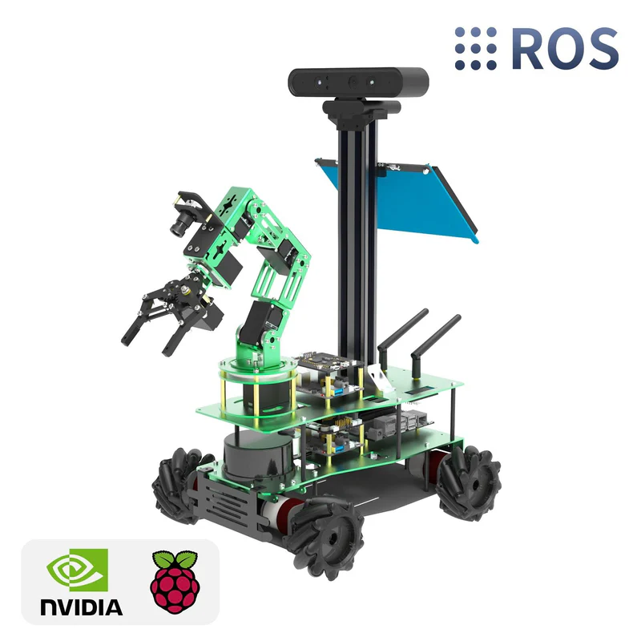

# TRC2025 - Finale

[**ACCUEIL](https://www.notion.so/TRC2025-Finale-2c04f1c8b94c804f9dd2fd5508bba3b8?pvs=21)                                                                                                                                             [SYSTEMES](https://www.notion.so/TRC2025-Finale-2c04f1c8b94c804f9dd2fd5508bba3b8?pvs=21)**                                                

---

Bienvenue à ECOCITY, ville fictive aux défis bien réels. Dans le cadre de la finale du TRC2025, notre équipe comme toutes les autres a eu pour objectif de transformer la gestion des déchets de cette métropole grâce à l'intelligence artificielle et la robotique avancée. Le défi ? Nettoyer 10 quartiers encombrés de déchets ménagers, dangereux et recyclables, en alliant rapidité d'exécution et précision de tri.

 Notre réponse technologique repose sur une collaboration parfaite entre mobilité et manipulation. Au cœur de notre dispositif : le Rosmaster X3, notre unité mobile chargée de la "reconnaissance et récupération". Après une phase d'analyse de données via des  QR Codes pour cartographier la pollution, il opère de manière autonome, traitant en priorité les zones critiques saturées de déchets dangereux grâce à un système de ramassage conçu par nos soins. 

Mais la collecte n'est que la première étape. Une fois les déchets acheminés à la station centrale, notre unité de tri, le bras robotique Dofbot, prend le relais. Couplé à un convoyeur personnalisé et un système de vision par ordinateur, il assure la ségrégation des matériaux pour garantir un recyclage optimal. 

Ce rapport présente comment notre équipe a relevé ce défi technique, transformant des composants électroniques et des lignes de code en une solution concrète pour l'environnement.

---

## Architecture du système

<aside>

[**DOFBOT JETSON NANO**](https://www.notion.so/DOFBOT-JETSON-NANO-2e74f1c8b94c81baab6cd91c094cd7e5?pvs=21)

</aside>

<aside>

[SYSTEME ROSMASTER X3](https://www.notion.so/SYSTEME-ROSMASTER-X3-2e54f1c8b94c815a988af2c2abd2bcf3?pvs=21)

</aside>

<aside>

[**SYSTÈME CONVOYEUR**](https://www.notion.so/SYST-ME-CONVOYEUR-2d94f1c8b94c80bca474f94be3fe41eb?pvs=21)

</aside>

---

- .