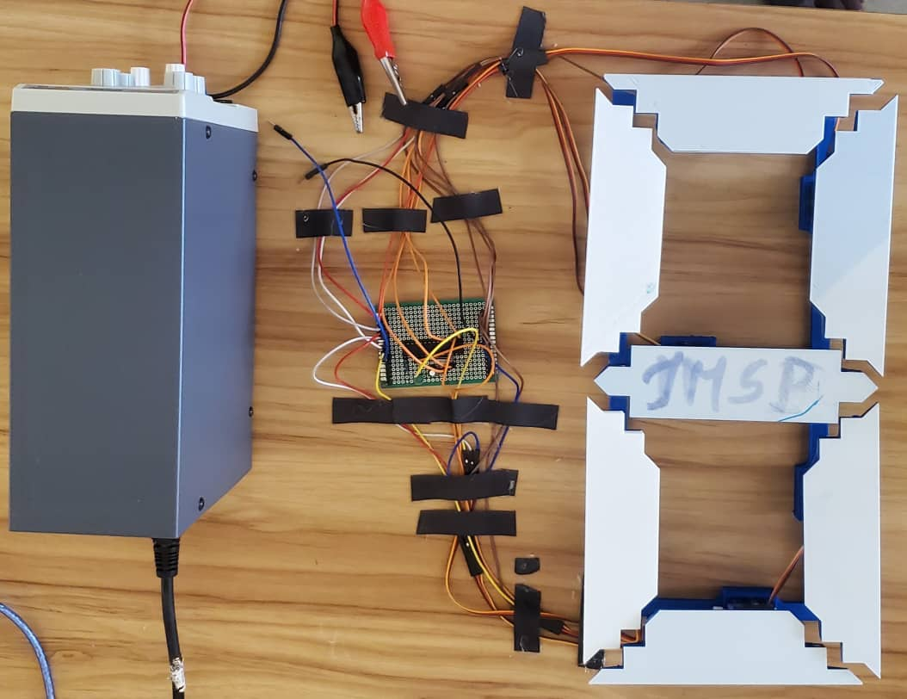

# Test3 Electronique: Afficheur 7 servos

## 🎯 Objectifs du projet

**Objectifs généraux:** 

-Réaliser un **digit d’afficheur 7 Segments avec des servomoteurs** (appelons ça un afficheur 7 servos) et y afficher les chiffres 0 à 9 puis de 9 à 0 avec une **vitesse d’une seconde par incrémentation**;

**Objectifs spécifiques:**

● Utiliser directement un microcontrôleur Atmega328P dans le circuit final et non une
carte Arduino. Vous devrez réaliser des schémas électronique avec KICAD et
designer les PCB pour ensuite les produire.

● Alimenter le circuit avec des batteries au lithium.
● Ne pas utiliser de fonction bloquante telle que “**delay**()” dans le code Arduino.

● Documenter votre travail sur le dépôt GitHub qui vous sera attribué

<aside>
💡

PLAN

1. Présentation de l’afficheur 7 servos
    
    a-1. Matériel 
    
    a-2. Montage électronique 
    
    a-3. Modélisation et conception de l’afficheur 3D
    
    a-4. Résultat final
    
2. Code 
3. Test de fonctionnement
4. Difficultés 
5. Compétences tirées de ce test
6. Meet the team 
</aside>

# 1.Présentation de l’afficheur 7 servos

## 🛠️Matériel

- **ATMega328p**


**📌** Utilité : le microcontrôleur commandant le système

<aside>
💡

**Lien de la datasheet**

[https://ww1.microchip.com/downloads/en/DeviceDoc/Atmel-7810-Automotive-Microcontrollers-ATmega328P_Datasheet.pdf](https://ww1.microchip.com/downloads/en/DeviceDoc/Atmel-7810-Automotive-Microcontrollers-ATmega328P_Datasheet.pdf)

</aside>

- **Batterie LITHIUM**


**📌** Utilité : source d’alimentation 

<aside>
💡

**Lien de la datasheet**

[https://www.ineltro.ch/media/downloads/SAAItem/45/45958/36e3e7f3-2049-4adb-a2a7-79c654d92915.pdf](https://www.ineltro.ch/media/downloads/SAAItem/45/45958/36e3e7f3-2049-4adb-a2a7-79c654d92915.pdf)

</aside>

- un **quartz de 16MHz** entre les broches **XTAL1** et **XTAL2m** qui nous servira d’oscillateur externe;


**📌** Utilité : fournit un signal d’horloge **très stable** et **précis** grâce à la vibration de son cristal à une fréquence spécifique (par exemple, 16 MHz).

| **Utilité du quartz** | **Détail** |
| --- | --- |
| **Cadencer les instructions** | Le quartz fixe la vitesse à laquelle les instructions sont exécutées. |
| **Précision temporelle** | Pour que les temporisations (ex : delay(), millis()) soient exactes.
 |
| **Communication fiable** | Pour que les protocoles comme UART, SPI, I2C fonctionnent correctement. |
| **Stabilité du système** | Un quartz est bien plus stable que les oscillateurs internes. |

<aside>
💡

**Lien de la datasheet**

[https://www.alldatasheet.com/category/index.jsp?sSearchword=16MHz crystal](https://www.alldatasheet.com/category/index.jsp?sSearchword=16MHz%20crystal)

</aside>

- deux **condensateurs de 22pF**, un entre chaque broche du quartz et la masse GND ;


**📌** Utilité: stabilise le quartz.

<aside>
💡

**Lien de la datasheet**

[https://www.mouser.ca/c/ds/passive-components/capacitors/?capacitance=22 pF](https://www.mouser.ca/c/ds/passive-components/capacitors/?capacitance=22%20pF)

</aside>

- **Résistance de 10 kΩ** sur la broche **RESET**;

 


**📌** Utilité : Maintient la broche **RESET** à l'état **haut** (HIGH) pour éviter les redémarrages intempestifs.

- **Condensateur de 100 nF (0.1 µF) entre VCC et GND (découplage)**


**📌** Utilité: Supprime les **bruits** et **pics de tension** sur l’alimentation du microcontrôleur.

Plus clairement, sans lui dans le circuit, il peut y avoir des comportements aléatoires (bugs, plantages) lors d’une charge soudaine (ex: allumage LED, envoi UART).

- **Bouton poussoir**


**📌** Utilité: réinitialiser l’ATMega lorsqu’un problème lié au code survient

- LEDs


**📌** Utilité:  Pour signifier que la boite est effectivement alimentée.

- **Resistance de 220Ω**


**📌** Utilité:  pour protéger la led

- **Connecteurs**


**📌** Utilité:  pour placer les composants sur le PCB sans les souder

## ⛓️Montage électronique

<aside>
💡

Notre système est composé de deux sous-systèmes:

- **le circuit de l’afficheur 7 servos;**
- **et l’alimentation.**
</aside>

### **Présentation du schéma du câblage du circuit de l’afficheur**

L’objectif de ce test était de faire un afficheur 7 servos qui sera contrôlé avec un microprocesseur Atmega 328p. Notre Atmega ne disposant que de 6 PMM, alors on devait utiliser un module qui allait nous permettre d’augmenter le nombre de PWM de notre Atmega et donc de  contrôler les 6 servomoteurs à l’aide d’un seul microprocesseur. Il s’agit du module PCA 9685, qui dispose de 16 sorties PWM et qui communique par I2C.


**Schéma d’un PCA 9685**

Mais hélas ! Ce module n’est pas disponible auprès des fournisseurs que nous avons consultés. Donc dans la suite de notre projet nous avons choisi de partir sur  l’utilisation de pin PWM combiné à l’utilisation des pins digitales de notre microprocesseur pour faire bouger nos 7 servos moteurs. Cependant, nous avons tenu quand même à réaliser le schéma de notre circuit avec l’utilisation du module PCA 9685 juste pour montrer comment les branchements auraient été faits si on disposait du module.

Pour représenter le module on est partis sur un connecteur 6 pins et les différentes connexions de ses broches seront résumées dans le tableau suivant :

| **Broche PCA9685** | **Nom** | **Connexion à...** | **Rôle** |
| --- | --- | --- | --- |
| VCC | Alimentation logique | +5V (ou +3.3V selon MCU) | Alimentation du circuit de contrôle du module |
| GND | Masse | GND du microcontrôleur | Référence commune (obligatoire) |
| SDA | Données I²C | SDA (ex : **A4** sur Arduino Uno / ATmega328P) | Ligne de données |
| SCL | Horloge I²C | SCL (ex : **A5** sur Arduino Uno / ATmega328P) | Ligne d'horloge |
| OE (facultatif) | Output Enable (actif bas) | GND ou non connecté | (Optionnel – désactive la sortie si HIGH) |
| V+ | Alimentation moteurs | +5V (ou alim servos séparée, 5V – 6V) | Alimente les servos (pas le PCA lui-même) |

Ce qui se traduit par le schéma suivant :


Sur ce schéma, les connexions des 7 servomoteurs au module PCA 9685 n’ont pas été représentées, mais juste la connexion de notre module à notre microprocesseur Atmega. Nous n’irons pas plus dans les détails avec ce schéma car ce n’est pas la méthode que nous adopterons pour notre circuit final.

Comme cela été dit plus haut, pour notre circuit final, nous utiliserons les broches digitales de notre microprocesseur Atmega pour faire bouger nos 7 servomoteurs. C’est donc ce schéma qui va représenter le schéma de notre projet et pour le faire on est d’abord partis sur un microprocesseur Atmega auquel on a associé son circuit d’oscillation composé de quartz de 16 MHz et de deux condensateurs connectés aux broches XTAL1 et XTAL2. On a ensuite câblé notre circuit de Reset composé d’un condensateur de 100            nF, d’une résistance de 1Ok et d’un bouton poussoir.


**Circuits d’oscillation de Reset**

Il  est important de notifier que les labels ont été fortement utilisés dans notre schéma comme c’est le cas depuis le 1er projet, histoire de permettre une meilleure compréhension de notre circuit et de ne pas l’encombrer avec des fils.

Pour la suite, on a décidé de mettre une LED d’état et sa résistance qui sera connectée au VCC de notre circuit, afin de nous indiquer que notre circuit est parcouru par le courant électrique.


**Circuit de la LED d’état**

Comme indiqué plus haut, à la place du module PCA 9685, nous utiliserons directement les Pin de notre microcontrôleur et celles que nous avons choisies sont les suivantes :

- PD2
- PD3
- PD5
- PD6
- PB3
- PB2
- PB1

Ces différentes pins seront connectées respectivement aux servomoteurs 1 à 7 de notre projet. Pour représenter nos servomoteurs on a choisi des connecteurs 3 pin qui correspondent respectivement à la broche du signal venant de notre microprocesseur, la seconde à l’entrée de courant et la troisième à la masse. Pour la liaison de la broche du signal, on est a créé le label Servo suivi du numéro du servomoteur correspondant donc le label Servo1 pour le servomoteur 1 et ainsi de suite pour les autres servomoteurs. Comme l’Atmega ne peut pas directement alimenter nos servomoteurs, le label VCC_servo a été créé et va correspondre à la borne d’entrée de courant de nos servomoteurs. Il sera également relié à un connecteur 2 pins qui va quant à lui correspondre au connecteur d’alimentation de nos servomoteurs, c’est-à-dire que la deuxième pin correspond au GND et sera relié à la masse de nos différents servomoteurs. Ainsi, on obtient le schéma Kicad suivant :


**Schéma final du circuit du test 3**

L’exécution du contrôle des règles électriques de ce circuit conduit à 0 erreurs et 0 avertissements comme ce qui est souhaité.


S’en est suivi le passage au PCB de notre circuit et c’est toujours après un long travail qu’on a pu réarranger les différents composants pour  obtenir le résultat suivant :


### **Vue 3D du PCB**

<iframe title="vimeo-player" src="https://player.vimeo.com/video/1097169059" width="640" height="360" frameborder="0" allowfullscreen></iframe>

Les dimensions de notre circuit sont :

- Longueur x Largeur : 7x6
- Largeur des pistes : 1.5 mm pour les pistes allant de VCC vers les composants, 1mm pour les pistes qui lient les composants proches, 0.5 mm pour le reste.

<aside>
💡

### **Fichiers zippés**

[Projet3 finalkicad.zip](./assets/test-three/Projet3_finalkicad.zip)

[Project (1)PCB.zip](./assets/test-three/Project_(1)PCB.zip)

</aside>

Après génération du typon grâce à l’option imprimer de notre logiciel, il a fallu l’imprimer au SCOP (Sèmè City) et le rendu physique est le suivant :


Il a fallu après y souder les différents composants pour obtenir notre circuit final :


Mais hélas ! On a eu un problème de dernière minute causé par le fait qu’apparemment les masses de notre circuit ne sont pas connectées entre elles. Ce qui a rendu notre circuit imprimé inutilisable pour notre projet et avec le temps imparti, il était impossible de retourner au SCOP pour refaire une autre impression.

Alors, pour le projet final, on a utilisé un **veroboard** et on a reproduit un schéma plus simple sans bouton poussoir. ET voici le résultat de la soudure sur le **veroboard**:

**Face avant**


**Face arrière**


### **Présentation de l’alimentation**

Pour l’alimentation , on a décidé d’utiliser un DC supply à cause  de souci technique avec l’alimentation des tests précédents.


## Modélisation et conception de l’afficheur 3D

Dans le cadre  du troisième test électronique consistant à crée un afficher sept segment, nous avons eut recourt à quelques notions de mécanique notamment la modélisation. 

 **

*Il a été donc question dans cette section de concevoir  chacun des segments formant l’afficheur complet. Nous avons donc opté pour le modèle suivant :*


Comme nous l’inique l’image nous avons eut tout au long de ce processus besoin d’implémenter trois modèles de segments que sont:

Modèle1: 

.png)

Cette première pièce, modélisée  représente les (04) segments latéraux de notre afficheur.

Modèle2:

.png)

Celle-ci quant à elle , représente s’identifie come étant la pièce centrale de notre afficheur.

Modèle3: 

.png)

Enfin la dernière pièce modélisée représente les deux pièces extrême du complexe.

En ce qui concerne les dimensions, nous sommes parti pour chacune des pièces sur une longueur totale de 150mm, une largeur totale de 40mmet une épaisseur globale de 18mm.Par la suite, nous avons ajouté à chacune de ces pièces des attaches afin de pouvoir les fixer convenablement a chacun des servomoteur. 

Une fois la modélisation et la conception des pales terminée, nous avons modélisée un support afin de soutenir l’ensemble des pales durant les phases de test. Pour ce faire, nous avons eut recoure à une simulation physique sur un carton fin d’avoir les valeurs jutes des distances  à prendre en compte.


On obtient donc après modélisation de la base la pièce suivante.


 

Globalement notre afficheur sept segment mesure une **longueur totale** de **330mm** pour une **largeur** de **160mm**.

L’impression du système final à été principalement faite avec deux couleurs. Une couleur bleu et une couleur blanche.  


<aside>
💡

### **Fichiers zippés des pièces modélisées**

[NPart3.zip](./assets/test-three/NPart3.zip)

[NPart1.2.zip](./assets/test-three/NPart1.2.zip)

[NPart1.zip](./assets/test-three/NPart1.zip)

[Base.zip](./assets/test-three/Base.zip)

</aside>

## Résultat final



# 2.Code

<aside>
💡

Pour le code, nous avons eu à afficher les chiffres de 0 à 9 par le biais de servomoteurs nous permettant **“*d’allumer ou d’éteindre des segments”*** (les pales). 

</aside>

### Un petit rappel par rapport au servomoteur?

Il s’agit d’un composant électronique qui ,dans notre cas ,permet “**d’éteindre**” ou “**d’allumer**” un segment. Il est composé de trois broches : **5V**, **GND** et **Signal.** 


### **Comment l’utiliser avec l’ATMega328p ?**

Pour commander un servomoteur, il faut lui envoyer **un train d’impulsions** dont la période (**intervalle de temps entre chaque impulsion**) est toujours de **20 ms (millisecondes)**. Ce qui va varier et qui au final déterminera la position de la pale n’est pas la période, mais bien la durée de l’impulsion :
• pour une impulsion de 1 ms, le servomoteur se met en position 0°
• pour une impulsion de 1.5 ms, le servomoteur se met en positon 90°
• pour une impulsion de 2 ms, le servomoteur se met en position 180°(angle maximale)


Les pins adaptés pour pouvoir faire cette commande sont les pins PWM(***Pulse Width Modulation** en anglais ou modulation de largeur d’impulsion*) et il est important de préciser que l’**ATMega328p** ne dispose que 6 pins PWM. Donc là on s’est dit qu’on manquait de ports puisqu’il nous fallait contrôler 7 servomoteurs.  Deux grandes méthodes nous sont d’abord venues en tête. Il s’agit de : 

- La méthode utilisant le module  **PCA9685** qui allait nous permettre d’augmenter le nombre de broches PWM(jusqu’à 16 broches). **Cette méthode a été abandonnée par manque de matériel.**
- La méthode utilisant deux **ATMega328p**

### Concernant la deuxième méthode

Dans cette méthode, on voulait utiliser deux ATMega, l’un pour contrôler 4 servomoteurs et l’autre pour les 3 restants. On s’est dit qu’il y aurait un problème de synchronisation au niveau de  l’affichage des chiffres. 

Et donc on a décidé de déterminer le temps d’affichage de chaque chiffre.

Voici les codes de test:

```cpp
//code pour le premier ATmega
#include<Servo.h> 
int pin[4]={3,5,6,9};

int i,n=1;
Servo servos[4];//initialisation des servomoteurs
//Configuration des 4 premiers segments 
const int chiffre0[10][4]={{1,1,1,1},
{0,1,1,0},
{1,1,0,1},
{1,1,1,1},
{0,1,1,0},
{1,0,1,1},
{1,0,1,1},
{1,1,1,0},
{1,1,1,1},
{1,1,1,1},
};

void setup(){

Serial.begin(9600);//initialisation de la communicaton serie pour afficher le temps dans le moniteur
for(i=0;i<4;i++)
{servos[i].attach(pin[i]);}// on attache chaque servo moteur a sa pin
}

void loop(){
  unsigned long tempinit=millis();//tempinit garde l'heure en debut de l'execution 

  fonction0(n);//on appelle la fonction qui appelle les quatres servos

  unsigned long duree = millis()-tempinit;//ici on calcule combien de temps a pris la fonction

  Serial.print("Duree de ");
  Serial.print(duree);
  Serial.println("ms");//on affiche la duree dans la moniteur serie
  delay(1000);
}

void fonction0(int n) //Fonction d'affichage d'un chiffre
{
  for(i=0;i<4;i++) 
  {
    if(chiffre0 [n][i]==1)
    servos[i].write(90);
  else
  servos[i].write(0);
delay(50);
  }

}
```

```cpp
//code pour le deuxieme ATmega
#include<Servo.h>
int pin[3]={3,5,6};

int i,n=1;
Servo servos[3];//initialisation des srvomoteurs

//Configuration des 3 derniers segments
const int chiffre0[10][3]={{1,1,0},
{0,0,0},
{1,0,1},
{0,0,1},
{0,1,1},
{0,1,1},
{1,1,1},
{0,0,0},
{1,1,1},
{0,1,1},
};

void setup(){

Serial.begin(9600);//initialisation de la communicaton serie pour afficher le temps dans le moniteur
for(i=0;i<3;i++)
{servos[i].attach(pin[i]);}// on attache chaque servo moteur a sa pin
}

void loop(){
  unsigned long tempinit=millis();//tempinit garde l'heure en debut de l'execution 

  fonction1(n);//on appelle la fonction qui appelle les quatres servos

  unsigned long duree = millis()-tempinit;//ici on calcule combien de temps a pris la fonction

  Serial.print("Duree de ");
  Serial.print(duree);
  Serial.println("ms");//on affiche la duree dans la moniteur serie
  delay(1000);
}

void fonction1(int n) //fonction d'affichage des chiffres
{
  for(i=0;i<3;i++) 
  {
    if(chiffre0 [n][i]==1)
    servos[i].write(90);
  else
  servos[i].write(0);
delay(50);
  }

}
```

 

Apres les tests, l’écart des temps d’affichage était de **`50 ms`** ,ce qui **théoriquement** allait entrainé une **désynchronisation**. Donc on a décidé de trouver des approches pour pouvoir réduire cet écart.

Nous avons opté pour deux approches:

-Utiliser **la communication I2C** dans laquelle le **maitre** serait le **premier ATMega**(celui contrôlant 4 servomoteurs ) , **l’esclave** le **deuxième ATMega**(celui contrôlant les 3 servos restants) et **le message ou la donnée** serait le **chiffre à afficher**( 0, 1, 2, …,9). 

-synchroniser directement le temps d’affichage de chaque chiffre en **faisant faire une attente de 50ms au deuxième ATMega.**

Du fait de leur complexité, on s’est tourné vers une méthode plus simple s’agissant de **l’utilisation de pin digital non PWM pour le pin manquant.** Il est évident qu’il a fallu programmer le pin en question de telle sorte qu’il envoie de manière périodique (période 20ms) la largeur d’impulsion qu’il faut pour positionner le servomoteur. **Le faire manuellement aurait été harassant et fastidieux !!!😩**

Heureusement (😏), la méthode **servo.write()** de la bibliothèque **Servo(utilisée précédemment pour les premiers test)** permet de faire ce travail, un fait auquel on a assisté au travers d’un test avec 3 servomoteurs connectés aux pins 2, 3 et 4 de l’Arduino(les pins 2 et 4 ne sont pas des pins PWM).

**Alors**, nous avons atteint le niveau où on s’est rendu compte que n’importe quel pin digital( PWM ou non) peut être utiliser pour contrôler les servomoteurs. 

Donc on s’est dit qu’on allait utiliser les pins sans porter une attention particulière au type. Nous avons un test dans lequel on utilisait les pins de 2 à 9 de l’Arduino pour la commande des 7 servos et durant le test, sur les 7 servos, celui lié au pin 2 était le seul fonctionnel. **Mais pourquoi????**  

Problèmes possibles

- **Certaines broches (D8, D9, D4, etc.)** peuvent **interférer avec les interruptions** si :
    - elles sont déjà utilisées par des fonctions critiques (`Serial`, `millis`, `delay`, etc.),
    - ou si elles sont **mal gérées au-delà d’un certain nombre de servos**.
- **Autre possibilité : surcharge électrique** :
    - Si tu alimentais tous les servos via le **5V de l'Arduino**, l'alimentation ne suivait pas → **seul le premier servo (D2) avait assez de courant** pour réagir.

## 🛠️Solution finale

**Numérotation des segments**


**Configuration de la solution finale**

| N° Segments | Pins utilisés Arduino | Type(PWM ou non) | ATMega328p | Broche physique de l’ATMega |
| --- | --- | --- | --- | --- |
| 0 | 2(Non PWM) | ✖️ | PD2 | 4 |
| 1 | 3 | ✔️ | PD3 | 5 |
| 2 | 5 | ✔️ | PD5 | 11 |
| 3 | 6 | ✔️ | PD6 | 12 |
| 4 | 9 | ✔️ | PB1 | 15 |
| 5 | 10 | ✔️ | PB2 | 16 |
| 6 | 11 | ✔️ | PB3 | 17 |

✅ **Explication brève**

Ce code contrôle **7 servomoteurs** pour afficher les chiffres **de 0 à 9** comme un **afficheur 7 segments mécanique**.

Chaque segment est un servo qui se positionne soit à **0° (allumé)**, soit à **90° (éteint)** selon le chiffre à afficher.

**Code de la solution finale**

```cpp
#include<Servo.h> 

/*Creation des servomoteurs */
Servo servos[7];

/*Declaration des pins auxquelles seront connectées les servomoteurs */
int pins[7]={2,3,5,6,9,10,11};

/*Configuration de chaque chiffre*/  
const byte chiffre[10][7]={
  {1,1,1,1,1,1,0},
  {0,1,1,0,0,0,0},
  {1,1,0,1,1,0,1},
  {1,1,1,1,0,0,1},
  {0,1,1,0,0,1,1},
  {1,0,1,1,0,1,1},
  {1,0,1,1,1,1,1},
  {1,1,1,0,0,0,0},
  {1,1,1,1,1,1,1},
  {1,1,1,1,0,1,1}};

// 1=allumé
//0=eteint

void setup(){

  /*Initialisation de la communication série */
    Serial.begin(9600);

  /*on attache chaque pin à son sevomoteur correspondant */
  for(int i=0;i<7;i++)
  {servos[i].attach(pins[i]);}
  
  for(int i=0;i<7;i++)
  {servos[i].write(0);}
  
  }

void loop(){

  /* On affiche de chaque chiffre avec une pause de 1 seconde entre chaque affichage dans l'ordre croissant */
  for(int i=0;i<10;i++)
  {affichechiffre(i);
  attendre(1000);}
  
  /*Attendre 1 seconde */
  attendre(1000);

   /*On affiche de chaque chiffre avec une pause de 1 seconde entre chaque affichage dans l'ordre decroissant*/
   for(int i=9;i>=0;i--)
   {
    affichechiffre(i);
    attendre(1000);
   }
  }

  /*Cette foncton attendre joue le meme role que delay */
  void attendre(unsigned long n)
  {unsigned long debut= millis();

  while(millis()-debut<n);

  }

  /* Affichage des chiffres */
  void affichechiffre(int n)
  {for(int i=0;i<7;i++)
  {
    if(i==6 || i==3)
    {
      if(chiffre[n][i]==0)
      servos[i].write(90);
      else
      servos[i].write(0);
    }
    else
    {
      if(chiffre[n][i]==0)
      servos[i].write(0);
      else
      servos[i].write(90);

    }
   
  }
  }

```

### 🧠 **Explication détaillée étape par étape**

---

### 1. **Initialisation**

```cpp
Servo servos[7];
int pins[7] = {2,3,5,6,9,10,11};

```

- On crée un tableau de 7 objets `Servo`, un pour chaque "segment" de chiffre.
- On précise les **pins** de l’Arduino auxquels les servos sont connectés (D2 à D11, sauf 4, 7, 8).

---

### 2. **Configuration des chiffres (0 à 9)**

```cpp
const byte chiffre[10][7] = {
  {1,1,1,1,1,1,0}, // 0
  {0,1,1,0,0,0,0}, // 1
  ...
  {1,1,1,1,0,1,1}  // 9
};

```

- Chaque ligne représente un **chiffre (0 à 9)**
- Chaque colonne représente un segment du chiffre (7 segments)
    - `1` = segment activé
    - `0` = segment désactivé

---

### 3. **`setup()`**

```cpp
Serial.begin(9600);
for(int i=0;i<7;i++) {
  servos[i].attach(pins[i]);
}
```

- Initialise la communication série (non utilisée ici, mais peut servir à afficher l’état).
- Associe chaque servo à sa broche.

---

### 4. **`loop()`**

```cpp
for (i = 0 to 9) {
  affichechiffre(i);
  attendre(1000);
}

for (i = 9 to 0) {
  affichechiffre(i);
  attendre(1000);
}
```

- Affiche les chiffres **de 0 à 9**, puis **de 9 à 0**
- Chaque chiffre est affiché pendant 1 seconde

---

### 5. **`attendre()`**

```cpp
void attendre(unsigned long n) {
  unsigned long debut = millis();
  while (millis() - debut < n);
}
```

- Fonction personnalisée équivalente à `delay(n)`
- Fait une pause de `n` millisecondes sans rien faire

---

### 6. **`affichechiffre()`**

```cpp
 /* Affichage des chiffres */
  void affichechiffre(int n)
  {for(int i=0;i<7;i++)
  {
    if(i==6 || i==3)
    {
      if(chiffre[n][i]==0)
      servos[i].write(90);
      else
      servos[i].write(0);
    }
    else
    {
      if(chiffre[n][i]==0)
      servos[i].write(0);
      else
      servos[i].write(90);

    }
   
  }
  }

```

- Pour le chiffre `n` :

Si le servo n’est ni 3 ni 6:

- Chaque `1` → servo à `90°`→ segment "allumé"
- Chaque `0` → servo à `0°`→ segment "éteint"

Si c’est 3 ou 6 :

- Chaque `1` → servo à `0°` → segment "allumé"
- Chaque `0` → servo à `90°`→ segment "éteint"

---

### 🧩 **Fonctionnement global**

> On simule un afficheur 7 segments avec 7 servos.
> 
> 
> Chaque chiffre de 0 à 9 active certains servos et en désactive d'autres pour dessiner le chiffre.
> 
> Les servos sont mis à 0° ou 90° selon qu’un segment est actif ou non.
> 

# **3.Test de fonctionnement**

Voici la vidéo de fonctionnement du système:

<!-- https://player.vimeo.com/video/1097168059 -->
<iframe title="vimeo-player" src="https://player.vimeo.com/video/1097168059" width="640" height="360" frameborder="0" allowfullscreen></iframe>


# 4.Difficultés

- Manque de matériel notamment le PCA 9685 et d’une imprimante de PCB
- Difficultés avec le choix de la méthode adaptée pour réaliser le projet qui nous a fait perdre assez de temps
- Problèmes de connexions sur notre PCB qui l’a rendu inutilisable
- Difficultés à déterminer la position 0° de chaque servomoteur

# 5.Compétences tirées de ce test

- Apprentissage de la soudure
- Réalisation d’un PCB
- Approfondissement de nos connaissances en électronique(le PWM, autres)
- Utilisation de handbrake pour la compression des vidéos

# 6. Annexes

Retrouvez ici les fichiers sources:
- [Lien de téléchargement](https://www.dropbox.com/scl/fi/53z0m1u0zf2puv22deea2/test-03-electro.zip?rlkey=cde21n81ghqlurnngnzliq5b2&st=ihxd9txq&dl=0)


# 7.Meet the team

<aside>
💡

### **Donald le codeur🖥️**

</aside>


<aside>
💡

### **Luc l’homme à tout faire🛠️**

</aside>


<aside>
💡

### **Siegfried le Kicadeur 🤣**

</aside>


<aside>
💡

### Marius le BOSS du PCB 😏

</aside>


<aside>
💡

### Alex le concepteur 3D en chef 🔧

</aside>

