# Partie électronique

# Circuiterie

Cette section décrit l’ensemble des composants électroniques utilisés, leur rôle dans le fonctionnement du système, ainsi que le schéma de câblage général.

1. **Le buzzer**

      Un **buzzer** est un petit composant électronique qui émet un son lorsqu’il est alimenté. Il est utilisé pour produire des signaux sonores, comme des bips ou des alarmes. Il en existe deux types principaux : le **buzzer actif**, qui produit un son dès qu’on lui applique une tension (généralement 5V), et le **buzzer passif**, qui a besoin d’un signal oscillant (comme un signal PWM) pour émettre un son.

.png)

1. **La LED RGB**

    Une **LED RGB** (Red-Green-Blue) est une diode électroluminescente capable d’émettre différentes couleurs en combinant trois LED de base : une rouge, une verte et une bleue, logées dans un même boîtier. Elle peut être **à cathode commune** (les trois LED partagent un même GND) ou **à anode commune** (elles partagent un même +V).

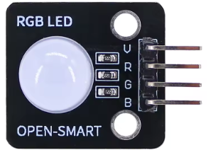

En faisant varier l’intensité de chaque couleur via des signaux PWM, on peut obtenir un large éventail de couleurs. Elle se connecte à trois sorties PWM d’un microcontrôleur, permettant de créer des effets lumineux dynamiques (comme des dégradés, clignotements ou transitions).

1. **Le driver A4988**

   Le **driver A4988** est un module conçu pour contrôler facilement un **moteur pas à pas bipolaire**. Il agit comme un pont en H double, capable de gérer le courant dans les deux bobines du moteur pour le faire tourner pas à pas. Il permet aussi d’utiliser des **micro-pas** (jusqu’à 1/16 de pas) pour un mouvement plus fluide et précis.

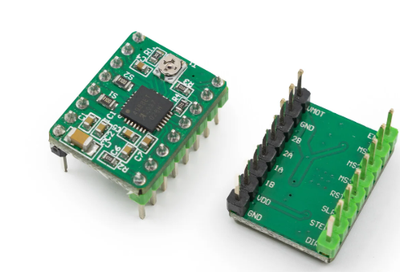

Le A4988 se commande avec seulement deux signaux : **STEP** (pour faire un pas) et **DIR** (pour choisir la direction). Il nécessite deux alimentations : une pour la **logique (3,3V ou 5V)** et une autre pour le **moteur (jusqu’à 35V)**. Il est idéal pour les imprimantes 3D, traceurs, ou tout projet nécessitant un contrôle précis de position.

**Présentation du schéma de notre circuit**

   Pour ce 4ème et dernier test de présélection, il nous était demandé de réaliser un convoyeur de déchets qui serait contrôlé grâce au microprocesseur Atmega 328p comme lors des semaines précédentes. Donc, pour le faire, on a d’abord choisi notre microprocesseur directement disponible dans la bibliothèque Kicad auquel on a associé son circuit d’oscillation, de Reset, la LED d’Etat et un connecteur d’alimentation comme lors des semaines précédentes. Cela est fait suivant le schéma suivant :

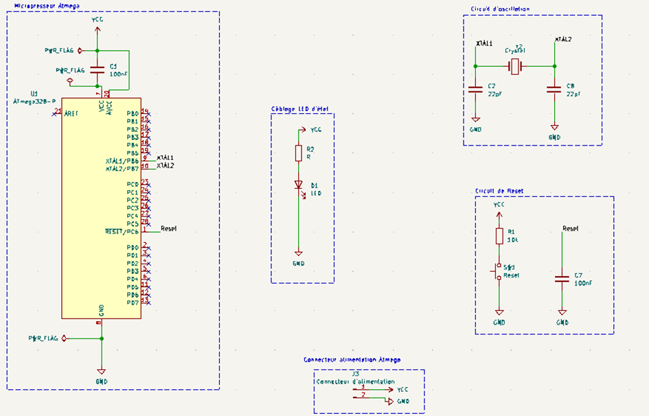

Pour la détection des déchets sur le tapis, on a choisi d’utiliser 2 émetteurs laser du même type, le KY-008. On l’a représenté par un connecteur 3 pin, qui correspondent respectivement au signal, au VCC et au GND. Pour la broche du signal, on a choisi de créer les labels S1 et S2 qui ont été connectées aux broches PD5 et PD6 de notre Atmega.

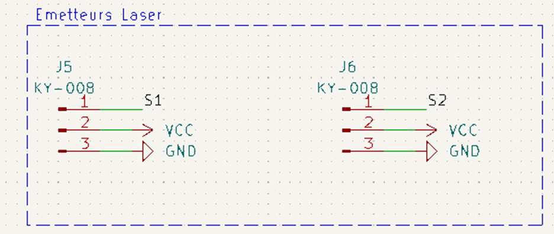

**Schéma de câblage des émetteurs laser KY-008**

   Pour recevoir l’information captée par les émetteurs, ces derniers sont fournis avec des modules récepteurs qui sont l’association de photorésistances et de résistances de 10k. Ils suivent le même schéma que les émetteurs laser, c’est-à-dire un connecteur 3 pin, mais avec les broches du signal qui ont été associées aux labels R1 et R2 qui sont quant à eux connectés respectivement aux broches PD2 et PD3 de notre microprocesseur. A la base, on ne voulait pas les inclure dans notre schéma, mais les récepteurs qui ont été livrés avec nos  émetteurs laser étant défaillants, on a dû fabriquer nous-mêmes nos propres récepteurs suivant le modèle suivant :

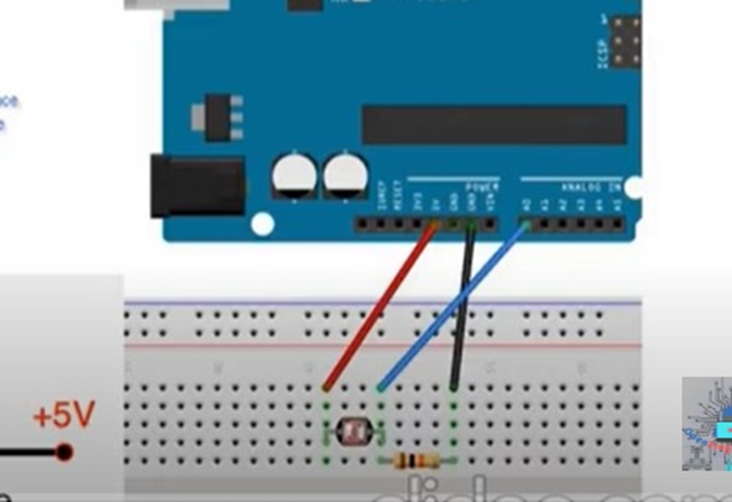

Ce qui a conduit au schéma Kicad suivant :

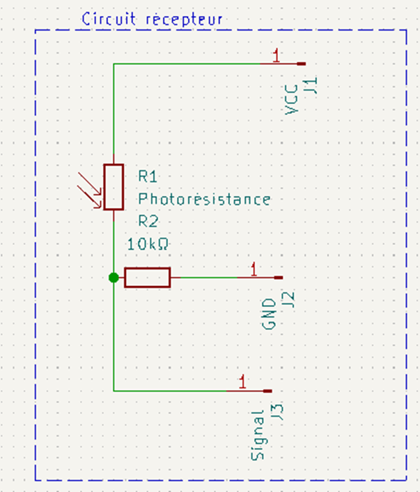

Dans notre schéma final, on a décidé de représenter nos 2 récepteurs de la manière suivante :

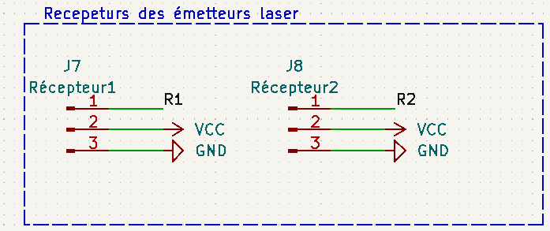

**Schéma de câblage des récepteurs laser**

Le montage physique de nos récepteurs sera présenté plus tard dans la documentation.

   Pour assurer la communication entre notre interface web et notre Atmega, on a choisi d’utiliser un module bluetooth, le HC05 qui est constitué de 6 broches. Mais comme pour notre circuit, seulement 4 broches seront utilisées donc on a choisi d’utiliser un connecteur 4 pin, les 2 premières correspondant aux broches VCC et GND et les deux dernières seront connectées au microprocesseur. Il s’agit des broches RX et TX qui seront connectées respectivement aux broches TXD et RXD de l’Atmega. Pour ce faire on a créé les labels RX et TX toujours dans l’optique de faciliter la compréhension de notre circuit.

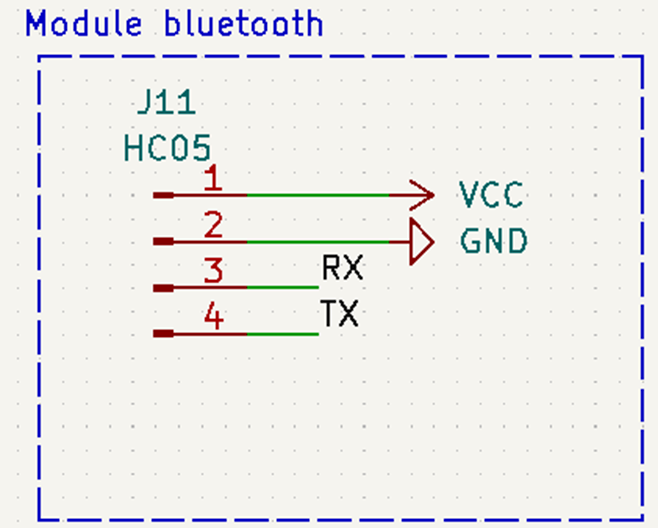

**Schéma de câblage du module HC05**

   Pour notre capteur de couleur, on est partis sur le capteur TCS 230 et pour le représenter dans notre logiciel, on a choisi d’utiliser un connecteur de deux rangées de 4 pin comme le module. Il y a 3 pin qui sont réservées à l’alimentation, une pin VCC et 2 GND. Pour le câblage des autres broches, on a créé les labels OUT, S0, S1, S2 et S3 qui sont connectés respectivement aux broches PD2, PD4, PD5, PD6 et PD7 de l’Atmega.

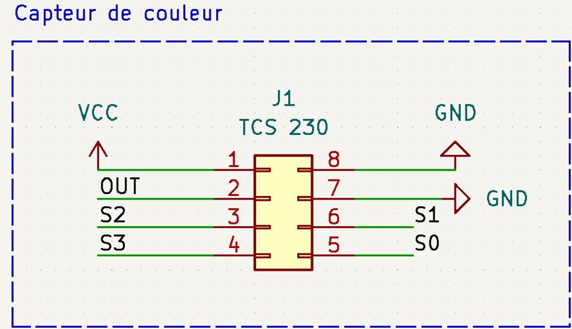

**Schéma de câblage du capteur de couleur**

   Lorsque la détection d’un déchet sur le tapis est faite, une led RGB qui est une association de 3 leds de couleurs différentes s’allume en fonction de la couleur du déchet sur le tapis. Donc la Led jaune pour un déchet de couleur jaune. Ce module est représenté dans notre schéma par un connecteur à 4 pin, les 3 premières représentant celles qui sont connectées à l’atmega. Il s’agit des broches connectées aux labels LED1, LED2 et LED3 qui sont connectées respectivement aux broches PB1, PB2 et PB3 de notre microprocesseur.

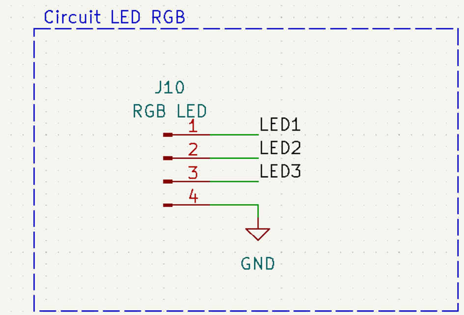

**Schéma de câblage de la LED RGB**

   De plus, on a décidé d’ajouter un buzzer qui sonnera à chaque fois qu’un objet sera détecté sur le tapis. Sa broche réceptrice de signal est mise sur la broche PD3 de notre Atmega grâce au label Signal buzzer.

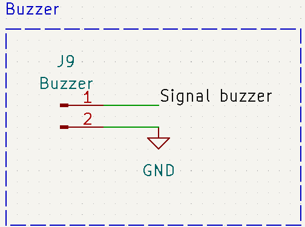

**Schéma du câblage du buzzer**

  Pour le contrôle de notre moteur, on est partis sur un driver A4988 qui possède 8 broches dont les connexions sont les suivantes :

Bobine A : 1A (A4988) <-> 1 fil moteur

- Bobine B : 2A (A4988) <-> 1 fil moteur

- STEP -> D3

- VDD -> 5V

- VMOT -> +12V

- Alimentation moteur :

- Bobine A : 1B (A4988) <-> 1 fil moteur

- GND -> GND

- DIR -> D4

- Bobine B : 2B (A4988) <-> 1 fil moteur

- A4988 vers microprocesseur :
- Connecter les 4 fils du moteur NEMA17 à l’A4988 :

- GND VMOT -> GND alim

Mais pour notre schéma vu qu’il fallait juste connecter les broches STEP, DIR, VCC, GND on a choisi d’utiliser un connecteur 4 pin avec des broches du même nom. Les broches STEP et DIR sont connectées respectivement aux broches PC0 et PC1 de notre Atmega avec des labels du même nom.

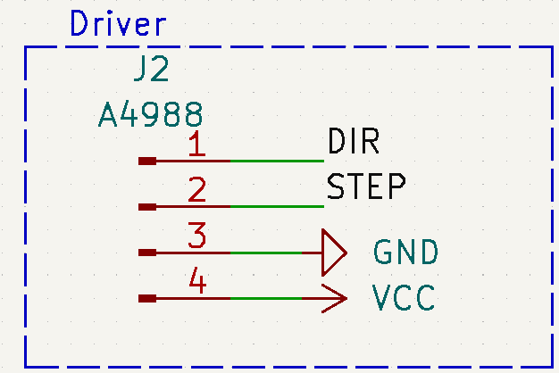

**Schéma de câblage du driver**

   Pour le circuit de notre driver on a choisi comme les récepteurs de nos émetteurs laser de faire le montage physique à part .Donc le driver ne sera pas directement notre circuit final. Nous y reviendrons plus tard notre documentation.

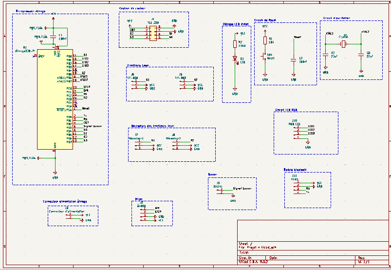

**Schéma final de notre circuit**

   L’exécution du contrôle des règles électriques de notre schéma génère le message suivant :

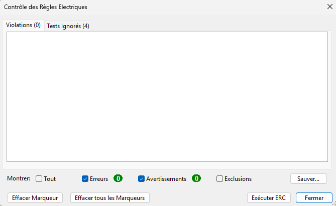

     Ce qui nous prouve que notre schéma ne comporte pas des erreurs.

Voici un tableau récapitulatif des différentes connexions que l’on a éffectué:

| **Composant** | **Broche ATmega328P** | **Référence Arduino** | **Numéro Arduino** |
| --- | --- | --- | --- |
| Signal 1er emetteur laser | PB0 (pin 14) | D8 | 8 |
| LED1 | PB1 (pin 15) | D9 | 9 |
| LED2 | PB2 (pin 16) | D10 | 10 |
| LED3 | PB3 (pin 17) | D11 | 11 |
| Signal 2ème emetteur laser | PB5 (pin 19) | D13 | 13 |
| Oscillateur XTAL1 | PB6 (pin 9) | - | - |
| Oscillateur XTAL2 | PB7 (pin 10) | - | - |
| STEP (A4988) | PC0 (pin 23) | A0 | 14 |
| DIR (A4988) | PC1 (pin 24) | A1 | 15 |
| Signal du récepteur 1er emetteur laser | PC2 (pin 25) | A2 | 16 |
| Signal du récepteur 2ème emetteur laser | PC3 (pin 26) | A3 | 17 |
| Reset | PC6 (pin 1) | Reset | - |
| Signal buzzer | PD3 (pin 5) | D3 | 3 |
| OUT (TCS230) | PD2 (pin 4) | D2 | 2 |
| S0 (TCS230) | PD4 (pin 6) | D4 | 4 |
| S1 (TCS230) | PD5 (pin 11) | D5 (PWM possible) | 5 |
| S2 (TCS230) | PD6 (pin 12) | D6 (PWM possible) | 6 |
| S3 (TCS230) | PD7 (pin 13) | D7 | 7 |

Après cela on est passés au design du PCB et c’est toujours après un long travail de réarrangement des composants et des connexions qu’on a obtenu le PCB suivant :

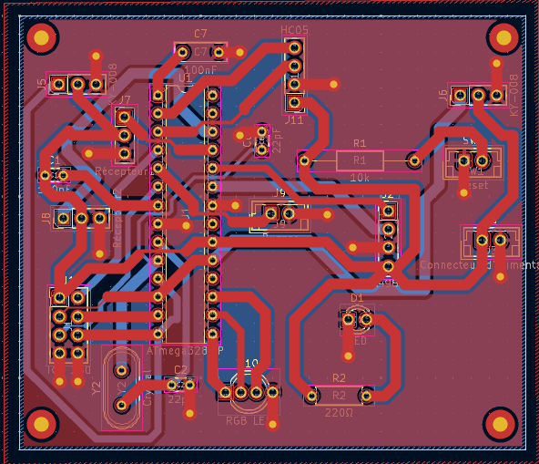

Et sa vue 3D :

Il fait une dimension de 7x6cm et on a utilisé majoritairement des pistes de longueur 1.5 mm mais aussi de 0.5mm.

[https://player.vimeo.com/video/1104738721?badge=0&amp;autopause=0&amp;player_id=0&amp;app_id=58479](https://player.vimeo.com/video/1104738721?badge=0&amp;autopause=0&amp;player_id=0&amp;app_id=58479)

On a également fait le design du PCB de notre récepteur :

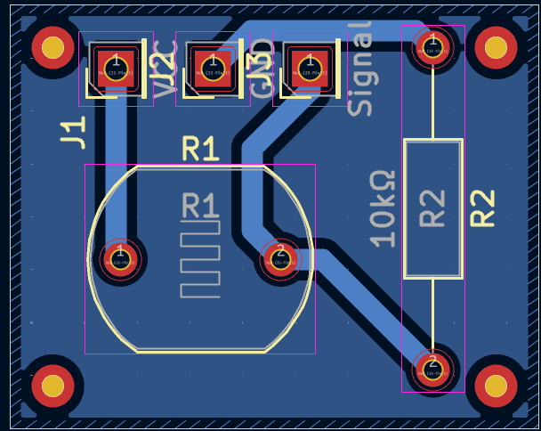

Et sa vue 3D :

[https://player.vimeo.com/video/1104739905?badge=0&amp;autopause=0&amp;player_id=0&amp;app_id=58479](https://player.vimeo.com/video/1104739905?badge=0&amp;autopause=0&amp;player_id=0&amp;app_id=58479)

Il fait 2.5x2 cm.

   Pour le montage de notre circuit principal, on a décidé de le réaliser sur un veroboard dont les images sont les suivantes :

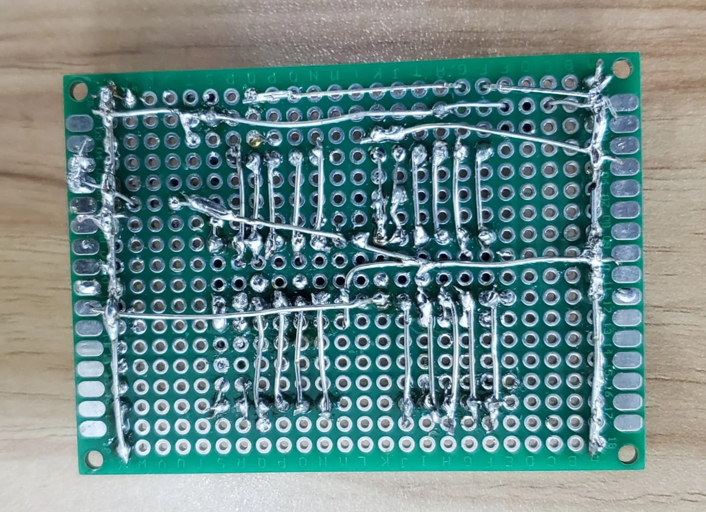

**Vue arrière du circuit principal**

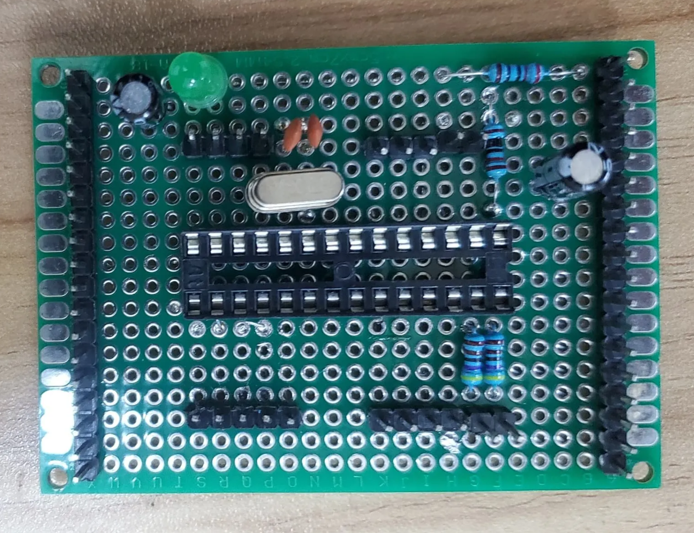

**Vue avant du circuit principal**

Pour le montage du circuit des récepteurs on a aussi décidé de les faire sur le veroboard.

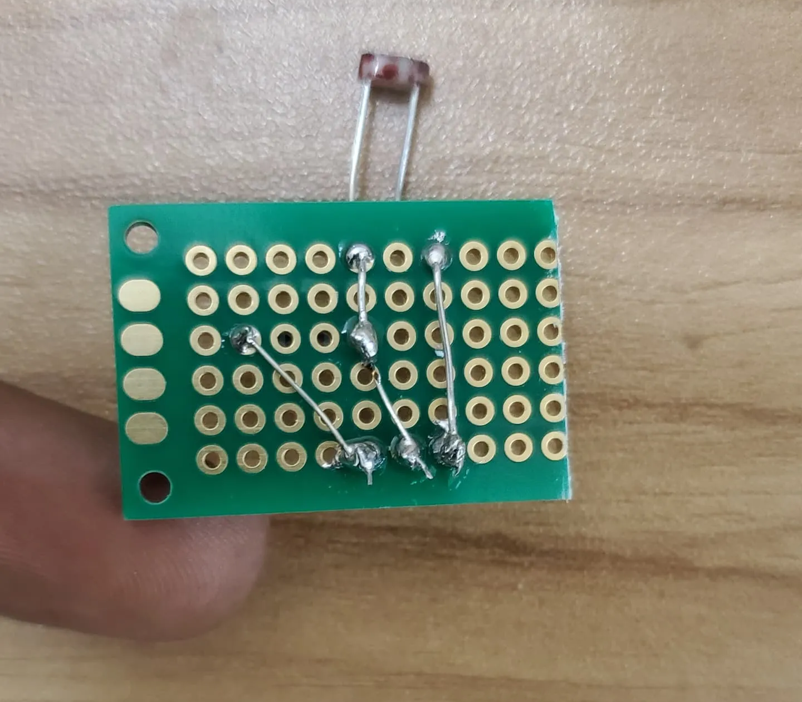

**Vue arrière du circuit du récepteur** 

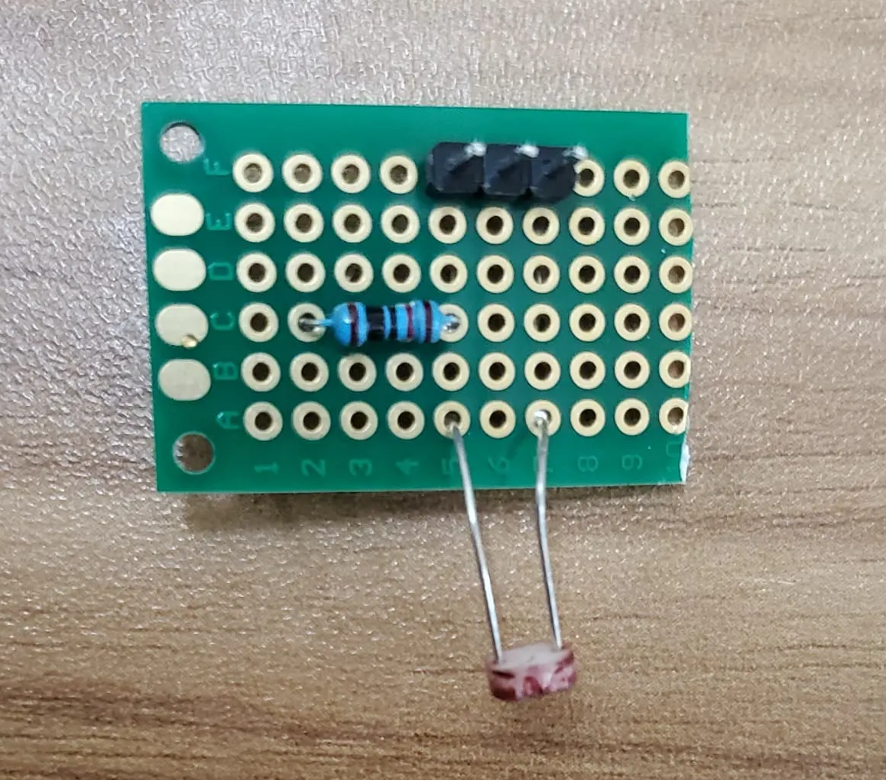

**Vue avant du circuit du récepteur** 

On a également utilisé la même approche pour le driver de notre circuit ,c’est à dire un montage sur veroboard mais vu qu’il allait sûrement être réutilisé pour un autre projet, on a décidé de souder des connecteurs sur notre veroboard et de faire la liaison avec jumpers.

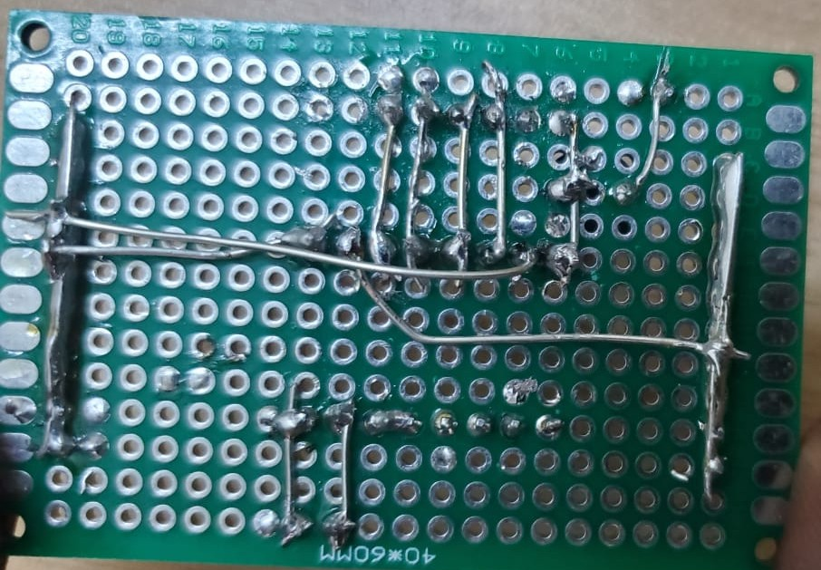

**Vue arrière du circuit du driver** 

Nous joyons à notre documentation les différents fichiers Kicad de notre projet.

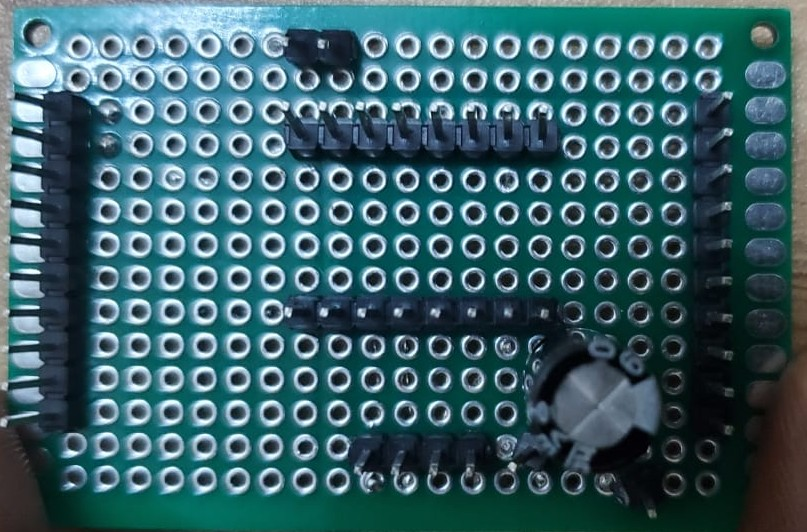

**Vue avant du circuit du driver** 

# Système embarqué

# **Détection des déchets sur le tapis**

L’objectif du travail fourni à ce  niveau est de détecter la présence d’un objet  sur le tapis.

Pour ce faire, on a décidé d’utiliser un **module laser diode KY-008** et comme récepteur une **photorésistance**.

## **Module Laser diode KY-008**

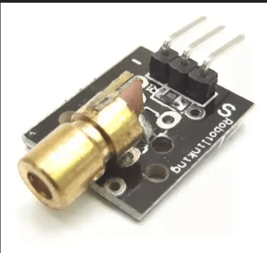

Il s’agit d’un capteur composé principalement d’une LED , de dissipateurs thermiques et de lentilles convergentes. Ces lentilles permettent de converger les faisceaux lumineux provenant de la LED lorsqu’elle est allumée en un seul faisceau lumineux invisible à l’œil nu et de longueur d’onde **650 nm.** Au moins, ce qui est visible est le **point rouge** qui apparait lorsqu’il atteint une surface opaque.   

[KY-008, KY-008-AZ Datasheet PDF (AZ-Delivery) - Laser Transmitter module](https://datasheet4u.com/datasheet-pdf/AZ-Delivery/KY-008/pdf.php?id=1415012)

## **Récepteur: Photorésistance**

 Particulièrement au niveau du récepteur, on voulait prendre le module KY-018 mais après quelques  tests avec lui, les données obtenues n’étaient pas utilisables (valeurs nulles, variation faible des mesures) pour faire une détection fiable .Donc on a décidé de prendre une photorésistance nue et de reproduire le circuit nous-même. 

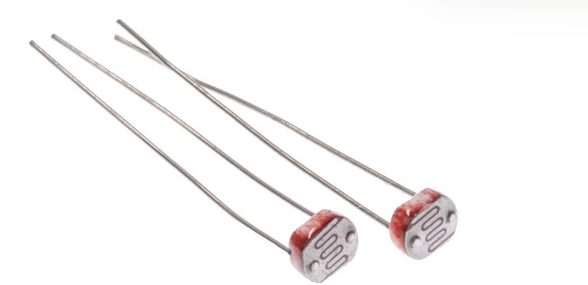

**photorésistance nue**

## **Principe de fonctionnement**

La photorésistance est une résistance variable en fonction de la luminosité ambiante. Puisque c’est une résistance variable, alors la donnée est continue et non binaire (0 ou 1) . Donc on comprend que les broches utilisables sont les pins analogiques(A0 à A5). 

En fait , la luminosité est inversement proportionnelle à la photorésistance. Donc:

- **plus il y a de la lumière**, **plus faible est la photorésistance** et donc cette dernière laissera passer le courant plus facilement, **ce qui conduira à une tension plus grande mesurée au niveau de la broche analogique** ;
- moins il y a de la lumière , plus grande est la photorésistance et donc plus faible sera la tension mesurée.

Pour rappel, ses deux  broches sont connectées à notre ATMega en rajoutant une résistance **pull down (10kOhm)** de cette manière :

```

       5V
        |
       [LDR]
        |
        +-------> A1 (entrée analogique Arduino)
        |
     [10 kΩ]
        |
       GND

```

Pour avoir plus d’informations par rapport à la résistance pull down, tapez sur le lien suivant : 

[**Pourquoi faut il rajouter un résistance au circuit de la photorésistance et pourquoi dit on pull down?**](./subpages/resistance_utility.md)

## **Détermination de la présence d’un objet sur le tapis en connaissant la luminosité**

- **Logique globale**

En pointant mon laser vers ma photorésistance, cette dernière mesure une très forte luminosité. Ainsi, on voit que si un objet se place devant le laser, il y aura une forte baisse de la luminosité. 

Puisque je n’ai que deux états à distinguer(objet présent ou objet absent) alors il me suffit de fixer un **seuil** par rapport auquel je compare les valeurs de tension mesurée du signal . Si ces valeurs le dépassent, alors la luminosité a augmenté et donc “objet absent” et le contraire pour “objet présent”.

- **Analyse des valeurs pour détermination du seuil**

Donc on a fait des mesures et on s’est rendu compte que lorsque qu’il n’y a pas d’objet , les valeurs dépassent 900 et le contraire lorsqu’il y en a. Il serait suffisant de prendre pour seuil **900**.

**Code-test de détection sur le tapis**

```cpp
 // broche de connexion module laser
#define LASER 11
 // broche de connexion buzzer  
#define BUZZER 12
// broche de connexion capteur de lumière
#define photoResistance A0    

int seuil=900;
void setup() {
  Serial.begin(9600);
    /*Configuration des broches */
  pinMode(LASER, OUTPUT); // en sortie 
  pinMode(BUZZER, OUTPUT); // en sortie
  pinMode(photoResistance,INPUT); // en entree
  digitalWrite(LASER,HIGH); //allumage du laser
  delay(500);
}

void loop() {
  // mesure de la lumière à l'aide d'un capteur
  int mesure= analogRead(photoResistance);
  Serial.print("Capteur de lumière: " + String(mesure));

  
  if(mesureActu<=900) // Objet sur le tapis
  {
      tone(BUZZER, 500);  // activer le buzzer
  }
  else {noTone(BUZZER);} // desactivation du buzzer
  delay(500);
}

```

- **Circuit de test**

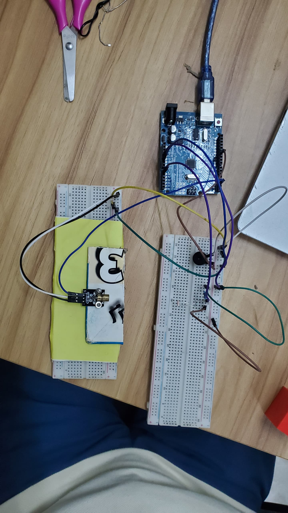

**Vidéo de test**

[https://player.vimeo.com/video/1100859641?h=971be1dd69](https://player.vimeo.com/video/1100859641?h=971be1dd69)

## **Amélioration pour le test de fonctionnement du convoyeur**

Donc nous venons d’atteindre notre objectif : nous avons pu détecter si un objet est présent sur le tapis ou non.  

Mais imaginons que plusieurs déchets soient déposés sur le tapis, et comme on sait que lorsqu’on est à la fin du convoyeur la bande s’arrête , ca veut dire que les déchets qui auraient été déposés pendant le cycle du premier déchet seraient toujours sur la bande alors que cette dernière se serait déjà arrêtée . **Problématique !!!** 

Donc il nous faut le nombre de déchets sur le tapis et on peut le faire notre détecteur laser en début du convoyeur. Le seul petit détail, c’est qu’il ne faudrait pas qu’un même déchet soit compté plusieurs fois et pour ce faire , on peut se baser sur la variation de la luminosité. 

Plus clairement, si un objet reste au niveau du laser, alors la variation des mesures sera faible (+-5). Et on est sûr que si un nouveau déchet est posé sur le tapis, la différence entre la valeur précédente et celle actuelle sera positive (car l’absence d’objet augmente la luminosité alors que la la présence la diminue).

**Code-test amélioré de détection sur le tapis**

```cpp
// broche de connexion module laser
#define LASER 11   
// broche de connexion buzzer
#define BUZZER 12 
 // broche de connexion capteur de lumière
#define LDR A0   

int seuil=900;
int compteur=0;
int mesurePrecedente=0;
bool newObject=0;
void setup() {
  Serial.begin(9600);

  pinMode(LASER, OUTPUT);
  pinMode(BUZZER, OUTPUT);
  pinMode(LDR, INPUT);
  digitalWrite(LASER,HIGH);
  mesurePrecedente=analogRead(LDR);
  delay(500);
}

void loop() {
  // mesure de la lumière à l'aide d'un capteur
  int mesureActu = analogRead(LDR);
  Serial.print("Capteur de lumière: " + String(mesureActu));

  newObject=newObjectOnTape(mesurePrecedente, mesureActu);
  if(mesureActu<=900 && newObject==1) //Nouvel Objet sur le tapis
  {
      tone(BUZZER, 500);  // activer le buzzer
      compteur++;
  }
  else {noTone(BUZZER);}
  Serial.println(" Compteur: "+String(compteur));
  mesurePrecedente=mesureActu;
  delay(500);
}

bool newObjectOnTape(int mesurePrecedente,int mesureActuelle)
{
if(mesurePrecedente-mesureActuelle>=100) return 1;// Il y a bien un nouvelle objet sur le tapis
return 0;
}

```

**Références et ressources utiles**

Voici une liste des ressources qui ont été consultées pour ce projet :

- [Arduino France - Module diode laser](https://arduino-france.site/module-diode-laser/) - Documentation sur l'utilisation des modules laser avec Arduino
- [Chaîne YouTube @openprogramming](https://www.youtube.com/channel/UCf4jGfp-BFp6GLd6eTptVMg) - Tutoriels vidéo sur la programmation Arduino

# **Reconnaissance d’un déchet et de son type par un capteur de couleur**

L’objectif du travail effectué est de reconnaitre un déchet en déterminant si sa couleur est Rouge, Vert, Bleu ou Jaune. 

## **Capteur de couleur TCS230**

Le capteur de couleur **TCS230** (ou sa version plus récente **TCS3200**) est un capteur optique capable de détecter la **couleur** d’un objet. Il repose sur un principe simple mais ingénieux mêlant **filtrage de couleur** et **conversion lumière → fréquence**. Voici une explication claire et directe :


## Principe de fonctionnement du capteur TCS230

### 1. **Structure du capteur**

Le TCS230 contient :

- Une **matrice de photodiodes** (8×8 = 64 photodiodes ) sensibles à la lumière.

Pour en savoir brièvement par rapport aux photodiodes, tapez ce lien:

[**C’est quoi une photodiode?**(2)](./subpages/photodiode.md)

- Chaque photodiode est recouverte d’un **filtre** :
    - 16 détectent le **rouge (R)**,
    - 16 le **vert (G)**,
    - 16 le **bleu (B)**,
    - 16 sont **sans filtre** (utilisés pour la luminosité globale).
- Une **logique de commutation** permet de sélectionner quel groupe de photodiodes est actif (R, G, B ou clair).
- Un **convertisseur courant–fréquence** transforme l’intensité lumineuse reçue par les photodiodes en un **signal carré en sortie** dont la **fréquence est inversement proportionnelle à l’intensité lumineuse** détectée.

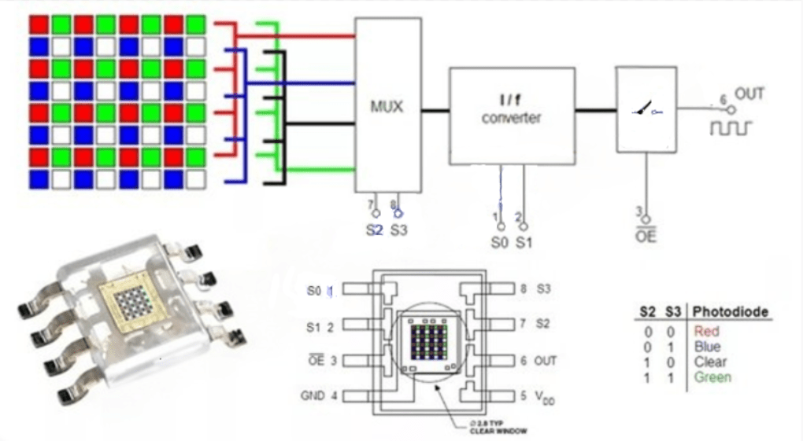

### 2. **Fonctionnement étape par étape**

1. **Éclairage de l’objet** : On éclaire l’objet avec une lumière blanche (souvent par des LED intégrées).
2. **Réflexion** : L’objet réfléchit une certaine quantité de lumière rouge, verte et bleue en fonction de sa couleur.
3. **Filtrage** : On active successivement les filtres R, G, puis B :
    - Quand le filtre rouge est actif, seules les photodiodes rouges « mesurent » la lumière rouge réfléchie.
    - Pareil pour vert et bleu.
4. **Conversion** : Le capteur convertit l’intensité reçue (R, G ou B) en une fréquence en sortie (`OUT`) :
    - Plus la couleur est intense, plus la fréquence est faible.

### Résumé

| Élément | Rôle |
| --- | --- |
| Photodiodes filtrées | Mesurent séparément les composantes R, G, B |
| Convertisseur courant-fréquence | Transforme la lumière détectée en fréquence |
| Sortie `OUT` | Donne un signal carré dont la fréquence dépend de l’intensité de lumière |
| Contrôle `S2` / `S3` | Sélectionne les filtres R, G, B ou clair |
| Contrôle `S0` / `S1` | Détermine le **facteur de division de fréquence** pour ajuster la vitesse de sortie |

Ici, vous avez une explication plus claire par rapport à la fonction de S0/S1:

[**S0/S1, qu’est ce que c’est?**](./subpages/s0_s1.md)

## **Détermination de la couleur d’un objet**

Pour pouvoir notre objectif, nous avons suivi un processus de réflexion que nous expliquons de manière assez claire dans la page suivante avec les difficultés rencontrées. 

[Processus de réflexion et difficultés](./subpages/reflexion_process.md)

**Logique globale de l’idée finale** 

<aside>
💡

Ici, l'idée est de mapper les valeurs de fréquences mesurées avec celles du code décimal RGB (0 à 255) et ensuite de mesurer la distance euclidienne entre les valeurs mesurées RGB et celles RGB correspondant à chaque couleur à détecter avec en plus la couleur du tapis qui est noir. Et donc, la couleur pour laquelle la distance est la plus petite est la couleur de l'objet .

</aside>

- Pour faire ce mappage, il a fallu d'abord, **déterminer le min et le max des valeurs de fréquence**, pour ensuite faire le mappage. Le min a été mesuré à partir du blanc pur, et le max a été mesuré à partir du noir pur. Ce qui est assez compréhensible, puisque le noir, étant donné qu'il absorbe complètement la lumière alors les fréquences mesurées seront les plus grandes . Et le blanc, puisque c'est la couleur qui contient le maximum de toutes les couleurs (255,255,255), alors forcément, ses fréquences seront les plus basses.

Il est important de préciser que pour plus de précision, on a considéré les valeurs de 0 à 1023 au lieu de la plage RGB connue (0 à 255) et que la distance entre le capteur et l’objet en dessous de ce dernier est fixe(2.5cm).

Pour vérifier visuellement que la détection est bonne, on utilise la LED RGB .

Voici le code de test: 

**Code-test d’identification de la couleur**

```cpp
//Broches de connexions du capteur de couleur
#define S0 2
#define S1 3
#define S2 4
#define S3 5
#define sensorOut 6
//Broches de connexion de la led RGB 
#define BLU 9
#define GRN 10
#define RED 11

float redFreq, greenFreq, blueFreq;// Variables de fréquences 

 // Liste de couleurs de référence (RGB)
char*noms[]={"Rouge","Vert","Bleu", "Jaune","Aucune"};

const int refR[5]={1023,0,0,1023, 0}; //Rouge
const int refV[5]={0,1023,0,1023, 0}; //Vert
const int refB[5]={0, 0,1023,0, 0}; //Bleu

// Valeurs mesurées durant l'étalonnage
const float minR = 29;  // Frequence de Rouge dans du blanc pur
const float maxR = 230;  // Frequence de Rouge dans du noir pur

const float minG = 30; // Frequence de Vert dans du blanc pur
const float maxG = 290;// Frequence de Vert dans du noir pur

const float minB = 25; // Frequence de Bleu dans du blanc pur
const float maxB = 230; // Frequence de Bleu dans du noir pur

void setup() {
  Serial.begin(9600);
  pinMode(S0, OUTPUT);
  pinMode(S1, OUTPUT);
  pinMode(S2, OUTPUT);
  pinMode(S3, OUTPUT);
  pinMode(RED, OUTPUT);
  pinMode(GRN, OUTPUT);
  pinMode(BLU, OUTPUT);
  pinMode(sensorOut, INPUT);
  //Fréquence à 20%
  digitalWrite(S0, HIGH);
  digitalWrite(S1, LOW);
  }
  void loop() {
  // Lecture rouge
  digitalWrite(S2, LOW);
  digitalWrite(S3, LOW);
  redFreq = pulseIn(sensorOut,LOW);
  // Lecture vert
  digitalWrite(S2, HIGH);
  digitalWrite(S3, HIGH);
  greenFreq = pulseIn(sensorOut, LOW);
  // Lecture bleu
  digitalWrite(S2, LOW);
  digitalWrite(S3, HIGH);
  blueFreq = pulseIn(sensorOut,LOW);
  //Affichage des valeurs de fréquences lues
  Serial.print("Mesuré Redfreq VertFreq BlueFreq = ");
  Serial.print(redFreq); Serial.print(", ");
  Serial.print(greenFreq); Serial.print(", ");
  Serial.println(blueFreq);

//Contraindre les valeurs de frequences à rester dans la plage de valeurs définies
  redFreq=constrain(redFreq,minR,maxR);
  greenFreq=constrain(greenFreq,minG,maxG);
  blueFreq=constrain(blueFreq,minB,maxB);
  
//Mappage des valeurs de fréquences et des valeurs RGB élargies
  int R = map(redFreq, minR, maxR, 1023, 0);
  int G = map(greenFreq,minG, maxG, 1023, 0);
  int B = map(blueFreq, minB, maxB, 1023, 0);
  
// Affichage des valeurs de fréquences mappées
  Serial.print("Mesuré RGB = ");
  Serial.print(R); Serial.print(", ");
  Serial.print(G); Serial.print(", ");
  Serial.println(B);
  
 //Determination de l'indice de la couleur avec la distance minimale 
int indexCouleur=compareCouleur(R,G,B);

//Affichage de la couleur détectée
Serial.print("Couleur détectée : ");

//Allumage de la LED RGB en la couleur correspondante
afficherLED(indexCouleur);
Serial.println(noms[indexCouleur]);
Serial.println("--------------------------");
  delay(1000);
}

float couleurDistance(int R,int G,int B,int r1,int r2,int r3)
{
  return sqrt(pow(r1-R,2)+pow(r2-G,2)+pow(r3-B,2));
}

int compareCouleur(int R, int G, int B)
{
  int i=0;
  int distance=0;
  int minDistance=couleurDistance(refR[0],refV[0],refB[0],R,G,B); //calcul de la distance de la mesure actuelle à la valeur de reference du rouge
  int indexMin= 0;
  for (i=1;i<5;i++)
  {
    distance=couleurDistance(refR[i],refV[i],refB[i],R,G,B);
    if(minDistance>=distance)
    {
      minDistance=distance;
      indexMin=i;
    }
    
  }
  return indexMin;
}

void afficherLED(int n)
{
  if (n==0) //Rouge 
  { analogWrite(RED, 255);
    analogWrite(GRN, 0);
    analogWrite(BLU, 0);
  }
  else if(n==1)//Vert
  {
    analogWrite(RED, 0);
    analogWrite(GRN, 255);
    analogWrite(BLU, 0);
  }
  else if(n==2)// Bleu
  {
    analogWrite(RED, 0);
    analogWrite(GRN, 0);
    analogWrite(BLU, 255);
  }
  else if(n==3)// Jaune
  {
    analogWrite(RED, 255);
    analogWrite(GRN, 255);
    analogWrite(BLU, 0); 
  }
  else //Aucune couleur
  {
  analogWrite(RED, 0);
  analogWrite(GRN, 0);
  analogWrite(BLU, 0); 
  }
}

```

<aside>
💡

**Lien de quelques sites** 

[https://www.moussasoft.com/tcs230-capteur-de-couleur-avec-arduino](https://www.moussasoft.com/tcs230-capteur-de-couleur-avec-arduino/)/

[https://lastminuteengineers.com/tcs230-tcs3200-color-sensor-arduino-tutorial/](https://lastminuteengineers.com/tcs230-tcs3200-color-sensor-arduino-tutorial/)

[https://projecthub.arduino.cc/SurtrTech/color-detection-using-tcs3200230-a1e463](https://projecthub.arduino.cc/SurtrTech/color-detection-using-tcs3200230-a1e463)

[https://www.ic-components.fr/blog/TCS3200-Color-Sensor-Specifications-Arduino-Guide-How-It-Works.jsp](https://www.ic-components.fr/blog/TCS3200-Color-Sensor-Specifications-Arduino-Guide-How-It-Works.jsp)

[https://www.bing.com/ck/a?!&&p=e1349f6fe6e6ed9708f930acb23d776e2c1576476a5b23efac725f103513ca4aJmltdHM9MTc1MjE5MjAwMA&ptn=3&ver=2&hsh=4&fclid=13ca58cd-0a8e-6cc3-350b-4c7d0b496dfe&psq=tableau+rgb&u=a1aHR0cHM6Ly93d3cucmFwaWR0YWJsZXMub3JnL2ZyL3dlYi9jb2xvci9SR0JfQ29sb3IuaHRtbA&ntb=1](https://www.bing.com/ck/a?!&&p=e1349f6fe6e6ed9708f930acb23d776e2c1576476a5b23efac725f103513ca4aJmltdHM9MTc1MjE5MjAwMA&ptn=3&ver=2&hsh=4&fclid=13ca58cd-0a8e-6cc3-350b-4c7d0b496dfe&psq=tableau+rgb&u=a1aHR0cHM6Ly93d3cucmFwaWR0YWJsZXMub3JnL2ZyL3dlYi9jb2xvci9SR0JfQ29sb3IuaHRtbA&ntb=1)

</aside>

# **Contrôle de la vitesse du Moteur pas à pas**

 **Alimentation et stabilisation :**

 Lors des premiers essais, un condensateur de 16 µF utilisé pour stabiliser l’alimentation sous 12 V a explosé. Après remplacement par un condensateur de 1000 µF, le circuit s’est comporté correctement, assurant ainsi une alimentation stable et fiable pour le microcontrôleur et les moteurs.

 **Contrôle du moteur**

Cette partie concerne la gestion du moteur pas à pas utilisé pour entraîner le tapis roulant.

Objectif :
Faire tourner le moteur à une vitesse contrôlée, suffisante pour convoyer les déchets sans qu’ils soient projetés à l’arrêt.

Étapes réalisées :

1. Calcul de la vitesse maximale :
    - Utilisation du principe d’inertie et du frottement pour déterminer la vitesse limite.
    - Conversion en nombre de pas par seconde → 5500 pas/s théorique.
2. Test moteur :
    - Le moteur supporte jusqu’à 1230 pas/s, ce qui reste suffisant pour un arrêt sans propulsion.
3. Contrôle par code :
    - Plusieurs programmes testés pour gérer la vitesse.
    - Tentative de contrôle via potentiomètre (échec temporaire)
    
     **Pour plus d’infos, voir la page [Contrôle moteur]**
    
    **.[https://www.notion.so/238bd6fe277b808bba63e6d112a00667?source=copy_link](https://www.notion.so/238bd6fe277b808bba63e6d112a00667?pvs=21)**
    

---

# **Communication Interface Web et ATMega: Module Bluetooth HC-05**

La communication entre l’interface Web et l’ATMega est l’une des parties les plus importantes qui exige un module physique permettant l’envoie de données sous un format utilisable de l’ATMega au backend. Pour ce faire , on a choisi le module Bluetooth HC-05 et le format Json. 

## **Module Bluetooth**

### **Pourquoi le Bluetooth?**

L'utilisation d'un module **Bluetooth** comme le **HC-05** avec un Arduino permet une **communication sans fil** entre l’Arduino et un autre appareil (PC, smartphone, tablette, etc.).

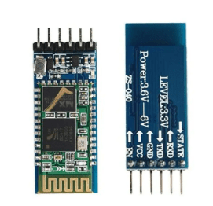

**Avantages du Bluetooth :**

- **Sans fil** : pas besoin de connexion physique, utile pour les systèmes embarqués ou mobiles.
- **Facile à mettre en œuvre** : le module HC-05 communique via UART (série), déjà disponible sur l’Arduino.
- **Large compatibilité** : fonctionne avec des applications Android, des logiciels PC, ou des programmes Python/Flask via un port COM.
- **Portée suffisante** : environ 10 mètres (classe 2).
- **Économie d’énergie** : utile dans les projets alimentés par batterie.

### **Formatage Json des données: bibliothèque**“**`ArduinoJson.h`**”

Le **JSON** (*JavaScript Object Notation*) est un format léger et facile à lire pour structurer et échanger des données. Il est largement utilisé dans les applications web pour transmettre des informations entre un client (navigateur) et un serveur. JSON est basé sur une syntaxe simple et intuitive, inspirée des objets en JavaScript, mais il est indépendant du langage de programmation.

### Structure de base du JSON :

1. **Objets** : Une collection de paires clé valeur, entourée d'accolades `{}`.
2. **Tableaux** : Une liste ordonnée de valeurs, entourée de crochets `[]`.
3. **Types de données** :
    - Chaînes de caractères (entre guillemets doubles : `"texte"`)
    - Nombres (entiers ou décimaux)
    - Booléens (`true` ou `false`)
    - Null (`null`)
    - Objets ou tableaux imbriqués.

### Exemple simple :

```json
{
  "nom": "Alice",
  "age": 25,
  "estEtudiant": true,
  "competences": ["programmation", "design", "communication"],
  "adresse": {
    "ville": "Cotonou",
    "pays": "Bénin"
  }
}
```

### Avantages :

- **Lisibilité** : Facile à comprendre;
- **Compatibilité** : Pris en charge par presque tous les langages de programmation.
- **Léger** : Idéal pour les échanges rapides de données.

**Code-test d’envoie de données par Bluetooth à l’interface Web**

```cpp
//librairie pour le formatage des donnees en Json
#include <ArduinoJson.h> 

//Broches de connexion pour le capteur de couleur
#define S0 2
#define S1 3
#define S2 4
#define S3 5
#define sensorOut 6

//Led RGB
#define BLU 9
#define GRN 10
#define RED 11

float redFreq, greenFreq, blueFreq;//fréquences

 // Liste de couleurs de référence (RGB) élargies
char*noms[]={"Rouge","Vert","Bleu", "Jaune","Aucune"};
int couleurPrecedente=4;
const int refR[5]={1023,0,0,1023, 0}; //Rouge
const int refV[5]={0,1023,0,1023, 0}; //Vert
const int refB[5]={0, 0,1023,0, 0}; //Bleu

// Valeurs mesurées durant l'étalonnage
const float minR = 29;  // Frequence de Rouge dans du blanc pur
const float maxR = 230;  // Frequence de Rouge dans du noir pur

const float minG = 30; // Frequence de Vert dans du blanc pur
const float maxG = 290;// Frequence de Vert dans du noir pur

const float minB = 25; // Frequence de Bleu dans du blanc pur
const float maxB = 230; // Frequence de Bleu dans du noir pur

void setup() {
  Serial.begin(9600);
  pinMode(S0, OUTPUT);
  pinMode(S1, OUTPUT);
  pinMode(S2, OUTPUT);
  pinMode(S3, OUTPUT);
  pinMode(RED, OUTPUT);
  pinMode(GRN, OUTPUT);
  pinMode(BLU, OUTPUT);
  pinMode(sensorOut, INPUT);
  // Fréquence à 20%
  digitalWrite(S0, HIGH);
  digitalWrite(S1, LOW);
  
}

void loop() {
  // Lecture rouge
  digitalWrite(S2, LOW);
  digitalWrite(S3, LOW);
  redFreq = pulseIn(sensorOut,LOW);
  // Lecture vert
  digitalWrite(S2, HIGH);
  digitalWrite(S3, HIGH);
  greenFreq = pulseIn(sensorOut, LOW);
  // Lecture bleu
  digitalWrite(S2, LOW);
  digitalWrite(S3, HIGH);
  blueFreq = pulseIn(sensorOut,LOW);

  JsonDocument doc;// création d'une variable de type Json

  redFreq=constrain(redFreq,minR,maxR);
  greenFreq=constrain(greenFreq,minG,maxG);
  blueFreq=constrain(blueFreq,minB,maxB);

  int R = map(redFreq, minR, maxR, 1023, 0);
  int G = map(greenFreq,minG, maxG, 1023, 0);
  int B = map(blueFreq, minB, maxB, 1023, 0);

int indexCouleur=compareCouleur(R,G,B);
if(indexCouleur!=4 && indexCouleur!=couleurPrecedente) //Couleur Detecté
{
  if(indexCouleur==0)//Rouge
  {
    doc["color_waste"]="red";
  }
  else if (indexCouleur==1)//Vert
  {
    doc["color_waste"]="green";
  }
  else if(indexCouleur==2)//Bleu
  {
    doc["color_waste"]="blue";
  }
  else //Jaune
  {
    doc["color_waste"]="yellow";
  }
  //Envoie de donnees sous format Json
  serializeJson(doc, Serial);
  Serial.println(); 
}
couleurPrecedente=indexCouleur;

afficherLED(indexCouleur);
delay(100);
}

int couleurDistance(int R,int G,int B,int r1,int r2,int r3)
{
  return sqrt(pow(r1-R,2)+pow(r2-G,2)+pow(r3-B,2));
}
int compareCouleur(int R, int G, int B)
{
  int i=0, distance=0,indexMin= 0;
  int minDistance=couleurDistance(refR[0],refV[0],refB[0],R,G,B); //calcul de la distance de la mesure actuelle à la valeur de reference du rouge
  for (i=1;i<5;i++)
  {
    distance=couleurDistance(refR[i],refV[i],refB[i],R,G,B);
    if(minDistance>=distance)
    {
      minDistance=distance;
      indexMin=i;
    }
    
  }
  return indexMin;
}

void afficherLED(int n)
{
  if (n==0) //Rouge 
  { analogWrite(RED, 255);
    analogWrite(GRN, 0);
    analogWrite(BLU, 0);
  }
  else if(n==1)//Vert
  {
    analogWrite(RED, 0);
    analogWrite(GRN, 255);
    analogWrite(BLU, 0);
  }
  else if(n==2)// Bleu
  {
    analogWrite(RED, 0);
    analogWrite(GRN, 0);
    analogWrite(BLU, 255);
  }
  else if(n==3)// Jaune
  {
    analogWrite(RED, 255);
    analogWrite(GRN, 255);
    analogWrite(BLU, 0); 
  }
  else //Aucune couleur
  {
  analogWrite(RED, 0);
  analogWrite(GRN, 0);
  analogWrite(BLU, 0); 
  }
}

```

## ⚠️ Attention au téléversement

Tu **dois débrancher le HC-05 pendant le téléversement du code**, car l’IDE Arduino utilise aussi RX/TX pour uploader.

Sinon vous aurez cette erreur:

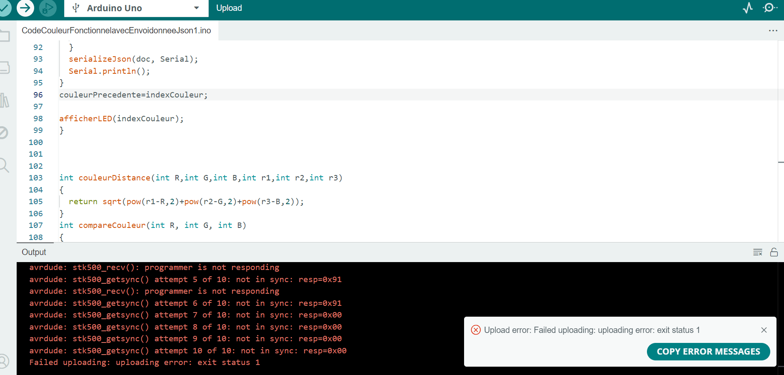

<aside>
💡

**Lien de quelques sites**

[https://arduinojson.org/](https://arduinojson.org/)

</aside>

# **Code du système entier**

Après avoir divisé le travail en sous partie, il a fallu lier ces sous parties en suivant une logique donnée. 

Notre code complet suit la logique suivante: 

- Lorsqu’un **déchet** est posé sur le tapis, le moteur s’active et déplace le déchet posé sur le tapis grâce au premier capteur laser avec une incrémentation de mon compteur puisqu’un nouveau déchet a été détecté sur le tapis.
- Tant que le capteur laser posé à la fin n’a pas détecté un déchet, le moteur continue de tourner avec une vitesse constante.
- Dès que le déchet est détecté par notre deuxième capteur laser , il y a arrêt du moteur et détection de la couleur par le capteur de couleur avec envoie de données à l’interface Web.
- L’objet sera toujours devant le laser en fin du tapis tant que sa couleur n’est pas détecté .
- Il est important de préciser que tant qu’il y aura de déchets sur le tapis, le moteur se réactivera pour permettre aux déchets restants d’être évacués.

Nous avons partitionné le code final en plusieurs sous codes pour faciliter la maintenance et la lecture du code. 

### Codes finaux

**Code principal**

```arduino
/* Inclusion des bibliothèques */

//Contrôle des moteurs pas à pas
#include <AccelStepper.h> 
 // Formatage  Json des donnees à envoyer
#include <ArduinoJson.h>
// Allumage Led 
#include "LedRGB.h" 
//Detection de la couleur
#include "DetectionCouleur.h" 
//Detection de dechets sur le tapis
#include "DetectionSurBande.h"

// Broche de connexion du Driver donnant le pas 
#define pinStep A0 
// Broche de connexion du Driver donnant la direction 
#define pinDir A1 

/* Creation d'un driver de moteur */
AccelStepper stepper(1,pinStep,pinDir);
/* Nombre de pas du moteur par seconde */
const float vitt=300;
/* Nombre de dechets sur le tapis */
int compteur=0;

/* la mesure précédente du premier capteur laser */
int mesurePrecedente=0;

void setup() {
  /* Initialisation de la communication série */
   Serial.begin(9600);

  /* Configuration des broches utilisées pour la detection sur la bande */
  pinModeDetectSurBande();

  /* Configuration des broches utilisées pour la LED RGB */
  pinModeLedRgb(); 

  /* Configuration des broches utilisées pour la detection de couleur */
  pinModeDetectCouleur();

  /* Allumage des lasers */ 
  allumageLaser();

  /*Configuration de la vitesse du moteur */
  configureVitesseMoteur();

  /* Fréquence à 20% */
  frequence(HIGH,LOW);

  /* Premiere Mesure du premier laser */
  mesurePrecedente=analogRead(recepteur1);
  
}

void loop() 
{
  detectObjetLaser1(&mesurePrecedente,&compteur);// mesure du capteur laser1

  if (compteur != 0) // Si un objet est sur le tapis
  { 
        stepper.runSpeed(); //Moteur tourne
      if(detectObjetLaser2()!=0) //Si il y a un déchet au niveau de la zone de détection de couleur
      {  
       
        delayMicroseconds(1); // arrêt du moteur

        while(detectColor()==0); //Tant que la couleur du déchet n'est pas reconnu au moins une fois
        
        detectObjetLaser1(&mesurePrecedente,&compteur);// mesure du capteur
        
        stepper.runSpeed();//Relance le moteur

        while(detectObjetLaser2()!=0); //Le moteur tourne tant que le déchet est dans la zone de détection de couleur
        compteur--;//le compteur décrémente

        delay(1000);//Arrêt du moteur pendant 1 seconde pour permettre la prise du déchet
      }
      
  }

  
}

void configureVitesseMoteur()
{
stepper.setMaxSpeed(vitt); // Vitesse max en pas/seconde
stepper.setSpeed(vitt); //Vitesse du moteur en pas/s
}

```

**Code pour la détection de couleur**

```cpp
//Fichier .cpp

#include <Arduino.h>
#include "DetectionCouleur.h"
#include <ArduinoJson.h> 
#include "LedRGB.h"

/*Fonction principale de detection des couleurs */
void detectColor()
{
  // Couleur précédente
  int couleurPrecedente = 4; 

  // Lecture Rouge
  float redFreq = lireFrequence(LOW, LOW);
  // Lecture Vert
  float greenFreq = lireFrequence(HIGH, HIGH);
  // Lecture Bleu
  float blueFreq = lireFrequence(LOW, HIGH);

  //Creation d'une variable de type Json
  JsonDocument doc;

  //Contraindre les valeurs à rester dans la plage de fréquences définies
  redFreq=constrain(redFreq,minR,maxR);
  greenFreq=constrain(greenFreq,minG,maxG);
  blueFreq=constrain(blueFreq,minB,maxB);

  //Correspondance de la plage de fréquences avec celle RGB etendue à 1023
  int R = map(redFreq, minR, maxR, 1023, 0);
  int G = map(greenFreq,minG, maxG, 1023, 0);
  int B = map(blueFreq, minB, maxB, 1023, 0);

  //Determination de la nature de la couleur 
  int indexCouleur=compareCouleur(R,G,B);

if(indexCouleur!=4 && indexCouleur!=couleurPrecedente) //Couleur Detecté et differente de la premiere 
{
      if(indexCouleur==0)//Rouge
      {
        doc["color_waste"]="red";
      }
      else if (indexCouleur==1)//Vert
      {
        doc["color_waste"]="green";
      }
      else if(indexCouleur==2)//Bleu
      {
        doc["color_waste"]="blue";
      }
      else //Jaune
      {
        doc["color_waste"]="yellow";
      }
      /* Envoie des donnees sous le format Json */
      serializeJson(doc, Serial);
      Serial.println();
}
// Mettre à jour la couleur précédente
couleurPrecedente=indexCouleur;

/* Allumer la LED RGB dans la couleur correspondante */
afficherLED(indexCouleur);

}

/* Distance des valeurs mesurees aux valeurs de reference */
int couleurDistance(int R,int G,int B,int r1,int r2,int r3)
{
  return pow(r1-R,2)+pow(r2-G,2)+pow(r3-B,2);
}

/* Determination de la couleur la plus proche à travers son indice */
int compareCouleur(int R, int G, int B)
{
  int i=0, distance=0,indexMin= 0;
  int minDistance=couleurDistance(refR[0],refV[0],refB[0],R,G,B); //calcul de la distance de la mesure actuelle à la valeur de reference du rouge
  for (i=1;i<5;i++)
  {
    distance=couleurDistance(refR[i],refV[i],refB[i],R,G,B);
    if(minDistance>=distance)
    {
      minDistance=distance;
      indexMin=i;
    }
    
  }
  return indexMin;
}

/* Lecture de la frequence */
float lireFrequence(bool s2, bool s3) 
{
  digitalWrite(S2, s2);
  digitalWrite(S3, s3);
  delay(2); // petit délai de stabilisation
  return pulseIn(sensorOut, LOW);
}

/* Configuration des broches */
void pinModeDetectCouleur()
{
  pinMode(S0, OUTPUT);
  pinMode(S1, OUTPUT);
  pinMode(S2, OUTPUT);
  pinMode(S3, OUTPUT);
  pinMode(sensorOut, INPUT);

}

/* Configurer le pourcentage de frequence */
 void frequence(bool s0,bool s1)
 {
  digitalWrite(S0, s0);
  digitalWrite(S1, s1);
 }

```

```cpp
//Fichier .h

#ifndef DETECTIONCOULEUR_H_INCLUDED
#define DETECTIONCOULEUR_H_INCLUDED

#define sensorOut 2 
#define S0 4  
#define S1 5
#define S2 6
#define S3 7

const int refR[5]={1023,0,0,1023, 0}; //Rouge
const int refV[5]={0,1023,0,1023, 0}; //Vert
const int refB[5]={0, 0,1023,0, 0}; //Bleu

// Valeurs mesurées durant l'étalonnage
const float minR = 29;  // Frequence de Rouge dans du blanc pur
const float maxR = 230;  // Frequence de Rouge dans du noir pur

const float minG = 30; // Frequence de Vert dans du blanc pur
const float maxG = 290;// Frequence de Vert dans du noir pur

const float minB = 25; // Frequence de Bleu dans du blanc pur
const float maxB = 230; // Frequence de Bleu dans du noir pur

void detectColor();
int compareCouleur(int R, int G, int B);
int couleurDistance(int R,int G,int B,int r1,int r2,int r3);
void afficherLED(int n );
float lireFrequence(bool s2, bool s3);
void pinModeDetectCouleur();
 void frequence(bool s0,bool s1);
#endif // DETECTIONCOULEUR_H_INCLUDED

```

**Code pour la détection sur le tapis**

```cpp
//Fichier .cpp
#include <Arduino.h>
#include "DetectionSurBande.h"

/* Allumage des lasers */
void allumageLaser()
{
digitalWrite(laser1, HIGH); 
digitalWrite(laser2, HIGH);
}

/*Configuration des broches en sortie */
void pinModeDetectSurBande()
{
  pinMode(laser1, OUTPUT);
  pinMode(laser2, OUTPUT);
}

/*Allumer et eteindre le buzzer */
void allumeEteintBuzzer()
{
  tone(BUZZER, 1000);
  delay(500);
  noTone(BUZZER);

}

/*Verification de la presence d'un nouveau dechet sur le tapis */
bool newObjectOnTape(int mesurePrecedente,int mesureActuelle)
{
if(mesurePrecedente-mesureActuelle>=100) return 1;// Il y a bien un nouvel objet sur le tapis
return 0;
}

/*Fonction de detection d'un dechet sur le tapis par le premier laser */
void detectObjetLaser1(int*mesurePrecedente, int* compteur)
{
  // mesure de la lumière à l'aide d'un capteur
  int mesureActu = analogRead(recepteur1);
  Serial.print("Capteur de lumière: " + String(mesureActu));

  bool newObject=newObjectOnTape(*mesurePrecedente, mesureActu);
  if(mesureActu<=900 && newObject==1) //Nouvel Objet sur le tapis
  {   allumeEteintBuzzer();
      (*compteur)++;
  }
  *mesurePrecedente=mesureActu;
}

/*Fonction de detection d'un dechet sur le tapis par le second laser */
int detectObjetLaser2()
{
  // mesure de la lumière à l'aide d'un capteur
  int mesure = analogRead(recepteur2);
  Serial.print("Capteur de lumière: " + String(mesure));

  if(mesure <=900 ) return 1; //Objet detecté en fin du tapis
  return 0;
}

```

```cpp
//Fichier .h
#ifndef DETECTSURBANDE_H_INCLUDED
#define DETECTSURBANDE_H_INCLUDED

// broche de connexion du 1er module laser
#define laser1 8
//broche de connexion du 2e module laser   
#define laser2 13  
// broche de connexion buzzer
#define BUZZER 3      
// broche de connexion du récepteur du laser1
#define recepteur1 A2 
// broche de connexion du récepteur du laser2
#define recepteur2 A3 
const int seuil=900;

void allumageLaser();
void pinModeDetectSurBande();
void allumeEteintBuzzer();
bool newObjectOnTape(int mesurePrecedente,int mesureActuelle);
void detectObjetLaser1(int*mesurePrecedente, int* Compteur);
int detectObjetLaser2();

#endif // DETECTSURBANDE_H_INCLUDED

```

**Code pour la LED RGB**

```cpp
//Fichier .cpp
#include <Arduino.h>
#include "LedRGB.h"

/* Configuration des pins de la LED en sortie */
void pinModeLedRgb()
{
  pinMode(ledRouge,OUTPUT);
  pinMode(ledVert, OUTPUT);
  pinMode(ledBleu, OUTPUT);
}

/* Allumage de la LED RGB dans la couleur detectée */
void afficherLED(int n)
{
  if (n==0) //Rouge 
  { analogWrite(ledRouge, 255);
    analogWrite(ledVert, 0);
    analogWrite(ledBleu, 0);
  }
  else if(n==1)//Vert
  {
    analogWrite(ledRouge, 0);
    analogWrite(ledVert, 255);
    analogWrite(ledBleu, 0);
  }
  else if(n==2)// Bleu
  {
    analogWrite(ledRouge, 0);
    analogWrite(ledVert, 0);
    analogWrite(ledBleu, 255);
  }
  else if(n==3)// Jaune
  {
    analogWrite(ledRouge, 255);
    analogWrite(ledVert, 255);
    analogWrite(ledBleu, 0); 
  }
  else //Aucune couleur
  {
  analogWrite(ledRouge, 0);
  analogWrite(ledVert, 0);
  analogWrite(ledBleu, 0); 
  }
}

```

```cpp
//Fichier .h
#ifndef LEDRGB_H_INCLUDED
#define LEDRGB_H_INCLUDED

// broche de connexion du Rouge de la led RGB
#define ledRouge 9  
// broche de connexion du Bleu de la led RGB
#define ledBleu 10  
// broche de connexion du Rouge de la led RGB
#define ledVert  11 

void afficherLED(int n);
void pinModeLedRgb();
#endif // LEDRGB_H_INCLUDED
```