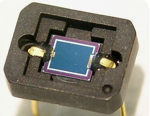

# C’est quoi une photodiode?

Une **photodiode** est un composant semi-conducteur ayant la capacité de capter un rayonnement du domaine optique et de le transformer en signal électrique.

## **Fonctionnement: effet photoélectrique**

Quand un semi-conducteur est exposé à de la lumière, les électrons acquiert de l’énergie cinétique en absorbant les photons qui constituent cette lumière conduisant à la création d’un courant électrique. Il est important de préciser que l’absorption d’un photon par un électron exige que l’énergie de ce dernier (*Eph=hν*) soit supérieure au seuil d’absorption .