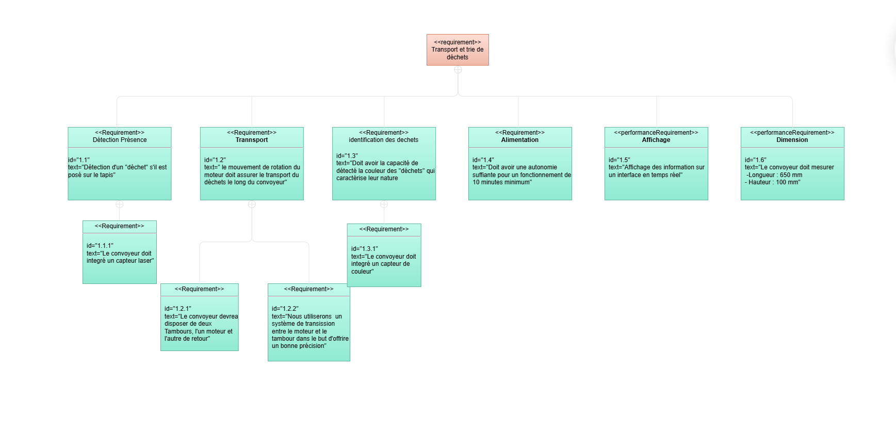

# Test Final

# **Objectif du projet**

L’objectif de ce projet est de concevoir et réaliser un système de convoyeur automatisé capable de trier des déchets en fonction de leur couleur : vert, jaune, rouge et bleu. À l’aide d’un capteur de couleur, le système identifie chaque type de déchet et indique à l’opérateur la berne appropriée pour le tri manuel. En complément, une interface web permettra de suivre en temps réel les quantités triées par catégorie, tout en intégraent les logos officiels de TEKBOT et TRC 2025. Le système devra être entièrement autonome, modulaire, robuste et réutilisable dans le cadre du challenge final.

Afin d’atteindre cet objectif ambitieux, plusieurs volets techniques complémentaires ont été développés, couvrant aussi bien l’aspect logiciel que la conception mécanique et électronique du système.

### Spécifications Techniques

- **Interface web** :
    
    Développement d’une interface web dynamique et réactive, assurant la **communication sans fil** avec le système embarqué. Elle affichera en temps réel les données de tri et intégrera les logos de TEKBOT et TRC 2025.
    
- **Conception mécanique** :
    
    Modélisation d’un **convoyeur de dimensions 650 mm x 100 mm** sous **SolidWorks**, assurant un **agencement fluide et optimisé** pour le tri des déchets selon leur couleur.
    
- **Système embarqué** :
    
    Mise en place d’un système à base d’un **ATMega**, intégrant :
    
    - Un **capteur de couleur** pour identifier le type de déchet,
    - Un **capteur de présence** pour détecter l’arrivée d’un objet sur le convoyeur,
    - Un **moteur contrôlé électroniquement** pour gérer l’avancement du convoyeur,
    - Une **alimentation par DC supply**, garantissant l’**autonomie énergétique** du dispositif.

## Fonctionnement du système

Le fonctionnement du système de convoyeur repose sur une coordination intelligente entre les différents sous-systèmes : détection, identification, communication, et visualisation. À l’état de repos, la bande transporteuse du convoyeur est immobile. Lorsqu’un déchet est placé sur la bande, un capteur de présence (comme un laser KY-008 couplé à une photorésistance) détecte sa présence et active le moteur, mettant en mouvement la bande transporteuse.

Une fois le déchet en mouvement, il passe devant un capteur de couleur capable d’identifier sa teinte dominante. Le système reconnaît alors s’il s’agit d’un cube vert, jaune, rouge ou bleu. Cette information est ensuite transmise au microcontrôleur, qui met à jour le compteur correspondant et envoie ces données à l’interface web.

L’interface web reçoit ces informations en temps réel et affiche les statistiques de tri sous forme de compteurs dynamiques. Elle indique également visuellement dans quelle berne le déchet doit être placé. Le placement du déchet dans la berne correspondante est ensuite effectué manuellement par un opérateur, suivant les instructions du système.

### **Conception mécanique**

Le pôle mécanique a travaillé sur la modélisation du convoyeur en définissant ses dimensions (650 mm x 100 mm) et en concevant une structure adaptée au tri par couleur. Les plans ont été réalisés sous SolidWorks afin d’optimiser l’agencement et de faciliter l’intégration des composants.

[Partie mécanique](https://www.notion.so/Partie-m-canique-23b99db3c75680fd9968ef63c119edf3?pvs=21)

### **Conception électronique**

Le pôle électronique a intégré un microcontrôleur ATMega, un capteur de couleur pour l’identification des déchets, un capteur de présence pour détecter leur passage et un moteur pour l’entraînement du convoyeur. Une alimentation DC a également été prévue pour garantir le fonctionnement du système.

[Partie électronique ](https://www.notion.so/Partie-lectronique-23999db3c75680d1947bd753e1f1b2ba?pvs=21)

### **Conception informatique**

Le pôle informatique a développé une application web connectée au système embarqué. Celle-ci affiche en temps réel les données de tri, visualise les statistiques par catégorie et intègre les éléments graphiques.

Le développement a été réalisé avec un backend en Flask pour la gestion des données puis l’envoie de donnée reçu du système en utilisant du SSE (Server Side Event) et un frontend en React pour l’affichage dynamique.

[Partie IT](./it/it-part.md)

# Conclusion

Le projet de convoyeur automatisé pour le tri des déchets a permis de concevoir une solution complète, alliant mécanique, électronique et informatique. Du point de vue mécanique, un convoyeur à bande de 650 mm a été entièrement modélisé en 3D, avec un système de tension intégré pour assurer une bonne adhérence, et des supports adaptés aux capteurs fabriqués par impression 3D. Sur le plan électronique, la détection des déchets a été assurée par un capteur laser KY-008 associé à une photorésistance, tandis que la reconnaissance des couleurs a été confiée à un capteur TCS230/TCS3200. Le moteur pas à pas Nema 17, soigneusement contrôlé, permet le déplacement précis de la bande sans perturber les objets transportés. Enfin, la communication entre le système et l’interface web a été rendue possible grâce au module Bluetooth HC-05. L’interface, développée avec Flask et React, affiche en temps réel les statistiques de tri via Server-Sent Events, en utilisant le format JSON pour structurer les données. L’ensemble constitue un système autonome, modulaire et conforme aux exigences du TEKBOT Robotics Challenge 2025, offrant des possibilités de réutilisation et d’évolution. Une **vidéo de démonstration** illustre le fonctionnement du système, depuis la détection et l’identification des déchets jusqu’à l’affichage dynamique des résultats sur l’interface web.