# Test finale

# **Objectif du projet**

L’objectif de ce projet est de concevoir et réaliser un système de convoyeur automatisé capable de trier des déchets en fonction de leur couleur : vert, jaune, rouge et bleu. À l’aide d’un capteur de couleur, le système identifie chaque type de déchet et indique à l’opérateur la berne appropriée pour le tri manuel. En complément, une interface web permettra de suivre en temps réel les quantités triées par catégorie, tout en intégrant les logos officiels de TEKBOT et TRC 2025. Le système devra être entièrement autonome, modulaire, robuste et réutilisable dans le cadre du challenge final.

Afin d’atteindre cet objectif ambitieux, plusieurs volets techniques complémentaires ont été développés, couvrant aussi bien l’aspect logiciel que la conception mécanique et électronique du système.

### Spécifications Techniques

- **Interface web** :
    
    Développement d’une interface web dynamique et réactive, assurant la **communication sans fil** avec le système embarqué. Elle affichera en temps réel les données de tri et intégrera les **logos de TEKBOT et TRC 2025**.
    
- **Conception mécanique** :
    
    Modélisation d’un **convoyeur de dimensions 650 mm x 100 mm** sous **SolidWorks**, assurant un **agencement fluide et optimisé** pour le tri des déchets selon leur couleur.
    
- **Système embarqué** :
    
    Mise en place d’un système à base d’un **ATMega**, intégrant :
    
    - Un **capteur de couleur** pour identifier le type de déchet,
    - Un **capteur de présence** pour détecter l’arrivée d’un objet sur le convoyeur,
    - Un **moteur contrôlé électroniquement** pour gérer l'avancement du convoyeur,
    - Une **alimentation par DC supply**, garantissant l’**autonomie énergétique** du dispositif.

## Fonctionnement du système

Le fonctionnement du système de convoyeur repose sur une coordination intelligente entre les différents sous-systèmes : détection, identification, communication, et visualisation. À l’état de repos, la bande transporteuse du convoyeur est immobile. Lorsqu’un déchet est placé sur la bande, un capteur de présence (comme un laser KY-008 couplé à une photorésistance) détecte sa présence et active le moteur, mettant en mouvement la bande transporteuse.

Une fois le déchet en mouvement, il passe devant un capteur de couleur capable d’identifier sa teinte dominante. Le système reconnaît alors s’il s’agit d’un cube vert, jaune, rouge ou bleu. Cette information est ensuite transmise au microcontrôleur, qui met à jour le compteur correspondant et envoie ces données à l’interface web.

L’interface web reçoit ces informations en temps réel et affiche les statistiques de tri sous forme de compteurs dynamiques. Elle indique également visuellement dans quelle berne le déchet doit être placé. Le placement du déchet dans la berne correcte est ensuite effectué manuellement par un opérateur, suivant les instructions du système.

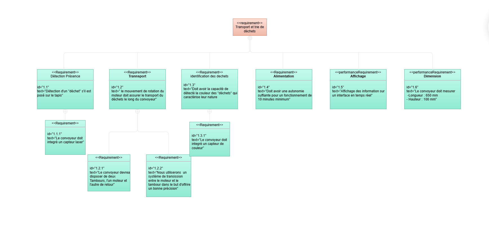

## Conception mécanique

Cette partie présente la structure physique du convoyeur, ses dimensions, ainsi que la modélisation des composants réalisés sous SolidWorks.

## Exigences mécaniques du système et solutions apportées 📋

### 1. Le type de convoyeur

La 1ère phase de l’atteinte de notre objectif a été la sélection du type de convoyeur à réaliser en tenant compte du délais de réalisation et des solutions à notre portées. A cette étape nous avons directement pensé à un convoyeur à bande étant donné qu’il s’agit d’un type de convoyeur largement utilisé dans l’industrie mais également du fait que sa conception rime bien entre simplicité et efficacité. 

Pour faire simple, un convoyeur à bande est un système de transport continue qui utilise une bande sans fin mis en mouvement par un tambour associé à un moteur  pour déplacer des matériaux d’un point A à un point B. Il se compose principalement  : 

- D’une bande qui sert de support pour les objets à déplacer
- De deux tambours : Un relié au moteur chargé de faire mouvoir le système et le second permettant de retourner la bande
- De support verticaux
- De guides latéraux

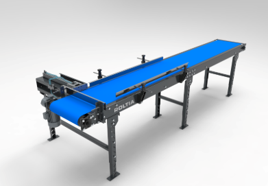

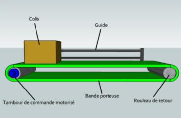

### 2. Adhérence entre la bande et les tambour.

Le défis majeur qui se présente lors de l’utilisation d’un tel type de convoyeur est l’adhérence parfaite entre la bande et les tambour devant la faire tourner. D’autant plus qu’on utilise du plastique comme matériau pour la réalisation des tambour, et nous savons tous que le plastique est très peu réputé pour ses qualités d’adhérence… Nous avons donc décidé d’utiliser des courroies comme intermédiaire entre la bande et les tambour . Pour être plus explicite, nous dispo9+erons de deux courroies : l’un à gauche et l’autre à droite, chacun d’entre eux étant reliée aux deux tambours extrêmes .Ensuite on posera la bande sur les deux courroies de sorte que le mouvement d’ensemble des courroies puisse faire bouger la bande . Ici se présente une illustration du système : 

### 3. Transmission entre le moteur et las tambours

Au regard de la charge des objets à transporter et de la puissance du moteur que nous avons choisi ( le moteur pas à pas Nema 17) nous avons jugé qu’un simple encastrement de l’arbre du moteur dans l’un des extrémité du tambour suffirait à assurer une bonne continuité entre le mouvement du moteur et celui des tambours. Ensuite des roulements à billes seront utilisés afin de faciliter le mouvement de rotation des tambours autour de leur axes respectifs. 

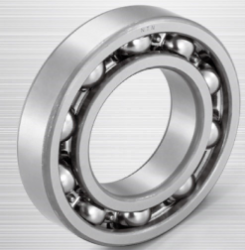

### 4. Maintient de la tension de la bande et compensation de l’allongement

Ici, nous avons préféré opter pour une solution à la fois simple, efficace et facile à concevoir. L’idée est de diviser le convoyeur en deux parties ( sur la longueur )de sorte que l’un puisse entrer dans l’autre avec une vis au dessus pour bloquer les deux parties dès que l’on a atteint la longueur voulue. En voici une illustration :

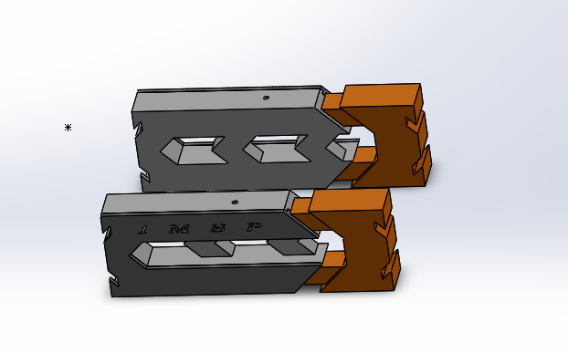

## Architecture globale  du convoyeur ⛓️

Dans un premier temps, nous avons établit un plan global du convoyeur en nous basant sur les solutions primaires précédemment définis . En résumé le convoyeur qu’on imaginais est un convoyeur à bande à longueur rétractable  disposant de deux courroies de part et d’autre des tambours de sorte que le mouvement des courroies fasse avancer la bande.  Un moteur sera encastré au niveau de l’un des tambours ( directement) afin d’assurer le control du mouvement de la bande puis des roulements seront placés au niveau des tambours afin de réduire les frottements. 

Ici se présentent les images de nos premiers dessins : 

### Caractéristiques du convoyeur

- Longueur de la bande : 650mm
- Longueur totale : 650mm x2
- largeur de la bande : 150mm
- Largeur totale du convoyeur: 230mm
- Hauteur du tapis par rapport au sol : 100mm
- Hauteur totale du convoyeur: 173 mm

### Les constituants  essentielles  et leurs conception 3D

1. **Moteur Nema 17**

Il s’agit du composant responsable du mouvement de la bande supportant les objets à déplacer . Vu son utilité dans la mécanique, nous avons jugé bon de le modéliser en vu de l’inclure dans l’assemblage SolidWorks du convoyeur. La conception réalisée s’inspire des dimensions réelles dudit moteur : Un cube de 42.30 mm d’arrête et un arbre d’une hauteur de 60mm pour un diamètre de 5mm . 

Afin de rendre la modélisation un peu plus facile, nous avons diviser le composants en trois pièces puis réaliser un assemblage. Comme pièce, on distingue : 

- La base :

Un carré extrudé auquel nous avons réalisé des perçages , des enlèvement de matières et des congés. 

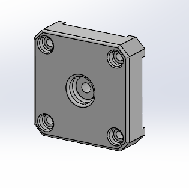

- Le tronc

Obtenue par extrusion mince d’un profil carré puis application de chanfreins. 

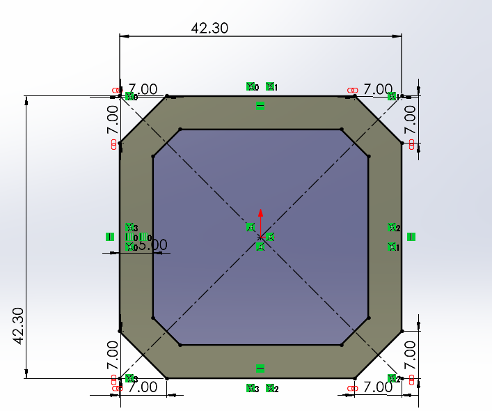

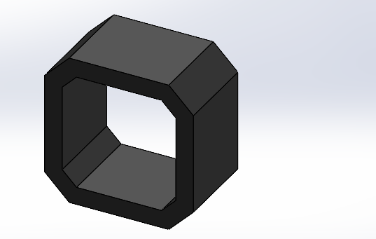

- Le haut (Similaire à la base)

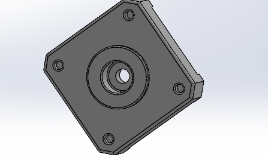

- L’axe

Il s’git juste d’un cylindre creux de rayon réduit.

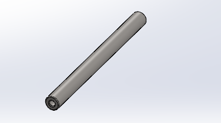

Ces pièces une fois assemblé donnent un modèle très proche du moteur pas à pas physique qu’on utilise (le nema 17) . 

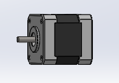

1. **Roulement**

Comme nous l’avons mentionné un peu plus haut, nous utilisons des roulements à billes afin que le mouvement de rotation des tambours puisse s’effectuer presque sans frottement . La conception de ce système fait également intervenir 3 pièces : les bagues intérieurs et extérieurs et les billes

- La bague intérieur

C’est elle qui bouge dans notre système en étant relié à l’arbre de tambour. Pour la réaliser, nous avons réalisé l’esquisse suivante ( image de gauche ) puis réalisé une révolution circulaire afin d’obtenir le motif souhaité. 

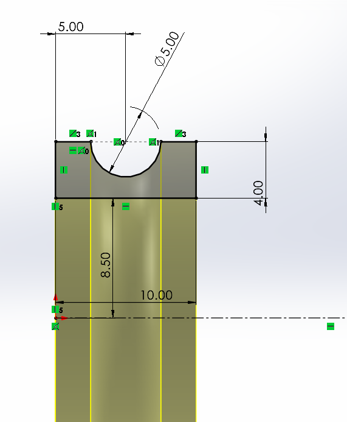


- La bague Extérieur

Il s’agit du composant fixe de notre système, relié au reste du convoyeur. Sa conception est similaire à celle de la bague intérieur ( Esquisse+ Revolution) 

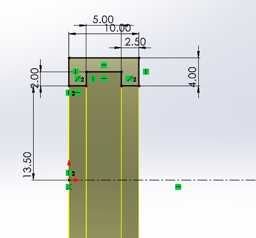

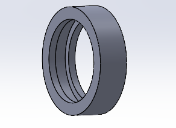

- Les billes

Ce sont de petits éléments sphériques en acier situés entre les deux bagues et qui permettent un mouvement de rotation à frottement réduit. La conception 3D est obtenue en appliquant une révolution circulaire sur un demi cercle dont le rayon est celui de la sphère. 

.png)

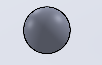

 Cette conception s’effectue dans le même fichier que celui de la bague intérieur puis la conception de la boule est répétée de façon circulaire suivant la direction de la bague. On Obtient ce qui suit : 

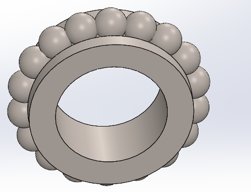

Par la suite, nous avons effectué un assemblage en appliquant une contrainte coaxiale entre les deux bagues et une contrainte de coïncidence de faces entre les faces latéraux des bagues. Finalement on obtient le résultat suivant : 

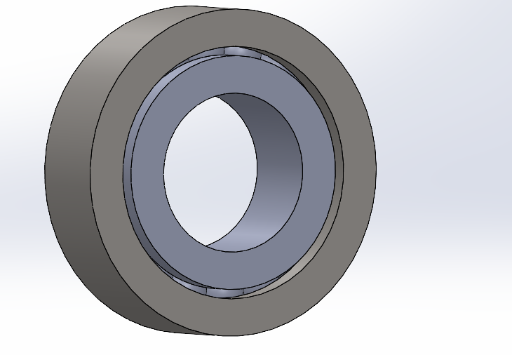

1. **Support latéral bas 1**


Ce composant contient en quelques sorte trois parties essentiels : Un support permettant de maintenir le moteur fixe pendant qu’il fait bouger le tambour moteur, Un motif en forme de demi cercle censé bloquer le roulement en ajout à une autre pièce ( situé en haut), puis des espaces à l’arrière afin de maintenir le composant au reste du convoyeur . Nous reviendrons sur ce système de maintient un peu plus loin.  Concernant la conception, elle utilise les fonction, de base tels que des lignes d’esquisse , des cercles, des extrusions et enlèvements de matière. Vous trouverez en annexe la mise en plan détaillant toutes les dimensions de cette pièce.

1. **Support latéral haut1**

Positionné au dessus de la précédente, cette pièce a pour rôle les roulements en place durant le mouvements avec l’aide de la pièce précédente. 

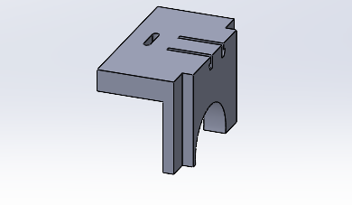

A la fin on obtient comme résultat partiel : 

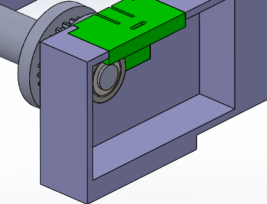

1. **Les tambours** 


On en distinguera deux ; le tambour moteur et le tambour de retour .

 **Le tambour moteur** comme son nom l’indique est relié au moteur et transmet son mouvement à la bande via une courroie. Celui de retour permet à la bande transporteuse de revenir vers le tambour moteur, créant ainsi un circuit fermé pour le mouvement continu. 

- La conception

Pour la conception, nous sommes parti dans un premier temps sur une géométrie cylindrique pleine puis nous avons apporté un certain nombre de modification afin d’obtenir la forme souhaitée. Les extrémités (de rayon réduite) sont censés entrer dans les roulements alors que les dents situées de part et d’autre de chaque tambour sont réservées aux courroies. Le cercle de pied des dents a été dimensionné en fonction des contraintes de tailles exigées dans le document descriptif du test (50mm) , les caractéristiques des dents ont été choisis selon les modèles de  courroies facilement accessible sur le marché (Voir les références des courroies en annexe)  puis la longueur du tambour choisis en fonction de la largeur de notre bande . Enfin, dans l’optique de réduire la consommation de filament au maximum, nous avons jugé bon de diminuer la circonférence du tambour au centre étant donné que le tapis est censé reposer sur les courroies et non sur les tambours. 

Pour ce qui est de la modélisation, nous avons d’abord construit un cylindre de diamètre maximal (70mm) puis réalisé des enlèvement de matière sur ce dernier afin d’obtenir le modèle présenté ci dessus. Par la suite nous avons pris des distances sur notre courroie puis modélisé les dents en fonction. l’esquisse suivant révèle les caractéristiques des dents modélisées. 


1.  **La courroie**

Dans notre système, il s’agit du composant responsable de la transmission du mouvement entre les tambours et la bande comme décrit précédemment . La conception dans SolidWorks se base sur l’esquisse suivante : 

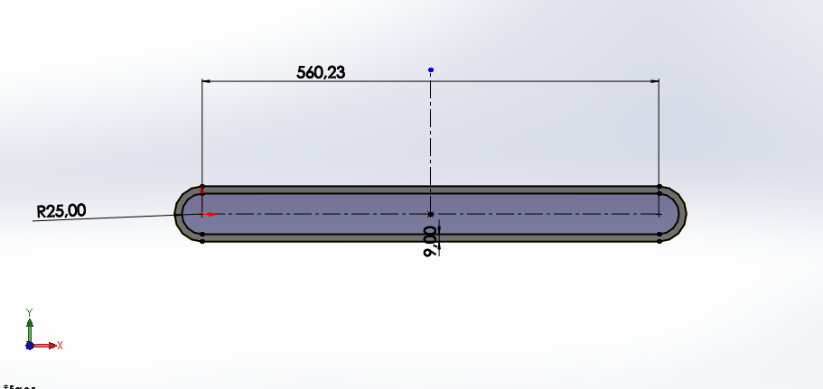

Les dents modélisées s’inspirent des dimensions réelles de la courroie qu’on dispose s’accommodant parfaitement aux dents des courroies . 

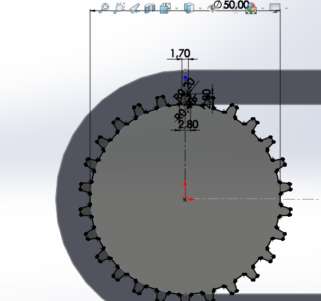

Le procédé est le même que pour la modélisation : création d’un cercle de 50mm de diamètre, modélisation d’une dents, répétition circulaire suivant la direction du cercle ,  répétition linéaire d’une des dents verticales sur toute la longueur de la courroie ( Nombre) puis enfin symétrisation de la fonction réalisée dernièrement par rapport au plan horizontal séparant la courroie en deux. 

Finalement on obtient le résultat suivant : 

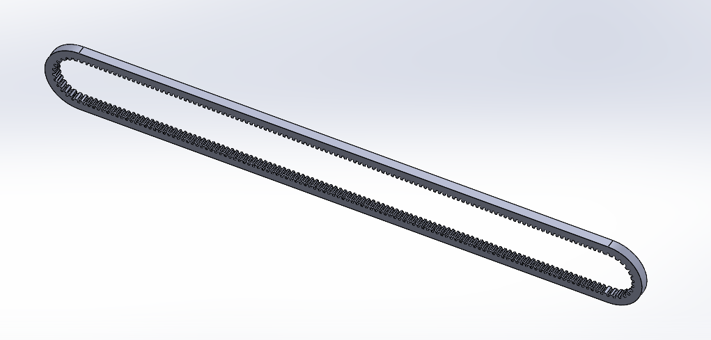

Voici un aperçu du système partiel constitué des tambours , des roulements, des courroies et de leurs supports: 

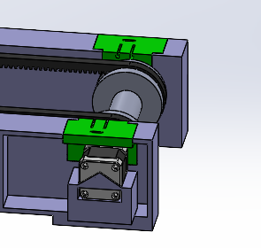

1. **La bande** 

Il s’git d’un des composants majeurs du système car c’est lui qui par son mouvement provoqué par celui des tambours et des courroies , est responsable du transport des déchets. 

Sa conception est assez simple : Rainure de (Caractéristiques de la rainure) , décalage de la géométrie de (longueur de décalage) puis extrusion . On obtient finalement le résultat suivant : 

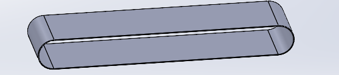

1. **Joins avant entre support latéral bas 1 et reste du convoyeur** 

Concernant les joins, il s'agit de p'tites attaches d'épaisseur 40 mm de forme parallélépipédique permettant de maintenir les blocs de segments avec lesquels ils entrent en contact. Cette solution mécanique plus ou moins innovante n'a pas subie une étude particulière et encore moins une validation par des chercheurs en mécanique. Nous l'avons nous même créé et en application du théorème d'équilibre relatif au moment des forces nous avons la certitude que cela tiendra le long de l'expérience que nous aurons à réaliser. Une démonstration vous sera faite. 

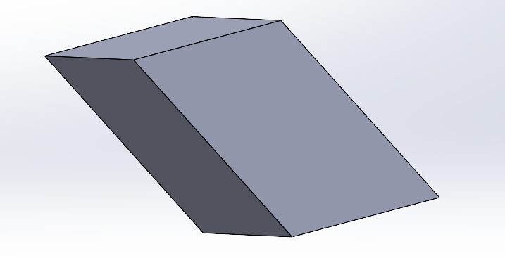

1. **Fourche**

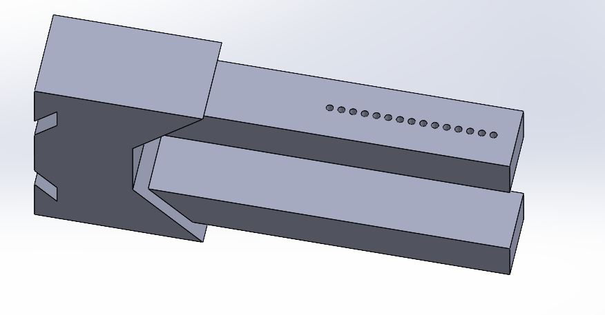

Ce composant est présent en deux exemplaire sur le convoyeur ( De part et d’autre sur la longueur) . Relié au support latéral bas 1 à travers les joins précédemment décrits , il est censé rentrer dans un autre composant du convoyeur afin de régler la tension de la bande comme nous avons eu à l’expliquer dans la rubrique précédente. Les trous présents au dessus sont censé permettre le blocage dès que la longueur voulue est atteinte.   Pour sa conception, nous avons dans un premier temps réalisé l’esquisse suivante : 

//Photo esquisse motif de bas

Ensuite, après extrusion de cette esquisse, nous avons construit un plan de décalage, créer deux rectangles (caractéristiques des rectangles de bout)  puis nous les avons extrudé jusqu’aux faces obliques de notre premier motif. Enfin nous avons réalisé un petit enlèvement de matière circulaire  de la taille des vis dont on dispose (3mm de diamètre ) que nous avons répété linéairement sur une longueur de (valeur)   Ici se présente une illustration de la jonction entre la fourche et le support latéral bas 1  maintenant le moteur: 

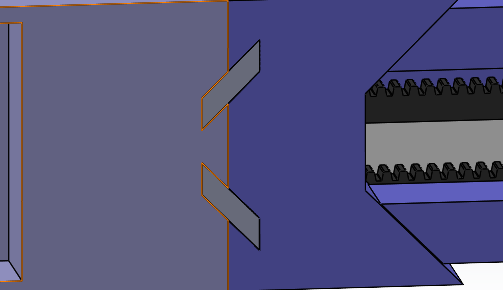

1. **Input fourche**

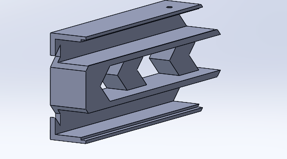


Ces deux pièces ( à mettre ensemble) sont censés recueillir les fourches formant le sous système rétractable dont on parlais précédemment .Leurs longueurs s’accordent avec ceux des fourches afin que le serrage ainsi que le desserrage puisse être réalisé sans grand difficulté. Les motifs de flèches indiquent le sens de déplacement à respecter lors de l’ajustement de la longueur , puis les petits espaces situés à l’arrière sont destinés aux joins permettant de les relier aux supports latéraux situés au niveau du tambour de retour. Enfin un petit trou est réalisé sur le dessus afin de recueillir la vis permettant de bloquer le mouvement. Compte tenu de l’imprécision des filetages réalisés par l’imprimante  dont on disposait, on a jugé bon d’ajuster notre trou aux écrous afin que la vis puisse facilement entrer. 

Quant à la conception 3D , elle consiste en une série d’esquisse , extrusion puis enlèvement de matière . (Dimensions en annexes)

Ces motifs se répètent également de l’autre côté du convoyeur 


1. **La vis** 

Comme décrit précédemment, elles servent à maintenir le convoyeur à la bonne taille . Pour faire simple, leur conception se résume en : Cercle, extrusion, Hexagone, extrusion , Cercle, extrusion. 

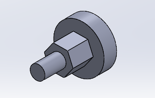

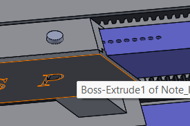

On a donc des fourches qui entrent en des espaces réservées bloqué par une vis dès que la taille correspondant à la tension voulue de la bande est atteinte. En voici une illustration : 

Avec ce système, notre convoyeur dispose de 655mm comme longueur minimale et 230mm comme largeur maximale. 

1. **Support latéraux pour tambour de retour** 

A l’image du tambours moteur, celui de retour dispose également d’un support afin de le maintenir au cours de son mouvement de rotation. L’enlèvement de matière circulaire réalisé est censé accueillir le roulement dans lequel l’arbre du tambour est placé . Enfin, comme d’habitude de petits espaces sont réservés pour accueillir les petits joins utilisé pour fixer le composant avec le reste du système. 

 

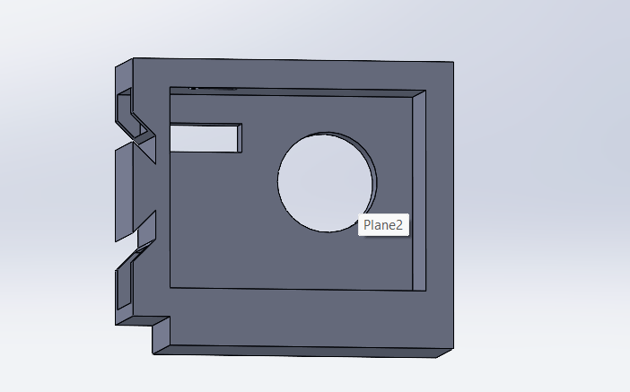

1. **Les joins arrières**

Ceux ci sont légèrement différents des joins avant de par leur géométrie : 


Tout comme les joins avant,  les joins arrière on été conçu dans la même optique. Celle de maintenir deux blocs de solides en contact. La différence entre cette pièce et la précédente est que celle-ci a été construite dans l'optique de maintenir le creux dans la pièce “ input fourche” comme suit.

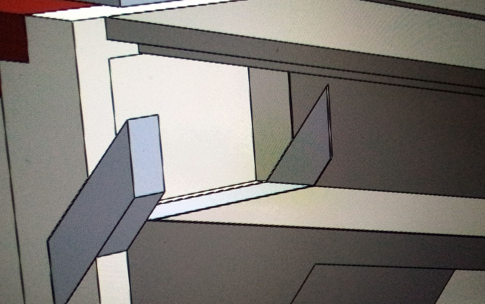

Une fois ces joins mis, on obtient le résultat suivant : 

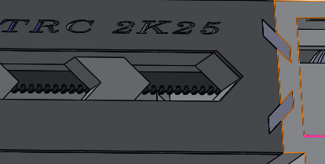

1. **Le support du capteur** 

Afin de fixer le capteur de couleur utilisé par les parties électroniques et IT pour trier les déchets selon leur catégorie, nous avons réalisé un système de suspension destiné à maintenir le capteur directement au dessus du déchet afin d’améliorer la précision de la détection. Ce support est placé sur le motif sortant suivant ( relié au support du tambour de retour décrit précédemment) : 

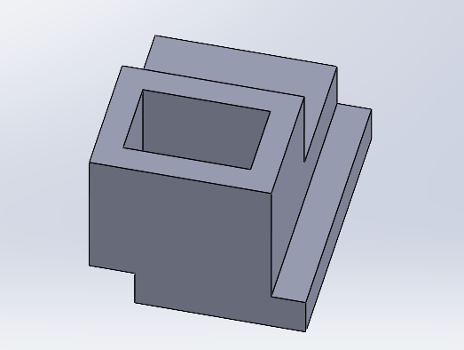

Ce support est un ensemble de 4 pièces modélisés de sorte à faciliter leur assemblage physique : 

- Le support vertical

Il couvre le trou sortant précédent et permet de donner de la hauteur au capteur : 

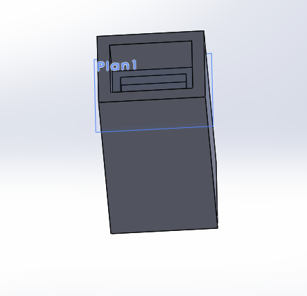

Sa conception est assez basique et repose sur une extrusion mince de 3 mm d’épaisseur et long de notre esquisse afin de maintenir le capteur à 2.5 cm maximum du déchet dès qu’il arrive à la zone de détection. 

- Le support horizontal : Il est chargé d’orienter le capteur vers le centre du tapis au niveau de la zone de détection . Sa conception repose également sur une extrusion mince à la différence où un enlèvement de matière a été réalisé afin de permettre l’assemblage avec le support droit :

.png)

- Liaison entre supports vertical et horizontal :

Comme vous l’avez sans doute remarqué, les deux supports sont munis de calles. Leur raison d’être s’explique par la présence de la pièce suivante entre les deux supports: 

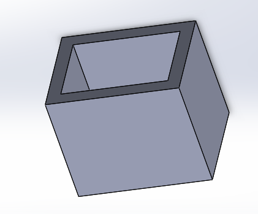

Et donc logiquement ce sont ces calles qui permettent de maintenir cette pièce entre les deux parties précédentes afin de le maintenir ensemble. Le jeu laissé entre les composants entrant et sortant est de 0.15m de chaque côté. 

- Le support du capteur proprement dit :

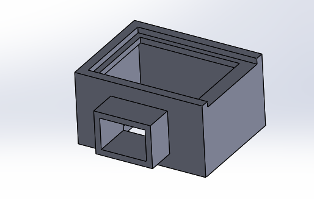

Il sera lié au support horizontale et permettra de maintenir le capteur . Le haut sera muni d’un couvercle raison pour laquelle des calles ont été prévues. Enfin l’extrusion mince réalisée à l’avant est censé entrer dans le support horizontal de sorte que les fils conducteurs du capteur puissent y passer. 

1. **Les déchets**

Comme exigé, il s’agit de petits cubes de 30mm d’arêtes  obtenues en 3D par simple extrusion de 30mm d’un carré de 30mm de côté. 

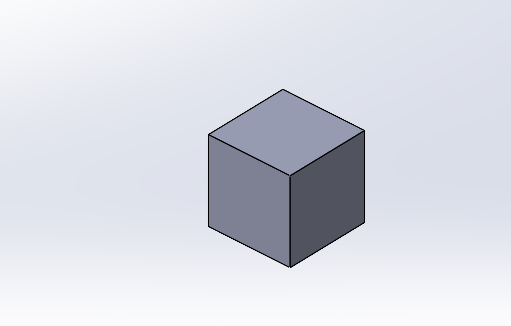

### L’assemblage 🧩

L’assemblage des différentes pièces énumérées ci dessus repose sur l’application des contraintes classiques : Coaxiale et coïncidence de face entre les entités correspondantes afin d’avoir le résultat voulu. L’application de ces contraintes a été décrite dans toutes nos documentations précédentes et donc ici, nous allons juste en faire usage afin de réaliser notre convoyeur en 3D. 

Après application de toutes les contraintes, on obtient l’assemblage final suivant : 

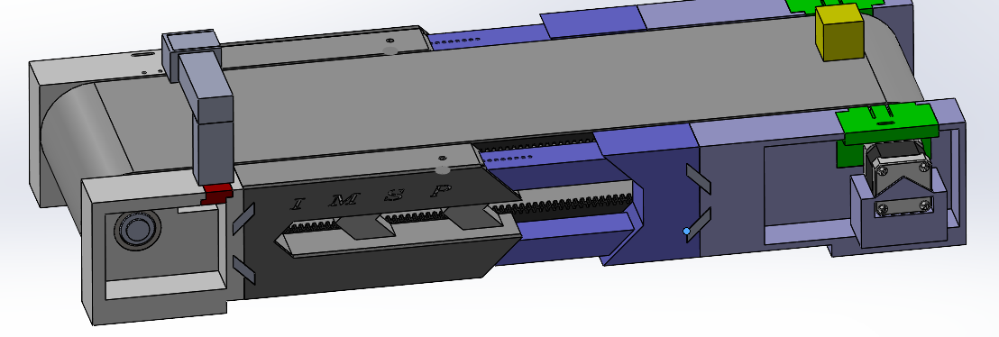

.png)

## L’impression des pièces 🧵

Malgré quelques difficultés matériels liés à notre imprimante et nos filaments, nous avons pu réaliser les impression des pièces  à imprimer avec l'aide de Bénin Excellence et du SCOP . Ici se présente quelques images des pièces imprimées. 

1. Les tambours 

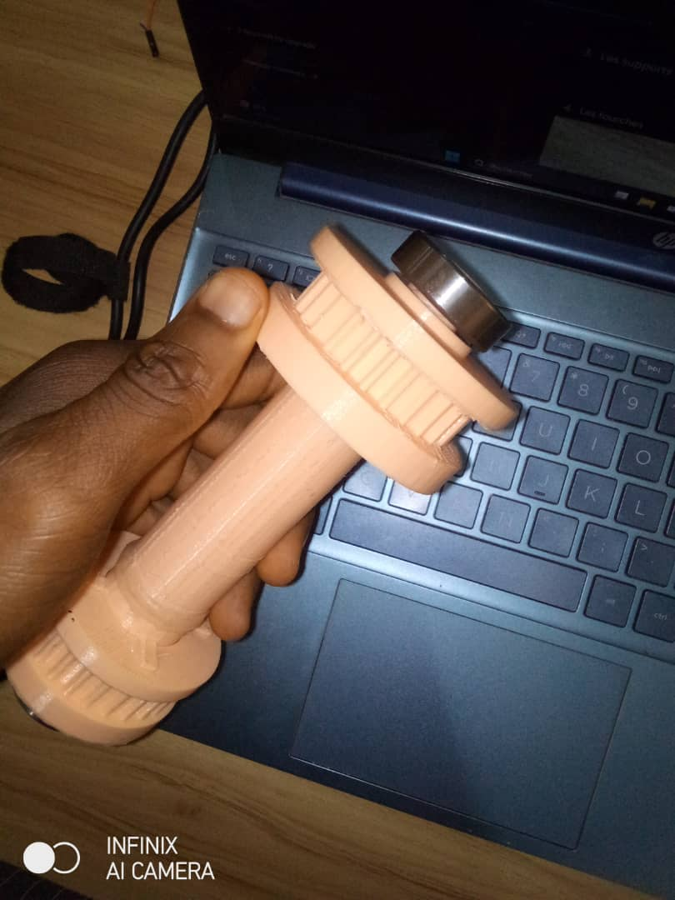

1. Les supports des tambours moteur

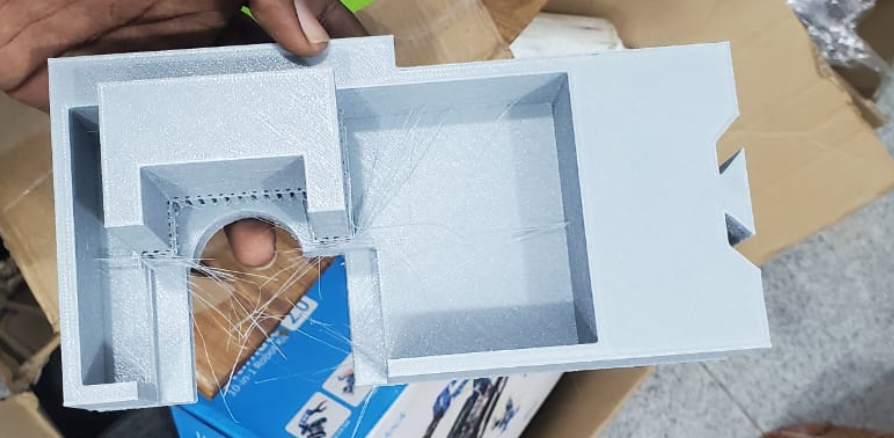

1. Les supports des tambours de retour 

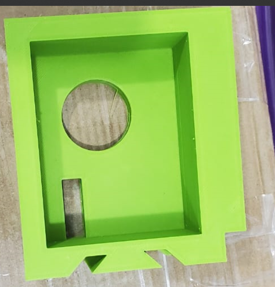

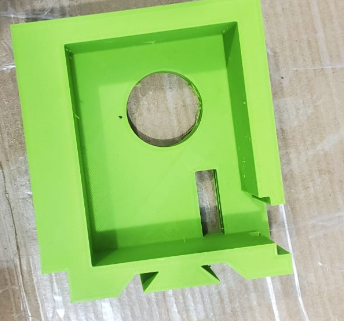

1. Les fourches 

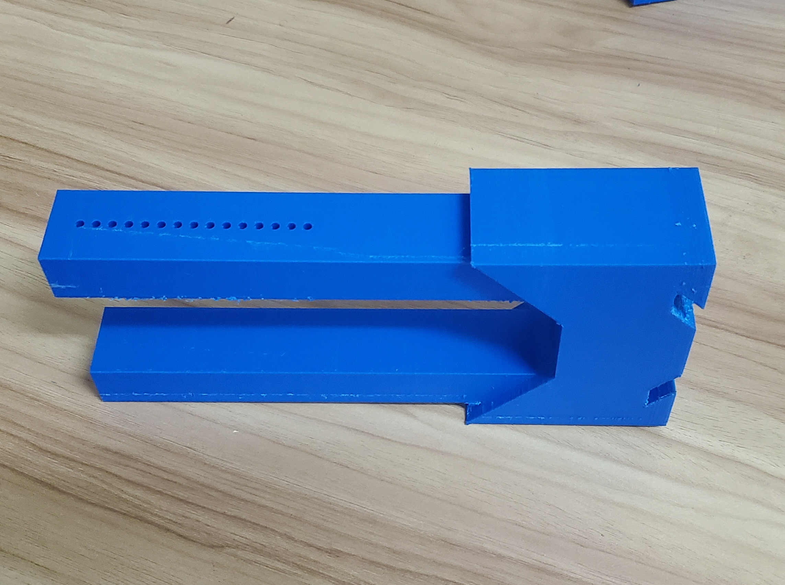

1. Inputs fourches et couvercles ?


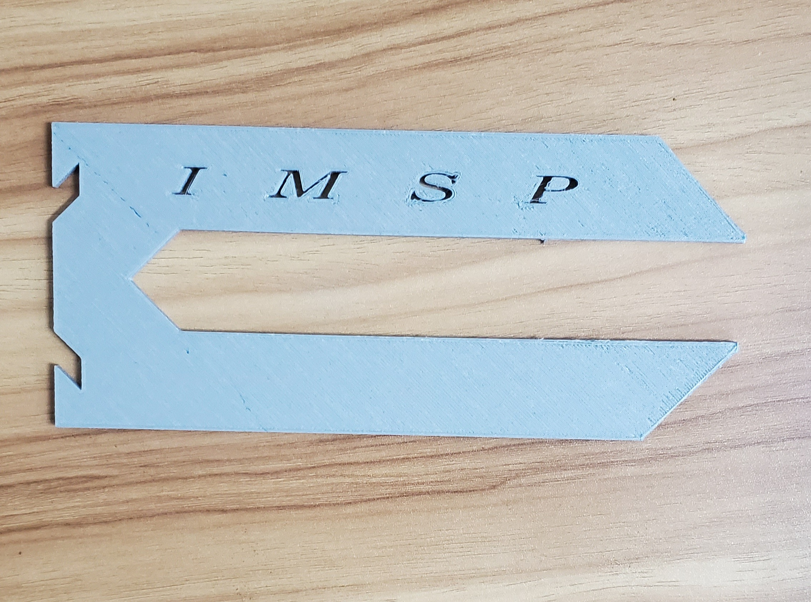

1. Supports de capteurs 

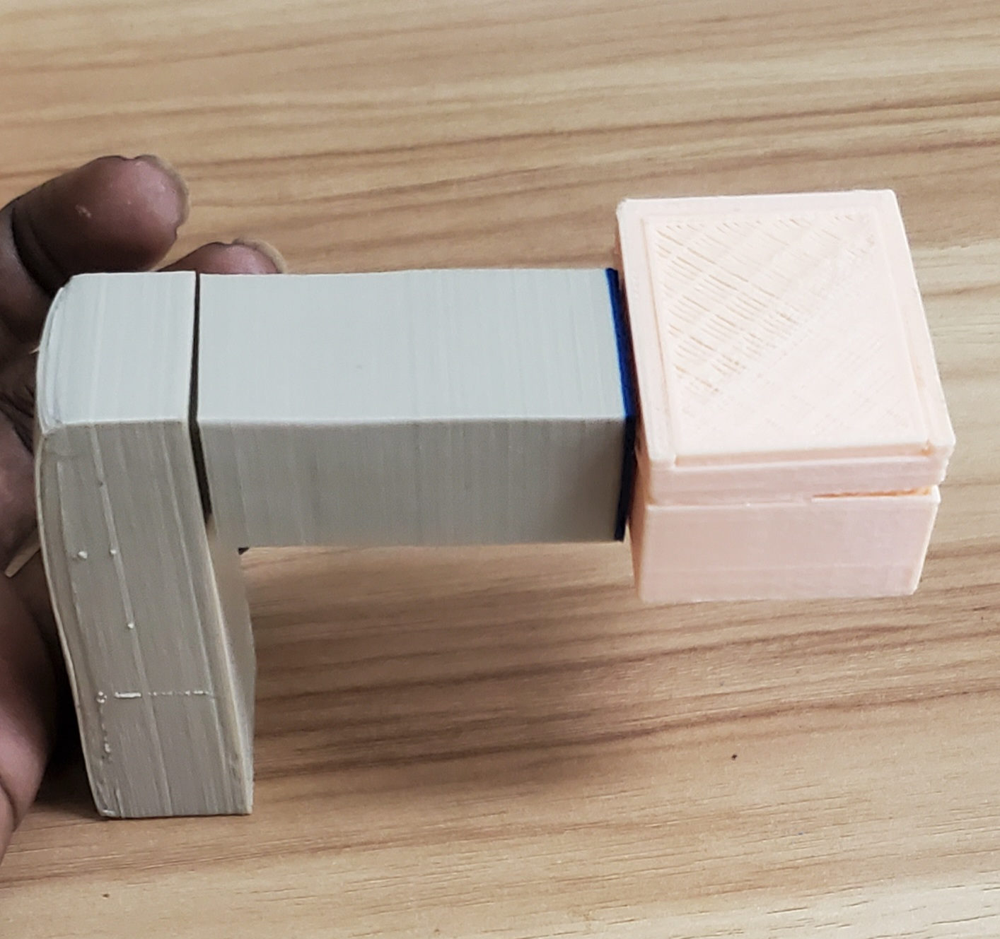

1. Couverts moteurs 

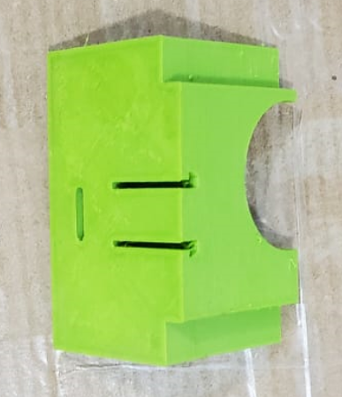

1. Pose capteurs 

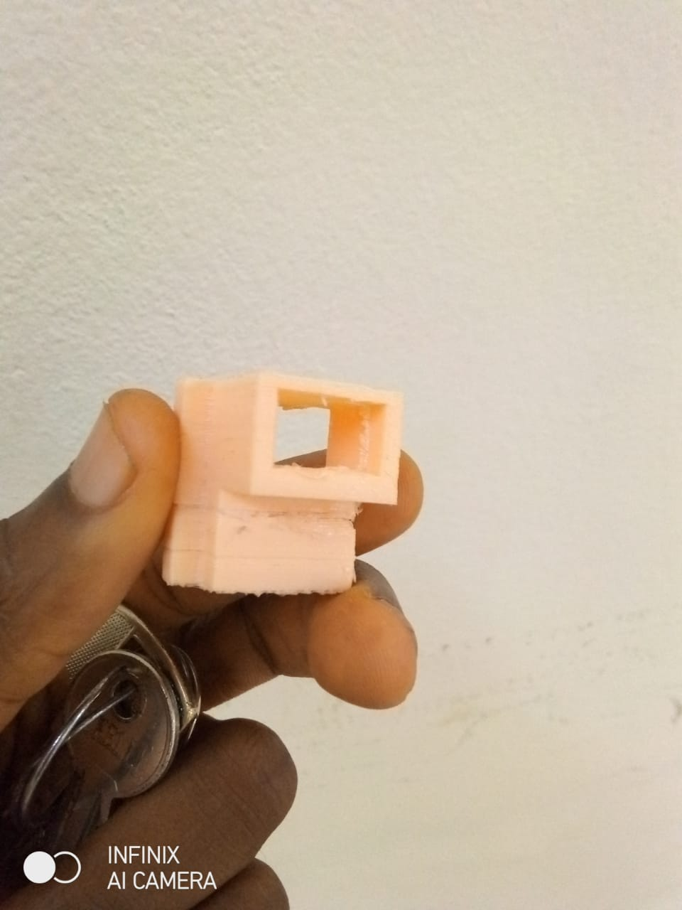

1. Joins  

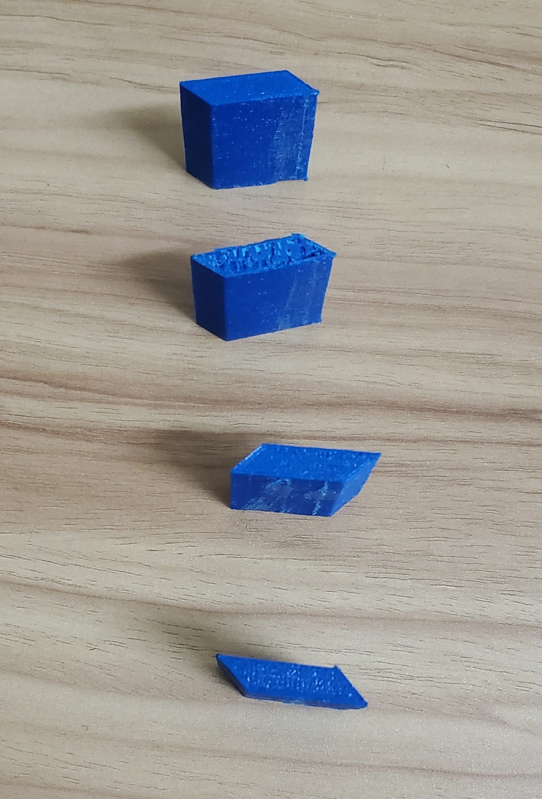

## Pièces mécaniques acquises

Il s'agit des pièces dont le matériau de base ne saurait être du plastique . Ce sont : 

1. Les courroies 

[](https://www.notion.so)

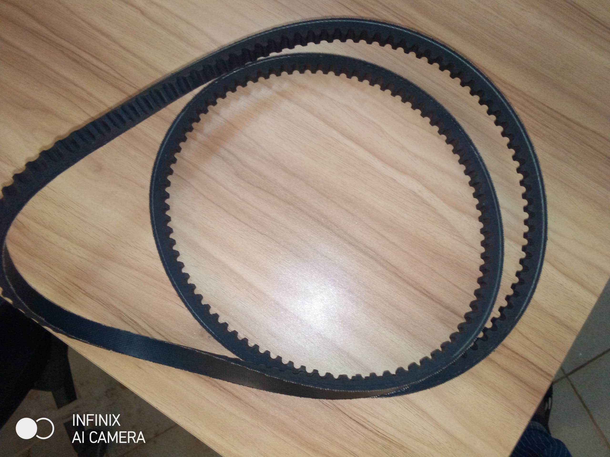

1. Les Roulements 


1. La bande 


## Le montage

## Le résultat final

- **Théorie :**

[https://player.vimeo.com/video/1100863371?h=12bea77160](https://player.vimeo.com/video/1100863371?h=12bea77160)

- Pratique:

## Le Bilan

Centré sur la conception mécanique  d'un système de convoyeur, ce test nous a apporté énormément aussi bien en terme de compétence que d'organisation.  C'était l'occasion pour nous d'appliquer toutes les connaissances qu'on a apprises jusque là 

## **Informations supplémentaires sur quelques pièces modélisées**


.png)

.png)


.png)


## Conception électronique

Cette section décrit l’ensemble des composants électroniques utilisés, leur rôle dans le fonctionnement du système, ainsi que le schéma de câblage général.

**1-Le buzzer**
Un **buzzer** est un petit composant électronique qui émet un son lorsqu’il est alimenté. Il est utilisé pour produire des signaux sonores, comme des bips ou des alarmes. Il en existe deux types principaux : le **buzzer actif**, qui produit un son dès qu’on lui applique une tension (généralement 5V), et le **buzzer passif**, qui a besoin d’un signal oscillant (comme un signal PWM) pour émettre un son.


2-**La LED RGB**

Une **LED RGB** (Red-Green-Blue) est une diode électroluminescente capable d’émettre différentes couleurs en combinant trois LED de base : une rouge, une verte et une bleue, logées dans un même boîtier. Elle peut être **à cathode commune** (les trois LED partagent un même GND) ou **à anode commune** (elles partagent un même +V).

En faisant varier l’intensité de chaque couleur via des signaux PWM, on peut obtenir un large éventail de couleurs. Elle se connecte à trois sorties PWM d’un microcontrôleur, permettant de créer des effets lumineux dynamiques (comme des dégradés, clignotements ou transitions).


**3-Le driver A4988**

Le **driver A4988** est un module conçu pour contrôler facilement un **moteur pas à pas bipolaire**. Il agit comme un pont en H double, capable de gérer le courant dans les deux bobines du moteur pour le faire tourner pas à pas. Il permet aussi d’utiliser des **micro-pas** (jusqu’à 1/16 de pas) pour un mouvement plus fluide et précis.


Le A4988 se commande avec seulement deux signaux : **STEP** (pour faire un pas) et **DIR** (pour choisir la direction). Il nécessite deux alimentations : une pour la **logique (3,3V ou 5V)** et une autre pour le **moteur (jusqu’à 35V)**. Il est idéal pour les imprimantes 3D, traceurs, ou tout projet nécessitant un contrôle précis de position.

**Présentation du schéma de notre circuit**

Pour ce 4ème et dernier test de présélection, il nous était demandé de réaliser un convoyeur de déchets qui serait contrôlé grâce au microprocesseur Atmega 328p comme lors des semaines précédentes. Donc, pour le faire, on a d’abord choisi notre microprocesseur directement disponible dans la bibliothèque Kicad auquel on a associé son circuit d’oscillation, de Reset, la LED d’Etat et un connecteur d’alimentation comme lors des semaines précédentes. Cela est fait suivant le schéma suivant :


Pour la détection des déchets sur le tapis, on a choisi d’utiliser 2 émetteurs laser du même type, le KY-008. On l’a représenté par un connecteur 3 pin, qui correspondent respectivement au signal, au VCC et au GND. Pour la broche du signal, on a choisi de créer les labels S1 et S2 qui ont été connectées aux broches PD5 et PD6 de notre Atmega.


 **Schéma de câblage des émetteurs laser KY-008**

Pour recevoir l’information captée par les émetteurs, ces derniers sont fournis avec des modules récepteurs qui sont l’association de photorésistances et de résistances de 10k. Ils suivent le même schéma que les émetteurs laser, c’est-à-dire un connecteur 3 pin, mais avec les broches du signal qui ont été associées aux labels R1 et R2 qui sont quant à eux connectés respectivement aux broches PD2 et PD3 de notre microprocesseur. A la base, on ne voulait pas les inclure dans notre schéma, mais les récepteurs qui ont été livrés avec nos  émetteurs laser étant défaillants, on a dû fabriquer nous-mêmes nos propres récepteurs suivant le modèle suivant :


Ce qui a conduit au schéma Kicad suivant :


Dans notre schéma final, on a décidé de représenter nos 2 récepteurs de la manière suivante :


**Schéma de câblage des récepteurs laser**

Le montage physique de nos récepteurs sera présenté plus tard dans la documentation.

Pour assurer la communication entre notre interface web et notre Atmega, on a choisi d’utiliser un module bluetooth, le HC05 qui est constitué de 6 broches. Mais comme pour notre circuit, seulement 4 broches seront utilisées donc on a choisi d’utiliser un connecteur 4 pin, les 2 premières correspondant aux broches VCC et GND et les deux dernières seront connectées au microprocesseur. Il s’agit des broches RX et TX qui seront connectées respectivement aux broches TXD et RXD de l’Atmega. Pour ce faire on a créé les labels RX et TX toujours dans l’optique de faciliter la compréhension de notre circuit.


**Schéma de câblage du module HC05**

Pour notre capteur de couleur, on est partis sur le capteur TCS 230 et pour le représenter dans notre logiciel, on a choisi d’utiliser un connecteur de deux rangées de 4 pin comme le module. Il y a 3 pin qui sont réservées à l’alimentation, une pin VCC et 2 GND. Pour le câblage des autres broches, on a créé les labels OUT, S0, S1, S2 et S3 qui sont connectés respectivement aux broches PD2, PD4, PD5, PD6 et PD7 de l’Atmega.


**Schéma de câblage du capteur de couleur**

Lorsque la détection d’un déchet sur le tapis est faite, une led RGB qui est une association de 3 leds de couleurs différentes s’allume en fonction de la couleur du déchet sur le tapis. Donc la Led jaune pour un déchet de couleur jaune. Ce module est représenté dans notre schéma par un connecteur à 4 pin, les 3 premières représentant celles qui sont connectées à l’atmega. Il s’agit des broches connectées aux labels LED1, LED2 et LED3 qui sont connectées respectivement aux broches PB1, PB2 et PB3 de notre microprocesseur.


**Schéma de câblage de la LED RGB**

De plus, on a décidé d’ajouter un buzzer qui sonnera à chaque fois qu’un objet sera détecté sur le tapis. Sa broche réceptrice de signal est mise sur la broche PD3 de notre Atmega grâce au label Signal buzzer.


**Schéma du câblage du buzzer**

Pour le contrôle de notre moteur, on est partis sur un driver A4988 qui possède 8 broches dont les connexions sont les suivantes :

Bobine A : 1A (A4988) <-> 1 fil moteur

- Bobine B : 2A (A4988) <-> 1 fil moteur

- STEP -> D3

- VDD -> 5V

- VMOT -> +12V

- Alimentation moteur :

- Bobine A : 1B (A4988) <-> 1 fil moteur

- GND -> GND

- DIR -> D4

- Bobine B : 2B (A4988) <-> 1 fil moteur

- A4988 vers microprocesseur :
- Connecter les 4 fils du moteur NEMA17 à l’A4988 :

- GND VMOT -> GND alim

Mais pour notre schéma vu qu’il fallait juste connecter les broches STEP, DIR, VCC, GND on a choisi d’utiliser un connecteur 4 pin avec des broches du même nom. Les broches STEP et DIR sont connectées respectivement aux broches PC0 et PC1 de notre Atmega avec des labels du même nom.


**Schéma de câblage du driver**

Pour le circuit de notre driver on a choisi comme les récepteurs de nos émetteurs laser de faire le montage physique à part .Donc le driver ne sera pas directement notre circuit final. Nous y reviendrons plus tard notre documentation.


**Schéma final de notre circuit**

L’exécution du contrôle des règles électriques de notre schéma génère le message suivant :


Ce qui nous prouve que notre schéma ne comporte pas des erreurs.

Voici un tableau récapitulatif des différentes connexions que l’on a éffectué:

| **Composant** | **Broche ATmega328P** | **Référence Arduino** | **Numéro Arduino** |
| --- | --- | --- | --- |
| Signal 1er emetteur laser | PB0 (pin 14) | D8 | 8 |
| LED1 | PB1 (pin 15) | D9 | 9 |
| LED2 | PB2 (pin 16) | D10 | 10 |
| LED3 | PB3 (pin 17) | D11 | 11 |
| Signal 2ème emetteur laser | PB5 (pin 19) | D13 | 13 |
| Oscillateur XTAL1 | PB6 (pin 9) | - | - |
| Oscillateur XTAL2 | PB7 (pin 10) | - | - |
| STEP (A4988) | PC0 (pin 23) | A0 | 14 |
| DIR (A4988) | PC1 (pin 24) | A1 | 15 |
| Signal du récepteur 1er emetteur laser | PC2 (pin 25) | A2 | 16 |
| Signal du récepteur 2ème emetteur laser | PC3 (pin 26) | A3 | 17 |
| Reset | PC6 (pin 1) | Reset | - |
| Signal buzzer | PD3 (pin 3) | D3 | 3 |
| OUT (TCS230) | PD2 (pin 4) | D2 | 2 |
| S0 (TCS230) | PD4 (pin 6) | D4 | 4 |
| S1 (TCS230) | PD5 (pin 11) | D5 (PWM possible) | 5 |
| S2 (TCS230) | PD6 (pin 12) | D6 (PWM possible) | 6 |
| S3 (TCS230) | PD7 (pin 13) | D7 | 7 |

Après cela on est passés au design du PCB et c’est toujours après un long travail de réarrangement des composants et des connexions qu’on a obtenu le PCB suivant :


Dont une vue 3D est la suivante :

[20250712-1205-50.3498119.mp4](./assets/20250712-1205-50.3498119.mp4)

Il fait une dimension de 9x8cm.

On a également fait le design du PCB de notre récepteur :


Et sa vue 3D :

[Enregistrement de l'écran 2025-07-10 170343.mp4](./assets/Enregistrement_de_lcran_2025-07-10_170343.mp4)

Il fait 2.5x2 cm.

Pour le montage de notre circuit principal, on a décidé de le réaliser sur un veroboard dont les images sont les suivantes :


**Vue arrière du circuit principal** 


**Vue avant du circuit principal**

Pour le montage du circuit des récepteurs on a aussi décidé de les faire sur le veroboard.


**Vue arrière du circuit du récepeteur** 


**Vue avant du circuit du récepteur** 

On a également utilisé la même approche pour le driver de notre circuit ,c’est à dire un montage sur veroboard mais vu qu’il allait sûrement être réutilisé pour un autre projet, on a décidé de souder des connecteurs sur notre veroboard et de faire la liaison avec jumpers.


**Vue arrière du circuit du driver**

Nous joyons à notre documentation les différents fichiers Kicad de notre projet.


**Vue avant du circuit du driver**

# **Présentation de quelques composants électroniques**

Cette section décrit l’ensemble des composants électroniques utilisés, leur rôle dans le fonctionnement du système, ainsi que le schéma de câblage général.

[Présentation de quelques composants électroniques](https://www.notion.so/Pr-sentation-de-quelques-composants-lectroniques-22ed3871a1b180918813ec62680820ca?pvs=21)

# Conception informatique

Cette section présente la mise en place du système embarqué permettant de détecter, identifier et gérer le tri des déchets sur le convoyeur, ainsi que le développement de l’interface web assurant le suivi en temps réel des données transmises par le dispositif.

# **Détection des déchets sur le tapis**

L’objectif du travail fourni à ce  niveau est de détecter la présence d’un objet  sur le tapis.

Pour ce faire, on a décidé d’utiliser un **module laser diode KY-008** et comme récepteur une **photorésistance**.

## **Module Laser diode KY-008**


Il s’agit d’un capteur composé principalement d’une LED , de dissipateurs thermiques et de lentilles convergentes. Ces lentilles permettent de converger les faisceaux lumineux provenant de la LED lorsqu’elle est allumée en un seul faisceau lumineux invisible à l’œil nu et de longueur d’onde **650 nm.** Au moins, ce qui est visible est le **point rouge** qui apparait lorsqu’il atteint une surface opaque.   

[KY-008, KY-008-AZ Datasheet PDF (AZ-Delivery) - Laser Transmitter module](https://datasheet4u.com/datasheet-pdf/AZ-Delivery/KY-008/pdf.php?id=1415012)

## **Récepteur: Photorésistance**

 Particulièrement au niveau du récepteur, on voulait prendre le module KY-018 mais après quelques  tests avec lui, les données obtenues n’étaient pas utilisables (valeurs nulles, variation faible des mesures) pour faire une détection fiable .Donc on a décidé de prendre une photorésistance nue et de reproduire le circuit nous-même. 


                          **photorésistance nue**

### **Principe de fonctionnement**

La photorésistance est une résistance variable en fonction de la luminosité ambiante. Puisque c’est une résistance variable, alors la donnée est continue et non binaire (0 ou 1) . Donc on comprend que les broches utilisables sont les pins analogiques(A0 à A5). 

En fait , la luminosité est inversement proportionnelle à la photorésistance. Donc:

- **plus il y a de la lumière**, **plus faible est la photorésistance** et donc cette dernière laissera passer le courant plus facilement, **ce qui conduira à une tension plus grande mesurée au niveau de la broche analogique** ;
- moins il y a de la lumière , plus grande est la photorésistance et donc plus faible sera la tension mesurée.

Pour rappel, ses deux  broches sont connectées à notre ATMega en rajoutant une résistance **pull down (10kOhm)** de cette manière :

```

       5V
        |
       [LDR]
        |
        +-------> A1 (entrée analogique Arduino)
        |
     [10 kΩ]
        |
       GND

```

**Pourquoi une résistance en plus et pourquoi dit on pull down?**

La mesure de la **lumière ambiante** avec une **LDR** (photorésistance) exige la transformation de cette lumière en une **tension électrique comprise entre 0 et 5V** pour pouvoir la lire avec une entrée analogique (`analogRead`) de l’Arduino ou de l’ATMega.

**🎛️ Problème : la LDR seule ne génère pas une tension exploitable**

Une LDR change de résistance selon la lumière :

- Plus de lumière → résistance faible
- Moins de lumière → résistance élevée

Mais seule, la LDR ne fournit pas une tension, juste une résistance variable. Il faut donc un montage électrique qui transforme cette variation de résistance en une variation de tension. C’est là qu’intervient.

**⚙️ Le diviseur de tension**

On utilise un diviseur de tension, composé de :

- Une LDR (résistance variable)
- Une résistance fixe de 10 kΩ

Formule de la tension mesurée par l’Arduino :

$$
V_{A1} = \frac{R_{\text{fixe}}}{R_{\text{LDR}} + R_{\text{fixe}}} \times 5V
$$

**🔍 Pourquoi une résistance de 10 kΩ ?**

1. Elle forme avec la LDR un diviseur de tension efficace.
2. Elle est assez grande pour ne pas consommer trop de courant.
3. Elle est assez petite pour créer une variation de tension perceptible quand la lumière change.
4. C’est une valeur standard bien adaptée à la plage de résistance typique des LDR (de quelques centaines d’ohms à plusieurs dizaines de kΩ).

**🧲 Pourquoi on l’appelle parfois "pull-down" ?**

Le terme pull-down vient de l’électronique numérique, où une résistance ramène un signal vers 0V (GND) lorsqu’aucune autre source ne force l’état.

Dans notre cas :

- Le signal (point entre la LDR et la résistance) est tiré vers le bas (GND) par la résistance de 10 kΩ.
- Donc elle "pull down" la tension quand la LDR est très résistante (obscurité).

Mais ici, ce n’est pas exactement un pull-down au sens strict numérique — on parle plutôt d’un diviseur de tension, dont la résistance du bas joue ce rôle de tirer le signal vers 0V quand la LDR ne conduit presque plus. 

[Photorésistance : fonctionnement, choix, montages arduino, …](https://passionelectronique.fr/photoresistance/)

## **Détermination de la présence d’un objet sur le tapis en connaissant la luminosité**

- **Logique globale**

En pointant mon laser vers ma photorésistance, cette dernière mesure une très forte luminosité. Ainsi, on voit que si un objet se place devant le laser, il y aura une forte baisse de la luminosité. 

Puisque je n’ai que deux états à distinguer(objet présent ou objet absent) alors il me suffit de fixer un **seuil** par rapport auquel je compare les valeurs de tension mesurée du signal . Si ces valeurs le dépassent, alors la luminosité a augmenté et donc “objet absent” et le contraire pour “objet présent”.

- **Analyse des valeurs pour détermination du seuil**

Donc on a fait des mesures et on s’est rendu compte que lorsque qu’il n’y a pas d’objet , les valeurs dépassent 900 et le contraire lorsqu’il y en a. Il serait suffisant de prendre pour seuil **900**.

Voici le code détaillé qui explique comment nous détectons la présence d'un objet sur le tapis:

```cpp
 // broche de connexion module laser
#define LASER 11
 // broche de connexion buzzer  
#define BUZZER 12
// broche de connexion capteur de lumière
#define photoResistance A0    

int seuil=900;
void setup() {
  Serial.begin(9600);
	/*Configuration des broches */
  pinMode(LASER, OUTPUT); // en sortie 
  pinMode(BUZZER, OUTPUT); // en sortie
  pinMode(photoResistance,INPUT); // en entree
  digitalWrite(LASER,HIGH); //allumage du laser
  delay(500);
}

void loop() {
  // mesure de la lumière à l'aide d'un capteur
  int mesure= analogRead(photoResistance);
  Serial.print("Capteur de lumière: " + String(mesure));

  
  if(mesureActu<=900) // Objet sur le tapis
  {
      tone(BUZZER, 500);  // activer le buzzer
  }
  else {noTone(BUZZER);} // desactivation du buzzer
  delay(500);
}

```

- **Circuit de test**


**Vidéo de test**

[https://player.vimeo.com/video/1100859641?h=971be1dd69](https://player.vimeo.com/video/1100859641?h=971be1dd69)

## **Amélioration pour le test de fonctionnement du convoyeur**

Donc nous venons d’atteindre notre objectif : nous avons pu détecter si un objet est présent sur le tapis ou non.  

Mais imaginons que plusieurs déchets soient déposés sur le tapis, et comme on sait que lorsqu’on est à la fin du convoyeur la bande s’arrête , ca veut dire que les déchets qui auraient été déposés pendant le cycle du premier déchet serait toujours sur la bande alors que cette dernière se serait déjà arrêté . **Problématique !!!** 

Donc il nous faut le nombre de déchets sur le tapis et on peut le faire notre détecteur laser en début du convoyeur. Le seul petit détail, c’est qu’il ne faudrait pas qu’un même déchet soit compté plusieurs fois et pour ce faire , on peut se baser sur la variation de la luminosité. 

Plus clairement, si un objet reste au niveau du laser, alors la variation des mesures sera faible (+-5). Et on est sûr que si un nouveau déchet est posé sur le tapis, la différence entre la valeur précédente et celle actuelle sera positive (car l’absence d’objet augmente la luminosité alors que la la présence la diminue).

Voici le code détaillé 

```cpp
// broche de connexion module laser
#define LASER 11   
// broche de connexion buzzer
#define BUZZER 12 
// broche de connexion capteur de lumière
#define photoResistance A0    

int seuil=900;
int compteur=0;
int mesurePrecedente=0;
bool newObject=0;
void setup() {
  /*Configuration des broches */
  pinMode(LASER, OUTPUT); // en sortie 
  pinMode(BUZZER, OUTPUT); // en sortie
  pinMode(photoResistance,INPUT); // en entree
  digitalWrite(LASER,HIGH); //allumage du laser
  mesurePrecedente=analogRead(LDR);
  delay(500);
}

void loop() {
  // mesure de la lumière à l'aide d'un capteur
  int mesureActu = analogRead(photoResistance);
  Serial.print("Capteur de lumière: " + String(mesureActu));

  newObject=newObjectOnTape(mesurePrecedente, mesureActu);
  if(mesureActu<=900 && newObject==1) //Nouvel Objet sur le tapis
  {
      tone(BUZZER, 500);  // activer le buzzer
      compteur++;
  }
  else {noTone(BUZZER);}
  Serial.println(" Compteur: "+String(compteur));
  mesurePrecedente=mesureActu;
  delay(500);
}

bool newObjectOnTape(int mesurePrecedente,int mesureActuelle)
{
if(mesurePrecedente-mesureActuelle>=100) return 1;// Il y a bien un nouvelle objet sur le tapis
return 0;
}

```

**Références et ressources utiles**

Voici une liste des ressources qui ont été consultées pour ce projet :

- [Arduino France - Module diode laser](https://arduino-france.site/module-diode-laser/) - Documentation sur l'utilisation des modules laser avec Arduino
- [Chaîne YouTube @openprogramming](https://www.youtube.com/channel/UCf4jGfp-BFp6GLd6eTptVMg) - Tutoriels vidéo sur la programmation Arduino

# **Reconnaissance d’un déchet et de son type par un capteur de couleur**

L’objectif du travail effectué est de reconnaitre un déchet en déterminant si sa couleur est Rouge, Vert, Bleu ou Jaune. 

## **Capteur de couleurTCS230**

Le capteur de couleur **TCS230** (ou sa version plus récente **TCS3200**) est un capteur optique capable de détecter la **couleur** d’un objet. Il repose sur un principe simple mais ingénieux mêlant **filtrage de couleur** et **conversion lumière → fréquence**. Voici une explication claire et directe :


## Principe de fonctionnement du capteur TCS230

### 1. **Structure du capteur**

Le TCS230 contient :

- Une **matrice de photodiodes** (8×8 = 64 photodiodes) sensibles à la lumière.

**C’est quoi une photodiode?**

Une photodiode est un composant semi-conducteur ayant la capacité de capter un rayonnement du domaine optique et de le transformer en signal électrique.


**Fonctionnement: effet photoélectrique**

Quand un semi-conducteur est exposé à de la lumière, les électrons acquiert de l’énergie cinétique en absorbant les photons qui constituent cette lumière conduisant à la création d’un courant électrique. Il est important de préciser que l’absorption d’un photon par un électron exige que l’énergie de ce dernier (Eph=hν) soit supérieure au seuil d’absorption .

- Chaque photodiode est recouverte d’un **filtre** :
    - 16 détectent le **rouge (R)**,
    - 16 le **vert (G)**,
    - 16 le **bleu (B)**,
    - 16 sont **sans filtre** (utilisés pour la luminosité globale).
- Une **logique de commutation** permet de sélectionner quel groupe de photodiodes est actif (R, G, B ou clair).
- Un **convertisseur courant–fréquence** transforme l’intensité lumineuse reçue par les photodiodes en un **signal carré en sortie** dont la **fréquence est inversement proportionnelle à l’intensité lumineuse** détectée.


### 2. **Fonctionnement étape par étape**

1. **Éclairage de l’objet** : On éclaire l’objet avec une lumière blanche (souvent par des LED intégrées).
2. **Réflexion** : L’objet réfléchit une certaine quantité de lumière rouge, verte et bleue en fonction de sa couleur.
3. **Filtrage** : On active successivement les filtres R, G, puis B :
    - Quand le filtre rouge est actif, seules les photodiodes rouges « mesurent » la lumière rouge réfléchie.
    - Pareil pour vert et bleu.
4. **Conversion** : Le capteur convertit l’intensité reçue (R, G ou B) en une fréquence en sortie (`OUT`) :
    - Plus la couleur est intense, plus la fréquence est faible.

### Résumé

| Élément | Rôle |
| --- | --- |
| Photodiodes filtrées | Mesurent séparément les composantes R, G, B |
| Convertisseur courant-fréquence | Transforme la lumière détectée en fréquence |
| Sortie `OUT` | Donne un signal carré dont la fréquence dépend de l’intensité de lumière |
| Contrôle `S2` / `S3` | Sélectionne les filtres R, G, B ou clair |
| Contrôle `S0` / `S1` | Détermine le **facteur de division de fréquence** pour ajuster la vitesse de sortie |

**Explication plus claire de la fonction de S0/S1**

Le capteur TCS230 ne donne **pas directement une couleur** ou un nombre.

Il **sort un signal carré** (comme un train d’impulsions) sur la broche `OUT`.

La **fréquence** de ce signal est **inversement proportionnelle à l’intensité lumineuse** détectée.

Mais cette fréquence peut être **très élevée** (des centaines de kHz), donc difficile à lire pour un Arduino, surtout si tu veux faire des calculs derrière.

👉 C’est pour ça qu’on utilise **S0 et S1** :

Ils servent à **diviser la fréquence du signal de sortie**, pour **rendre le signal plus facile à lire**.

---

**🧠 Tableau de configuration S0 / S1**

| S0 | S1 | Fréquence de sortie |
| --- | --- | --- |
| L | L | 0% (sortie désactivée) |
| L | H | 2% de la fréquence d’origine |
| H | L | 20% |
| H | H | 100% (plein débit) |

**Exemple concret**

Imaginons que le capteur veut sortir un signal à **100 kHz** (c’est rapide) :

- Si **S0 = H, S1 = H**, tu obtiens 100 kHz → difficile à mesurer avec `pulseIn()`
- Si **S0 = H, S1 = L**, tu obtiens **20% de 100 kHz = 20 kHz** → plus facile pour Arduino
- Si **S0 = L, S1 = H**, tu obtiens seulement **2 kHz**
- Si **S0 = L, S1 = L**, la sortie est **désactivé.**

La plus pratique est :

```cpp
digitalWrite(S0, HIGH);
digitalWrite(S1, LOW);
```

→ Ça donne **20% de la fréquence d’origine**, un bon compromis entre précision et vitesse.

**En résumé :**

- **S0 / S1** contrôlent la **vitesse du signal OUT**
- Ce n’est **pas lié à la couleur**, mais à **comment tu veux lire le signal**
- Le but est de **rendre la fréquence mesurable par ton Arduino**, sinon ce serait trop rapide

**Détermination de la couleur d’un objet** 

**1. Comprendre ce que le capteur mesure**

Quand on mesures une couleur avec le capteur :

- Tu obtiens trois valeurs : `redFreq`, `greenFreq`, `blueFreq`.
- **Plus la fréquence est basse**, **plus la couleur correspondante est présente** (car la fréquence est inversement proportionnelle à l’intensité).
- Donc pour chaque couleur, on peut dire :
    
    ```
    Couleur claire → fréquence basse
    Couleur foncée ou absente → fréquence élevée
    ```
    

**Réflexion**

- Il est assez clair que pour détecter les couleurs primaires Rouge, Vert et Bleu, il suffirait de chercher la fréquence mesurée la plus basse. Si on obtenait par exemple :

-redFreq=30, greenFreq=70, blueFreq=80, alors on dira que l’objet est de couleur rouge. 

- Mais ici, notre objectif est de détecter le Rouge, le Vert, le Bleu et le Jaune. Alors comment prendre le jaune en compte ?
- La **première idée** fut de considérer **des plages de valeurs de fréquences fixes** pour chaque couleur à reconnaitre. Et on comprend que si les valeurs de fréquences mesurées ne se retrouvent pas dans une  des plages définies , alors la couleur ne correspond à rien .

Il est important de préciser que ces plages de valeurs doivent être déterminées en mesurant chaque couleur à détecter et en analysant la variation des valeurs. 

Le problème avec cette méthode est qu’elle est peu flexible et dépend des paramètres extérieurs comme:

-la stabilité des valeurs

-la distance,

-l’éclairage , de l’angle d’éclairage 

-les teintes de couleurs

-etc.

La remarque s’est faite surtout au niveau de la distance parce que plus on s’éloignait de l’objet, plus les valeurs de fréquences augmentaient (ce qui est assez logique puisque l’intensité lumineuse de la lumière reflétée par l’objet diminue au fur et à mesure que la distance augmente conduisant ainsi à une augmentation de la fréquence) et dépassaient les plages de valeurs définies . Je précise qu’il ne fallait qu’une légère variation (1cm ) pour que la détection ne marche plus . Donc on s'est dit qu'en mesurant à plusieurs distances, les valeurs des fréquences de rouge, de vert, de bleu, dans une couleur, et en prenant pour minimum, le minimum des fréquences obtenues pour la distance la plus petite et pour maximum, le maximum des valeurs de fréquences pour la distance la plus grande, alors on aurait notre plage de valeurs. Mais un problème assez évident s'est posé : les plages se mélangeaient. Par exemple, le rouge et le jaune se sont vite confondus. 

Aussi, on s’est dit qu’en fixant la distance , qu’on aurait un meilleur résultat mais les mesures du capteur n’étaient pas assez stables et dépassaient parfois les plages de valeurs. De plus, la teinte de vert dont nous disposions n’était pas pur c’est à dire que son code décimal n’était pas (0,255,0) ce qui rendait la création des plages de valeurs encore plus compliquée. 

On a donc abandonné cette idée et on a eu l’idée suivante.

**Logique globale de l’idée finale actuelle**

<aside>
💡

Ici, l'idée est de mapper les valeurs de fréquences mesurées avec celles du code décimal RGB (0 à 255) et ensuite de mesurer la distance euclidienne entre les valeurs mesurées RGB et celles RGB correspondant à chaque couleur à détecter avec en plus la couleur du tapis qui est noir. Et donc, la couleur pour laquelle la distance est la plus petite est la couleur de l'objet .

</aside>

- Pour faire ce mappage, il a fallu d'abord, **déterminer le min et le max des valeurs de fréquence**, pour ensuite faire le mappage. Le min a été mesuré à partir du blanc pur, et le max a été mesuré à partir du noir pur. Ce qui est assez compréhensible, puisque le noir, étant donné qu'il absorbe complètement la lumière alors les fréquences mesurées seront les plus grandes . Et le blanc, puisque c'est la couleur qui contient le maximum de toutes les couleurs (255,255,255), alors forcément, ses fréquences seront les plus basses.

Il est important de préciser que pour plus de précision, on a considéré les valeurs de 0 à 1023 au lieu de la plage RGB connue (0 à 255) et que la distance est toujours fixe entre le capteur et l’objet en dessous du capteur est fixe(2.5cm).

Pour vérifier visuellement que la détection est bonne, on utilise la LED RGB .

Voici le code de test: 

```cpp
//Broches de connexions du capteur de couleur
#define S0 2
#define S1 3
#define S2 4
#define S3 5
#define sensorOut 6
//Broches de connexion de la led RGB 
#define BLU 9
#define GRN 10
#define RED 11

float redFreq, greenFreq, blueFreq;// Variables de fréquences 

 // Liste de couleurs de référence (RGB)
char*noms[]={"Rouge","Vert","Bleu", "Jaune","Aucune"};

const int refR[5]={1023,0,0,1023, 0}; //Rouge
const int refV[5]={0,1023,0,1023, 0}; //Vert
const int refB[5]={0, 0,1023,0, 0}; //Bleu

// Valeurs mesurées durant l'étalonnage
const float minR = 29;  // Frequence de Rouge dans du blanc pur
const float maxR = 230;  // Frequence de Rouge dans du noir pur

const float minG = 30; // Frequence de Vert dans du blanc pur
const float maxG = 290;// Frequence de Vert dans du noir pur

const float minB = 25; // Frequence de Bleu dans du blanc pur
const float maxB = 230; // Frequence de Bleu dans du noir pur

void setup() {
  Serial.begin(9600);
  pinMode(S0, OUTPUT);
  pinMode(S1, OUTPUT);
  pinMode(S2, OUTPUT);
  pinMode(S3, OUTPUT);
  pinMode(RED, OUTPUT);
  pinMode(GRN, OUTPUT);
  pinMode(BLU, OUTPUT);
  pinMode(sensorOut, INPUT);
  //Fréquence à 20%
  digitalWrite(S0, HIGH);
  digitalWrite(S1, LOW);
  }
  void loop() {
  // Lecture rouge
  digitalWrite(S2, LOW);
  digitalWrite(S3, LOW);
  redFreq = pulseIn(sensorOut,LOW);
  // Lecture vert
  digitalWrite(S2, HIGH);
  digitalWrite(S3, HIGH);
  greenFreq = pulseIn(sensorOut, LOW);
  // Lecture bleu
  digitalWrite(S2, LOW);
  digitalWrite(S3, HIGH);
  blueFreq = pulseIn(sensorOut,LOW);
  //Affichage des valeurs de fréquences lues
  Serial.print("Mesuré Redfreq VertFreq BlueFreq = ");
  Serial.print(redFreq); Serial.print(", ");
  Serial.print(greenFreq); Serial.print(", ");
  Serial.println(blueFreq);

//Contraindre les valeurs de frequences à rester dans la plage de valeurs définies
  redFreq=constrain(redFreq,minR,maxR);
  greenFreq=constrain(greenFreq,minG,maxG);
  blueFreq=constrain(blueFreq,minB,maxB);
  
//Mappage des valeurs de fréquences et des valeurs RGB élargies
  int R = map(redFreq, minR, maxR, 1023, 0);
  int G = map(greenFreq,minG, maxG, 1023, 0);
  int B = map(blueFreq, minB, maxB, 1023, 0);
  
// Affichage des valeurs de fréquences mappées
  Serial.print("Mesuré RGB = ");
  Serial.print(R); Serial.print(", ");
  Serial.print(G); Serial.print(", ");
  Serial.println(B);
  
 //Determination de l'indice de la couleur avec la distance minimale 
int indexCouleur=compareCouleur(R,G,B);

//Affichage de la couleur détectée
Serial.print("Couleur détectée : ");

//Allumage de la LED RGB en la couleur correspondante
afficherLED(indexCouleur);
Serial.println(noms[indexCouleur]);
Serial.println("--------------------------");
  delay(1000);
}

float couleurDistance(int R,int G,int B,int r1,int r2,int r3)
{
  return sqrt(pow(r1-R,2)+pow(r2-G,2)+pow(r3-B,2));
}

int compareCouleur(int R, int G, int B)
{
  int i=0;
  int distance=0;
  int minDistance=couleurDistance(refR[0],refV[0],refB[0],R,G,B); //calcul de la distance de la mesure actuelle à la valeur de reference du rouge
  int indexMin= 0;
  for (i=1;i<5;i++)
  {
    distance=couleurDistance(refR[i],refV[i],refB[i],R,G,B);
    if(minDistance>=distance)
    {
      minDistance=distance;
      indexMin=i;
    }
    
  }
  return indexMin;
}

void afficherLED(int n)
{
  if (n==0) //Rouge 
  { analogWrite(RED, 255);
    analogWrite(GRN, 0);
    analogWrite(BLU, 0);
  }
  else if(n==1)//Vert
  {
    analogWrite(RED, 0);
    analogWrite(GRN, 255);
    analogWrite(BLU, 0);
  }
  else if(n==2)// Bleu
  {
    analogWrite(RED, 0);
    analogWrite(GRN, 0);
    analogWrite(BLU, 255);
  }
  else if(n==3)// Jaune
  {
    analogWrite(RED, 255);
    analogWrite(GRN, 255);
    analogWrite(BLU, 0); 
  }
  else //Aucune couleur
  {
  analogWrite(RED, 0);
  analogWrite(GRN, 0);
  analogWrite(BLU, 0); 
  }
}

```

<aside>
💡

**Lien de quelques sites** 

[https://www.moussasoft.com/tcs230-capteur-de-couleur-avec-arduino](https://www.moussasoft.com/tcs230-capteur-de-couleur-avec-arduino/)/

[https://lastminuteengineers.com/tcs230-tcs3200-color-sensor-arduino-tutorial/](https://lastminuteengineers.com/tcs230-tcs3200-color-sensor-arduino-tutorial/)

[https://projecthub.arduino.cc/SurtrTech/color-detection-using-tcs3200230-a1e463](https://projecthub.arduino.cc/SurtrTech/color-detection-using-tcs3200230-a1e463)

[https://www.ic-components.fr/blog/TCS3200-Color-Sensor-Specifications-Arduino-Guide-How-It-Works.jsp](https://www.ic-components.fr/blog/TCS3200-Color-Sensor-Specifications-Arduino-Guide-How-It-Works.jsp)

[https://www.bing.com/ck/a?!&&p=e1349f6fe6e6ed9708f930acb23d776e2c1576476a5b23efac725f103513ca4aJmltdHM9MTc1MjE5MjAwMA&ptn=3&ver=2&hsh=4&fclid=13ca58cd-0a8e-6cc3-350b-4c7d0b496dfe&psq=tableau+rgb&u=a1aHR0cHM6Ly93d3cucmFwaWR0YWJsZXMub3JnL2ZyL3dlYi9jb2xvci9SR0JfQ29sb3IuaHRtbA&ntb=1](https://www.bing.com/ck/a?!&&p=e1349f6fe6e6ed9708f930acb23d776e2c1576476a5b23efac725f103513ca4aJmltdHM9MTc1MjE5MjAwMA&ptn=3&ver=2&hsh=4&fclid=13ca58cd-0a8e-6cc3-350b-4c7d0b496dfe&psq=tableau+rgb&u=a1aHR0cHM6Ly93d3cucmFwaWR0YWJsZXMub3JnL2ZyL3dlYi9jb2xvci9SR0JfQ29sb3IuaHRtbA&ntb=1)

</aside>

# **Contrôle de la vitesse du Moteur pas à pas**

Lors de mes premiers tests pour nous approprier le circuit, nous avons consulté plusieurs vidéos sur YouTube afin de mieux comprendre le fonctionnement et les précautions à prendre.

J’ai ensuite utilisé un *condensateur de 16V* (erreur mentionnée : 16 Ohms) sans vérifier précisément sa capacité réelle (**100 microfarads**). L’alimentation du circuit était réglée sur *12V*.

Après branchement, *le condensateur **a explosé** au bout de quelques secondes*.

Suite à cela, j’ai remplacé ce condensateur par un *condensateur de 1000 µF*, afin d’observer son comportement dans les mêmes conditions.

### *Phase de test (suite)*

Pour le deuxième test, nous avons utilisé un condensateur de 1000 µF, toujours sous une alimentation de 12V.

Cette fois, *le circuit a fonctionné correctement*, et le comportement attendu a été constaté.

Cela confirme que le *problème provenait de la capacité inadaptée du condensateur utilisé au départ*. La capacité trop faible ne permettait pas une stabilisation correcte de la tension, ce qui a conduit à l'explosion du composant.

Suite à cette réussite, *nous sommes passés à l’étape suivante du projet.*

***Phase de test – Contrôle de la vitesse du tapis roulant et des moteurs***

**D**ans le cadre de la synchronisation du système de convoyage, nous avons réalisé une étude pour *déterminer la vitesse maximale* du tapis afin d’éviter que les déchets posés dessus ne soient projetés à l’arrêt.

- **Méthode :**

En se basant sur le principe d’inertie, nous avons supposé l’absence de frottement et cherché la vitesse maximale pour laquelle, lors d’un arrêt brusque, les déchets ne glissent ni ne sont projetés.

Pour cela nous avons consideré que le tapis serait en matiere plastique ce qui nous a permit d’avoir un coefficient de viscosité de 0,4 assez faible. Evidement nous comptions utiliser une matiere dont le coefficient de viscosité serait plus élever sans avoir pour autant avoir plus  de precision dans l’imediat.

Déterminer la vitesse maximale  que peut avoir le cube sans glisser, en utilisant la distance d’arrêt , le coefficient de frottement statique , et l’accélération due à la gravité.

⚠️ Attention :

Si  les forces de frottement sont nulles, alors aucune force ne lie l’objet au tapis. Donc dès que le tapis s’arrête, l’objet continue forcément sa course à vitesse constante.

En clair :

> S’il n’y a pas de frottement (μ = 0), l’objet sera toujours propulsé, quelle que soit la vitesse.
> 

**Pour qu’il n’y ait aucune propulsion (pas de glissement) :**

Il faut que le frottement existe (μ > 0), et on cherche la vitesse maximale Vmax à laquelle le tapis peut aller sans que l’objet glisse quand il s’arrête.

**Forces en jeu lors de l’arrêt du tapis :**

- L'objet veut continuer avec une vitesse V₀.
- Le tapis arrêté exerce une force de frottement **f = μ·m·g** pour le ralentir.
- L'objet sera stoppé par cette force si l'accélération de freinage **a ≤ μ·g.**

**Application de la loi de Newton :**

L’objet s’arrête avec l’équation :

$$
Vo^2 = 2 a d  ⇒ d = \frac{V_0^2}{2 \mu g}
$$

Mais pour éviter tout glissement, l’objet doit être stoppé sans trop de distance de glissement :
→ donc la vitesse maximale autorisée est :

$$
\boxed{V_0 \leq \mu \cdot g \cdot t}
$$

où t est le temps de freinage (si non instantané), ou encore on peut poser une vitesse maximale limite :

$$
\boxed{V_{\text{max}} = \sqrt{2 \mu g d}}
$$

où d est la distance disponible avant glissement.

**Application numérique :**

μ = 0,4 (plastique sur caoutchouc)

g = 9,8 m/s²

d = 50.5cm

$$
V_{\text{max}} = \sqrt{2 \cdot 0{,}4 \cdot 9{,}8 \cdot 0{,}505} \approx 1{,}98\ \text{m/s}
$$

- Cette vitesse a permis de calculer la fréquence de rotation nécessaire du moteur, soit environ **5500 pas/seconde**.
- Or, après test, nous avons constaté que le moteur utilisé avait une limite maximale de **1230 pas/seconde**, équivalente à **6 tours/seconde**.

Code de test

```
#include <AccelStepper.h>
AccelStepper stepper(1,A0,A1);
unsigned long timer;
const float vitt=1230;

void setup() {
  Serial.begin(9600);
  stepper.setMaxSpeed(vitt);
  
  stepper.setSpeed(vitt);

}

void loop(){
 while(millis()-timer<10000)
 {  stepper.runSpeed();}
 delay(2000);
 stepper.runSpeed();
timer=millis();
 while(millis()-timer<2000)
  {  stepper.runSpeed();}

  delay(2000);
  timer=millis() ;

}

```

[https://player.vimeo.com/video/1100860064?h=c5f1fa30aa](https://player.vimeo.com/video/1100860064?h=c5f1fa30aa)

**Conclusion :** la fréquence maximale réelle du moteur est *inférieure à celle nécessaire pour entraîner une propulsion*, ce qui signifie que *le moteur est parfaitement adapté à notre usage*.

- **Essai de contrôle de vitesse avec un potentiomètre**.

 Oui bon je vient le dire un peut tard mais nous avons également essayé d’utiliser un potentiomètre pour contrôler la vitesse de notre moteur.

Dans le but de rendre le contrôle de la vitesse du tapis roulant plus dynamique, *nous avons tenté d’utiliser un potentiomètre* pour ajuster la vitesse du moteur en temps réel. Cependant, *au moment du test, le moteur ne tournait pas* malgré le changement de valeur sur le potentiomètre. Cela indiquait un *problème technique* potentiel dans le câblage, la lecture du signal analogique ou le code utilisé.

Faute de temps pour diagnostiquer plus en profondeur, *nous avons décidé de mettre cette option de côté* pour l’instant.

```cpp
#include <AccelStepper.h>
AccelStepper stepper(AccelStepper::DRIVER,3,4);

const int pinot=A0;
void setup() {
  Serial.begin(9600);
  stepper.setMaxSpeed(1000);
  stepper.setAcceleration(500);
  stepper.setSpeed(200);

}

void loop(){
 int potval=analogRead(pinot);
 float speed=map(potval,0,1023,0,1000);
 stepper.setSpeed(speed);
 stepper.runSpeed();

}
```

# **Communication Interface Web et ATMega: Module Bluetooth HC-05**

La communication entre l’interface Web et l’ATMega est l’une des parties les plus importantes qui exige un module physique permettant l’envoie de données sous un format utilisable de l’ATMega au backend. Pour ce faire , on a choisi le module Bluetooth HC-05 et le format Json. 

## **Module Bluetooth**

### **Pourquoi le Bluetooth?**

L'utilisation d'un module **Bluetooth** comme le **HC-05** avec un Arduino permet une **communication sans fil** entre l’Arduino et un autre appareil (PC, smartphone, tablette, etc.).


**Avantages du Bluetooth :**

- **Sans fil** : pas besoin de connexion physique, utile pour les systèmes embarqués ou mobiles.
- **Facile à mettre en œuvre** : le module HC-05 communique via UART (série), déjà disponible sur l’Arduino.
- **Large compatibilité** : fonctionne avec des applications Android, des logiciels PC, ou des programmes Python/Flask via un port COM.
- **Portée suffisante** : environ 10 mètres (classe 2).
- **Économie d’énergie** : utile dans les projets alimentés par batterie.

### **Formatage Json des données: bibliothèque**“**`ArduinoJson.h`**”

Le **JSON** (*JavaScript Object Notation*) est un format léger et facile à lire pour structurer et échanger des données. Il est largement utilisé dans les applications web pour transmettre des informations entre un client (navigateur) et un serveur. JSON est basé sur une syntaxe simple et intuitive, inspirée des objets en JavaScript, mais il est indépendant du langage de programmation.

### Structure de base du JSON :

1. **Objets** : Une collection de paires clé valeur, entourée d'accolades `{}`.
2. **Tableaux** : Une liste ordonnée de valeurs, entourée de crochets `[]`.
3. **Types de données** :
    - Chaînes de caractères (entre guillemets doubles : `"texte"`)
    - Nombres (entiers ou décimaux)
    - Booléens (`true` ou `false`)
    - Null (`null`)
    - Objets ou tableaux imbriqués.

### Exemple simple :

```json
Copier le code{
  "nom": "Alice",
  "age": 25,
  "estEtudiant": true,
  "competences": ["programmation", "design", "communication"],
  "adresse": {
    "ville": "Cotonou",
    "pays": "Bénin"
  }
}
```

### Avantages :

- **Lisibilité** : Facile à comprendre pour les humains.
- **Compatibilité** : Pris en charge par presque tous les langages de programmation.
- **Léger** : Idéal pour les échanges rapides de données.

Si vous travaillez avec des API ou des bases de données modernes, vous rencontrerez souvent JSON comme format standard pour structurer les données. 😊

**Code pour tester l’envoie de données provenant du capteur de couleur**

```cpp
//librairie pour le formatage des donnees en Json
#include <ArduinoJson.h> 

//Broches de connexion pour le capteur de couleur
#define S0 2
#define S1 3
#define S2 4
#define S3 5
#define sensorOut 6

//Led RGB
#define BLU 9
#define GRN 10
#define RED 11

float redFreq, greenFreq, blueFreq;//fréquences

 // Liste de couleurs de référence (RGB) élargies
char*noms[]={"Rouge","Vert","Bleu", "Jaune","Aucune"};
int couleurPrecedente=4;
const int refR[5]={1023,0,0,1023, 0}; //Rouge
const int refV[5]={0,1023,0,1023, 0}; //Vert
const int refB[5]={0, 0,1023,0, 0}; //Bleu

// Valeurs mesurées durant l'étalonnage
const float minR = 29;  // Frequence de Rouge dans du blanc pur
const float maxR = 230;  // Frequence de Rouge dans du noir pur

const float minG = 30; // Frequence de Vert dans du blanc pur
const float maxG = 290;// Frequence de Vert dans du noir pur

const float minB = 25; // Frequence de Bleu dans du blanc pur
const float maxB = 230; // Frequence de Bleu dans du noir pur

void setup() {
  Serial.begin(9600);
  pinMode(S0, OUTPUT);
  pinMode(S1, OUTPUT);
  pinMode(S2, OUTPUT);
  pinMode(S3, OUTPUT);
  pinMode(RED, OUTPUT);
  pinMode(GRN, OUTPUT);
  pinMode(BLU, OUTPUT);
  pinMode(sensorOut, INPUT);
  // Fréquence à 20%
  digitalWrite(S0, HIGH);
  digitalWrite(S1, LOW);
  
}

void loop() {
  // Lecture rouge
  digitalWrite(S2, LOW);
  digitalWrite(S3, LOW);
  redFreq = pulseIn(sensorOut,LOW);
  // Lecture vert
  digitalWrite(S2, HIGH);
  digitalWrite(S3, HIGH);
  greenFreq = pulseIn(sensorOut, LOW);
  // Lecture bleu
  digitalWrite(S2, LOW);
  digitalWrite(S3, HIGH);
  blueFreq = pulseIn(sensorOut,LOW);

  JsonDocument doc;// création d'une variable de type Json

  redFreq=constrain(redFreq,minR,maxR);
  greenFreq=constrain(greenFreq,minG,maxG);
  blueFreq=constrain(blueFreq,minB,maxB);

  int R = map(redFreq, minR, maxR, 1023, 0);
  int G = map(greenFreq,minG, maxG, 1023, 0);
  int B = map(blueFreq, minB, maxB, 1023, 0);

int indexCouleur=compareCouleur(R,G,B);
if(indexCouleur!=4 && indexCouleur!=couleurPrecedente) //Couleur Detecté
{
  if(indexCouleur==0)//Rouge
  {
    doc["color_waste"]="red";
  }
  else if (indexCouleur==1)//Vert
  {
    doc["color_waste"]="green";
  }
  else if(indexCouleur==2)//Bleu
  {
    doc["color_waste"]="blue";
  }
  else //Jaune
  {
    doc["color_waste"]="yellow";
  }
  //Envoie de donnees sous format Json
  serializeJson(doc, Serial);
  Serial.println(); 
}
couleurPrecedente=indexCouleur;

afficherLED(indexCouleur);
delay(100);
}

int couleurDistance(int R,int G,int B,int r1,int r2,int r3)
{
  return sqrt(pow(r1-R,2)+pow(r2-G,2)+pow(r3-B,2));
}
int compareCouleur(int R, int G, int B)
{
  int i=0, distance=0,indexMin= 0;
  int minDistance=couleurDistance(refR[0],refV[0],refB[0],R,G,B); //calcul de la distance de la mesure actuelle à la valeur de reference du rouge
  for (i=1;i<5;i++)
  {
    distance=couleurDistance(refR[i],refV[i],refB[i],R,G,B);
    if(minDistance>=distance)
    {
      minDistance=distance;
      indexMin=i;
    }
    
  }
  return indexMin;
}

void afficherLED(int n)
{
  if (n==0) //Rouge 
  { analogWrite(RED, 255);
    analogWrite(GRN, 0);
    analogWrite(BLU, 0);
  }
  else if(n==1)//Vert
  {
    analogWrite(RED, 0);
    analogWrite(GRN, 255);
    analogWrite(BLU, 0);
  }
  else if(n==2)// Bleu
  {
    analogWrite(RED, 0);
    analogWrite(GRN, 0);
    analogWrite(BLU, 255);
  }
  else if(n==3)// Jaune
  {
    analogWrite(RED, 255);
    analogWrite(GRN, 255);
    analogWrite(BLU, 0); 
  }
  else //Aucune couleur
  {
  analogWrite(RED, 0);
  analogWrite(GRN, 0);
  analogWrite(BLU, 0); 
  }
}

```

## ⚠️ Attention au téléversement

Tu **dois débrancher le HC-05 pendant le téléversement du code**, car l’IDE Arduino utilise aussi RX/TX pour uploader.

Sinon vous aurez cette erreur:


<aside>
💡

**Lien de quelques sites**

[https://arduinojson.org/](https://arduinojson.org/)

</aside>

# **Code du système entier**

Après avoir divisé le travail en sous partie, il a fallu lié ces sous parties en suivant une logique donnée. 

Notre code complet suit la logique suivante: 

- Lorsqu’un **déchet** est posé sur le tapis, le moteur s’active et déplace le déchet posé sur le tapis grâce au premier capteur laser avec une incrémentation de mon compteur puisqu’un nouveau déchet a été détectsé sur le tapis.
- Tant que le capteur laser posé à la fin n’a pas détecté un déchet, le moteur continue de tourner avec une vitesse constante.
- Dès que le déchet est détecté par notre deuxième capteur laser , il y a arrêt du moteur et détection de la couleur par le capteur de couleur avec envoie de données à l’interface Web.
- L’objet sera toujours devant le laser en fin du tapis tant que sa couleur n’est pas détecté .
- Il est important de préciser que tant qu’il y aura de déchets sur le tapis, le moteur se réactivera pour permettre aux déchets restants d’être évacués.

Nous avons partitionné le code final en plusieurs sous codes pour faciliter la maintenance et la lecture du code. 

## Codes finaux

**Code principal**

```arduino
/* Inclusion des bibliothèques */

//Contrôle des moteurs pas à pas
#include <AccelStepper.h> 
 // Formatage  Json des donnees à envoyer
#include <ArduinoJson.h>
// Allumage Led 
#include "LedRGB.h" 
//Detection de la couleur
#include "DetectionCouleur.h" 
//Detection de dechets sur le tapis
#include "DetectionSurBande.h"

// Broche de connexion du Driver donnant le pas 
#define pinStep A0 
// Broche de connexion du Driver donnant la direction 
#define pinDir A1 

/* Creation d'un driver de moteur */
AccelStepper stepper(1,pinStep,pinDir);

/* Nombre de pas du moteur par seconde */
const float vitt=1230;
/* Nombre de dechets sur le tapis */
int compteur=0;

/* la mesure précédente du premier capteur laser */
int mesurePrecedente=0;

void setup() {
  /* Initialisation de la communication série */
   Serial.begin(9600);

  /* Configuration des broches utilisées pour la detection sur la bande */
  pinModeDetectSurBande();

  /* Configuration des broches utilisées pour la LED RGB */
  pinModeLedRgb(); 

  /* Configuration des broches utilisées pour la detection de couleur */
  pinModeDetectCouleur();

  /* Allumage des lasers */ 
  allumageLaser();

  /*Configuration de la vitesse du moteur */
  configureVitesseMoteur();

  /* Fréquence à 20% */
  frequence(HIGH,LOW);

  /* Premiere Mesure du premier laser */
  mesurePrecedente=analogRead(recepteur1);

}

void loop() 
{
  detectObjetLaser1(&mesurePrecedente,&compteur);// mesure du capteur laser
  
  if (compteur != 0) // Un objet est sur le tapis
  {
	    stepper.runSpeed(); //Moteur tourne
	
	    // Arrêt du tapis tant que l'objet est à la fin
	    bool dechetParti = false;
	    while (detectObjetLaser2() != 0)
		   { delayMicroseconds(1); // arrêt du moteur
		    
		      detectColor(); //Identification de la couleur et envoie de la donnée à l'interface web		      
		      if (!dechetParti) 
		      {
		         dechetParti=true;
		      }
		      delay(500);
		    }
		    if(dechetParti)//Si le déchet est sorti du tapis 
			   {
			   compteur--; // Décrémente le compteur
			   }
  }
}

void configureVitesseMoteur()
{
stepper.setMaxSpeed(vitt); // Vitesse max en pas/seconde
stepper.setSpeed(vitt); //Vitesse du moteur en pas/s
}

```

**Code pour la détection de couleur**

```cpp
//Fichier .cpp

#include <Arduino.h>
#include "DetectionCouleur.h"
#include <ArduinoJson.h> 
#include "LedRGB.h"

/*Fonction principale de detection des couleurs */
void detectColor()
{
  // Couleur précédente
  int couleurPrecedente = 4; 

  // Lecture Rouge
  float redFreq = lireFrequence(LOW, LOW);
  // Lecture Vert
  float greenFreq = lireFrequence(HIGH, HIGH);
  // Lecture Bleu
  float blueFreq = lireFrequence(LOW, HIGH);

  //Creation d'une variable de type Json
  JsonDocument doc;

  //Contraindre les valeurs à rester dans la plage de fréquences définies
  redFreq=constrain(redFreq,minR,maxR);
  greenFreq=constrain(greenFreq,minG,maxG);
  blueFreq=constrain(blueFreq,minB,maxB);

  //Correspondance de la plage de fréquences avec celle RGB etendue à 1023
  int R = map(redFreq, minR, maxR, 1023, 0);
  int G = map(greenFreq,minG, maxG, 1023, 0);
  int B = map(blueFreq, minB, maxB, 1023, 0);

  //Determination de la nature de la couleur 
  int indexCouleur=compareCouleur(R,G,B);

if(indexCouleur!=4 && indexCouleur!=couleurPrecedente) //Couleur Detecté et differente de la premiere 
{
	  if(indexCouleur==0)//Rouge
	  {
	    doc["color_waste"]="red";
	  }
	  else if (indexCouleur==1)//Vert
	  {
	    doc["color_waste"]="green";
	  }
	  else if(indexCouleur==2)//Bleu
	  {
	    doc["color_waste"]="blue";
	  }
	  else //Jaune
	  {
	    doc["color_waste"]="yellow";
	  }
	  /* Envoie des donnees sous le format Json */
	  serializeJson(doc, Serial);
	  Serial.println();
}
// Mettre à jour la couleur précédente
couleurPrecedente=indexCouleur;

/* Allumer la LED RGB dans la couleur correspondante */
afficherLED(indexCouleur);

}

/* Distance des valeurs mesurees aux valeurs de reference */
int couleurDistance(int R,int G,int B,int r1,int r2,int r3)
{
  return pow(r1-R,2)+pow(r2-G,2)+pow(r3-B,2);
}

/* Determination de la couleur la plus proche à travers son indice */
int compareCouleur(int R, int G, int B)
{
  int i=0, distance=0,indexMin= 0;
  int minDistance=couleurDistance(refR[0],refV[0],refB[0],R,G,B); //calcul de la distance de la mesure actuelle à la valeur de reference du rouge
  for (i=1;i<5;i++)
  {
    distance=couleurDistance(refR[i],refV[i],refB[i],R,G,B);
    if(minDistance>=distance)
    {
      minDistance=distance;
      indexMin=i;
    }
    
  }
  return indexMin;
}

/* Lecture de la frequence */
float lireFrequence(bool s2, bool s3) 
{
  digitalWrite(S2, s2);
  digitalWrite(S3, s3);
  delay(2); // petit délai de stabilisation
  return pulseIn(sensorOut, LOW);
}

/* Configuration des broches */
void pinModeDetectCouleur()
{
  pinMode(S0, OUTPUT);
  pinMode(S1, OUTPUT);
  pinMode(S2, OUTPUT);
  pinMode(S3, OUTPUT);
  pinMode(sensorOut, INPUT);

}

/* Configurer le pourcentage de frequence */
 void frequence(bool s0,bool s1)
 {
  digitalWrite(S0, s0);
  digitalWrite(S1, s1);
 }

```

```cpp
//Fichier .h

#ifndef DETECTIONCOULEUR_H_INCLUDED
#define DETECTIONCOULEUR_H_INCLUDED

#define sensorOut 2 
#define S0 4  
#define S1 5
#define S2 6
#define S3 7

const int refR[5]={1023,0,0,1023, 0}; //Rouge
const int refV[5]={0,1023,0,1023, 0}; //Vert
const int refB[5]={0, 0,1023,0, 0}; //Bleu

// Valeurs mesurées durant l'étalonnage
const float minR = 29;  // Frequence de Rouge dans du blanc pur
const float maxR = 230;  // Frequence de Rouge dans du noir pur

const float minG = 30; // Frequence de Vert dans du blanc pur
const float maxG = 290;// Frequence de Vert dans du noir pur

const float minB = 25; // Frequence de Bleu dans du blanc pur
const float maxB = 230; // Frequence de Bleu dans du noir pur

void detectColor();
int compareCouleur(int R, int G, int B);
int couleurDistance(int R,int G,int B,int r1,int r2,int r3);
void afficherLED(int n );
float lireFrequence(bool s2, bool s3);
void pinModeDetectCouleur();
 void frequence(bool s0,bool s1);
#endif // DETECTIONCOULEUR_H_INCLUDED

```

**Code pour la détection sur le tapis**

```cpp
//Fichier .cpp
#include <Arduino.h>
#include "DetectionSurBande.h"

/* Allumage des lasers */
void allumageLaser()
{
digitalWrite(laser1, HIGH); 
digitalWrite(laser2, HIGH);
}

/*Configuration des broches en sortie */
void pinModeDetectSurBande()
{
  pinMode(laser1, OUTPUT);
  pinMode(laser2, OUTPUT);
}

/*Allumer et eteindre le buzzer */
void allumeEteintBuzzer()
{
  tone(BUZZER, 1000);
  delay(500);
  noTone(BUZZER);

}

/*Verification de la presence d'un nouveau dechet sur le tapis */
bool newObjectOnTape(int mesurePrecedente,int mesureActuelle)
{
if(mesurePrecedente-mesureActuelle>=100) return 1;// Il y a bien un nouvel objet sur le tapis
return 0;
}

/*Fonction de detection d'un dechet sur le tapis par le premier laser */
void detectObjetLaser1(int*mesurePrecedente, int* compteur)
{
  // mesure de la lumière à l'aide d'un capteur
  int mesureActu = analogRead(recepteur1);
  Serial.print("Capteur de lumière: " + String(mesureActu));

  bool newObject=newObjectOnTape(*mesurePrecedente, mesureActu);
  if(mesureActu<=900 && newObject==1) //Nouvel Objet sur le tapis
  {   allumeEteintBuzzer();
      (*compteur)++;
  }
  *mesurePrecedente=mesureActu;
}

/*Fonction de detection d'un dechet sur le tapis par le second laser */
int detectObjetLaser2()
{
  // mesure de la lumière à l'aide d'un capteur
  int mesure = analogRead(recepteur2);
  Serial.print("Capteur de lumière: " + String(mesure));

  if(mesure <=900 ) return 1; //Objet detecté en fin du tapis
  return 0;
}

```

```cpp
//Fichier .h
#ifndef DETECTSURBANDE_H_INCLUDED
#define DETECTSURBANDE_H_INCLUDED

// broche de connexion du 1er module laser
#define laser1 8
//broche de connexion du 2e module laser   
#define laser2 13  
// broche de connexion buzzer
#define BUZZER 3      
// broche de connexion du récepteur du laser1
#define recepteur1 A2 
// broche de connexion du récepteur du laser2
#define recepteur2 A3 
const int seuil=900;

void allumageLaser();
void pinModeDetectSurBande();
void allumeEteintBuzzer();
bool newObjectOnTape(int mesurePrecedente,int mesureActuelle);
void detectObjetLaser1(int*mesurePrecedente, int* Compteur);
int detectObjetLaser2();

#endif // DETECTSURBANDE_H_INCLUDED

```

**Code pour la LED RGB**

```cpp
//Fichier .cpp
#include <Arduino.h>
#include "LedRGB.h"

/* Configuration des pins de la LED en sortie */
void pinModeLedRgb()
{
  pinMode(ledRouge,OUTPUT);
  pinMode(ledVert, OUTPUT);
  pinMode(ledBleu, OUTPUT);
}

/* Allumage de la LED RGB dans la couleur detectée */
void afficherLED(int n)
{
  if (n==0) //Rouge 
  { analogWrite(ledRouge, 255);
    analogWrite(ledVert, 0);
    analogWrite(ledBleu, 0);
  }
  else if(n==1)//Vert
  {
    analogWrite(ledRouge, 0);
    analogWrite(ledVert, 255);
    analogWrite(ledBleu, 0);
  }
  else if(n==2)// Bleu
  {
    analogWrite(ledRouge, 0);
    analogWrite(ledVert, 0);
    analogWrite(ledBleu, 255);
  }
  else if(n==3)// Jaune
  {
    analogWrite(ledRouge, 255);
    analogWrite(ledVert, 255);
    analogWrite(ledBleu, 0); 
  }
  else //Aucune couleur
  {
  analogWrite(ledRouge, 0);
  analogWrite(ledVert, 0);
  analogWrite(ledBleu, 0); 
  }
}

```

```cpp
//Fichier .h
#ifndef LEDRGB_H_INCLUDED
#define LEDRGB_H_INCLUDED

// broche de connexion du Rouge de la led RGB
#define ledRouge 9  
// broche de connexion du Bleu de la led RGB
#define ledBleu 10  
// broche de connexion du Rouge de la led RGB
#define ledVert  11 

void afficherLED(int n);
void pinModeLedRgb();
#endif // LEDRGB_H_INCLUDED
```

Cette partie détaille le développement de l’interface web, la communication avec le système embarqué, ainsi que l’affichage des données de tri en temps réel.

## Connexion au module bluetooth HC-05

Avant la connexion, le module HC-05 doit être sous tension. La LED clignotante indique qu’il est en mode appairage, ce qui permet sa détection par l’ordinateur.

1. Détection du HC-05

La détection du module HC-05 peut être effectuée soit directement via l’interface graphique de l’ordinateur (à travers les paramètres Bluetooth du système), soit en ligne de commande à l’aide de l’outil `bluetoothctl`. Dans ce cas, la méthode en ligne de commande a été utilisée afin d’avoir un meilleur contrôle sur le processus de détection.

Les étapes réalisées sont les suivantes :

```bash
bluetoothctl         # Lance l’interface de gestion Bluetooth en ligne de commande
power on             # Active l’adaptateur Bluetooth si ce n’est pas déjà fait
agent on             # Active l’agent qui gère les demandes d’appairage
default-agent        # Définit cet agent comme celui utilisé par défaut
scan on              # Lance la recherche des périphériques Bluetooth à proximité
```

Une fois le module HC-05 apparu dans la liste des périphériques détectés, son adresse MAC a été relevée. Le scan a ensuite été stoppé pour plus de lisibilité :

```bash
scan off             # Arrête la recherche des périphériques
```

1. Appairage du HC-05

Une fois l’adresse MAC du module HC-05 identifiée, l’appairage peut être effectué. Comme pour la détection, cette opération peut se faire via l’interface graphique du système (en sélectionnant le périphérique HC-05 et en validant l’appairage), ou directement en ligne de commande avec l’outil `bluetoothctl`. Ici, l’approche en ligne de commande a été retenue pour assurer une configuration plus précise.

La commande suivante permet de lancer l’appairage avec le module :

```bash
pair [adresse MAC]   # Lance la procédure d’appairage avec l’adresse MAC du module HC-05 détecté
```

Au moment de l’appairage, il est demandé de saisir un code PIN. Par défaut, les modules HC-05 utilisent généralement le code **1234** .

Une fois l’appairage terminé, l’outil peut être quitté :

```bash
quit                 # Quitte l’interface bluetoothctl
```

L’appairage étant terminé, le module HC-05 a été utilisé pour établir une liaison série via rfcomm, en l’occurrence sur le port `/dev/rfcomm0`.

## Système de récupération d’informations

Le système mis en place permet de récupérer automatiquement les données envoyées par le module Bluetooth HC-05 et de les afficher côté client via une interface web.

Le backend a été conçu avec **Flask**, un micro-framework Python, pour gérer la réception des données Bluetooth et offrir un point d’entrée serveur. Le frontend, quant à lui, est développé en **React**, ce qui permet une interface dynamique et réactive.

La communication entre le module HC-05 et le serveur Flask s’effectue via une liaison série RFCOMM. Une fois les données reçues, elles sont placées dans une file d’attente, puis mises à disposition pour traitement ou transmission vers le frontend.

## Structure du backend

L’arborescence du dossier `backend/` est la suivante :

```bash
backend/
├── app.py
├── bluetooth_service.py
├── requirements.txt
├── .env
```

module Bluetooth. Parmi ceux-ci, on trouve notamment `app.py`, qui sert de point d’entrée pour le serveur Flask, et `bluetooth_service.py`, qui gère la connexion et la communication avec le module HC-05 via RFCOMM. Les autres fichiers comprennent les dépendances dans `requirements.txt` et la configuration des variables d’environnement dans `.env`.

Les fichiers `bluetooth_service.py` et `app.py` feront l’objet d’une description plus détaillée dans les sections suivantes.

Description des fichiers principaux :

- **`bluetooth_service.py`**

Ce fichier contient la classe qui gère la connexion Bluetooth avec le module HC-05 via le port série RFCOMM. Il s’occupe d’établir la liaison avec le module en utilisant les paramètres définis dans les variables d’environnement, lance un thread d’écoute pour récupérer les données reçues, les place dans une file d’attente (queue.Queue) et fournit une interface pour traiter ces données via un callback. Il gère également la fermeture propre de la connexion lors de l’arrêt du service.

```python
import os
import time
import queue
import serial
import threading
import subprocess
from dotenv import load_dotenv

# Charge les variables d'environnement depuis le fichier .env
load_dotenv()

# Récupération des variables d'environnement pour la configuration Bluetooth
HC05_MAC = os.getenv("HC05_MAC")          # Adresse MAC du module HC-05
RFCOMM_PORT = os.getenv("RFCOMM_PORT")    # Port RFCOMM à utiliser (ex: /dev/rfcomm0)
BAUD_RATE = int(os.getenv("BAUD_RATE"))   # Vitesse de communication série

class BluetoothService:
    def __init__(self):
        self.ser = None                  # Objet Serial (port série)
        self.rx_queue = queue.Queue()   # File pour stocker les données reçues
        self.running = False            # État du service (en fonctionnement ou non)
        self.__connect()                # Lance la connexion automatique au démarrage

    def __bind_device(self):
        # Libère le port RFCOMM s'il est déjà lié (ignore erreur si pas lié)
        subprocess.run(["sudo", "rfcomm", "release", RFCOMM_PORT], check=False)
        # Lie l'adresse MAC HC05 au port RFCOMM local
        subprocess.run(["sudo", "rfcomm", "bind", RFCOMM_PORT, HC05_MAC], check=True)
        time.sleep(2)  # Pause pour laisser le temps à la liaison de s'établir

    def __release_device(self):
        print(f"Releasing {RFCOMM_PORT}...")
        # Libère le port RFCOMM si le fichier de périphérique existe
        if os.path.exists(RFCOMM_PORT):
           subprocess.run(["sudo", "rfcomm", "release", RFCOMM_PORT], check=True)

    def __connect(self):
        try:
            # Si le port RFCOMM n'existe pas encore, bind le module HC-05 dessus
            if not os.path.exists(RFCOMM_PORT):
                self.__bind_device()

            # Ouvre la connexion série avec les paramètres définis
            self.ser = serial.Serial(RFCOMM_PORT, baudrate=BAUD_RATE, timeout=1)
            self.running = True

            # Lance un thread en arrière-plan qui écoute les données reçues
            threading.Thread(target=self.listen, daemon=True).start()
            print("Connected! Getting data...")
        except serial.SerialException as e:
            # En cas d'erreur lors de la connexion série, affiche l'erreur
            print(f"Serial error: {e}")
            self.running = False
            self.ser = None

    def listen(self):
        try:
            # Vérifie que le port série est bien ouvert
            if not self.ser or not self.ser.is_open:
                print("Serial port is not open. Exiting listener.")
                self.running = False
                self.ser = None
                self.__stop()    
                return
            print("Listening for data...")
            while True:
                # Lit une ligne de données depuis le port série
                line = self.ser.readline().decode('utf-8').strip()
                print(f"Raw line: {line}")
                if line:
                    # Affiche la donnée reçue et la place dans la file d'attente
                    print(f"Received: {line}")
                    self.rx_queue.put(line)
                    # Si le service est arrêté, quitte la boucle d'écoute
                    if not self.running:
                        break
                time.sleep(0.5)  # Petite pause entre les lectures
        except serial.SerialException as e:
            print(f"Serial error: {e}")

    def get_waste_color(self, callback):
        # Méthode qui récupère les données dans la queue et appelle une fonction callback pour traitement
        while True:
            waste_data = self.rx_queue.get()  # Attend et récupère une donnée
            if waste_data:
                callback(waste_data)            # Traite la donnée avec la fonction callback
            time.sleep(1)

    def __stop(self):
        # Arrête proprement le service Bluetooth
        print("Stopping Bluetooth service...")
        self.running = False
        if self.ser:
            self.ser.close()             # Ferme le port série
        self.__release_device()          # Libère le port RFCOMM

    def __del__(self):
        # Nettoyage automatique lors de la destruction de l'objet
        self.__stop()

# Création d'une instance globale du service Bluetooth
bluetooth_service = BluetoothService()

```

- **`app.py`**

Ce fichier contient le serveur Flask qui constitue le point d’entrée du backend. Il initialise l’application Flask, importe l’instance du service Bluetooth définie dans `bluetooth_service.py`, et expose une route API permettant de récupérer en temps réel les données reçues du module HC-05. Ce serveur orchestre la réception des données Bluetooth via une file d’attente, puis les transmet au frontend React sous forme de flux Server-Sent Events (SSE).

L’application Flask s’appuie sur le service Bluetooth (`BluetoothService`), qui écoute les messages transmis par la liaison série et les place dans une file d’attente. Ces messages, envoyés au format JSON par le module, contiennent une information sur la couleur d’un déchet détecté. Le serveur lit ces messages, incrémente un compteur pour chaque couleur (vert, jaune, rouge, bleu), puis diffuse ces statistiques à un client via la route HTTP `/api/waste-stats` utilisant le protocole SSE. Cette méthode permet à l’interface web de recevoir les mises à jour en continu sans effectuer de requêtes répétées.

```python
import threading
from flask import Flask, render_template
from flask_cors import CORS
from bluetooth_service import bluetooth_service  # Import du service Bluetooth déjà instancié
import os
import json
from dotenv import load_dotenv

# Chargement des variables d'environnement depuis le fichier .env
load_dotenv()

# Initialisation de l'application Flask
app = Flask(__name__)

# Activation de CORS pour autoriser les requêtes cross-origin depuis le frontend
CORS(app)

# Configuration de la clé secrète depuis l'environnement (utile pour sessions, sécurité...)
app.config['SECRET_KEY'] = os.getenv('SECRET_KEY')

# Lecture du mode debug dans l'environnement (par défaut True)
DEBUG = os.getenv('DEBUG', 'True').lower() == 'true'

# Dictionnaire pour stocker le nombre de déchets par couleur
waste_counts = {
    'green': 0,
    'yellow': 0,
    'red': 0,
    'blue': 0
}

def stream_counts():
    import queue
    # Boucle infinie qui récupère les données du module Bluetooth et met à jour les compteurs
    while True:
        try:
            try:
                # Récupère une donnée dans la file du service Bluetooth avec timeout d'1 seconde
                waste_data = bluetooth_service.rx_queue.get(timeout=1)
            except queue.Empty:
                # Pas de nouvelle donnée reçue, on renvoie les compteurs actuels
                yield waste_counts
                continue

            if waste_data:
                # Décode la donnée JSON reçue en dictionnaire Python
                deserialized_data = json.loads(waste_data)

                # Récupère la couleur du déchet
                color = deserialized_data.get('color_waste', 'unknown')

                # Incrémente le compteur correspondant si la couleur est connue
                if color in waste_counts.keys():
                    waste_counts[color] += 1

                # Affiche les compteurs mis à jour dans la console
                print(f"Updated waste counts: {waste_counts}")

            # Envoi les compteurs mis à jour au frontend
            yield waste_counts

        except json.JSONDecodeError as e:
            # En cas d'erreur lors du décodage JSON, afficher l'erreur et renvoyer les compteurs
            print(f"JSON Decode Error: {e}")
            yield waste_counts

        except Exception as e:
            # Gestion d'autres erreurs éventuelles
            print(f"Error: {e}")
            yield waste_counts

# Route API pour fournir les statistiques de déchets via Server-Sent Events (SSE)
@app.route('/api/waste-stats', methods=['GET'])
def get_waste_counts():
    def stream():
        # Parcourt en boucle les mises à jour des compteurs et les transmet en SSE
        for counts in stream_counts():
            yield f"data: {json.dumps(counts)}\n\n"
    
    # Réponse HTTP avec type mime SSE pour mise à jour continue côté client
    return app.response_class(stream(), mimetype='text/event-stream')

# Point d'entrée du serveur Flask
if __name__ == "__main__":
    # Lancement du serveur sur toutes les interfaces réseau, port 5005, avec debug selon la config
    app.run(host="0.0.0.0", port=5005, debug=DEBUG)

```

## Structure du fontend

Arborescence simplifiée du dossier `frontend/`

```bash
frontend/
├── .env.example
├── .gitignore
├── eslint.config.js
├── index.html
├── package-lock.json
├── package.json
├── postcss.config.js
├── README.md
├── src/
│   ├── App.tsx
│   ├── config.ts
│   ├── env.d.ts
│   ├── index.css
│   ├── main.tsx
│   └── vite-env.d.ts
├── tailwind.config.js
├── tsconfig.app.json
├── tsconfig.json
├── tsconfig.node.json
└── vite.config.ts
```

Le fichier `App.tsx` constitue le composant principal de l’application React. Il assure la connexion en temps réel avec le backend Flask via Server-Sent Events (SSE) pour recevoir les statistiques des déchets collectés. Il traite ces données et les affiche de manière visuelle et interactive via des cartes colorées, des icônes dynamiques, une horloge en direct, et une barre de progression.

```jsx
...

  // Connexion SSE avec le backend Flask pour recevoir les données
  useEffect(() => {
    const eventSource = new EventSource(`${config.apiUrl}/api/waste-stats`);

    eventSource.onopen = () => {
      setIsConnected(true);
      console.log('SSE connection established');
    };

    eventSource.onmessage = (event) => {
      try {
        const data = JSON.parse(event.data); // Parse des données JSON
        console.log('Received SSE data:', data);
        setWasteStats(data);
        setLastUpdate(new Date()); // Mémorise la date de mise à jour
      } catch (error) {
        console.error('Error parsing SSE data:', error);
      }
    };

    eventSource.onerror = (error) => {
      console.error('SSE error:', error);
      setIsConnected(false);
    };

    return () => {
      eventSource.close(); // Ferme proprement la connexion à la fin
    };
  }, []);
  
...
```

**Vidéo d’envoi de la couleur sur l’interface Web**

[VideoCouleurInterface.mp4](./assets/VideoCouleurInterface.mp4)


# Conclusion

Le projet de convoyeur automatisé pour le tri des déchets a permis de concevoir une solution complète, alliant mécanique, électronique et informatique. Du point de vue mécanique, un convoyeur à bande de 650 mm a été entièrement modélisé en 3D, avec un système de tension intégré pour assurer une bonne adhérence, et des supports adaptés aux capteurs fabriqués par impression 3D. Sur le plan électronique, la détection des déchets a été assurée par un capteur laser KY-008 associé à une photorésistance, tandis que la reconnaissance des couleurs a été confiée à un capteur TCS230/TCS3200. Le moteur pas à pas Nema 17, soigneusement contrôlé, permet le déplacement précis de la bande sans perturber les objets transportés. Enfin, la communication entre le système et l’interface web a été rendue possible grâce au module Bluetooth HC-05. L’interface, développée avec Flask et React, affiche en temps réel les statistiques de tri via Server-Sent Events, en utilisant le format JSON pour structurer les données. L’ensemble constitue un système autonome, modulaire et conforme aux exigences du TEKBOT Robotics Challenge 2025, offrant des possibilités de réutilisation et d’évolution. Une **vidéo de démonstration** illustre le fonctionnement du système, depuis la détection et l’identification des déchets jusqu’à l’affichage dynamique des résultats sur l’interface web.