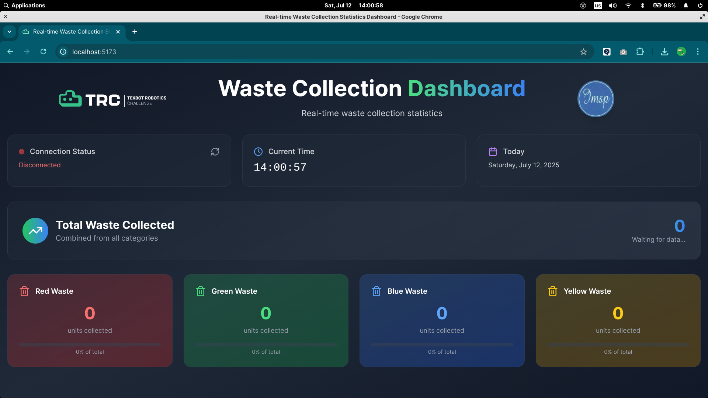

# Partie IT

### **Objectif**

La partie IT du projet de convoyeur intelligent est chargée de la conception et de la mise en œuvre de toutes les fonctionnalités numériques et embarquées essentielles à son fonctionnement. Pour cela, il devra:

mettre en place un système capable de détecter la présence de déchets et d’identifier leur couleur

gérer le mouvement du tapis et l’algorithme de tri de manière autonome en fonction des détections

développer une interface utilisateur ergonomique, visuellement attractive, affichant les quantités de déchets triés par couleur

Assurer un comptage exact et une actualisation instantanée des données de tri.

Établir une communication robuste et efficace entre la partie embarquée (microcontrôleur) et l'interface web.

### **Connexion au module bluetooth HC-05**

Avant la connexion, le module HC-05 doit être sous tension. La LED clignotante indique qu’il est en mode appairage, ce qui permet sa détection par l’ordinateur.

Détection du HC-05

La détection du module HC-05 peut être effectuée soit directement via l’interface graphique de l’ordinateur (à travers les paramètres Bluetooth du système), soit en ligne de commande à l’aide de l’outil bluetoothctl. Dans ce cas, la méthode en ligne de commande a été utilisée afin d’avoir un meilleur contrôle sur le processus de détection.

Les étapes réalisées sont les suivantes :

```bash
bluetoothctl         # Lance l’interface de gestion Bluetooth en ligne de commande
power on             # Active l’adaptateur Bluetooth si ce n’est pas déjà fait
agent on             # Active l’agent qui gère les demandes d’appairage
default-agent        # Définit cet agent comme celui utilisé par défaut
scan on              # Lance la recherche des périphériques Bluetooth à proximité
```

Une fois le module HC-05 apparu dans la liste des périphériques détectés, son adresse MAC a été relevée. Le scan a ensuite été stoppé pour plus de lisibilité :

```bash
scan off             # Arrête la recherche des périphériques
```

Appairage du HC-05

Une fois l’adresse MAC du module HC-05 identifiée, l’appairage peut être effectué. Comme pour la détection, cette opération peut se faire via l’interface graphique du système (en sélectionnant le périphérique HC-05 et en validant l’appairage), ou directement en ligne de commande avec l’outil bluetoothctl. Ici, l’approche en ligne de commande a été retenue pour assurer une configuration plus précise.

La commande suivante permet de lancer l’appairage avec le module :

```bash
pair [adresse MAC]   # Lance la procédure d’appairage avec l’adresse MAC du module HC-05 détecté
```

Au moment de l’appairage, il est demandé de saisir un code PIN. Par défaut, les modules HC-05 utilisent généralement le code **1234** .

Une fois l’appairage terminé, l’outil peut être quitté :

```bash
quit                 # Quitte l’interface bluetoothctl
```

L’appairage étant terminé, le module HC-05 a été utilisé pour établir une liaison série via rfcomm, en l’occurrence sur le port /dev/rfcomm0.

### **Système de récupération d’informations**

Le système mis en place permet de récupérer automatiquement les données envoyées par le module Bluetooth HC-05 et de les afficher côté client via une interface web.

Le backend a été conçu avec **Flask**, un micro-framework Python, pour gérer la réception des données Bluetooth et offrir un point d’entrée serveur. Le frontend, quant à lui, est développé en **React**, ce qui permet une interface dynamique et réactive.

La communication entre le module HC-05 et le serveur Flask s’effectue via une liaison série RFCOMM. Une fois les données reçues, elles sont placées dans une file d’attente, puis mises à disposition pour traitement ou transmission vers le frontend.

### **Structure du backend**

L’arborescence du dossier backend/ est la suivante :

```bash
backend/
├── app.py
├── bluetooth_service.py
├── requirements.txt
├── .env
```

module Bluetooth. Parmi ceux-ci, on trouve notamment app.py, qui sert de point d’entrée pour le serveur Flask, et bluetooth_service.py, qui gère la connexion et la communication avec le module HC-05 via RFCOMM. Les autres fichiers comprennent les dépendances dans requirements.txt et la configuration des variables d’environnement dans .env.

Les fichiers bluetooth_service.py et app.py feront l’objet d’une description plus détaillée dans les sections suivantes.

Description des fichiers principaux :

**bluetooth_service.py**

Ce fichier contient la classe qui gère la connexion Bluetooth avec le module HC-05 via le port série RFCOMM. Il s’occupe d’établir la liaison avec le module en utilisant les paramètres définis dans les variables d’environnement, lance un thread d’écoute pour récupérer les données reçues, les place dans une file d’attente (queue.Queue) et fournit une interface pour traiter ces données via un callback. Il gère également la fermeture propre de la connexion lors de l’arrêt du service.

```python
import os
import time
import queue
import serial
import threading
import subprocess
from dotenv import load_dotenv

# Charge les variables d'environnement depuis le fichier .env
load_dotenv()

# Récupération des variables d'environnement pour la configuration Bluetooth
HC05_MAC = os.getenv("HC05_MAC")          # Adresse MAC du module HC-05
RFCOMM_PORT = os.getenv("RFCOMM_PORT")    # Port RFCOMM à utiliser (ex: /dev/rfcomm0)
BAUD_RATE = int(os.getenv("BAUD_RATE"))   # Vitesse de communication série

class BluetoothService:
    def __init__(self):
        self.ser = None                  # Objet Serial (port série)
        self.rx_queue = queue.Queue()   # File pour stocker les données reçues
        self.running = False            # État du service (en fonctionnement ou non)
        self.__connect()                # Lance la connexion automatique au démarrage

    def __bind_device(self):
        # Libère le port RFCOMM s'il est déjà lié (ignore erreur si pas lié)
        subprocess.run(["sudo", "rfcomm", "release", RFCOMM_PORT], check=False)
        # Lie l'adresse MAC HC05 au port RFCOMM local
        subprocess.run(["sudo", "rfcomm", "bind", RFCOMM_PORT, HC05_MAC], check=True)
        time.sleep(2)  # Pause pour laisser le temps à la liaison de s'établir

    def __release_device(self):
        print(f"Releasing {RFCOMM_PORT}...")
        # Libère le port RFCOMM si le fichier de périphérique existe
        if os.path.exists(RFCOMM_PORT):
           subprocess.run(["sudo", "rfcomm", "release", RFCOMM_PORT], check=True)

    def __connect(self):
        try:
            # Si le port RFCOMM n'existe pas encore, bind le module HC-05 dessus
            if not os.path.exists(RFCOMM_PORT):
                self.__bind_device()

            # Ouvre la connexion série avec les paramètres définis
            self.ser = serial.Serial(RFCOMM_PORT, baudrate=BAUD_RATE, timeout=1)
            self.running = True

            # Lance un thread en arrière-plan qui écoute les données reçues
            threading.Thread(target=self.listen, daemon=True).start()
            print("Connected! Getting data...")
        except serial.SerialException as e:
            # En cas d'erreur lors de la connexion série, affiche l'erreur
            print(f"Serial error: {e}")
            self.running = False
            self.ser = None

    def listen(self):
        try:
            # Vérifie que le port série est bien ouvert
            if not self.ser or not self.ser.is_open:
                print("Serial port is not open. Exiting listener.")
                self.running = False
                self.ser = None
                self.__stop()    
                return
            print("Listening for data...")
            while True:
                # Lit une ligne de données depuis le port série
                line = self.ser.readline().decode('utf-8').strip()
                print(f"Raw line: {line}")
                if line:
                    # Affiche la donnée reçue et la place dans la file d'attente
                    print(f"Received: {line}")
                    self.rx_queue.put(line)
                    # Si le service est arrêté, quitte la boucle d'écoute
                    if not self.running:
                        break
                time.sleep(0.5)  # Petite pause entre les lectures
        except serial.SerialException as e:
            print(f"Serial error: {e}")

    def get_waste_color(self, callback):
        # Méthode qui récupère les données dans la queue et appelle une fonction callback pour traitement
        while True:
            waste_data = self.rx_queue.get()  # Attend et récupère une donnée
            if waste_data:
                callback(waste_data)            # Traite la donnée avec la fonction callback
            time.sleep(1)

    def __stop(self):
        # Arrête proprement le service Bluetooth
        print("Stopping Bluetooth service...")
        self.running = False
        if self.ser:
            self.ser.close()             # Ferme le port série
        self.__release_device()          # Libère le port RFCOMM

    def __del__(self):
        # Nettoyage automatique lors de la destruction de l'objet
        self.__stop()

# Création d'une instance globale du service Bluetooth
bluetooth_service = BluetoothService()
```

**app.py**

Ce fichier contient le serveur Flask qui constitue le point d’entrée du backend. Il initialise l’application Flask, importe l’instance du service Bluetooth définie dans bluetooth_service.py, et expose une route API permettant de récupérer en temps réel les données reçues du module HC-05. Ce serveur orchestre la réception des données Bluetooth via une file d’attente, puis les transmet au frontend React sous forme de flux Server-Sent Events (SSE).

L’application Flask s’appuie sur le service Bluetooth (BluetoothService), qui écoute les messages transmis par la liaison série et les place dans une file d’attente. Ces messages, envoyés au format JSON par le module, contiennent une information sur la couleur d’un déchet détecté. Le serveur lit ces messages, incrémente un compteur pour chaque couleur (vert, jaune, rouge, bleu), puis diffuse ces statistiques à un client via la route HTTP /api/waste-stats utilisant le protocole SSE. Cette méthode permet à l’interface web de recevoir les mises à jour en continu sans effectuer de requêtes répétées.

```python
import threading
from flask import Flask, render_template
from flask_cors import CORS
from bluetooth_service import bluetooth_service  # Import du service Bluetooth déjà instancié
import os
import json
from dotenv import load_dotenv

# Chargement des variables d'environnement depuis le fichier .env
load_dotenv()

# Initialisation de l'application Flask
app = Flask(__name__)

# Activation de CORS pour autoriser les requêtes cross-origin depuis le frontend
CORS(app)

# Configuration de la clé secrète depuis l'environnement (utile pour sessions, sécurité...)
app.config['SECRET_KEY'] = os.getenv('SECRET_KEY')

# Lecture du mode debug dans l'environnement (par défaut True)
DEBUG = os.getenv('DEBUG', 'True').lower() == 'true'

# Dictionnaire pour stocker le nombre de déchets par couleur
waste_counts = {
    'green': 0,
    'yellow': 0,
    'red': 0,
    'blue': 0
}

def stream_counts():
    import queue
    # Boucle infinie qui récupère les données du module Bluetooth et met à jour les compteurs
    while True:
        try:
            try:
                # Récupère une donnée dans la file du service Bluetooth avec timeout d'1 seconde
                waste_data = bluetooth_service.rx_queue.get(timeout=1)
            except queue.Empty:
                # Pas de nouvelle donnée reçue, on renvoie les compteurs actuels
                yield waste_counts
                continue

            if waste_data:
                # Décode la donnée JSON reçue en dictionnaire Python
                deserialized_data = json.loads(waste_data)

                # Récupère la couleur du déchet
                color = deserialized_data.get('color_waste', 'unknown')

                # Incrémente le compteur correspondant si la couleur est connue
                if color in waste_counts.keys():
                    waste_counts[color] += 1

                # Affiche les compteurs mis à jour dans la console
                print(f"Updated waste counts: {waste_counts}")

            # Envoi les compteurs mis à jour au frontend
            yield waste_counts

        except json.JSONDecodeError as e:
            # En cas d'erreur lors du décodage JSON, afficher l'erreur et renvoyer les compteurs
            print(f"JSON Decode Error: {e}")
            yield waste_counts

        except Exception as e:
            # Gestion d'autres erreurs éventuelles
            print(f"Error: {e}")
            yield waste_counts

# Route API pour fournir les statistiques de déchets via Server-Sent Events (SSE)
@app.route('/api/waste-stats', methods=['GET'])
def get_waste_counts():
    def stream():
        # Parcourt en boucle les mises à jour des compteurs et les transmet en SSE
        for counts in stream_counts():
            yield f"data: {json.dumps(counts)}\n\n"
    
    # Réponse HTTP avec type mime SSE pour mise à jour continue côté client
    return app.response_class(stream(), mimetype='text/event-stream')

# Point d'entrée du serveur Flask
if __name__ == "__main__":
    # Lancement du serveur sur toutes les interfaces réseau, port 5005, avec debug selon la config
    app.run(host="0.0.0.0", port=5005, debug=DEBUG)
```

### **Structure du fontend**

Arborescence simplifiée du dossier frontend/

```bash
frontend/
├── .env.example
├── .gitignore
├── eslint.config.js
├── index.html
├── package-lock.json
├── package.json
├── postcss.config.js
├── README.md
├── src/
│   ├── App.tsx
│   ├── config.ts
│   ├── env.d.ts
│   ├── index.css
│   ├── main.tsx
│   └── vite-env.d.ts
├── tailwind.config.js
├── tsconfig.app.json
├── tsconfig.json
├── tsconfig.node.json
└── vite.config.ts
```

Le fichier App.tsx constitue le composant principal de l’application React. Il assure la connexion en temps réel avec le backend Flask via Server-Sent Events (SSE) pour recevoir les statistiques des déchets collectés. Il traite ces données et les affiche de manière visuelle et interactive via des cartes colorées, des icônes dynamiques, une horloge en direct, et une barre de progression.

```jsx
...

  // Connexion SSE avec le backend Flask pour recevoir les données
  useEffect(() => {
    const eventSource = new EventSource(`${config.apiUrl}/api/waste-stats`);

    eventSource.onopen = () => {
      setIsConnected(true);
      console.log('SSE connection established');
    };

    eventSource.onmessage = (event) => {
      try {
        const data = JSON.parse(event.data); // Parse des données JSON
        console.log('Received SSE data:', data);
        setWasteStats(data);
        setLastUpdate(new Date()); // Mémorise la date de mise à jour
      } catch (error) {
        console.error('Error parsing SSE data:', error);
      }
    };

    eventSource.onerror = (error) => {
      console.error('SSE error:', error);
      setIsConnected(false);
    };

    return () => {
      eventSource.close(); // Ferme proprement la connexion à la fin
    };
  }, []);
  
...
```

<iframe title="vimeo-player" src="https://player.vimeo.com/video/1100869013?title=0&amp;byline=0&amp;portrait=0&amp;badge=0&amp;autopause=0&amp;player_id=0&amp;app_id=58479" width="640" height="360" frameborder="0"    allowfullscreen></iframe>

