# Annexe

## Fichiers de conception

Ici sont présentés les fichiers de conception du convoyeur [voir ici](/assets/test-final/meca/sources.zip).

## Mise en plan

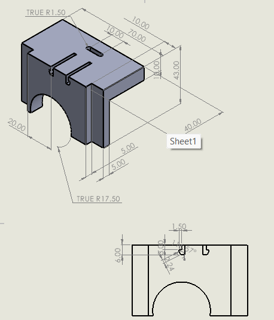

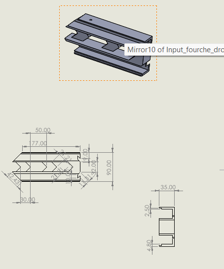

.png)

.png)

.png)

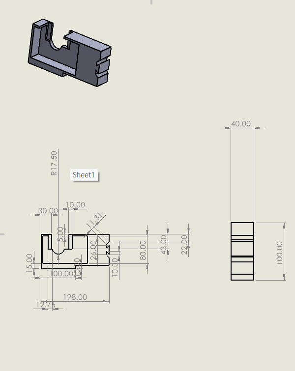

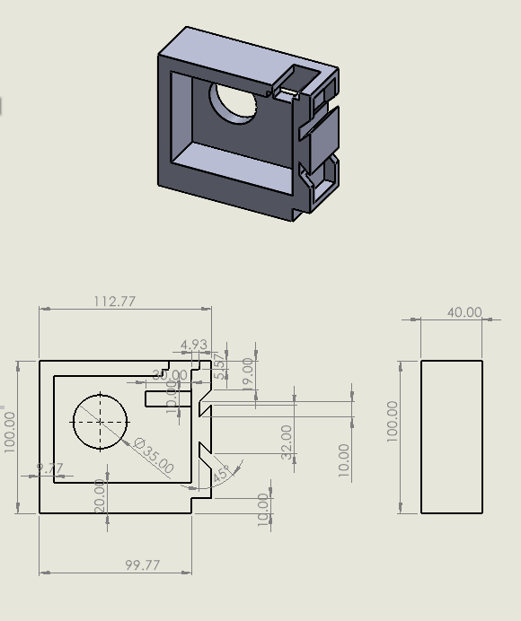

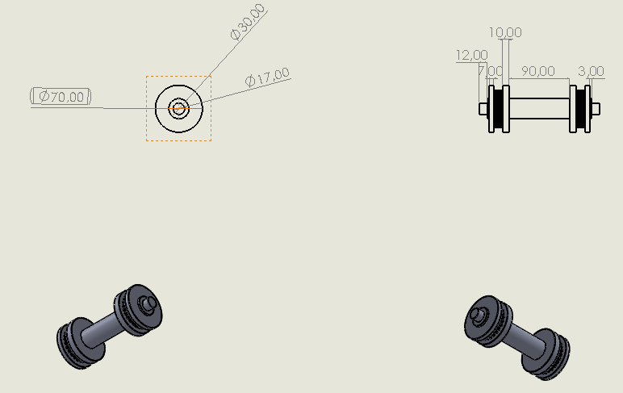

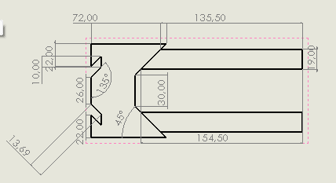

## Quelques spécification des pièces acquises

### Les courroies :

Référence : 6003 2RS

Type : Trapézoïdale dentée 

Matière : Caoutchouc 

Longueur : 1275mm

Largeur : 13mm

Epaisseur : 9mm

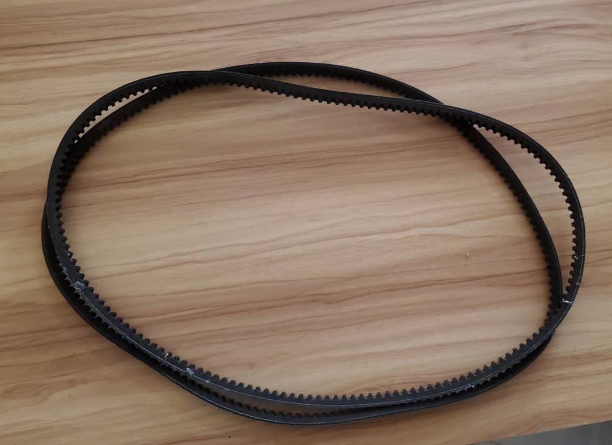

### Les roulements

Référence : 

Type : Roulement à billes 

Diamètre intérieur : 

Diamètre supérieur : 

Matériau: Acier 

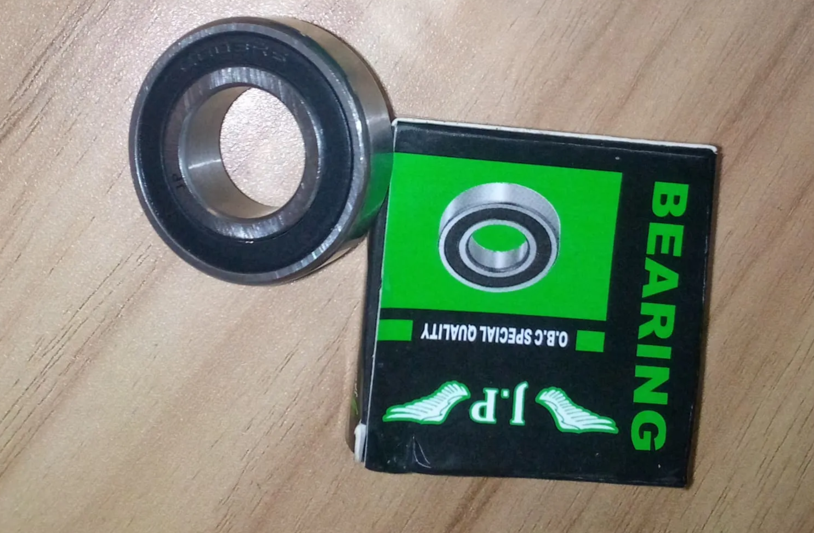

### La bande

Matériau : Polychlorure de vinyle sur support textile (Polyester)

Densité : 1.2- 1.4g/cm^3

Epaisseur : 0.5mm

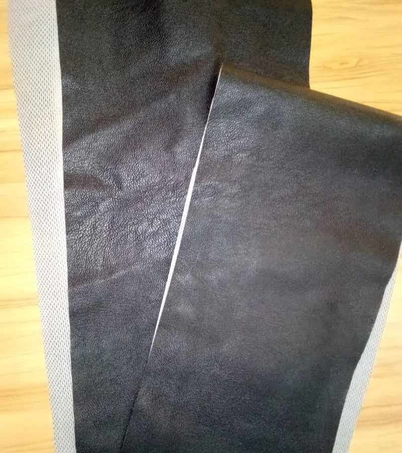

## Team et rôles ✌🏾️

Alex : Concepteur et Designer du convoyeur 

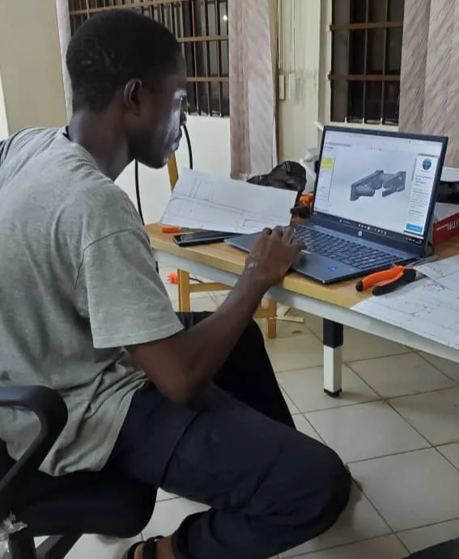

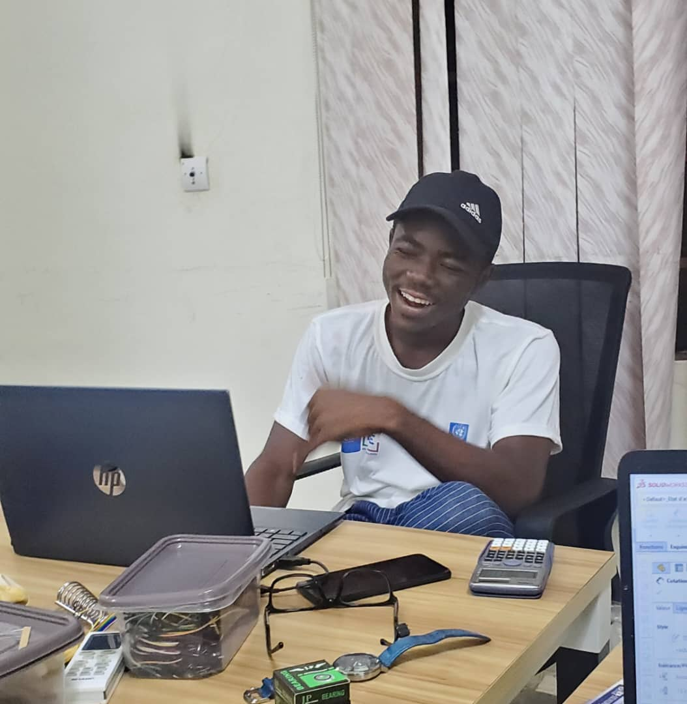

Luc : Modélisation de quelques pièces, acquisition des pièces et communication avec la team électronique .

