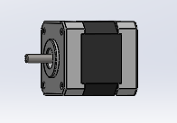
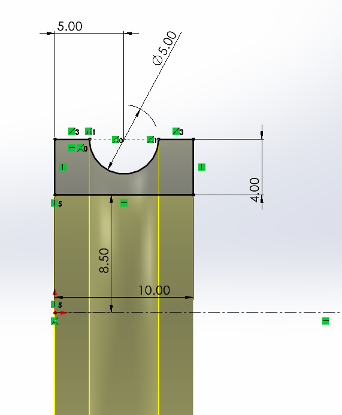
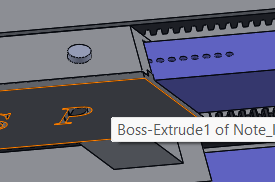
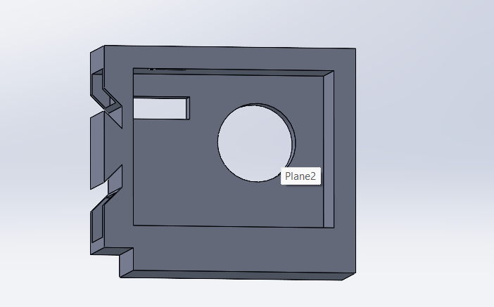
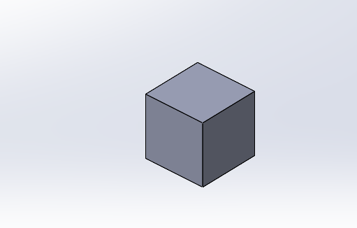

# Différentes pièces du convoyeur

## La partie moteur

### Le moteur

Il s’agit du composant responsable du mouvement de la bande supportant les objets à déplacer . Vu son utilité dans la mécanique, nous avons jugé bon de le modéliser en vu de l’inclure dans l’assemblage SolidWorks du convoyeur. La conception réalisée s’inspire des dimensions réelles dudit moteur : Un cube de 42.30 mm d’arrête et un arbre d’une hauteur de 60mm pour un diamètre de 5mm . 

Afin de rendre la modélisation un peu plus facile, nous avons diviser le composants en trois pièces puis réaliser un assemblage. Comme pièce, on distingue : 

- La base :

Un carré extrudé auquel nous avons réalisé des perçages , des enlèvement de matières et des congés. 

- Le tronc

Obtenue par extrusion mince d’un profil carré puis application de chanfreins. 

- Le haut (Similaire à la base)

- L’axe

Il s’agit juste d’un cylindre creux de rayon réduit.

Ces pièces une fois assemblé donnent un modèle très proche du moteur pas à pas physique qu’on utilise (le nema 17) . 

### Les roulements

Comme nous l’avons mentionné un peu plus haut, nous utilisons des roulements à billes afin que le mouvement de rotation des tambours puisse s’effectuer presque sans frottement . La conception de ce système fait également intervenir 3 pièces : les bagues intérieurs et extérieurs et les billes

- La bague intérieur

C’est elle qui bouge dans notre système en étant relié à l’arbre de tambour. Pour la réaliser, nous avons réalisé l’esquisse suivante ( image de gauche ) puis réalisé une révolution circulaire afin d’obtenir le motif souhaité. 

- La bague Extérieur

Il s’agit du composant fixe de notre système, relié au reste du convoyeur. Sa conception est similaire à celle de la bague intérieur ( Esquisse+ Révolution) 

- Les billes

Ce sont de petits éléments sphériques en acier situés entre les deux bagues et qui permettent un mouvement de rotation à frottement réduit. La conception 3D est obtenue en appliquant une révolution circulaire sur un demi cercle dont le rayon est celui de la sphère. 

 Cette conception s’effectue dans le même fichier que celui de la bague intérieur puis la conception de la boule est répétée de façon circulaire suivant la direction de la bague. On Obtient ce qui suit : 

Par la suite, nous avons effectué un assemblage en appliquant une contrainte coaxiale entre les deux bagues et une contrainte de coïncidence de faces entre les faces latéraux des bagues. Finalement on obtient le résultat suivant : 

### Support moteur et roulements 1

Ce composant contient en quelques sorte trois parties essentiels : Un support permettant de maintenir le moteur fixe pendant qu’il fait bouger le tambour moteur, Un motif en forme de demi cercle censé bloquer le roulement en ajout à une autre pièce ( situé en haut), puis des espaces à l’arrière afin de maintenir le composant au reste du convoyeur . Nous reviendrons sur ce système de maintient un peu plus loin.  Concernant la conception, elle utilise les fonction, de base tels que des lignes d’esquisse , des cercles, des extrusions et enlèvements de matière. Vous trouverez en annexe la mise en plan détaillant toutes les dimensions de cette pièce.

### Support moteur et roulement 2

## Partie latérale rétractable

### Modules sortant

Ce composant est présent en deux exemplaire sur le convoyeur ( De part et d’autre sur la longueur) . Relié au support latéral bas 1 à travers les joins précédemment décrits , il est censé rentrer dans un autre composant du convoyeur afin de régler la tension de la bande comme nous avons eu à l’expliquer dans la rubrique précédente. Les trous présents au dessus sont censé permettre le blocage dès que la longueur voulue est atteinte.   Pour sa conception, nous avons dans un premier temps réalisé une esquisse dont les dimensions sont les  suivantes : 

Ensuite, après extrusion de cette esquisse, nous avons construit un plan de décalage, créer deux rectangles (caractéristiques des rectangles de bout)  puis nous les avons extrudé jusqu’aux faces obliques de notre premier motif. Enfin nous avons réalisé un petit enlèvement de matière circulaire  de la taille des vis dont on dispose (3mm de diamètre ) que nous avons répété linéairement sur une longueur de (valeur)   Ici se présente une illustration de la jonction entre la fourche et le support latéral bas 1  maintenant le moteur: 

### Modules entrants

Ces deux pièces ( à mettre ensemble) sont censés recueillir les fourches formant le sous système rétractable dont on parlais précédemment .Leurs longueurs s’accordent avec ceux des fourches afin que le serrage ainsi que le desserrage puisse être réalisé sans grand difficulté. Les motifs de flèches indiquent le sens de déplacement à respecter lors de l’ajustement de la longueur , puis les petits espaces situés à l’arrière sont destinés aux joins permettant de les relier aux supports latéraux situés au niveau du tambour de retour. Enfin un petit trou est réalisé sur le dessus afin de recueillir la vis permettant de bloquer le mouvement. Compte tenu de l’imprécision des filetages réalisés par l’imprimante  dont on disposait, on a jugé bon d’ajuster notre trou aux écrous afin que la vis puisse facilement entrer. 

Quant à la conception 3D , elle consiste en une série d’esquisse , extrusion puis enlèvement de matière . (Dimensions en annexes)

Ces motifs se répètent également de l’autre côté du convoyeur 

### Les vis

Comme décrit précédemment, elles servent à maintenir le convoyeur à la bonne taille . Pour faire simple, leur conception se résume en : Cercle, extrusion, Hexagone, extrusion , Cercle, extrusion. 

On a donc des fourches qui entrent en des espaces réservées bloqué par une vis dès que la taille correspondant à la tension voulue de la bande est atteinte. En voici une illustration : 

Avec ce système, notre convoyeur dispose de 655mm comme longueur minimale et 230mm comme largeur maximale. 

## Partie retour

A l’image du tambours moteur, celui de retour dispose également d’un support afin de le maintenir au cours de son mouvement de rotation. L’enlèvement de matière circulaire réalisé est censé accueillir le roulement dans lequel l’arbre du tambour est placé . Enfin, comme d’habitude de petits espaces sont réservés pour accueillir les petits joins utilisé pour fixer le composant avec le reste du système. 

 

## Les joins

### Joins avant

Concernant les joins, il s'agit de p'tites attaches d'épaisseur 40 mm de forme parallélépipédique permettant de maintenir les blocs de segments avec lesquels ils entrent en contact. Cette solution mécanique plus ou moins innovante n'a pas subie une étude particulière et encore moins une validation par des chercheurs en mécanique. Nous l'avons nous même créé et en application du théorème d'équilibre relatif au moment des forces nous avons la certitude que cela tiendra le long de l'expérience que nous aurons à réaliser. Une démonstration vous sera faite. 

### Joins arrières

Ceux ci sont légèrement différents des joins avant de par leur géométrie : 

Tout comme les joins avant,  les joins arrière on été conçu dans la même optique. Celle de maintenir deux blocs de solides en contact. La différence entre cette pièce et la précédente est que celle-ci a été construite dans l'optique de maintenir le creux dans la pièce “ input fourche” comme suit.

## Les tambours

On en distinguera deux ; le tambour moteur et le tambour de retour .

 Le tambour moteur comme son nom l’indique est relié au moteur et transmet son mouvement à la bande via une courroie. Celui de retour permet à la bande transporteuse de revenir vers le tambour moteur, créant ainsi un circuit fermé pour le mouvement continu. 

- La conception

Pour la conception, nous sommes parti dans un premier temps sur une géométrie cylindrique pleine puis nous avons apporté un certain nombre de modification afin d’obtenir la forme souhaitée. Les extrémités (de rayon réduite) sont censés entrer dans les roulements alors que les dents situées de part et d’autre de chaque tambour sont réservées aux courroies. Le cercle de pied des dents a été dimensionné en fonction des contraintes de tailles exigées dans le document descriptif du test (50mm) , les caractéristiques des dents ont été choisis selon les modèles de  courroies facilement accessible sur le marché (Voir les références des courroies en annexe)  puis la longueur du tambour choisis en fonction de la largeur de notre bande . Enfin, dans l’optique de réduire la consommation de filament au maximum, nous avons jugé bon de diminuer la circonférence du tambour au centre étant donné que le tapis est censé reposer sur les courroies et non sur les tambours. 

Pour ce qui est de la modélisation, nous avons d’abord construit un cylindre de diamètre maximal (70mm) puis réalisé des enlèvement de matière sur ce dernier afin d’obtenir le modèle présenté ci dessus. Par la suite nous avons pris des distances sur notre courroie puis modélisé les dents en fonction. l’esquisse suivant révèle les caractéristiques des dents modélisées. 

## Transmission du mouvement des tambours

### Les courroies

Dans notre système, il s’agit du composant responsable de la transmission du mouvement entre les tambours et la bande comme décrit précédemment . La conception dans SolidWorks se base sur l’esquisse suivante : 

Les dents modélisées s’inspirent des dimensions réelles de la courroie qu’on dispose s’accommodant parfaitement aux dents des courroies . 

Le procédé est le même que pour la modélisation : création d’un cercle de 50mm de diamètre, modélisation d’une dents, répétition circulaire suivant la direction du cercle ,  répétition linéaire d’une des dents verticales sur toute la longueur de la courroie ( Nombre) puis enfin symétrisation de la fonction réalisée dernièrement par rapport au plan horizontal séparant la courroie en deux. 

Finalement on obtient le résultat suivant : 

Voici un aperçu du système partiel constitué des tambours , des roulements, des courroies et de leurs supports: 

### La bande

Il s’git d’un des composants majeurs du système car c’est lui qui par son mouvement provoqué par celui des tambours et des courroies , est responsable du transport des déchets. 

Sa conception est assez simple : Rainure de (Caractéristiques de la rainure) , décalage de la géométrie de (longueur de décalage) puis extrusion . On obtient finalement le résultat suivant : 

 ****

## Support Capteur de couleur

Afin de fixer le capteur de couleur utilisé par les parties électroniques et IT pour trier les déchets selon leur catégorie, nous avons réalisé un système de suspension destiné à maintenir le capteur directement au dessus du déchet afin d’améliorer la précision de la détection. Ce support est placé sur le motif sortant suivant ( relié au support du tambour de retour décrit précédemment) : 

Ce support est un ensemble de 4 pièces modélisés de sorte à faciliter leur assemblage physique : 

- Le support vertical
    
    Il couvre le trou sortant précédent et permet de donner de la hauteur au capteur : 
    
    Sa conception est assez basique et repose sur une extrusion mince de 3 mm d’épaisseur et long de notre esquisse afin de maintenir le capteur à 2.5 cm maximum du déchet dès qu’il arrive à la zone de détection. 
    
    
    
- Le support horizontal : Il est chargé d’orienter le capteur vers le centre du tapis au niveau de la zone de détection . Sa conception repose également sur une extrusion mince à la différence où un enlèvement de matière a été réalisé afin de permettre l’assemblage avec le support droit :

.png)

- Liaison entre supports vertical et horizontal :
    
    Comme vous l’avez sans doute remarqué, les deux supports sont munis de calles. Leur raison d’être s’explique par la présence de la pièce suivante entre les deux supports: 
    
    
    
    Et donc logiquement ce sont ces calles qui permettent de maintenir cette pièce entre les deux parties précédentes afin de le maintenir ensemble. Le jeu laissé entre les composants entrant et sortant est de 0.15m de chaque côté. 
    
- Le support du capteur proprement dit :

Il sera lié au support horizontale et permettra de maintenir le capteur . Le haut sera muni d’un couvercle raison pour laquelle des calles ont été prévues. Enfin l’extrusion mince réalisée à l’avant est censé entrer dans le support horizontal de sorte que les fils conducteurs du capteur puissent y passer. 

### Les déchets

Comme exigé, il s’agit de petits cubes de 30mm d’arêtes  obtenues en 3D par simple extrusion de 30mm d’un carré de 30mm de côté. 

