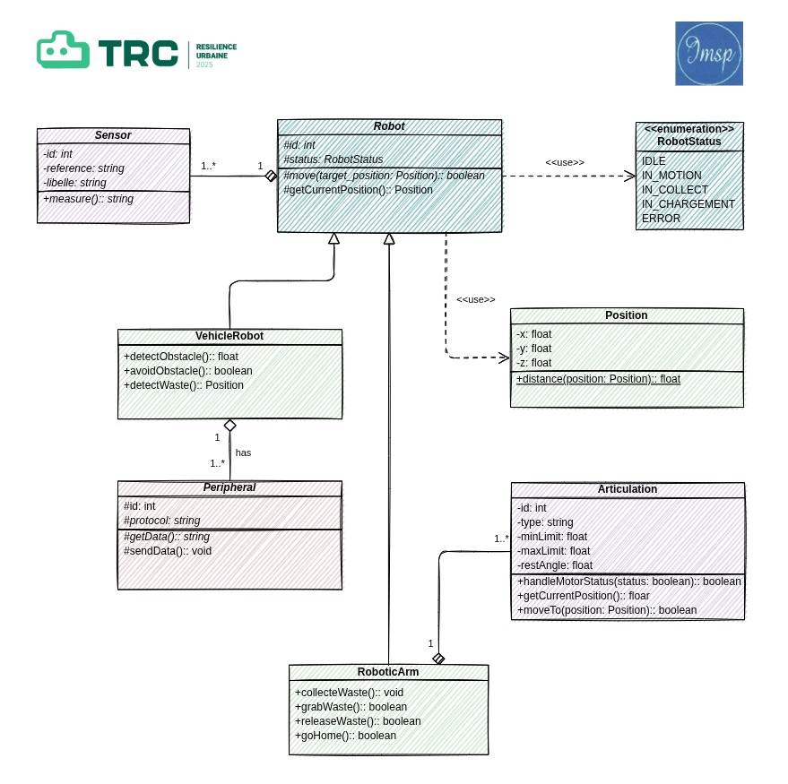

# Création d’une classe pour un Robot

## Introduction

Pour ce projet nous avons conçu un robot dont la fonction principale est de se mouvoir dans l’espace pour ramasser des déchets. Il est composé de trois modules, interconnectés via un bus de communication : le **module principal**, le **module de collecte** et les **périphériques**.

Le module principale est un module semblable au **Rosmaster X3** qui disposent de plusieurs capteurs pour scanner l'environnement et des roues pour se mouvoir dans l'espace. Il dispose également de supports pour accueillir des périphériques (modules externes). Pour ce projet, Il va accueillir le module de collecte et la poubelle intélligente.

Le module de collecte est un module semblable au bas robotisé *Dofbot Jetson
Nano* qui dispose d'une caméra et d'une pince pour la récupération des déchets.
Il sera vu comme un périphérique du module principale.

les periphériques sont des  modules qui vont etendre les fonctionnalités de notre robot

## Fonctionnement du Robot

Le fonctionnement du robot collecteur et trieur de déchets se décompose en plusieurs étapes séquentielles :

1. **Navigation autonome** : Le robot se déplace dans l’environnement grâce à son système SLAM qui assure la cartographie et la localisation.
2. **Détection des obstacles** : Durant son parcours, le LiDAR du robot identifie les obstacles et ajuste sa trajectoire pour les éviter.
3. **Détection des objets**  : Grâce à l’une de ces caméras  il scrute l’environnement pour localiser les objets au sol.
4. **Analyse et classification** : Dès qu’un objet est repéré, les algorithmes de Deep learning permettent de l’analyser pour déterminer si c’est un déchet ou un obstacle afin de le classifier pour la collecte ou l’évitement .
5. **Collecte du déchet** : Le déchet identifié est saisi par le bras robotisé, qui utilise ses 6 degrés de liberté pour exécuter des mouvements précis.
6. **Tri sélectif** : Le déchet est placé dans le compartiment dédié de la corbeille posée sur la plateforme du robot, selon sa classification, après que ce dernier s’est assuré que la corbeille n’était pas pleine.

Ce cycle opère en continu, permettant au robot d’assurer un nettoyage efficace de la zone tout en effectuant un tri automatisé des déchets.

## Diagramme de classe UML

Au cœur de notre système de collecte des déchets se trouve la classe abstraite **Robot**. Cette classe définit les fonctionnalités de base communes à tous les types de robots du système, notamment le déplacement via la méthode move(). Pour percevoir son environnement, elle utilise des capteurs (**Sensors),**établissant ainsi une relation d'association fondamentale entre les robots et leurs systèmes de perception.

La classe **VehicleRobot**, quant à elle, est une spécialisation concrète d’un Robot. Elle hérite des fonctionnalités de base et ajoute des capacités de navigation autonome avancées. Elle implémente des méthodes de détection et d’évitement d’obstacles, ainsi que d’identification des déchets. Pour accomplir ces tâches, le robot véhicule utilise une collection de périphériques ( **Peripherals**), créant une relation d’agrégation qui permet l’intégration de divers équipements spécialisés.

Parmi  ces périphériques on peut avoir une corbeille pour recueillir les déchets collectés. Le bras robotique représenté (**RoboticArm)** est lui aussi modélisé comme un robot à part entière, capable de se mouvoir de manière autonome et disposant de son propre état et permet la manipulation physique des déchets. Notre architecture se veut ainsi modulaire et hiérarchisée, permettant une gestion efficace et évolutive du processus de collecte.



### **Description textuelle du diagramme de classe**

### Classe **Robot** (abstraite)

La classe `Robot` est au cœur de l’architecture. Elle regroupe les **comportements de base** communs aux différents robots de notre système ( ce qui justifie le fait qu’elle soit abstraite ), notamment :

- `move()`: déplacement autonome basé sur les informations des capteurs.

Elle **compose la classe `Sensor`**, c’est-à-dire qu’un robot intègre nécessairement un ou plusieurs capteurs pour interagir avec son environnement. Cette relation de **composition forte** signifie qu’un capteur n’a pas d’existence fonctionnelle sans le robot auquel il est intégré.

### Classe **Sensor**

La classe `Sensor` modélise les différents **capteurs embarqués**, qu’ils soient visuels (caméra du Dofbot ou du *Rosmaster X3*), de distance (LiDAR du Rosmaster), ou autres. Chaque capteur possède :

- un identifiant,
- un libellé  (camera, LiDAR , etc.),
- une référence,
- une valeur mesurée,

L’encapsulation privée des attributs des capteurs s’explique par le fait qu’ils constituent les caractéristiques uniques d’un capteur.

- une méthode `measure()` pour obtenir une nouvelle lecture.

Elle est **composée dans `Robot`** car tout comportement intelligent repose sur une perception du monde extérieur. Le robot y accède pour prendre ses décisions de mouvement ou de collecte.

### Classe **VehicleRobot** (spécialisation de `Robot`)

La classe `VehicleRobot` hérite de la classe `Robot`. Elle **représente le robot mobile principal**, qui assure le transport, la navigation et la coordination des actions.

En plus de la méthode héritée `move()` qui est surchargée, elle possède ses propres capacités spécifiques comme :

- `detect_obstacle()` : détection d’un obstacle.
- `avoid_obstacle()` : manœuvre d’évitement.
- `detect_waste()` : localisation des déchets au sol.

Elle joue aussi un rôle central en **agrégeant des périphériques** (relation d’agrégation avec la classe `Peripherals`). Cette agrégation reflète une **connexion souple et modulaire** : les périphériques (corbeille, etc.) peuvent être associés ou dissociés du robot véhicule sans affecter sa structure fondamentale.

### Classe **RobotStatus** (Enumération)

C’est une classe qui permet d’énumérer les différents états possibles du robot.

Les états possibles du robot sont :

- `IDLE` : en veille
- `IN_MOTION` : en mouvement
- `IN_COLLECT` : en collecte
- `IN_CHARGEMENT` : en chargement
- `ERROR` : en erreur

### Classe **RoboticArm** (spécialisation de `Robot`)

`RoboticArm` est une spécialisation concrète de la classe `Robot`. Elle représente un **bras articulé avec intelligence embarquée** .

Elle implémente  :

- `grabWwaste()` : pour saisir un déchet.
- `releaseWaste()` : pour déposer le déchet dans un compartiment.
- `collecteWaste()` : pour collecter un déchet.

et elle surcharge `move()` héritée de `Robot`. 

Fonctionnellement, cette classe incarne la **manipulation physique des déchets**, en se basant sur les informations fournies par les capteurs de vision. Elle reçoit des commandes du véhicule robot pour la collecte des déchets venant compléter sa mission de détection des déchets.

### Classe **Peripherals** (abstraite)

`Peripherals` est une classe abstraite qui regroupe les **éléments externes connectés au robot mobile**. C’est une **généralisation** des composants qu’on peut ajouter au véhicule comme la corbeille. Elle comprend des attributs techniques :

- `identifiant` , `protocol,` etc.
- une méthode `getData()` pour recevoir des données du robot mobile.
- et une autre `sendData()` pour envoyer des informations au robot mobile.

Le protocole, qui est le moyen par lequel les périphériques et le véhicule communiquent, est propre à chaque périphérique et doit être utilisable par le `VehicleRobot` grâce à des getters et des setters. Donc il  est protégé.

La **relation d’agrégation** avec `VehicleRobot` est essentielle : le robot mobile gère dynamiquement ses périphériques et leur envoie des commandes selon le contexte (détection de déchet, tri). Cela reflète l’organisation réelle de ton système : le Rosmaster sert de plateforme centrale à laquelle sont rattachés des modules spécialisés.

### **Classe `Position`**

Cette classe représente une **position spatiale en 3D** dans l’environnement (coordonnées `x`, `y`, `z`). Elle est utilisée pour localiser un robot ou un élément dans l’espace. Elle comprend des attributs techniques :

- `x`, `y`, `z` : pour coordonnées  (`float`).
- La méthode  `distance(position1: Position , position2: Position): float` : calcule la distance entre deux positions.

Elle est utilisée par la méthode `getCurrentPosition()` dans `Robot` et par `moveTo(Position)` dans `Articulation`.

### **Classe `Articulation`**

La classe `Articulation` représente les **mécanismes de mouvement** du bras robotisé, c’est-à-dire les moteurs qui permettent à celui-ci de se déplacer et de s’orienter dans l’espace selon les besoins de la tâche à accomplir. Elle dispose des attributs tels que :

- `id` : identifiant de l’articulation.
- `minLimit`, `maxLimit` : limites de déplacement.
- `restAngle` : angle de repos.

Les méthodes qu’elle implémente :

- `handleMotorStatus(status: boolean): boolean` : active ou désactive le moteur.
- `getCurrentAngle(): float` : retourne la position actuelle de l’articulation.
- `moveTo(angle: float): boolean` : déplace l’articulation vers une position donnée.

Il existe une **relation de composition** entre `RoboticArm` et `Articulation`, indiquant que le bras robotisé contient **au moins une articulation**, essentielle à son fonctionnement.

### **Récapitulatif des relations**

- **Héritage** :
    - `VehicleRobot` et `RoboticArm` héritent de `Robot` car ce sont des versions spécialisées du robot général, conçues pour se déplacer et interagir dans l’environnement.
- **Composition** :
    - `Robot` est en composition avec `Sensor` car les capteurs font partie intégrante du robot : sans eux, il ne peut percevoir son environnement. Ils sont indispensables à son fonctionnement.
    - `RoboticArm` est en composition avec `Articulation` car les articulations font partie intégrantes du bras robotique: sans eux  eux il n’a pas ses fonctionnalités.
- **Agrégation** :
    - `VehicleRobot` est en agrégation avec `Peripherals` car il peut intégrer différents périphériques comme des extensions amovibles, sans que ceux-ci dépendent entièrement de lui.
- **Utilisation :**
    - Etant donne que la méthode `getPosition` retourne une valeur de type Position il était donc nécessaire que la classe Robot fasse référence à cette dernière.

### Extraits de code

- `Robot`

```cpp
/**
 * @class Robot
 * @brief Classe abstraite représentant un robot générique.
 * 
 * Définit l'interface commune à tous les robots du système, incluant la gestion des capteurs et le déplacement.
 */
class Robot {
protected:
    int id; ///< Identifiant du robot.
    RobotStatus status; ///< Statut du robot.
    std::vector<Sensor*> sensors; ///< Liste des capteurs associés au robot.
public:
    /**
     * @brief Constructeur du robot.
     * @param id Identifiant unique.
     * @param status Statut initial.
     */
    Robot(int id, RobotStatus status);

    /**
     * @brief Destructeur virtuel.
     */
    virtual ~Robot();

    /**
     * @brief Ajoute un capteur au robot.
     * @param sensor Pointeur vers le capteur à ajouter.
     */
    void addSensor(Sensor* sensor);

    /**
     * @brief Méthode abstraite pour déplacer le robot.
     * @return true si le déplacement est réussi.
     */
    virtual bool move() = 0;

    /**
     * @brief Méthode abstraite pour obtenir la position actuelle.
     * @return Position actuelle.
     */
    virtual Position getCurrentPosition() const = 0;

    // Getters et setters

    /**
     * @brief Retourne l'identifiant du robot.
     */
    int getId() const { return id; }
    /**
     * @brief Définit l'identifiant du robot.
     */
    void setId(int val) { id = val; }
    /**
     * @brief Retourne le statut du robot.
     */
    RobotStatus getStatus() const { return status; }
    /**
     * @brief Définit le statut du robot.
     */
    void setStatus(RobotStatus s) { status = s; }
    /**
     * @brief Retourne la liste des capteurs.
     */
    std::vector<Sensor*> getSensors() const { return sensors; }
};
```

  dont les classes VehiculeRobot et RoboticArm en herite

    

- `VehicleRobot`

```cpp
#pragma once
#include <vector>
#include "Robot.hpp"
#include "Peripheral.hpp"

/**
 * @class VehicleRobot
 * @brief Représente un robot véhicule autonome pour la collecte de déchets.
 * 
 * Cette classe hérite de Robot et gère les déplacements, la détection d'obstacles,
 * la gestion des périphériques (agrégation) et la détection de déchets.
 */
class VehicleRobot : public Robot {
private:
    std::vector<Peripheral*> peripherals; ///< Liste des périphériques agrégés au robot.
    Position position; ///< Position actuelle du robot véhicule.
public:
    /**
     * @brief Constructeur du robot véhicule.
     * @param id Identifiant unique du robot.
     * @param status Statut initial du robot.
     */
    VehicleRobot(int id, RobotStatus status);

    /**
     * @brief Ajoute un périphérique au robot.
     * @param peripheral Pointeur vers le périphérique à ajouter.
     */
    void addPeripheral(Peripheral* peripheral);

    /**
     * @brief Détecte la présence d'un obstacle.
     * @return true si un obstacle est détecté, false sinon.
     */
    bool detectObstacle();

    /**
     * @brief Tente d'éviter un obstacle détecté.
     * @return true si l'évitement est réussi, false sinon.
     */
    bool avoidObstacle();

    /**
     * @brief Détecte la présence de déchets.
     * @return true si des déchets sont détectés, false sinon.
     */
    bool detectWaste();

    /**
     * @brief Déplace le robot véhicule.
     * @return true si le déplacement est réussi, false sinon.
     */
    bool move() override;

    /**
     * @brief Retourne la position actuelle du robot.
     * @return Position actuelle.
     */
    Position getCurrentPosition() const override;

    /**
     * @brief Accesseur pour la liste des périphériques.
     * @return Vecteur de pointeurs vers les périphériques.
     */
    std::vector<Peripheral*> getPeripherals() const { return peripherals; }

    /**
     * @brief Mutateur pour la liste des périphériques.
     * @param p Nouvelle liste de périphériques.
     */
    void setPeripherals(const std::vector<Peripheral*>& p) { peripherals = p; }

    /**
     * @brief Accesseur pour la position.
     * @return Position actuelle.
     */
    Position getPosition() const { return position; }

    /**
     * @brief Mutateur pour la position.
     * @param pos Nouvelle position.
     */
    void setPosition(const Position& pos) { position = pos; }
};
```

- `RoboticArm`

```cpp
#pragma once
#include <vector>
#include "Robot.hpp"
#include "Articulation.hpp"

/**
 * @class RoboticArm
 * @brief Représente un bras robotisé autonome pour la manipulation physique des déchets.
 * 
 * Cette classe hérite de Robot et gère ses propres articulations, mouvements et actions de collecte.
 */
class RoboticArm : public Robot {
private:
    std::vector<Articulation*> articulations; ///< Liste des articulations du bras.
    Position position; ///< Position actuelle du bras robotisé.
public:
    /**
     * @brief Constructeur du bras robotisé.
     * @param id Identifiant unique du bras.
     * @param status Statut initial du bras.
     */
    RoboticArm(int id, RobotStatus status);

    /**
     * @brief Ajoute une articulation au bras.
     * @param articulation Pointeur vers l'articulation à ajouter.
     */
    void addArticulation(Articulation* articulation);

    /**
     * @brief Simule la collecte de déchets.
     */
    void collectWaste();

    /**
     * @brief Simule la prise de déchets.
     * @return true si la prise est réussie.
     */
    bool grabWaste();

    /**
     * @brief Simule le relâchement des déchets.
     * @return true si le relâchement est réussi.
     */
    bool releaseWaste();

    /**
     * @brief Ramène toutes les articulations à l'angle de repos.
     * @return true si toutes les articulations sont revenues à la position de repos.
     */
    bool goHome();

    /**
     * @brief Déplace le bras robotisé.
     * @return true si le déplacement est réussi.
     */
    bool move() override;

    /**
     * @brief Retourne la position actuelle du bras.
     * @return Position actuelle.
     */
    Position getCurrentPosition() const override;

    /**
     * @brief Accesseur pour la liste des articulations.
     * @return Vecteur de pointeurs vers les articulations.
     */
    std::vector<Articulation*> getArticulations() const { return articulations; }

    /**
     * @brief Mutateur pour la liste des articulations.
     * @param a Nouvelle liste d'articulations.
     */
    void setArticulations(const std::vector<Articulation*>& a) { articulations = a; }

    /**
     * @brief Accesseur pour la position.
     * @return Position actuelle.
     */
    Position getPosition() const { return position; }

    /**
     * @brief Mutateur pour la position.
     * @param pos Nouvelle position.
     */
    void setPosition(const Position& pos) { position = pos; }
};
```

           

ces dernières surchargent la methode `move()` :

- `VehicleRobot` `move(targetPosition:Position)::boolean`

```cpp
bool VehicleRobot::move(const Position& targetPosition) {
    // Simuler le déplacement vers la position cible
    this->target_position = target_position;
    status = RobotStatus::IN_MOTION;
    // ...simuler le mouvement...
    position = targetPosition;
    while (position.distance(targetPosition) > 0.1f)  // Simuler le mouvement jusqu'à la position cible
    {
        if (detectObstacle() < 1.0f) {
            avoidObstacle();
        }
    }
    // Une fois arrivé à destination, mettre le statut à IDLE
    status = RobotStatus::IDLE;
    return true;
}
```

- `RoboticArm` `move(targetPosition:Position)::boolean`

```cpp
bool RoboticArm::move(const Position& target_position) {
    // Simuler le déplacement du bras vers la position cible
    bool success = true;
    for (auto* art : articulations) {
        float targetAngle = art->getCurrentAngle() + 10.0f;
        if (!art->moveTo(targetAngle)) success = false;
    }
    position = target_position;
    status = RobotStatus::IN_MOTION;
    // ...simuler le mouvement...
    // Déplacer chaque articulation vers un angle cible (simuler l'atteinte de la position cible)
    std::vector<float> targetAngles = {30.0f, 45.0f, 60.0f}; // Exemples d'angles cibles calculés sur la base de la position cible
    if (targetAngles.size() != articulations.size()) {
        return false;
    }
    for (size_t i = 0; i < articulations.size() && i < targetAngles.size(); ++i) {
        if (!articulations[i]->moveTo(targetAngles[i])) success = false;
    }
    // Simuler la prise de déchets à la position cible 
    if (!grabWaste()) success = false;
    // Déplacer vers la position de la poubelle (simuler avec de nouveaux angles)
    std::vector<float> trashAngles = {10.0f, 20.0f, 30.0f}; // Exemples d'angles pour la poubelle
    for (size_t i = 0; i < articulations.size() && i < trashAngles.size(); ++i) {
        if (!articulations[i]->moveTo(trashAngles[i])) success = false;
    }
    // Relâcher les déchets dans la poubelle
    if (!releaseWaste()) success = false;
    status = RobotStatus::IDLE;
    return success;
}
```