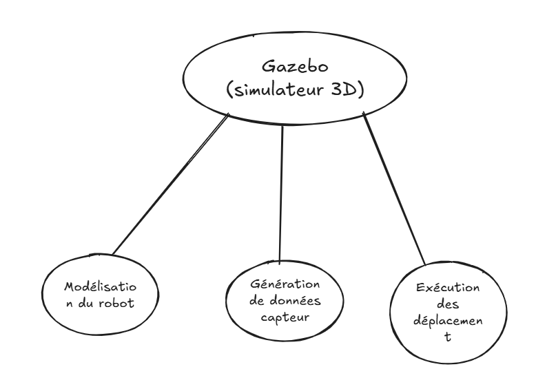

# Gazebo

## Qu’est-ce que `Gazebo` ?

Gazebo est un **simulateur 3D open-source** conçu pour la modélisation et la simulation de systèmes robotiques complexes dans un environnement virtuel. Développé initialement par le laboratoire de robotique de Willow Garage, puis maintenu par l'Open Source Robotics Foundation, il offre un environnement de test hautement réaliste et configurable grâce à l'intégration de plusieurs fonctionnalités essentielles et avancées :

- **Moteur de physique** : Gestion précise des collisions, frottements et interactions dynamiques entre objets, permettant de simuler des comportements physiques réalistes avec une grande fidélité aux lois de la mécanique newtonienne.
- **Rendu visuel avancé** : Simulation graphique hautement réaliste avec textures détaillées, ombres dynamiques et éclairages variés, offrant une visualisation immersive des environnements robotiques.
- **Plugins ROS/ROS2** : Intégration native et complète avec le framework de robotique ROS pour la communication bidirectionnelle et le contrôle précis des robots virtuels, facilitant la transition entre simulation et déploiement réel.

## Vocabulaire spécifique à Gazebo

- **GénèreWorld** : Environnement simulé complet contenant le sol, les obstacles, les conditions atmosphériques et les objets interactifs qui constituent le monde virtuel dans lequel évolue le robot.
- **Model** : Représentation numérique complète d'un objet ou d'un robot avec ses propriétés physiques, visuelles et dynamiques, incluant masse, inertie et apparence.
- **Link** : Élément constitutif fondamental d'un modèle, représentant une partie rigide et indéformable du robot, caractérisé par sa géométrie et ses propriétés massiques.
- **Joint** : Connexion articulée entre deux liens permettant un mouvement contrôlé selon différents degrés de liberté (rotations, translations) avec des contraintes paramétrables.
- **Sensor** : Composant virtuel simulant fidèlement un capteur réel (LIDAR, caméra, IMU, GPS) avec ses caractéristiques techniques et limitations spécifiques.
- **Plugin** : Extension logicielle modulaire ajoutant des fonctionnalités spécifiques et personnalisées à Gazebo, permettant d'étendre ses capacités selon les besoins du projet.
- **Topic** : Canal de communication standardisé utilisé pour échanger des données structurées entre Gazebo et ROS, suivant l'architecture de publication/souscription.

Gazebo joue un rôle clé et indispensable dans la validation des algorithmes de navigation autonome et de cartographie environnementale, permettant de tester exhaustivement différentes stratégies et scénarios avant leur déploiement sur un robot physique réel, réduisant ainsi les risques et les coûts de développement.

Usage dans le projet actuel :

- Modélisation détaillée du robot Tekbot (géométrie précise, capteurs calibrés, actionneurs avec leurs caractéristiques dynamiques).
- Génération de données capteurs réalistes et bruitées (LIDAR avec résolution configurable, odométrie avec dérive simulée, IMU avec biais caractéristiques).
- Exécution et validation des commandes de déplacement (`geometry_msgs/Twist`) dans différentes conditions environnementales.



## Comment installer `Gazebo`

> Avant de commencer, il est essentiel de vous assurer que vous avez correctement installé ROS2 dans sa version Humble sur votre système. Cette étape préliminaire est cruciale pour permettre l'installation de Gazebo. Si vous n'avez pas encore installé ROS2 Humble ou si vous rencontrez des difficultés avec votre installation actuelle, veuillez [voir plus](../test-two/installation-ros2-humble.md) pour obtenir des instructions détaillées sur la procédure d'installation.
> 
- Installer Gazebo et les paquets ROS 2
On installe Gazebo 11 + les meta-packages pour interfacer avec ROS 2 :
    
    ```bash
    sudo apt install -y \
      gazebo11 \
      ros-humble-gazebo-ros-pkgs \
      ros-humble-gazebo-ros2-control
    ```
    
    Le paquet `ros-humble-gazebo-ros-pkgs` inclut les noeuds et plugins nécessaires pour lancer Gazebo via ROS 2.
    
- Vérifier l’installation
• Lancez Gazebo seul pour tester :
    
    ```bash
    gazebo
    ```
    
    - Ou démarrez un monde vide depuis ROS 2 :
    
    ```bash
    ros2 launch gazebo_ros empty_world.launch.py
    ```
    
    Vous devriez voir la fenêtre Gazebo s’ouvrir sans erreur.
    
- Intégration en workspace
Dans vos packages ROS 2 qui utilisent Gazebo, ajoutez dans `package.xml` :
    
    ```xml
    <depend>gazebo_ros</depend>
    ```
    
    Puis, après un build avec colcon (`colcon build --symlink-install`), sourcez `install/setup.bash` pour accéder aux plugins Gazebo dans votre workspace.