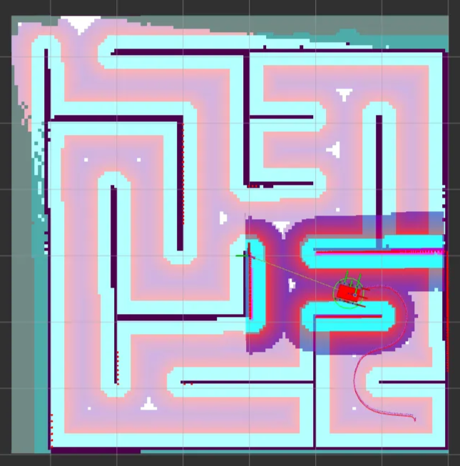
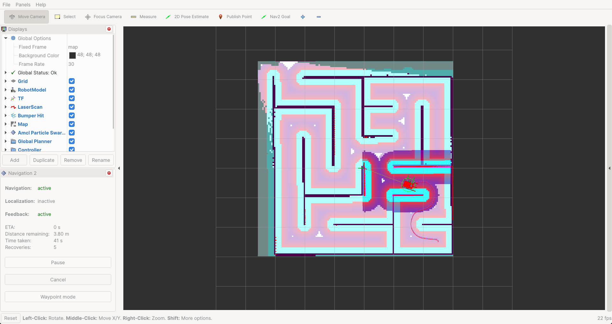
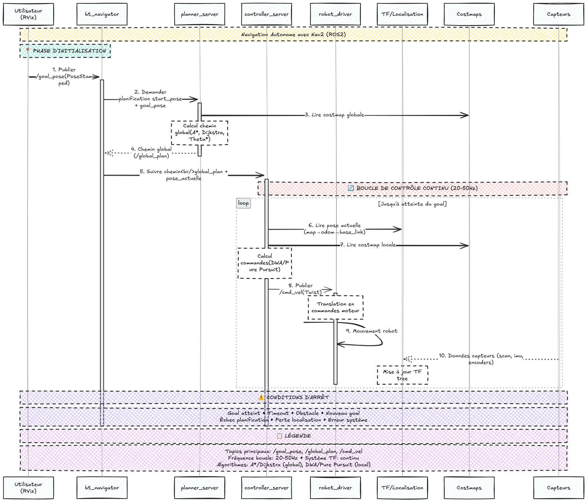

# Test IT 3 – Création d'un Algorithme de Pathfinding

## Objectif du projet
Ce test consiste à développer un système de navigation autonome pour le robot mobile TekBot dans un environnement simulé à l'aide de ROS2 et Gazebo. Il permettra au robot de:

- Générer une carte 2D de son environnement en utilisant l’algorithme de SLAM;
- Trouver un chemin entre deux points (A*)
- Éviter les obstacles
- Se déplacer de façon autonome dans Gazebo
- Visualiser les résultats dans **RViz2**

## [Architecture de base](https://github.com/charif-tekbot/tekbot_sim.git)

Ce projet repose sur une architecture modulaire organisée autour de trois packages ROS 2 principaux. Chacun jouant un rôle spécifique dans la simulation, la cartographie dynamique et la planification du déplacement du robot dans un environnement inconnu.

### 1. Le package `tekbot_description`

Il contient la description complète du robot : sa forme (*URDF/XACRO*), ses capteurs simulés (notamment un capteur laser), et leurs relations *TF*. Les fichiers *URDF* définissent la forme et comment les pièces interagissent entre elles. Les fichiers *XACRO* peuvent être utilisés plusieurs fois et sont appelés dans l'*URDF*. L'*URDF* contient aussi des plugins. Ce sont des bibliothèques qui permettent d'interagir avec du code sur la simulation. Ce package permet de lancer le robot dans Gazebo, prêt à interagir avec son environnement. Il définit aussi les données de capteurs utilisées par le SLAM et les limites physiques que le pathfinding doit respecter (rayon de braquage, taille, etc.).

### 2. `maze_solving`

Il fournit un environnement simulé sous Gazebo([voir plus](./gazebo.md)) : **un labyrinthe** dans lequel le robot peut y être lancé automatiquement grâce à des fichiers de lancement. Ce monde de test est utilisé pour évaluer la capacité du robot à explorer, cartographier et trouver un chemin vers un but dans des environnements variables.

### 3. `tekbot_control`

Ce package concentre toute la **logique algorithmique du robot**. Il est conçu pour accueillir nos principaux modules :

- **SLAM** : via `slam_toolbox`, le robot génère une carte 2D de l’environnement en utilisant les mesures du capteur laser.
- **Pathfinding** : un nœud qui récupère la carte générée pour planifier un chemin vers un objectif , en utilisant la stack Nav2.
- **Contrôle moteur** : convertit les points du chemin trouvé en commandes de déplacement `/cmd_vel`.

C’est dans ce package que nous développons l’intelligence autonome du robot.

## Contrôle manuel (télé opération)

Avant d'engager la navigation autonome, nous testons manuellement le robot pour vérifier sa réactivité et sa connectivité ROS.

Pour cela, utilisons la télé opération par clavier :

```bash
ros2 run teleop_twist_keyboard teleop_twist_keyboard --ros-args -r cmd_vel:=/cmd_vel
```

<details>
<summary>Lancer la télé-opération clavier via un fichier launch Python</summary>

```python
import os
from launch import LaunchDescription
from launch.actions import ExecuteProcess
from launch.substitutions import LaunchConfiguration

def generate_launch_description():
    # Configuration du topic de commande
    cmd_vel_topic = LaunchConfiguration('cmd_vel_topic', default='/cmd_vel')
    # Détection du terminal disponible sur le système
    terminals = [
        'io.elementary.terminal',  # elementary OS
        'gnome-terminal',          # Ubuntu/GNOME
        'konsole',                 # KDE
        'xfce4-terminal',          # XFCE
        'x-terminal-emulator',     # Alternative générique
        'xterm'                    # Fallback
    ]

    terminal_cmd = None
    for term in terminals:
        if os.system(f'which {term} > /dev/null 2>&1') == 0:
            terminal_cmd = term
            break

    if terminal_cmd is None:
        raise RuntimeError("Aucun terminal compatible trouvé sur le système")

    # Construction de la commande selon le terminal
    if terminal_cmd == 'io.elementary.terminal':
        cmd_args = [terminal_cmd, '--new-tab', '--execute']
    elif terminal_cmd == 'gnome-terminal':
        cmd_args = [terminal_cmd, '--tab', '--']
    elif terminal_cmd == 'konsole':
        cmd_args = [terminal_cmd, '--new-tab', '-e']
    elif terminal_cmd == 'xfce4-terminal':
        cmd_args = [terminal_cmd, '--tab', '--command']
    else:
        cmd_args = [terminal_cmd, '-e']

    # Processus de télé-opération clavier
    teleop_keyboard = ExecuteProcess(
        cmd=cmd_args + [
            'bash', '-c',
            f'''
            echo "=== TEKBOT TELEOP KEYBOARD ==="
            echo "Terminal détecté: {terminal_cmd}"
            echo "Topic de commande: {cmd_vel_topic}"
            echo "================================"
            echo ""
            echo "Commandes de contrôle:"
            echo "  u    i    o"
            echo "  j    k    l"
            echo "  m    ,    ."
            echo ""
            echo "q/z : augmenter/diminuer vitesse linéaire"
            echo "a/s : augmenter/diminuer vitesse angulaire"
            echo "ESPACE : arrêt d'urgence"
            echo "CTRL+C : quitter"
            echo ""
            echo "Lancement de la télé-opération..."
            sleep 2
            source ~/tekbot_ws/install/setup.bash
            ros2 run teleop_twist_keyboard teleop_twist_keyboard --ros-args -r cmd_vel:={cmd_vel_topic}
            '''
        ],
        output='screen'
    )

    return LaunchDescription([
        teleop_keyboard
    ])
```

</details>
    

Il permet de contrôler le robot avec les touches *(”**u”**, “**i”**, “**o”**,” **j”**, “**k”**, “**l”**, “**m”**, “**,”** , “**.”**)* du clavier via le topic `/cmd_vel`, et d'initier une première exploration pour alimenter le SLAM.

<iframe title="vimeo-player" src="https://player.vimeo.com/video/1096475820?h=e86efbfe9d" width="640" height="360" frameborder="0" allowfullscreen>
</iframe>

Aussi, nous utilisons Rviz2 pour visualiser en temps réel le scan laser (`/scan`), la pose (`/tf`) et la carte (`/map`).

## Cartographie (SLAM)

Nous utilisons le package [`slam_toolbox`](https://github.com/SteveMacenski/slam_toolbox)  pour réaliser la cartographie (SLAM, Simultaneous Localization And Mapping) du robot dans l’environnement de simulation. SLAM permet au robot de construire une carte de son environnement tout en se localisant dessus à partir des capteurs.

### Installation de `slam_toolbox`([voir plus](./slam_and_slam_toolbox.md))

Après une installation du package `slam_toolbox` via la commande:

```bash
sudo apt install ros-humble-slam-toolbox
```

### Lancement du SLAM

Pour lancer la cartographie avec SLAM Toolbox en mode asynchrone avec horloge simulée nous précédons comme suit:

```bash
ros2 launch slam_toolbox online_async_launch.py use_sim_time:=true
```

Mais avant dans le fichier `mapper_params_online_async.yaml`  , nous procédons à la configuration détaillé du SLAM. Voici les principaux paramètres:

- **Paramètres des Plugins**
    - *solver_plugin* : solver_plugins::CeresSolver
    Défini le solveur Ceres pour l’optimisation des graphes de poses.
    - *ceres_linear_solver, ceres_preconditioner, etc.*
    Défini des réglages clés du solveur Ceres pour la robustesse et la rapidité de convergence.
- **Paramètres ROS**
    - *odom_frame* : odom
    Frame de l’odométrie du robot.
    - *map_frame* : map
    Frame de la carte générée.
    - *base_frame* : base_link
    Frame de base du robot.
    - *scan_topic* : /scan
    Topic sur lequel le capteur laser publie les scans.
    - *mode* : mapping
    Mode SLAM (cartographie). Changé en localization pour la relocalisation sur une carte existante puis définissant le chemin vers cette map avec *map_file_name*
- **Paramètres de Cartographie**
    - *resolution* : 0.05
    Résolution de la carte (en mètres par pixel).
    - *max_laser_range* : 12.0
    Portée maximale du capteur laser prise en compte.
    - *map_update_interval* : 3.0
    Fréquence de mise à jour de la carte (en secondes).
- **Paramètres de Scan Matching et Loop Closure**
    - *use_scan_matching* : true
    Active l’alignement des scans pour améliorer la précision.
    - *do_loop_closing* : true
    Active la détection et la correction des boucles pour réduire la dérive.
    - *loop_search_maximum_distance* : 3.0
    Distance maximale pour rechercher des boucles.
- **Paramètres Divers**
    - *enable_interactive_mode* : true
    Permet l’utilisation interactive de l’outil (via RViz).
    - *debug_logging* : false
    Active ou non les logs de debug.

### Flux de Données

1. **Le robot publie les scans du capteur laser sur /scan.**
2. ***SLAM Toolbox*** reçoit ces scans, l’odométrie (odom), et effectue :
    - L’association de scans (scan matching)
    - L’optimisation du graphe de poses
    - La détection de boucles (loop closure)
3. *La carte générée* est publiée sur /map et est visualisée dans RViz.

### Sauvegarde de la carte

Une fois la cartographie jugée suffisante, nous la sauvegardons:

```bash
ros2 run nav2_map_server map_saver_cli -f ~/tekbot_ws/maps/maze_map
```

Elle pourra donc ensuite être exploitée dans un scénario de navigation ultérieur.

### Visualisation de la carte



Afin d’observer la cartographie de la map effectué, nous démarrons RViz2 ([voir plus](./RViz2.md)). Ce dernier nous sert d’interface visuelle unifiée pour:

- la **visualisation** de la carte générée par SLAM
- le **monitoring** de la navigation autonome
- et le **contrôle interactif** du robot.

Nous le démarrons grâce à la commande où passons le chemin vers sa configuration avec l’option -d.

```bash
ros2 run rviz2 rviz2 -d /chemin/vers/nav2_default_view.rviz
```

Ainsi, après cartographie nous obtenons la carte si après:




## Navigation autonome avec Nav2

Le Framework **Nav2**[(voir plus)](./Nav2.md) est utilisé ici pour compléter le système :

- Localisation via AMCL ;
- Planification globale et locale (A*, DWB, TEB...) ;
- Génération dynamique de trajectoires ;
- Évitement d'obstacles en temps réel.

Nous l’a lançons avec la commande :

```bash
ros2 launch nav2_bringup navigation_launch.py use_sim_time:=true map:=~/tekbot_ws/maps/maze_map.yaml
```

Il nous a été utile pour approfondir les capacités de navigation du robot et d’automatisation complètement de sa conduite dans l'environnement simulé.




**Diagramme de séquence:**  Processus utilisé par Nav2 pour la navigation autonome.

- **Description textuelle**
    
    **1. Publier /goal_pose (Phase d'Initialisation)**
    L'utilisateur définit la destination du robot en cliquant sur "2D Goal Pose" dans RViz. Cette action génère automatiquement un message de type `PoseStamped` qui contient les coordonnées de position (x, y, z) et l'orientation (quaternion) de la destination souhaitée. Ce message est publié sur le topic `/goal_pose` avec un timestamp et le frame de référence approprié (généralement `map`).
    
    **2. Demander planification**
    Le `bt_navigator` reçoit le message de goal et active son arbre de comportement pour orchestrer la navigation. Il extrait la pose actuelle du robot via le système TF et transmet ces informations au `planner_server` avec une demande de calcul de trajectoire. Cette étape marque le début du processus de planification globale qui va déterminer le chemin optimal vers la destination.
    
    **3. Lire costmap globale**
    Le `planner_server` consulte la costmap globale qui contient une représentation de l'environnement avec les zones navigables et les obstacles statiques. Cette carte des coûts est générée à partir de la carte d'occupation (`/map`) et attribue des valeurs de coût à chaque cellule selon la difficulté ou le danger de traverser cette zone. Les murs et obstacles fixes ont un coût infini, tandis que les zones libres ont un coût minimal.
    
    **4. Chemin global**
    En utilisant des algorithmes de planification comme A*, Dijkstra ou Theta*, le `planner_server` calcule le chemin optimal entre la position actuelle et le goal. L'algorithme prend en compte les coûts de la costmap globale pour éviter les obstacles et minimiser la distance ou le temps de parcours. Le résultat est une séquence ordonnée de waypoints qui forme le chemin global, publié sur le topic `/global_plan`.
    
    **5. Suivre chemin**
    Le `bt_navigator` reçoit le chemin global calculé et l'envoie au `controller_server` pour démarrer la phase de suivi de trajectoire. Cette transition marque le passage de la planification globale au contrôle local, où le robot va effectivement commencer à se déplacer en suivant le chemin planifié tout en s'adaptant aux conditions locales en temps réel.
    
    ## **Boucle de Contrôle (20-50Hz)**
    
    **6. Lire pose actuelle**
    Le `controller_server` interroge continuellement le système TF pour obtenir la position et l'orientation précises du robot dans l'espace. Il utilise la chaîne de transformations `map → odom → base_link` qui combine les informations de localisation globale (AMCL/SLAM) avec l'odométrie locale. Cette pose actuelle est essentielle pour calculer l'écart par rapport au chemin planifié et déterminer les corrections nécessaires.
    
    **7. Lire costmap locale**
    La costmap locale est consultée pour obtenir une vue actualisée de l'environnement immédiat du robot. Contrairement à la costmap globale qui contient principalement des obstacles statiques, la costmap locale intègre les données récentes des capteurs pour détecter les obstacles dynamiques comme les personnes, véhicules ou objets mobiles. Cette information permet au contrôleur d'adapter sa trajectoire en temps réel.
    
    **8. Publier /cmd_vel**
    Le `controller_server` utilise des algorithmes de contrôle local comme DWA (Dynamic Window Approach) ou Pure Pursuit pour calculer les commandes de vitesse appropriées. Il prend en compte la pose actuelle, le chemin global à suivre, les obstacles locaux et les contraintes cinématiques du robot. Le résultat est un message `Twist` contenant les vitesses linéaires (x, y, z) et angulaires (roll, pitch, yaw) publiées sur `/cmd_vel`.
    
    **9. Mouvement robot**
    Le `robot_driver` reçoit les commandes de vitesse abstraites et les traduit en commandes spécifiques aux actionneurs du robot. Pour un robot différentiel, cela implique de convertir les vitesses linéaire et angulaire en vitesses individuelles pour chaque roue. Ces commandes sont ensuite transmises aux contrôleurs de moteur via des protocoles de communication (UART, CAN, Ethernet) pour effectuer le mouvement physique.
    
    **10. Données capteurs**
    Les capteurs du robot (lidar, caméras, IMU, encodeurs de roues) fournissent continuellement des données sur l'état du robot et son environnement. Le lidar détecte les obstacles, l'IMU mesure l'orientation et les accélérations, tandis que les encodeurs de roues fournissent l'odométrie. Ces informations sont utilisées pour mettre à jour le système TF, corriger la localisation et actualiser les costmaps pour la prochaine itération de la boucle.
    
    Cette boucle de contrôle se répète à haute fréquence (20-50Hz) jusqu'à ce que le robot atteigne sa destination ou qu'une condition d'arrêt soit déclenchée (obstacle insurmontable, timeout, nouveau goal, perte de localisation, etc.).
    

### Démo:

<iframe title="vimeo-player" src="https://player.vimeo.com/video/1096462167?h=3b0c8f6d9e" width="640" height="360" frameborder="0" allowfullscreen>
</iframe>

*Navigation Autonome avec Nav2*