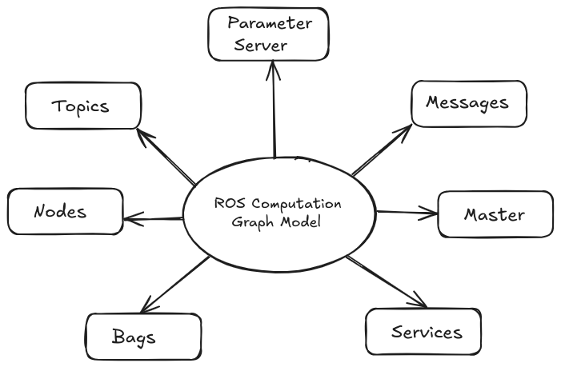
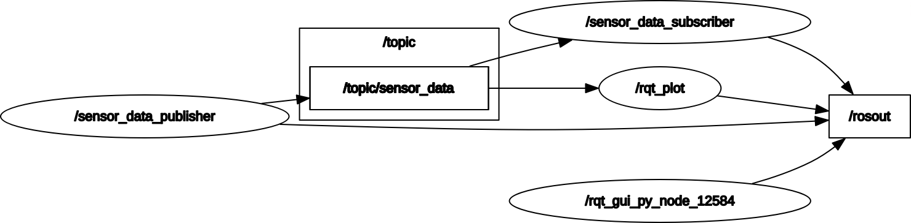

# Introduction à ROS2

## Objectif du Projet

Ce test d’introduction à `ROS2` a pour finalité la mise en place d’un système de simulation de donnée de capteurs (température, humidité et pression) par un nœud publisher et de recueil de ces données par un nœud subscriber. Ainsi, le nœud:

- **publisher**, génère et publie périodiquement les données simulées des capteurs;
- **subscriber**, les reçoit, les analyse et vérifie si elles se trouvent dans des plages de valeurs acceptables.

> **NB:** Dans le suite de cette documentation, ROS2 est supposé être installé dans un environnement Linux, dans sa version “*HUMBLE*”. [voir plus](./installation-ros2-humble.md)
> 

## ROS – Robot Operating System

### Qu’est ce que ROS?

**ROS**(***Robot Operating System***) est comme son nom l’indique un système d'exploitation pour robot. Il est composé d’un ensemble de   bibliothèque permettant de développer des applications robotiques. 

En tant que OS robotique, il doit d’une part faire fonctionner en parallèle un grand nombre d’exécutables qui doivent pouvoir échanger de


l’information de manière *synchrone* ou *asynchrone* et d’autre part assurer la gestion de la concurrence afin d’assurer l’accès efficace aux  ressources du robot.

Pour ce faire, il est dot de concepts regroupés sous le nom de «*ROS Computation Graph*».

### ROS Computation Graph

`ROS` crée un réseau peer-to-peer dans lequel tous les processus sont connectés. Chaque nœud de ce graphique représente les concepts utilisé dans `ROS` (*“nodes”, “master”, “services”, “messages”,  “bags”,”topics” et “parameter server”*). Ils peuvent interagir entre eux en consultant des informations échangées ou en se transmettant des données.



Parmi ceux liés à ce test, on compte :

- **Les nodes:** Un nœud est une instance d’un exécutable.Il peut correspondre à un capteur, un moteur, un algorithme de traitement, de surveillance… Chaque nœud qui se lance se déclare au Master.
- **Les messages:** Un message **est une structure de donnée composite. Il est composé d’une combinaison de types primitifs (chaines de caractères, booléens, entiers, flottants…) et de message (*un message est une structure récursive*).
- **Les topics:** Un *topic* est un système de transport de l’information basé sur le système de l’abonnement/publication (***subscribe / publish***). Il est typé ce signifie que le type d’information qui est publiée (*le message*) est toujours structuré de la même manière.

## Arborescence du projet

La mise en place d’un projet sous ROS 2 commence par la création d’un espace de travail, appelé workspace  [voir plus](./creation-workspace.md) . Cet espace constitue la base de l’organisation du projet et comporte plusieurs répertoires. Le dossier `src/` contient l’ensemble des packages  [voir plus](./creation-package.md) développés ou ajoutés au projet. Dans notre cas, on y retrouve le package `sensor_data_evaluation`, qui représente une unité modulaire regroupant tous les fichiers nécessaires à une fonctionnalité spécifique, tels que les nœuds, les en-têtes, les scripts de lancement ou encore les fichiers de configuration.

Les autres dossiers `build/`, `install/` et `log/`  sont générés automatiquement lors de la compilation avec l’outil `colcon`.  Chacun ayant un rôle spécifique:

- `build/` stocke les fichiers intermédiaires produits pendant la construction du projet;
- `install/` contient l’installation finale des différents packages, rendant leur exécution possible;
- `log/` conserve les fichiers de journalisation liés aux processus de compilation et d’exécution, ce qui facilite le suivi et le débogage du projet;

Ainsi, une fois le package placé dans `src/` et compilé, toute la structure du workspace est automatiquement générée et prête à l’emploi.

```bash
./
├── build/
├── install/
├── log/
└── src/
    └── sensor_data_evaluation/
        ├── include/
        │   └── sensor_data_evaluation/
        ├── launch/
        │   └── sensor_data_launch.py
        ├── msg/
        │   └── SensorData.msg
        ├── src/
        │   ├── sensor_data_publisher.cpp
        │   └── sensor_data_subscriber.cpp
        ├── package.xml
        └── CMakeLists.txt
```

Le package ***sensor_data_evaluation***  regroupe tous les fichiers nécessaires à son bon fonctionnement, notamment les scripts sources, les fichiers de configuration et de compilation  et le script de lancement. En son sein, deux fichiers sources principaux assurent le cœur de la logique de notre système : `sensor_data_publisher.cpp` et `sensor_data_subscriber.cpp`. Tandis que le premier est chargé de générer et de publier les données, le second lui les réceptionne, les analyse et signale toute anomalie détectée dans ces dernières.

## Fonctionnement



Le nœud `/sensor_data_publisher` publie des données sur le topic `/topic/sensor_data`. Le nœud `/sensor_data_subscriber` et l’outil `rqt_plot` sont abonnés à ce topic et reçoivent ces données. Tous les nœuds, y compris celui généré par l’interface graphique `rqt_gui_py_node_12584`, envoient leurs messages de log vers `/rosout`.

## Implémentation

Pour réaliser ce test, nous avons opté pour le langage C++, l’un des deux langages principaux pris en charge par ROS2.

### Nœud Publisher

Le fichier `sensor_data_publisher.cpp` définit un nœud ROS2 responsable de la génération et de la publication périodique de données simulées de capteurs. Ce nœud est encapsulé dans une classe nommée `SensorDataPublisher`, héritée de `rclcpp::Node`, ce qui permet d’utiliser les fonctionnalités de ROS2, telles que les timers et les publishers. Le constructeur de la classe initialise un publisher (`create_publisher`) qui publie sur le topic `topic/sensor_data` des messages du type `SensorData` chaque *0.5s* soit *500ms*, un type de message personnalisé défini dans l’interface du package. Ce publisher est configuré avec une file d’attente de *10 messages*, ce qui permet de gérer un petit retard si les subscribers ne consomment pas immédiatement les données.

Pour simuler les mesures de température, d’humidité, de pression, la classe utilise un générateur de nombres aléatoires basé sur `std::mt19937`, initialisé avec un `random_device` pour garantir des valeurs imprévisibles. Trois distributions uniformes sont créées : l’une pour la température (15 à 35°C), une autre pour l’humidité (30 à 70 %) et une dernière pour la pression atmosphérique (950 à 1050 hPa). À chaque *0.5s*, la méthode `timer_callback()` est appelée. Elle instancie un message `SensorData`, y affecte des valeurs aléatoires extraites des distributions, puis ajoute un horodatage avec `get_clock()->now()` pour indiquer le moment exact de génération simulant la date de mesure.

Le type de message `SensorData` est défini dans un fichier `.msg` propre au package. Il contient quatre champs :

- `float64 temperature` : température en degrés Celsius,
- `float64 humidity` : humidité en pourcentage,
- `float64 pressure` : pression en hectopascals,
- `builtin_interfaces/Time stamp` : horodatage indiquant le moment exact de la mesure.

Avant d’être publié sur le topic `topic/sensor_data`, les données sont enregistrées dans les logs grâce à la méthode `RCLCPP_INFO`

Le timer est configuré via `create_wall_timer` pour appeler la fonction de rappel toutes les 500 millisecondes, simulant ainsi un flux rapide et continu de données capteurs. L’exécution de ce nœud commence dans la fonction `main`, où ROS2 est initialisé avec `rclcpp::init`, puis l’objet `SensorDataPublisher` est passé à `rclcpp::spin` pour lancer la boucle d'exécution, avant un `rclcpp::shutdown()` final.

```cpp
#include <chrono>
#include <functional>
#include <memory>
#include <random>

#include "rclcpp/rclcpp.hpp"
#include "sensor_data_evaluation/msg/sensor_data.hpp"

using namespace std;
using namespace chrono_literals;

class SensorDataPublisher : public rclcpp::Node
{
private:
  rclcpp::TimerBase::SharedPtr timer_;
  rclcpp::Publisher<sensor_data_evaluation::msg::SensorData>::SharedPtr publisher_;
  
  mt19937 gen_; // Standard mersenne_twister_engine seeded with rd()
  uniform_real_distribution<double> temp_dist_;
  uniform_real_distribution<double> humidity_dist_;
  uniform_real_distribution<double> pressure_dist_;

  void timer_callback()
  {
    auto message = sensor_data_evaluation::msg::SensorData();
    
    message.temperature = temp_dist_(gen_);
    message.humidity = humidity_dist_(gen_);
    message.pressure = pressure_dist_(gen_);
    message.stamp = this->get_clock()->now();
    
    auto now = this->get_clock()->now();
    time_t now_c = static_cast<time_t>(now.seconds());
    char time_str[32];
    strftime(time_str, sizeof(time_str), "%Y-%m-%d %H:%M:%S", localtime(&now_c));

    RCLCPP_INFO(this->get_logger(),
          "[%s] Publishing - Temp: %.2f°C, Humidity: %.2f%%, Pressure: %.2f hPa",
          time_str, message.temperature, message.humidity, message.pressure);

    publisher_->publish(message);
  }
  
  public:
    SensorDataPublisher()
    : Node("sensor_data_publisher"),
      gen_(random_device{}()),
      temp_dist_(15.0, 35.0),
      humidity_dist_(30.0, 70.0),
      pressure_dist_(950.0, 1050.0)
    {
      publisher_ = this->create_publisher<sensor_data_evaluation::msg::SensorData>("topic/sensor_data", 10);
      timer_ = this->create_wall_timer(
        500ms, bind(&SensorDataPublisher::timer_callback, this));
    }
};

int main(int argc, char * argv[])
{
  rclcpp::init(argc, argv);
  rclcpp::spin(make_shared<SensorDataPublisher>());
  rclcpp::shutdown();
  return 0;
}
```

## Nœud Subscriber

Le fichier `sensor_data_subscriber.cpp` implémente un nœud ROS2 chargé de recevoir, afficher et valider les données simulées publiées par le nœud `sensor_data_publisher.cpp`. Ce nœud est encapsulé dans une classe nommée `SensorDataSubscriber`, dérivée de `rclcpp::Node`. Lors de l’instanciation de cette classe, une souscription est créée via `create_subscription`, spécifiant le type de message attendu (`SensorData`), le nom du topic écouté (`topic/sensor_data`), une profondeur de file d’attente de 10 messages et une fonction de rappel (`topic_callback`) appelée à chaque réception de message.

La méthode `topic_callback()` reçoit en argument une référence constante vers le message de type `SensorData`. Elle commence par extraire les trois grandeurs physiques contenues dans le message (température, humidité et pression) pour les enregistrer les logs à l’aide de `RCLCPP_INFO`.

Une étape importante de ce nœud réside dans la **vérification de validité des données reçues**. Trois conditions sont définies, chacune correspondant à une plage de valeurs acceptables pour une grandeur physique : une température entre 15 et 35 °C, une humidité entre 30 % et 70 %, et une pression entre 950 et 1050 hPa. Ces bornes correspondent à celles définies dans le nœud éditeur. Si l’une des valeurs ne respecte pas son intervalle, un log d’avertissement est enregistré à l’aide de `RCLCPP_WARN`, signalant la détection d’une anomalie potentielle dans les données.

Enfin, la fonction `main` initialise ROS2, crée une instance du nœud via `make_shared` et lance son exécution avec `rclcpp::spin`, assurant la réactivité continue au flux de messages, avant de terminer avec `rclcpp::shutdown()`.

```cpp
#include <functional>
#include <memory>

#include "rclcpp/rclcpp.hpp"
#include "sensor_data_evaluation/msg/sensor_data.hpp"

using namespace std;
using placeholders::_1;

class SensorDataSubscriber : public rclcpp::Node
{
public:
  SensorDataSubscriber()
  : Node("sensor_data_subscriber")
  {
    subscription_ = this->create_subscription<sensor_data_evaluation::msg::SensorData>(
      "topic/sensor_data", 10, bind(&SensorDataSubscriber::topic_callback, this, _1));
  }

private:
  void topic_callback(const sensor_data_evaluation::msg::SensorData & msg) const
  {
    RCLCPP_INFO(this->get_logger(), "Received - Temp: %.2f°C, Humidity: %.2f%%, Pressure: %.2f hPa",
                msg.temperature, msg.humidity, msg.pressure);

    // Validate data ranges
    bool temp_valid = (msg.temperature >= 15.0 && msg.temperature <= 35.0);
    bool humidity_valid = (msg.humidity >= 30.0 && msg.humidity <= 70.0);
    bool pressure_valid = (msg.pressure >= 950.0 && msg.pressure <= 1050.0);
    
    if (!temp_valid || !humidity_valid || !pressure_valid) {
      RCLCPP_WARN(this->get_logger(), "Warning: Some sensor values are out of expected range!");
    }
  }
  rclcpp::Subscription<sensor_data_evaluation::msg::SensorData>::SharedPtr subscription_;
};

int main(int argc, char * argv[])
{
  rclcpp::init(argc, argv);
  rclcpp::spin(make_shared<SensorDataSubscriber>());
  rclcpp::shutdown();
  return 0;
}
```

## Lancement automatique avec un fichier `launch`

Pour exécuter facilement l’ensemble du système, un fichier `sensor_data_launch.py` a été créé dans le dossier `launch` du package. Ce fichier est écrit en Python et utilise le module `launch` de ROS2 pour spécifier les nœuds qui doivent être lancés simultanément : le publisher, le subscriber et les nœuds rqt_plot pour la visualisation des données mesurer. Cela permet d’initier le test complet en une seule commande, sans avoir à exécuter manuellement chaque composant dans différents terminaux.

```python
from launch import LaunchDescription
from launch_ros.actions import Node

def generate_launch_description():
    return LaunchDescription([
        Node(
            package='sensor_data_evaluation',
            executable='sensor_data_publisher',
            name='sensor_data_publisher'
        ),
        Node(
            package='sensor_data_evaluation',
            executable='sensor_data_subscriber',
            name='sensor_data_subscriber'
        ),
         Node(
             package='rqt_plot',
             executable='rqt_plot',
             name='rqt_plot',
             arguments=['/topic/sensor_data/temperature', '/topic/sensor_data/humidity', '/topic/sensor_data/pressure'],

         )
    ])
```

## Résultats obtenues

Une fois le fichier `launch.py` exécuté, les données simulées sont affichées en temps réel dans le terminal. Chaque valeur générée est associée à un horodatage précis, ce qui permet de suivre l’évolution des mesures au fil du temps.

Pour compléter cette sortie textuelle, l’outil **rqt_plot** a été utilisé afin de visualiser graphiquement la variation des paramètres (*température, humidité, pression*). Cette visualisation facilite l’analyse des données simulées et permet de détecter plus aisément d’éventuelles anomalies.

<iframe title="vimeo-player" src="https://player.vimeo.com/video/1094573538?h=def88607b6" width="640" height="360" frameborder="0"    allowfullscreen></iframe>

## Utilisation de ROS2 en configuration multi-machines

Pour enrichir le test et démontrer les capacités distribuées de ROS2, une expérimentation a été menée en répartissant le système sur deux machines distinctes, toutes deux connectées au même réseau local. Dans cette configuration, une machine exécute le nœud publisher tandis que l’autre machine héberge le nœud subscriber, qui reçoit les données publiées. Cette approche simule un environnement distribué où les nœuds *ROS2* fonctionnent sur des hôtes physiques différents, plutôt que sur une seule machine comme précédemment.

### Mise en place de l’environnement distribué ROS2

1. **Vérification de la connexion réseau**
    
    Les deux machines ont été reliées au même réseau local (notre cas par Wi-Fi). La communication a été testée avec la commande `ping` pour s’assurer de leur accessibilité mutuelle.
    
2. **Configuration des variables d’environnement**
    
    Afin d’isoler les communications entre les différents groupes de nœuds sur un réseau, la variable `ROS_DOMAIN_ID` a été définir avec la même valeur.
    
    **Machine 1 & 2 (Publisher et Subscriber)**
    
    ```bash
    export ROS_DOMAIN_ID=0
    ```
    
3. **Lancement des nœuds**
    
    Sur la *machine 1*, le nœud publisher est exécuté, tandis que sur la *machine 2*, le subscriber reçoit et visualise les messages transmis.
    

<iframe title="vimeo-player" src="https://player.vimeo.com/video/1094569796?h=7519df4962" width="640" height="360" frameborder="0"    allowfullscreen></iframe>