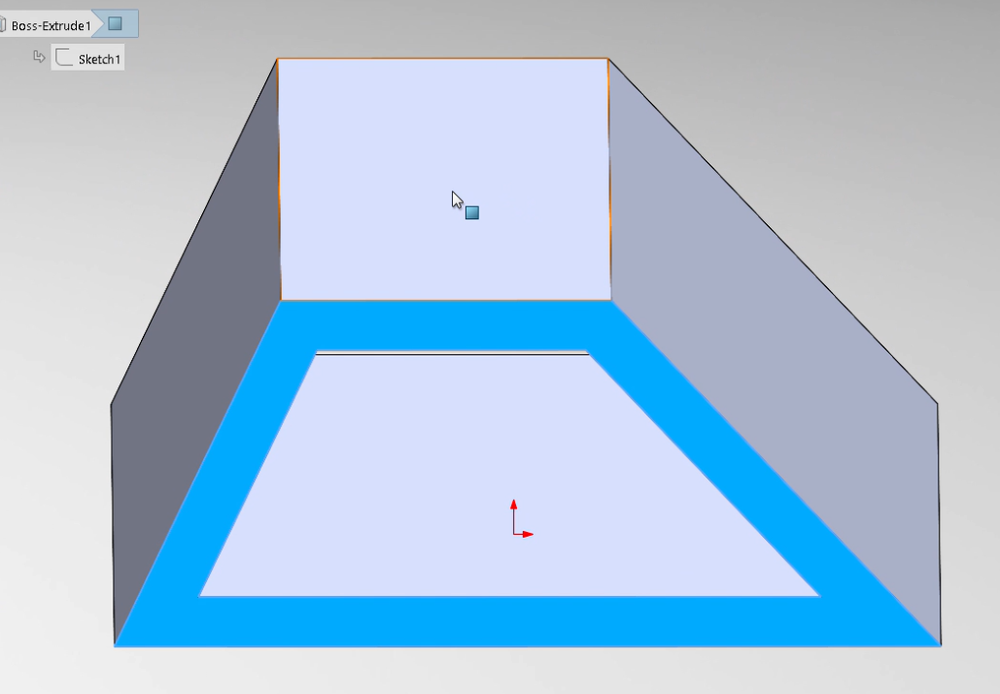
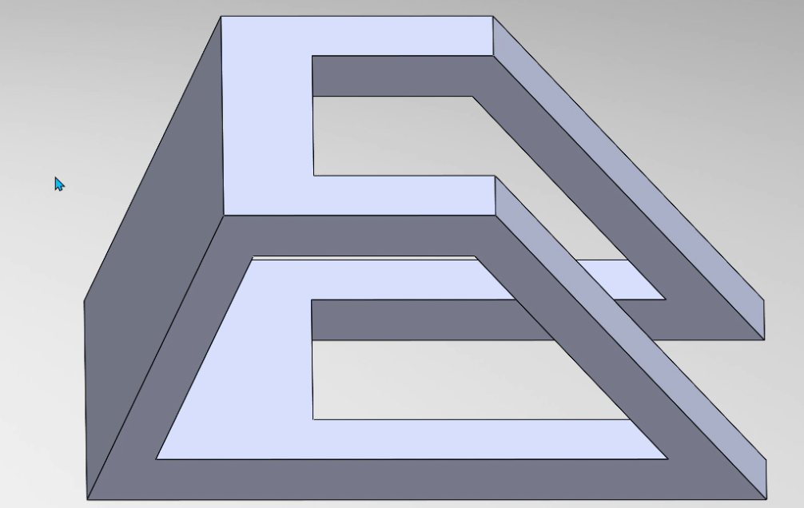
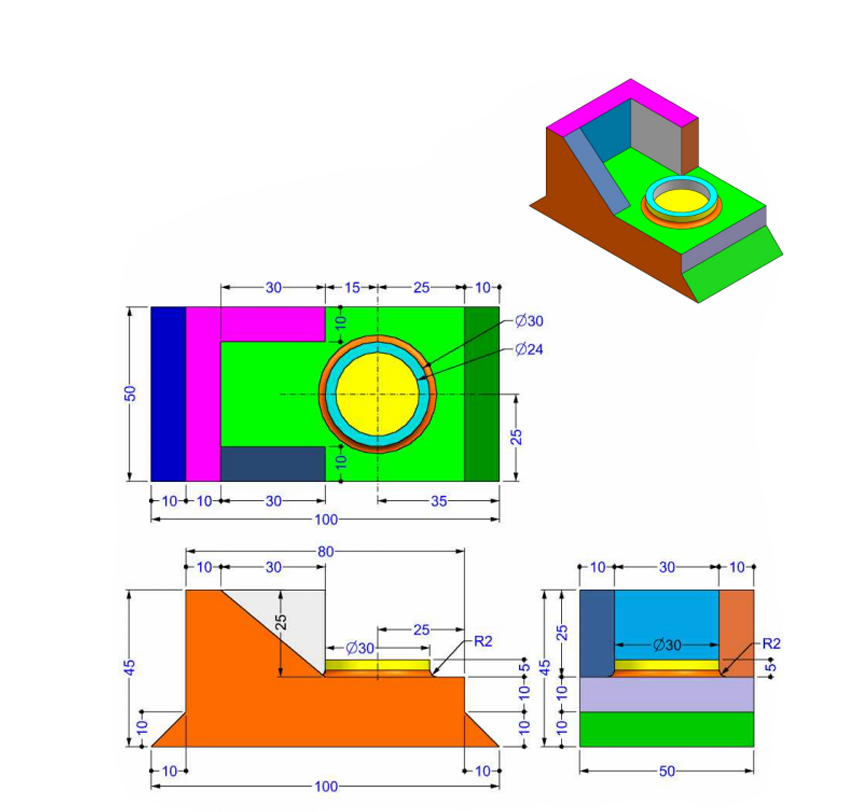
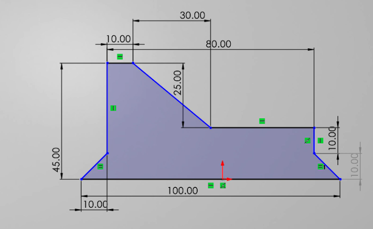

# Mécanique
## Conception de la 2eme pièce
Voyons maintenant le processus de conception la troisième pièce.

 
Dans un premier temps nous allons dans l’onglet esquisse faire le choix d’un plan de référence (ici le plan frontal). 

 Puis, après avoir choisi notre plan de travail, toujours dans notre même esquisse, parmi les outils de base nous allons sélectionner l’outil ligne pour faire une représentation plane de l’une des faces latérales en y appliquant les dimensions(cotations).

Nous allons ensuite dans notre esquisse se servir de l’outils décalage d’entité pour créer une copie décalée (de 10mm) de notre esquisse précédente vers l’intérieur.  

Une fois le croquis terminé, nous allons dans Fonctions > Bossage/Base Extrudé où nous allons nous servir de la fonction extruder pour donner du volume à notre esquisse. Pour ce faire, nous allons sélectionner dans un premier temps l’esquisse puis nous allons définir la longueur d’extrusion ou encore la profondeur (dans notre cas ici 50mm) ensuite, nous indiquerons la direction dans laquelle se fera l’ajout de matière.

 
Pour continuer notre modélisation, nous allons nous mettre dans le plan de haut puis nous allons réaliser un rectangle comme sur la figure ci-dessous. 

A présent, nous allons effectuer un enlèvement de matière par rapport en prenant comme référence le rectangle que nous avons réalisé précédemment. Tout d’abord, on sélection dans un premier temps le rectangle en question puis, à nouveau dans l’onglet des fonctions, on sélectionne l’option coupe extrudé afin d’effectuer l’enlèvement de matière après avoir choisi la direction (ici celle du bas). On obtient donc le schéma qui suit. 

Nous allons ensuite choisir le matériau approprié et nous appliquer les couleur comme demandé. Pour ce faire, nous allons nous rendre dans l'arbre de conception (FeatureManager). Ensuite, après avoir repéré l'option Matériau en haut de la liste, à l’aide d’un clic droit sur Matériau, on sélectionne Modifier le matériau.
On parcours ensuite la liste des matériaux en prenant garde de choisir comme matériau un acier AISI 1020 de densité : 0,0079 g/mm^3.

En ce qui concerne la coloration, il suffit de se rendre dans les paramètres d’apparence et d’y appliquer les couleurs correspondantes. On obtient donc dans notre ca de figure la figure suivante. 

Alors, ici, nous somme à la fin de notre modélisation. Pour connaitre la masse totale de notre pièce, nous allons nous rendre dans l’onglet Évaluation puis nous allons choisir l’option Propriétés de masse. Une foi cette opération exécutée, on obtien donc la masse de notre pièce qui dans notre cas de figure est de 1633.25gramme.
 
 

## Conception de la dernière pièce.

Dans un premier temps nous allons ouvrir une nouvelle esquisse puis après avoir choisi notre plan de travail, nous allons faire une représentation plane de l’un des côtés comme suit en prenant garde de bien donner les cotations.   

Pour donner du volume à notre matière, nous allons nous rendre dans les Fonctions puis on sélectionne l’option Bossage/Base Extrudé. Nous allons nous servir de la fonction extruder pour donner du volume à notre esquisse. Pour ce faire, nous allons sélectionner dans un premier temps l’esquisse puis nous allons définir la longueur d’extrusion ou encore la profondeur (dans notre cas ici 50mm) ensuite, nous indiquerons la direction dans laquelle se fera l’ajout de matière (celle de l’axe y ici).

 
Ensuite nous nous placerons dans notre plan frontal puis, nous ferons un petit triangle rectangle de sorte à ce que l’hypoténuse soit confondue à la pente descendante (du haut vers le bas) comme sur la figure ci-dessous. Après avoir sélectionné le triangle construit, nous irons dans les fonctions puis nous ferons le choix de la fonction permettant de faire un enlèvement de matière. Nous-y spécifierons la longueur de notre enlèvement de matière (30mm dans notre cas) puis nous y ajouterons un petit décalage de 10mm vers l’intérieur.

 Après avoir sélectionné le triangle construit, nous irons dans les fonctions puis nous ferons le choix de la fonction permettant de faire un enlèvement de matière. Nous-y spécifierons la longueur de notre enlèvement de matière (30mm dans notre cas) puis nous y ajouterons un petit décalage de 10mm vers l’intérieur(l'axe Y).

 
Par la suite, on retourne dans une esquisse puis on réalise à nouveau dans le même plan un triangle supérieur complémentaire à l’autre triangle de façon à ce que le tout forme un parallélogramme puis, à ce nouveau triangle, on donne du volume avec la fonction Bossage/Base Extrudé. Comme paramètres, nous donnerons à cette fonction 10mm de longueur et un décalage de 40mm dans la direction de l’axe y.
On obtient ainsi ce qui suit.

 
A présent, nous allons nous placer dans le plan de base de notre solide puis, nous allons dans notre esquisse choisir dans l’option ligne, les lignes centrales, puis, nous allons construire un axe centrale perpendiculaire et passant par le milieu de la largeur de la base de notre figure de telle sorte qu’elle ait 35mm de longueur. On vient ensuite donc de déterminer le centre de notre cercle. Maintenant, nous allons réaliser deux cercles centrés en ce même point de sorte qu’ils aient des diamètres de 24mm et de 30mm chacun.

  
On se sert à nouveau de la fonction Bossage/Base Extrudé pour donner un volume de 5mm à l’espace contenue entre les deux cercles.

 
On retourne par la suite dans notre esquisse puis on choisit dans le menu l’option Congé pour effectuer un filetage d’un rayon de 2mm sur la bordure inférieure du cercle précédemment. 

On vient ainsi donc de terminer notre solide, pour se conformer aux exigences, nous allons nous rendre dans l'arbre de conception (FeatureManager). Ensuite, après avoir repéré l'option Matériau en haut de la liste, à l’aide d’un clic droit sur Matériau, on sélectionne Modifier le matériau.
On parcours ensuite la liste des matériaux en prenant garde de choisir comme matériau un l’Alliage 1060 de l’Aluminium avec une densité de 0.0027 g/mm^3.

On se rend maintenant dans les paramètres d’apparence puis en faisant le choix de la face concernée, on applique la coloration appropriée. 

 
La masse de l’objet nous ait fourni dans la section propriété de masse dans l’onglet évaluation.

Notre pièce pèse donc un total de 297.29 gramme
