# Test 1: Niveau Débutant

## I.	Description brève du test 
La mécanique, branche fondamentale de la physique étudiant les mouvements des objets et ainsi que les causes de ces mouvements joue un rôle prépondérant dans la conception des systèmes robotiques. L’objectif ici étant étant de concevoir un robot roulant capable d’identifier, de ramasser puis de trier les déchets, la mécanique s’occupera principalement de la conception des pièces du robot puis de la simulation des mouvements éventuels entre ces pièces à travers un logiciel de CAO (Conception assistée par ordinateur). Plus précisément pour cette phase, nous nous concentrerons sur la conception et l’assemblage de pièces mécaniques basiques dans l’optique d’acquérir le minimum de connaissances nécessaires à la conception des différentes parties du robot.

## II.	La conception 
### II-1. Conception de la 1ere pièce 
L’objectif ici est de modéliser la pièce suivante sur la base des caractéristiques fournies.

La réalisation
1. L’esquisse
  - On crée une nouvelle esquisse sur le plan de dessous (Barre d’outils/ Esquisse puis on sélectionne le plan de dessous dans l’arbre feature manager)
  - On se sert de l’outil cercle pour dessiner deux cercles concentriques de centre l’origine de diamètre respectives 100 et 150.
  - On crée ensuite un point à 150 mm de l’origine à gauche. Puis on dessine deux cercles concentriques centrés en ce point et de diamètre respectives 50mm et 80.
  - Le rayon de courbure de la courbe reliant les cercles de 150mm et 80 n’étant pas donné alors une photo de la forme de la courbe a été importée dans SolidWorks puis la courbe a été dessinée avec une spline.
  - Ensuite un rectangle centré sur la ligne reliant les centres des cercles, de largeur 40 et de longueur suffisante pour traverser l’extrémité gauche des deux petits cercles a été construit. Puis les portions d’esquisses inutiles ont été ajustées avec l’outil ajuster.

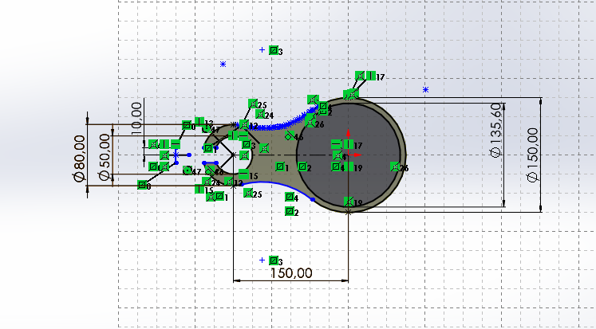

  - Nous avons ensuite quitté l’esquisse puis réalisé une extrusion du contour fermé obtenu avec l’outil Bossage/Extrusion.

  - Ensuite nous avons créé une nouvelle esquisse sur la face supérieure de l’objet obtenu puis dessiné un cercle de 100mm de diamètre.

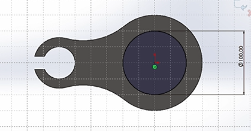

  - Enlèvement de matière suivant le cercle créé précédemment en sélectionnant l’option (à travers tout) :

  - Dessin d’un cercle de 135.6 mm de diamètre sur le même que celui de 100mm dessiné précédemment

  - Enlèvement de matière suivant ce cercle (outil : borgne distance : 10mm)

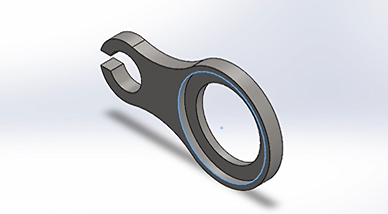

  - Symétrie de l’objet obtenu par rapport au plan de droite.

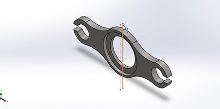

  - Application des couleurs correspondantes à chaque face : On sélectionne la face en faisant un clic gauche puis dans apparence (représenté par une boule colorée) on sélectionne la couleur correspondant à la face.
  - Résultat final :

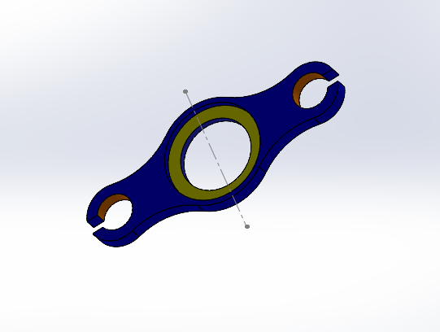

Pour connaitre la masse totale de notre pièce, nous allons nous rendre dans l’onglet Évaluation puis nous allons choisir l’option Propriétés de masse. Nous reviendrons sur la masse de l'objet un peu plus loin.

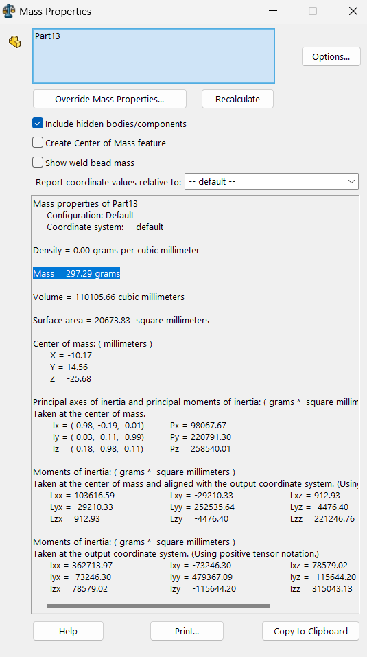

Nous allons ensuite choisir le matériau approprié et appliquer les couleurs comme demandé. Pour ce faire, nous allons nous rendre dans l'arbre de conception (FeatureManager). Ensuite, après avoir repéré l'option Matériau en haut de la liste, à l’aide d’un clic droit sur Matériau, on sélectionne Modifier le matériau. On sélectionne ensuite le matériau recommandé pour cette pièce : Acier AISI 1020.

### II-2. Conception de la deuxième pièce 
Description des caractéristiques de la pièce :

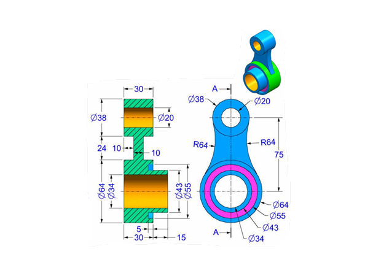

La réalisation 
  - Dessin de deux cercles dans le plan de face : Un de diamètre 20 et l’autre de diamètre 34 et dont les centres sont distants de 75mm

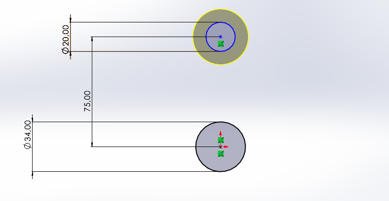

  - Extrusion mince d’épaisseur 9mm et distant de 30mm du petit cercle et extrusion mince d’épaisseur 15mm et distant de 45 mm

  - Dessin de deux cercles de diamètre 55mm et 43mm respectivement à l’arrière du cylindre plus grand.

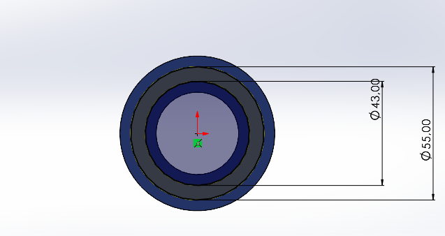

  - Enlèvement de matière distant de 15mm suivant le cercle de diamètre 55mm (Borgne)
  - Enlèvement de matière distant de 20mm suivant le cercle de diamètre 43mm (Borgne)

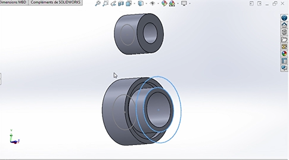

  - Création d’un plan décalé du plan de face de 10 mm du côté de l’objet.

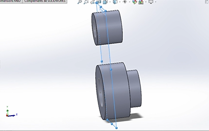

  - Création d’une esquisse sur ce plan :
    - On projette d’abord la géométrie sur le plan en utilisant l’outil : Convertir les entités 
    - L’objectif étant de relier les deux grands cercles obtenus par extrusion mince avec une courbe de 64mm de rayon de part et d’autre de la ligne centrale, pour le faire on place dans un premier temps deux points : un sur le grand cercle et un sur le petit (légèrement décalé du diamètre horizontal de chaque cercle), ensuite on construit une courbe de rayon 64mm reliant ces deux points (On dessine la courbe et ensuite on ajoute une côte) puis on impose des contraintes de tangence entre cette courbe et chacun des cercles.
    - On ferme ensuite cette courbe avec des portions des deux cercles et la ligne centrale :

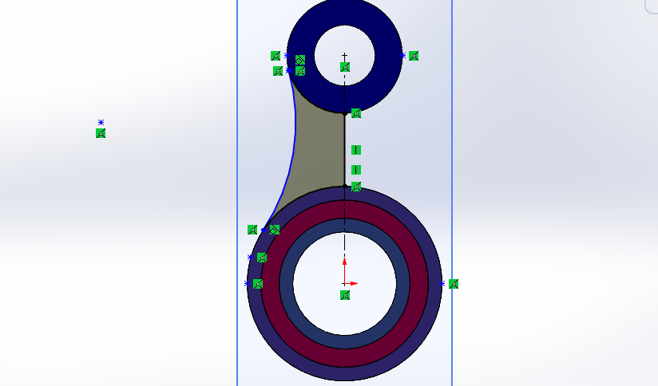

  - Extrusion de 10mm d’épaisseur du contour fermé obtenu vers le bas de l’esquisse 

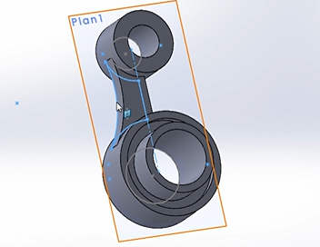

  - Symétrie de l’extrusion par rapport au plan de droite (Fonction /Symétrie)

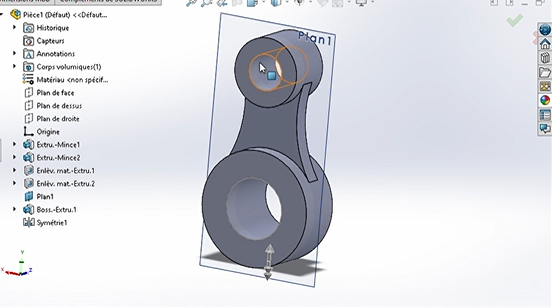

  - Application de la couleur correspondant à chaque face comme pour la 1ere pièce.

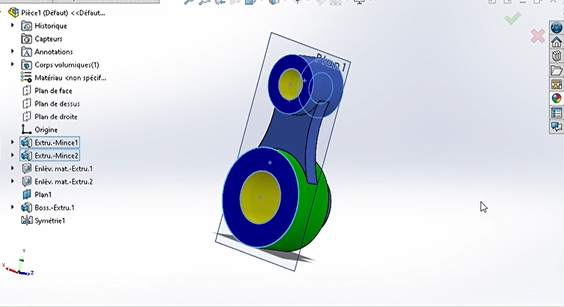

On détermine ensuite la masse de l'objet comme précédemment puis on sélectionne le matériau adapté : Alliage d'aluminium 1060 de densité 0.0027 g/mm^3

### II-2. Conception de la 3eme pièce
Voyons maintenant le processus de conception de la troisième pièce.

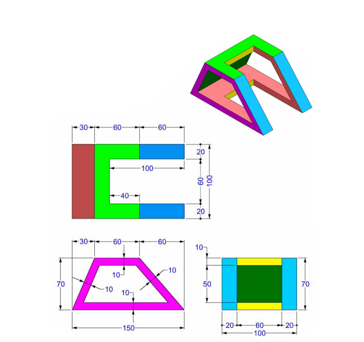

Dans un premier temps nous allons dans l’onglet esquisse faire le choix d’un plan de référence (ici le plan frontal).

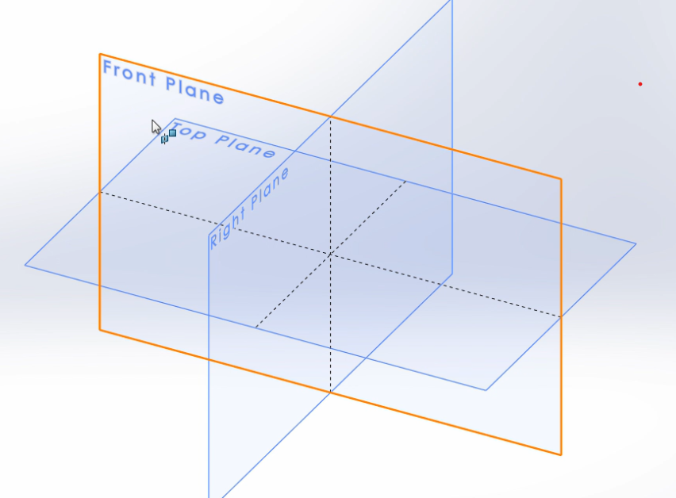

Puis, après avoir choisi notre plan de travail, toujours dans notre même esquisse, parmi les outils de base nous allons sélectionner l’outil ligne pour faire une représentation plane de l’une des faces latérales en y appliquant les dimensions (cotations).

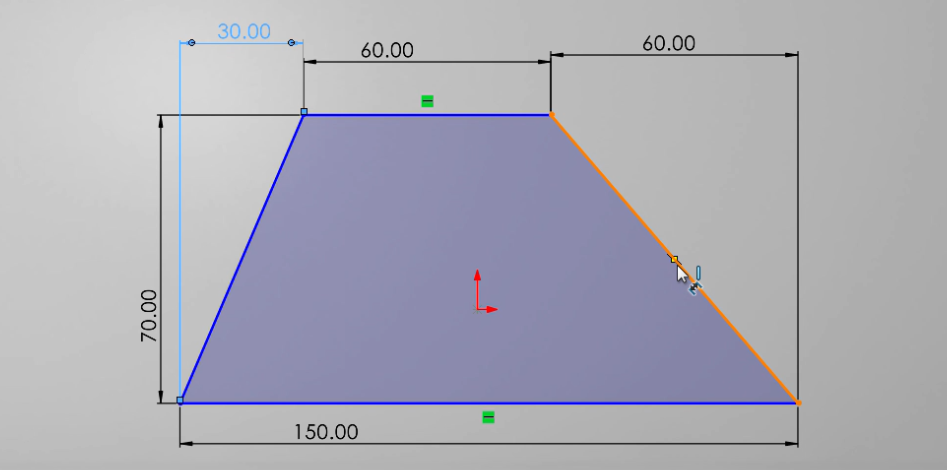

Nous allons ensuite dans notre esquisse se servir de l’outil décalage d’entité pour créer une copie décalée (de 10mm) de notre esquisse précédente vers l’intérieur.

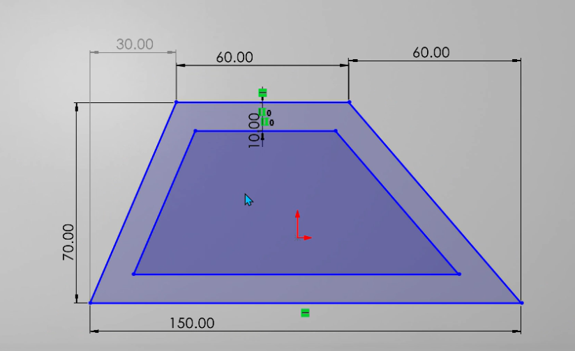

Une fois le croquis terminé, nous allons dans Fonctions > Bossage/Base Extrudé où nous allons nous servir de la fonction extruder pour donner du volume à notre esquisse. Pour ce faire, nous allons sélectionner dans un premier temps l’esquisse puis nous allons définir la longueur d’extrusion ou encore la profondeur (dans notre cas ici 50mm) ensuite, nous indiquerons la direction dans laquelle se fera l’ajout de matière.

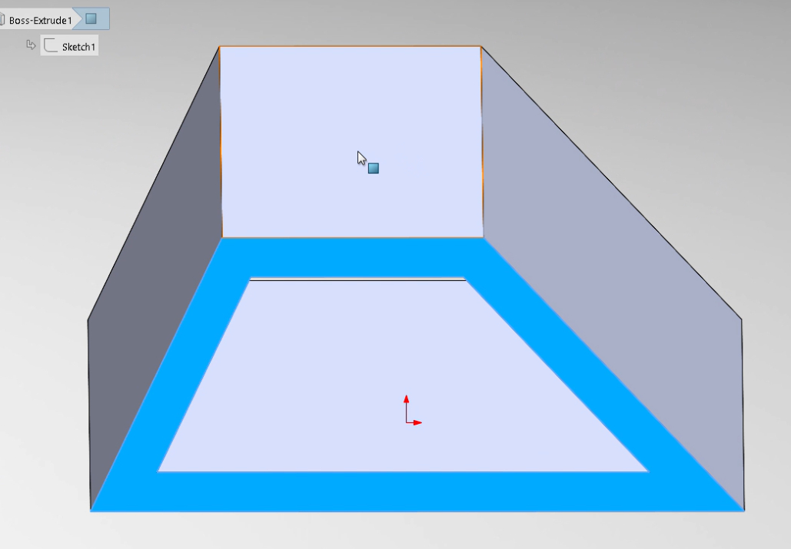

Pour continuer notre modélisation, nous allons nous mettre dans le plan de haut puis nous allons réaliser un rectangle comme sur la figure ci-dessous.

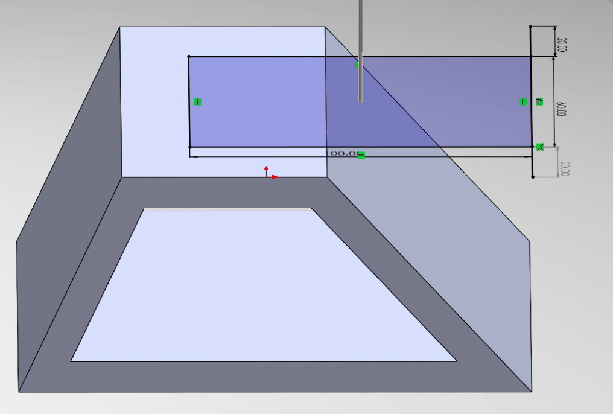

A présent, nous allons effectuer un enlèvement de matière par rapport en prenant comme référence le rectangle que nous avons réalisé précédemment. Tout d’abord, on sélectionne dans un premier temps le rectangle en question puis, à nouveau dans l’onglet des fonctions, on sélectionne l’option coupe extrudée afin d’effectuer l’enlèvement de matière après avoir choisi la direction (ici celle du bas). On obtient donc le schéma qui suit.

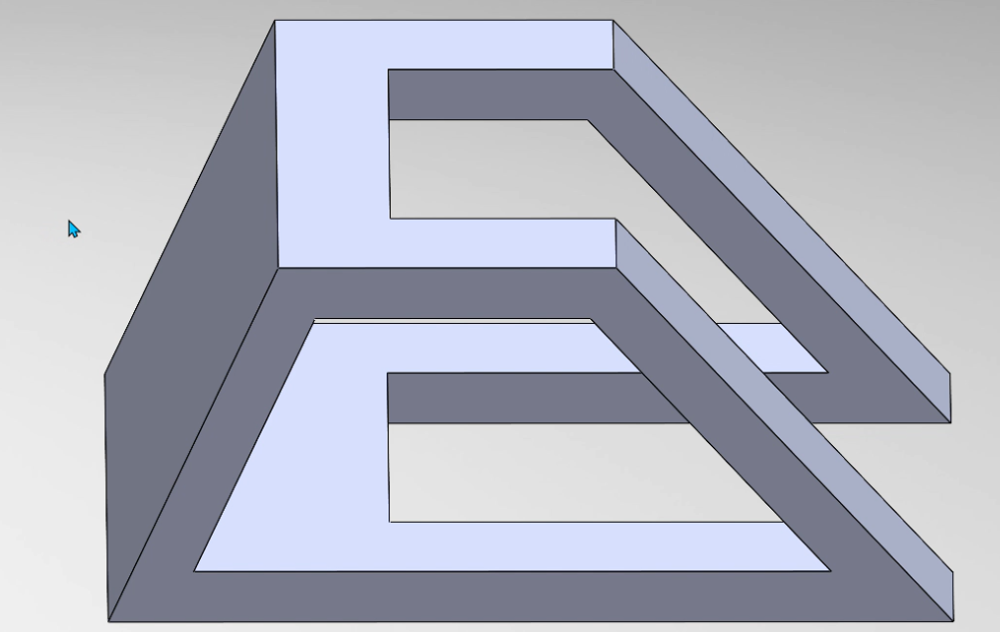

Comme précédemment, on choisit le matériau recommandé pour cette pièce : Ici un alliage d'acier AISI 1020 de densité : 0.0079 g/mm^3

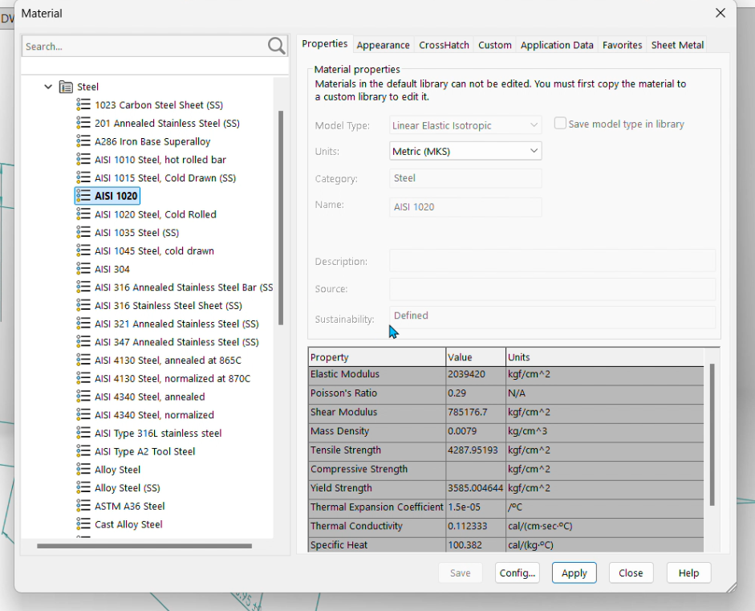

En ce qui concerne la coloration, il suffit de se rendre dans les paramètres d’apparence et d’y appliquer les couleurs correspondantes. On obtient donc dans notre cas de figure la figure suivante.

Enfin, on détermine la masse totale de notre pièce.

### II-3. Conception de la dernière pièce.

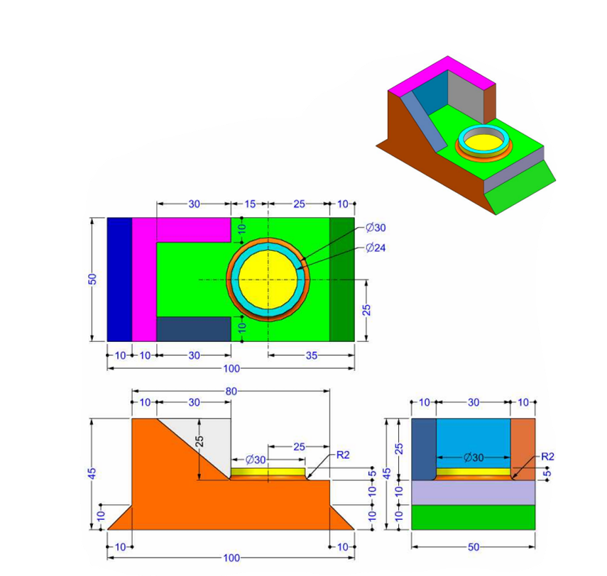

Dans un premier temps nous allons ouvrir une nouvelle esquisse puis après avoir choisi notre plan de travail, nous allons faire une représentation plane de l’un des côtés comme suit en prenant garde de bien donner les cotations.

Pour donner du volume à notre matière, nous allons nous rendre dans les Fonctions puis on sélectionne l’option Bossage/Base Extrudé. Nous allons nous servir de la fonction extruder pour donner du volume à notre esquisse. Pour ce faire, nous allons sélectionner dans un premier temps l’esquisse puis nous allons définir la longueur d’extrusion ou encore la profondeur (dans notre cas ici 50mm) ensuite, nous indiquerons la direction dans laquelle se fera l’ajout de matière (celle de l’axe y ici).

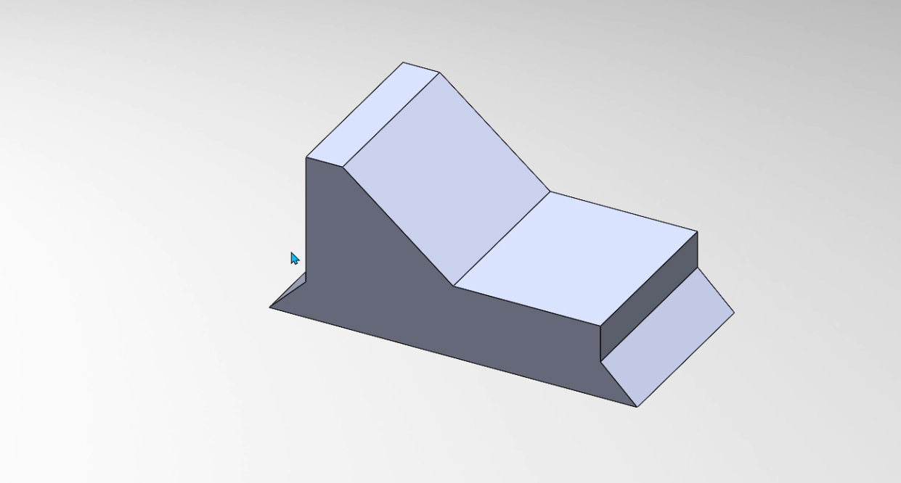

Ensuite nous nous placerons dans notre plan frontal puis, nous ferons un petit triangle rectangle de sorte à ce que l’hypoténuse soit confondue à la pente descendante (du haut vers le bas) comme sur la figure ci-dessous. Après avoir sélectionné le triangle construit, nous irons dans les fonctions puis nous ferons le choix de la fonction permettant de faire un enlèvement de matière. Nous-y spécifierons la longueur de notre enlèvement de matière (30mm dans notre cas) puis nous y ajouterons un petit décalage de 10mm vers l’intérieur.

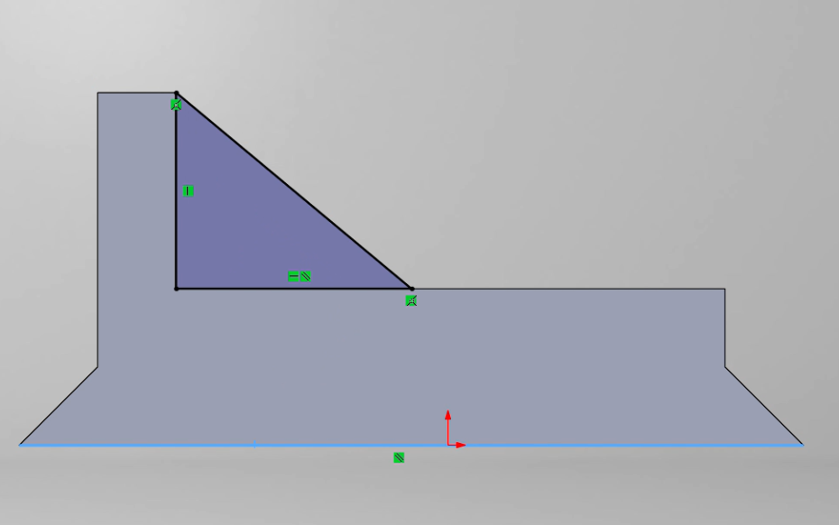

Après avoir sélectionné le triangle construit, nous irons dans les fonctions puis nous ferons le choix de la fonction permettant de faire un enlèvement de matière. Nous-y spécifierons la longueur de notre enlèvement de matière (30mm dans notre cas) puis nous y ajouterons un petit décalage de 10mm vers l’intérieur (l'axe Y).

Par la suite, on retourne dans une esquisse puis on réalise à nouveau dans le même plan un triangle supérieur complémentaire à l’autre triangle de façon à ce que le tout forme un parallélogramme puis, à ce nouveau triangle, on donne du volume avec la fonction Bossage/Base Extrudé. Comme paramètres, nous donnerons à cette fonction 10mm de longueur et un décalage de 40mm dans la direction de l’axe y.
On obtient ainsi ce qui suit.

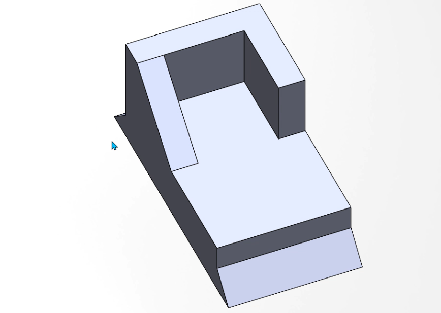

A présent, nous allons nous placer dans le plan de base de notre solide puis, nous allons dans notre esquisse choisir dans l’option ligne, les lignes centrales, puis, nous allons construire un axe central perpendiculaire et passant par le milieu de la largeur de la base de notre figure de telle sorte qu’elle ait 35mm de longueur. On vient ensuite donc de déterminer le centre de notre cercle. Maintenant, nous allons réaliser deux cercles centrés en ce même point de sorte qu’ils aient des diamètres de 24mm et de 30mm chacun.

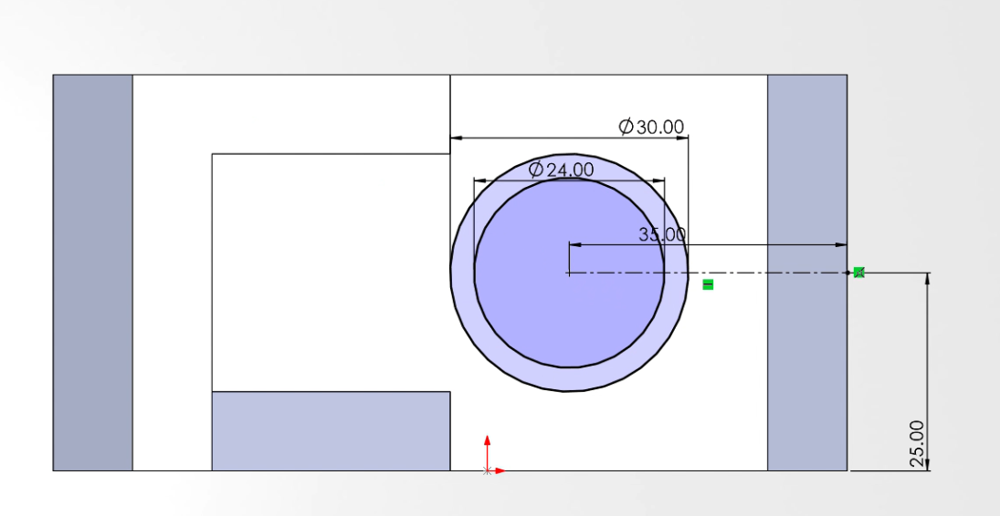

On se sert à nouveau de la fonction Bossage/Base Extrudé pour donner un volume de 5mm à l’espace contenu entre les deux cercles.

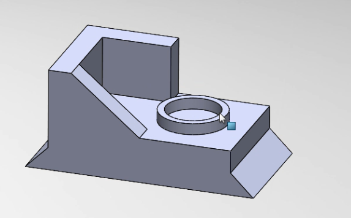

On retourne par la suite dans notre esquisse puis on choisit dans le menu l’option Congé pour effectuer un filetage d’un rayon de 2mm sur la bordure inférieure du cercle précédemment.

On vient ainsi donc de terminer notre solide, pour se conformer aux exigences, nous allons nous rendre dans l'arbre de conception (FeatureManager). Ensuite, après avoir repéré l'option Matériau en haut de la liste, à l’aide d’un clic droit sur Matériau, on sélectionne Modifier le matériau.
On parcourt ensuite la liste des matériaux en prenant garde de choisir comme matériau l’Alliage 1060 de l’Aluminium avec une densité de 0.0027 g/mm^3.

Puis on détermine la masse de l'objet.

## III. L’assemblage

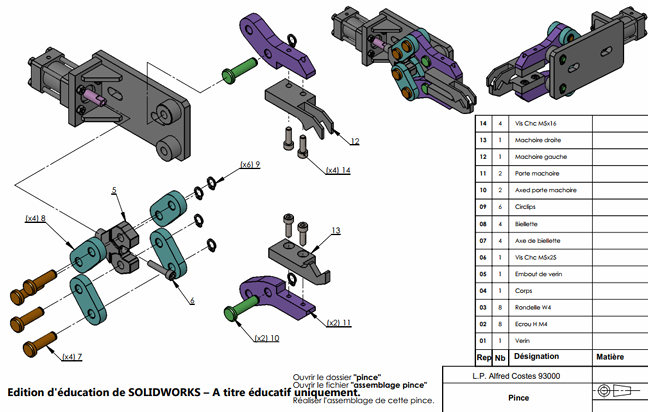

Description de l’assemblage 
L’assemblage réalisé ici se repose sur les différents types de contraintes à appliquer entre les différents composants devant être en relation. Dans notre cadre, on distingue principalement deux catégories de contraintes :
- Les contraintes entre vis et composants
- Les contraintes entre composants

1.	Les contraintes entre vis et Composants
Pour visser une vis à une pièce, il suffira d’appliquer dans un premier temps une contrainte de coaxialité entre le corps cylindrique et le trou devant accueillir la vis, puis une contrainte de coïncidence entre la face inférieure de la tête de la vis et la face du composant entourant le trou.

<!-- <video width="640" height="360" controls>
  <source src="assets/test-one/video 1.1.mp4" type="video/mp4"/>
  Ton navigateur ne supporte pas la balise vidéo.
</video> -->

2.	Les contraintes entre composants
Ces contraintes sont appliquées entre des composants qui doivent être vissés ensemble. Pour le faire, nous avons juste appliqué une contrainte de coïncidence entre les faces devant se coller puis des contraintes de coaxialité entre les trous des composants devant être alignés :

<!-- <video width="640" height="360" controls>
  <source src="assets/test-one/video 1.2.mp4" type="video/mp4"/>
  Ton navigateur ne supporte pas la balise vidéo.
</video> -->

Ces deux types de contraintes ont été répétés encore et encore entre les différents composants à contraindre afin d’obtenir l’assemblage donné.

## IV.	Le résultat 
La conception des pièces ainsi que l’assemblage s’étant déroulé sans encombre, nous avons ensuite procédé à la détermination de la masse des pièces modélisées ainsi que la détermination du centre de gravité de l’assemblage. 

:::info
Les résultats se présentent comme suit : 
  
  - __<ins>Pièce 1 :</ins>__ Masse = 3020.54 grammes  
  - __<ins>Pièce 2 :</ins>__ Masse = 290.80 grammes  
  - __<ins>Pièce 3 :</ins>__ Masse = 1633.25 grammes  
  - __<ins>Pièce 4 :</ins>__ Masse = 297.29 grammes  

__<ins>Assemblage :</ins>__
-	Vérin en position minimale Centre de gravité :  
           X = -25.78
           Y = 0.06
           Z = 19.81
-	Vérin en position maximale 
X = -45.29
Y = 0.00 
Z = 24.50
:::

## V. Démonstration de l’assemblage
Pour illustrer le résultat de notre assemblage, nous avons réalisé une vidéo de démonstration. Cette vidéo montre l'assemblage complet ainsi que le fonctionnement des pièces modélisées.

<iframe title="vimeo-player" src="https://player.vimeo.com/video/1093001036?h=e86efbfe9d" width="640" height="360" frameborder="0"    allowfullscreen>
</iframe>

## VI. Le Bilan 
Ce test nous a permis notamment de
-	Renforcer nos compétences en conception assistée par ordinateur 
-	Nous familiariser avec de nouvelles fonctions (tels que la détermination des masses, du centre de gravité ainsi que la sélection des matériaux) indispensables à une conception plus efficace
-	Compréhension plus approfondie du fonctionnement mécanique d’une pince de robot 

### Annexes 
Retrouvez ici les fichiers sources de la modélisation des pièces ainsi que de l'assemblage :
- [Lien de téléchargement](https://www.dropbox.com/scl/fi/i1576y5yejvsmfvep9jmf/test-01.zip?rlkey=v39jdvqwgtykg6nxs9rptnpsb&st=p4t0b20e&dl=0)

Nous pouvons retrouver ici les vidéos complètes de toutes les modélisations.

<!-- 
<video width="640" height="360" controls>
  <source src="assets/test-one/video_1.mp4" type="video/mp4"/>
  Ton navigateur ne supporte pas la balise vidéo.
</video>

<video width="640" height="360" controls>
  <source src="assets/test-one/video_2-1.mp4" type="video/mp4"/>
  Ton navigateur ne supporte pas la balise vidéo.
</video>

<video width="640" height="360" controls>
  <source src="assets/test-one/video_2-2.mp4" type="video/mp4"/>
  Ton navigateur ne supporte pas la balise vidéo.
</video>

<video width="640" height="360" controls>
  <source src="assets/test-one/video_3.mp4" type="video/mp4"/>
  Ton navigateur ne supporte pas la balise vidéo.
</video>

<video width="640" height="360" controls>
  <source src="assets/test-one/video_4.1.mp4" type="video/mp4"/>
  Ton navigateur ne supporte pas la balise vidéo.
</video>

<video width="640" height="360" controls>
  <source src="assets/test-one/video_4.2.mp4" type="video/mp4"/>
  Ton navigateur ne supporte pas la balise vidéo.
</video>

<video width="640" height="360" controls>
  <source src="assets/test-one/video_5-1.mp4" type="video/mp4"/>
  Ton navigateur ne supporte pas la balise vidéo.
</video>

<video width="640" height="360" controls>
  <source src="assets/test-one/video_5-2.mp4" type="video/mp4"/>
  Ton navigateur ne supporte pas la balise vidéo.
</video> -->
