# 🚀 Test 3 Mécanique TRC  2025 🦾

## 📌 Objectif 

Dans l'optique de  comprendre  la mécanique robotique au mieux, les test 1 et 2 nous ont permis d'aquérir les notions indispensables à la modélisation et à l'assemblage de pièces pour la robotique. Ce test , centré sur la modélisation d'une pièce un peu plus complexe en terme de géométrie et de paramètre, vise à faire usage des connaissances  acquises aux deux premiers test en matière de modélisation. Ladite pièce  du fait de sa structure  possède des applications très variées allant de la robotique aux systèmes plus avancés ce qui renforce l'utilité de ce test dans le cardre de notre concours. Découvrons ensemble les étapes de sa modélisation!

## 🛠️ Les Etapes de la modélisation

### 1. 🔩 La pièce à modéliser 
Comme nous l'avons mentionné précédemment, il s'agit d'une structure complexe explorant différentes fonctionnalitées de SolidWorks aussi bien basique que avancées... Ses caractéristiques sont les suivantes : 

  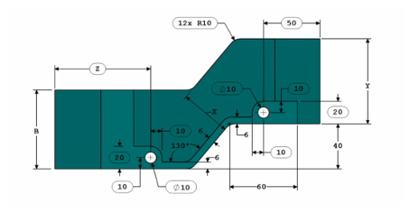
  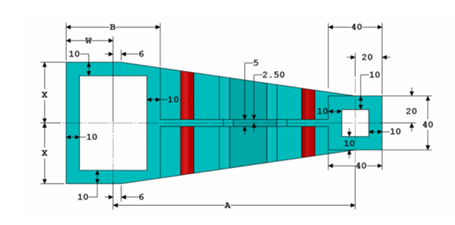

  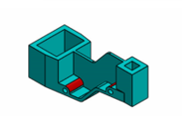

### 2. 📈 La définition des variables

Comme on pourrait le constater sur les images décrivant la pièce, la pièce à réaliser utilise  six (06) variables globales nommées respectivement : A, B, W, X, Y et Z. L'objectif est de déterminer la masse de la pièce pour différentes valeurs des paramètres. Ces différentes valeurs sont les suivantes : 

a. A = 193 mm ; B = 88 mm ; W = B/2 mm ; X = A/4 mm ; Y = B+5.5 mm ; Z = B+15mm ;
b. A = 205 mm ; B = 100mm ; W = B/2 mm ; X = A/4 mm ; Y = B+5.5 mm ; Z = B+15mm ;
c. A = 210 mm ; B = 105 mm ; W = B/2 mm ; X = A/4 mm ; Y = B+5.5 mm ; Z = B+15mm ;

Nous nous rendrons alors dans la rubrique Equation (dont l'utilisation a déjà été décrite lors du test précédent), afin de définir nos variables (suivant l'option a)

  
  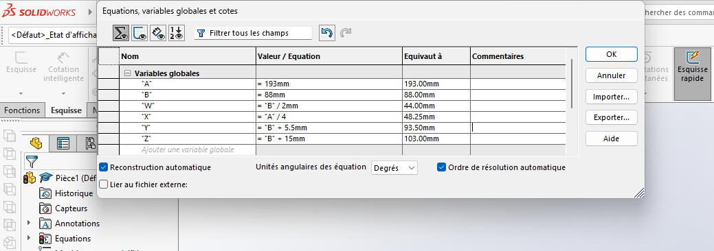

### 3. 🧊 L'objet de base

Avant tout il est important de bien analyser la géométrie de notre pièce afin de savoir par où on doit débuter la modélisation afin d'être plus rapide et efficace. Pour notre part, nous avons jugé bon de commencer par créer les deux motifs  principales de l'objet (En forme de pavé droit creux) ainsi que le lien droit qui existe entre eux sans nous préoccuper au prime abord des différences de niveau entre les deux motifs. L'esquisse dessinée pour avoir ces motifs est le suivant : 

  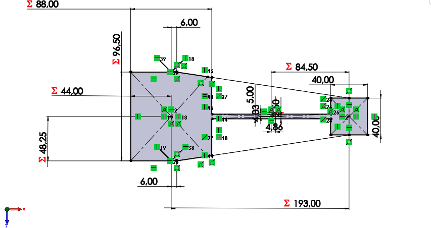

Les étapes de la réalisation de cette esquisse se résument comme suit : 

- Sélection du plan de face comme plan d'esquisse ;
- Construction d'un carré de côté 40mm centré en l'origine;
- Disposition d'un point sur l'horizontale distant de A mm de l'origine;
- Dessin d'une figure géométrique ayant la forme de gauche (Sans se préoccuper des côtations);
- Application des cotations comme indiquées dans l'image descriptif jusqu'a ce que toutes les lignes d'esquisse prenent une couleur noir : Signe que l'esquisse est entièrement côtée.

Suite à cette esquisse, nous utilisons la fonction Bossage/Base Extruder pour donner du volume à notre Esquisse. La distance fourni pour l'extrusion est la hauteur maximale de l'objet . Nous avons juger de prendre B+Y.
A la fin, On obtient le modèle suvant  :

  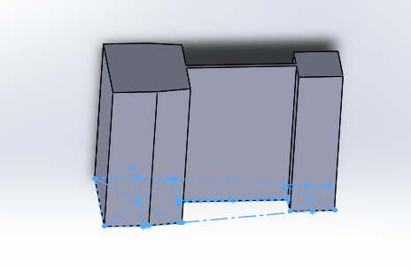

### 4. 🪚 Enlèvement de matière 1

Afin d'obtenir la forme correspondant au vue de profil de la pièce, nous allons procéder à un enlèvement de matière un peu particulier.
L'esquisse de base de l'enlèvement de matière est réalisé sur le plan de dessus et se présente comme suit : 

  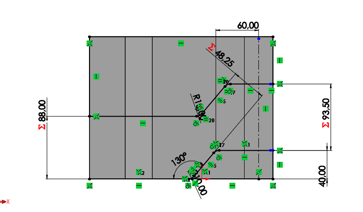

Cette esquisse fût réalisée suivant les étapes suivantes : 

- Tracé des lignes d'esquisse à l'aide de l'outil ligne.
- Application des contraintes d'angles de distances et de parallélisme jusqu'a ce que l'esquisse soit entièrement côtée;
- Tracé des lignes complémentaires afin de fermer les contours;  
- Application des congés (10mm de rayon);
  
La vidéo ci dessous illustre le processus de réalisation de l'esquisse.

<iframe title="vimeo-player" src="https://player.vimeo.com/video/1096325022" width="640" height="360" frameborder="0" allowfullscreen></iframe>

Suite à cela on obtient le résultat suivant : 

  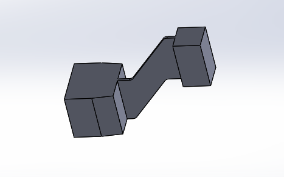

### 5. Enlèvement de matière 2

  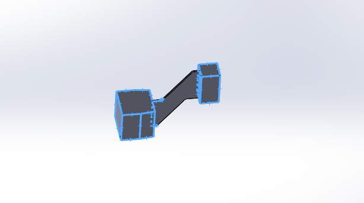

Cet enlèvement de matière est effectué afin de rendre creux les deux motifs sélectionnés ci-dessus  conformément à la description. Pour le faire, nous avons dans un premier temps sélectionner le plan de face comme plan de base de notre esquisse, puis dessiné les contours de notre enlèvement de matière dans un second temps.
Ce dessin s'est effectué de la manière suivante :

- Convertion d'entitées 
L'outil convertir les entités permet de projeter la géométrie de la pièce modélisé dans un plan spécifique . On le retrouve au niveau du panneau en haut après le choix d'une esquisse : 

  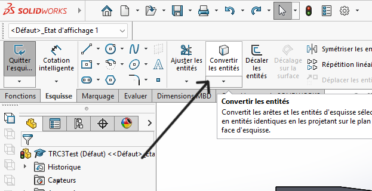

Les entités convertit dans notre cas se présentent comme suit :

  

- Décalage d'entités
On décale ensuite les entités précédemment obtenues(L'outil décalage se trouvant juste à coté de l'outil convertir) afin d'avoir le contour d'enlèvement de matière souhaité.

  

On effectue ainsi l'enlèvement de matière souhaiyé et on obtient ce qui suit : 

  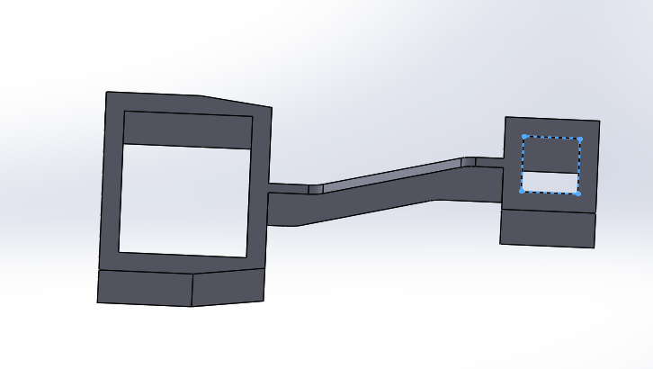

### 6. Forme d'escalier entre les deux bases
L'objectif ici est d'obtenir la forme encerclée ci-dessous: 

  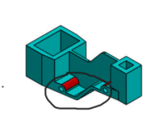

Pour le faire nous allons créer une esquisse sur le plan de dessus conformément aux différentes cotation fournies pour cet motif. L'esquisse est le suivant :

  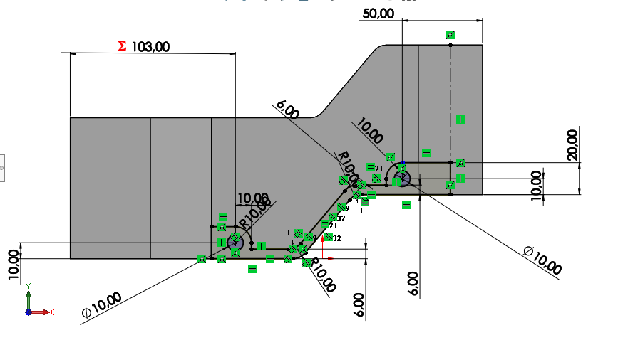

Le processus de réalisation de cette esquisse est résumé dans la vidéo ci - après : 
<iframe src="https://vimeo.com/1096327143" width="640" height="360" frameborder="0" allowfullscreen></iframe>

Suite à cette esquisse, nous avons procédé à une extrusion symétrique de l'esquisse jusqu'aux faces obliques obtenus lors de notre premiere extrusion. On obtient le résultat suivant : 

  

### 7. Surplus de matiere à enlever

  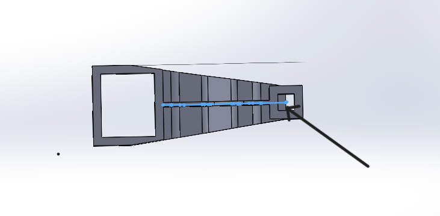

L'extrusion précédemment réalisé e engendré un surplus de matière (décrit ci-dessus) à l'objet. Et donc pour régler ça, nous allons convertir le contour du petit rectangle dans le plan de face et faire un enlèvement de matière : 

  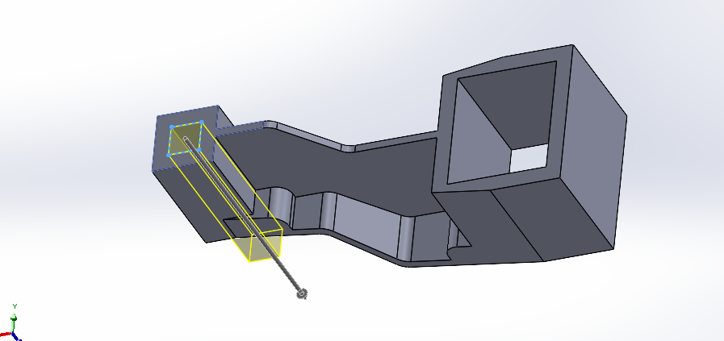

### 8. ⚙️ Perçage 

Afin de réaliser les deux perçages circulaires visibles sur l'objet, nous allons- dans l'arbre feature manager- faire apparaîtrel'esquisse précédente puis faire un enlèvement de matiere suivant les deux cercles construit sur cette esquisse : 

  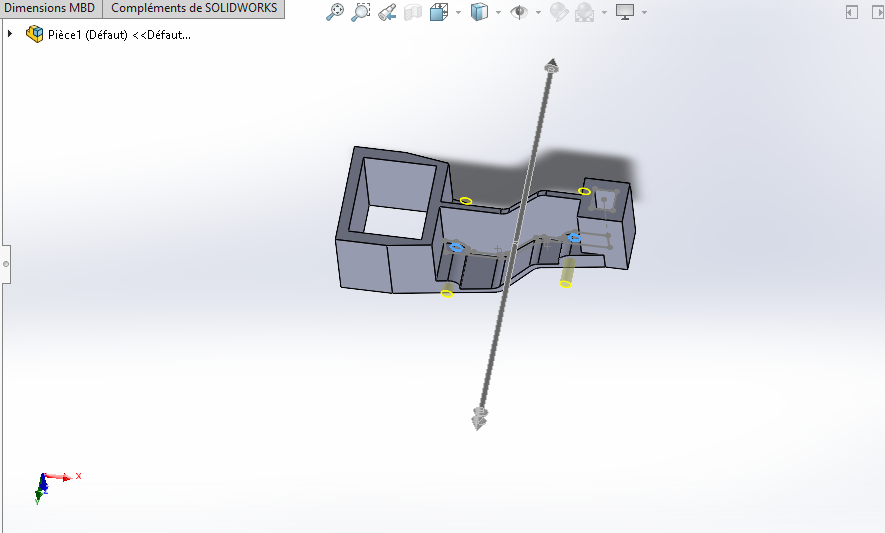

On obtient le résultat suivant : 

  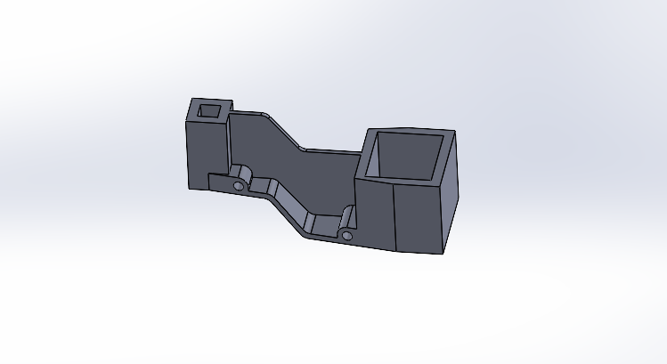

### 9. 🔩 Sélection du matériau de l'objet 

Le matériaux recommandé pour cette pièce est l'alliage d'aluminium Alloy 1060 ayant une densité de 2700kg/m^3. Pour appliquer ce matériau à l'objet, on fait un clique droit sur la pièce dans l'arbre feature manager , on sélectionne l'option matériau puis on cherche la matériau parmis ceux disponible . 

  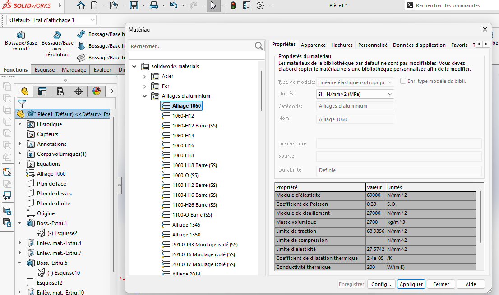

### 10. 🌈 Application des couleurs 

La couleur par défaut de SolidWorks étant le gris, afin de respecter la couleur de la pièce proposée, une modification des couleurs des faces sera effectuée conformément à la documentation. 
La couleur de base de la pièce est le vert sombre . Mais quatres faces ont une couleur rouge . Ainsi, dans un premier temps, nous allons appliquer une couleur vert sombre à la pièce entière puis nous allons sélectionner les faces devant être en rouge et appliquer la couleur.

Pour appliquer une couleur donnée à la pièce , comme dans les précédents tests, nous ferrons un clique droit sur la pièce puis dans apparence (icone en forme de sphère colorée) nous sélections la couleur correspondante. De même, Pour modifier la couleur d'une face, il suffit de faire un clique droit sur cette face, puis dans apparence  on sélectionne une couleur pour la face (Ici , nous sélectionnons quatre faces en même temps en maintenant la touche contrôle). 

  
  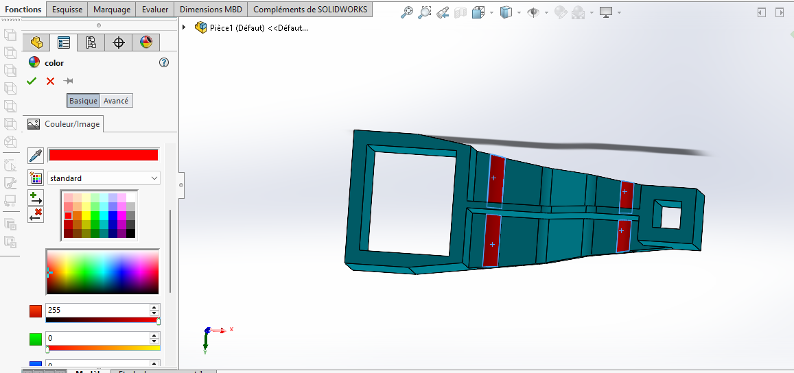

### 11. ⚖️ Détermination de masses

La pièce étant obtenu pour les premières valeurs, nous allons ensuite déterminer sa masse et faire de même en changeant les valeurs des paramètres conformément à la documentation.
Pour rappel, la masse de la pièce est accessible via l'option Evaluer/Propriété de masse .

 1. A = 193 mm ; B = 88 mm ; W = B/2 mm ; X = A/4 mm ; Y = B+5.5 mm ; Z = B+15mm ;
 On obtient une masse égale à 1400.64grammes

 

  

2. A = 205 mm ; B = 100mm ; W = B/2 mm ; X = A/4 mm ; Y = B+5.5 mm ; Z = B+15mm ;
On obtient comme masse ici, 1651.40grammes

  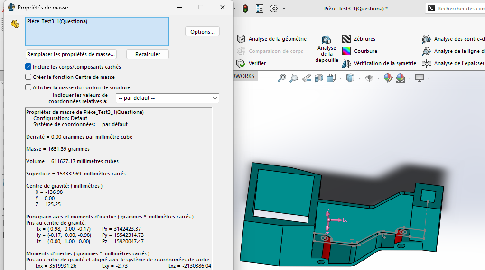

3. A = 210 mm ; B = 105 mm ; W = B/2 mm ; X = A/4 mm ; Y = B+5.5 mm ; Z = B+15mm ;

On obtient comme masse : 1760.41 grammes

  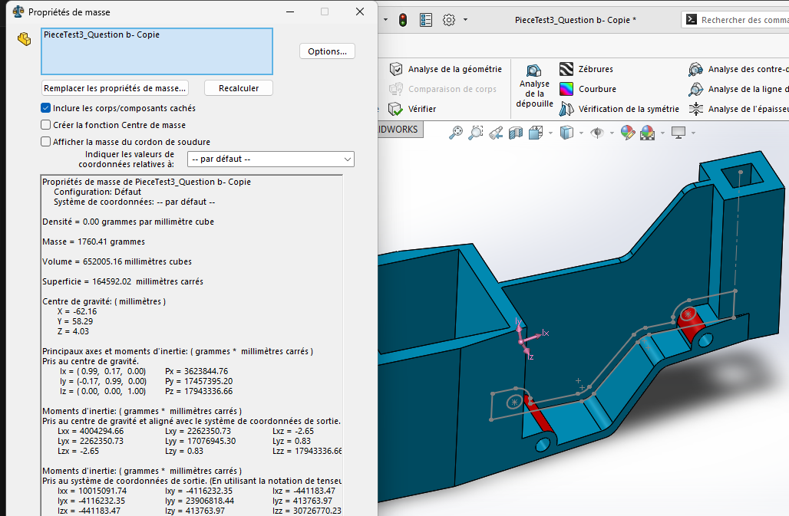

## ⛔ Quelques obstacles 
Si il y a bien une fenêtre de solidWorks contre laquelle on s'est battu durant toute la modélisation c'est bien celle la : 

  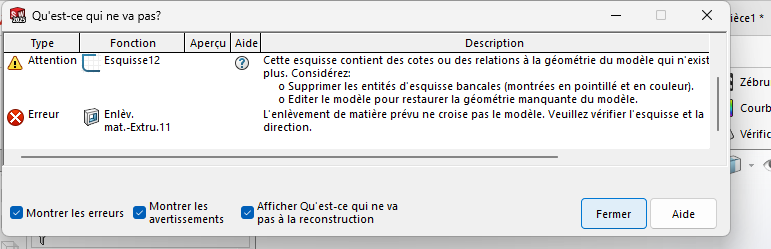

Et oui.... La fenêtre d'erreur. (Et elle est assez chiante 🤦🏾‍♂️)

En fait, Le principal défis de cette modélisation résidais dans l'application de toutes les contraintes et cotations afin d'aboutir chaque fois à des esquisses totalement contraintes. Nous avions négligé entre temps quelques contraintes d'horizontalité, de distance et de coincidence entre certaines entités surtout au niveau de la première esquisse et nous en avons vraiment souffert ...surtout lors de la modification des valeurs des variables. 

### 1. Insuffisance de contraintes au niveau de la première esquisse.
Sur une esquisse paramétrée comme ça a été le cas ici , les contraintes sont très importantes voire indispensables si on veut maintenir la géométrie du modèle après modification des paramètres.

  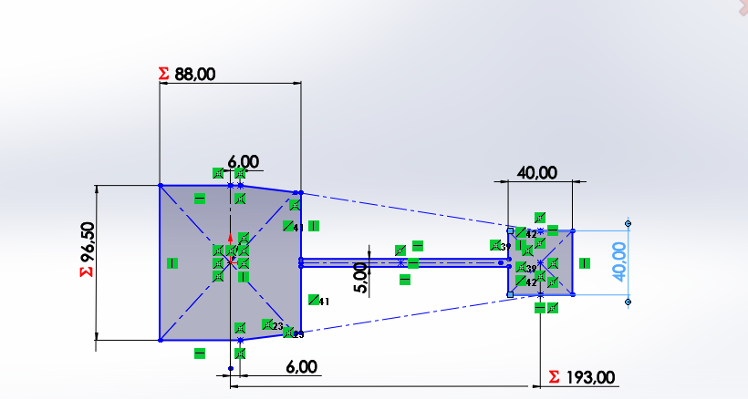

A première vu, on pourrait penser que cette esquisse est totalement contrainte mais en fait non. Les contraintes manquantes sont entre autres :

- Contraintes d'alignements horizontales entre les paires de points de part et d'autre du centre au niveau du motif de gauche
- Contrainte de coincidence respectives entre les points situés aux extrémités obliques du motif de gauche et les deux grandes lignes obliques( Contrairement à ce qu'on pourrait imaginer, ces contraintes ne sont pas systématiques)
- Contrainte de longueur (W) entre les points alignés verticalement avec le centre (du motif de gauche) et la ligne extrême gauche. 
  
Le non respect de ces contraintes a entraîné entre autre les erreurs suivants  l'un lors de la modification des variables.

  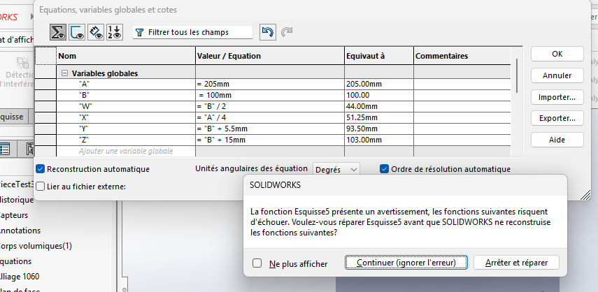

 

  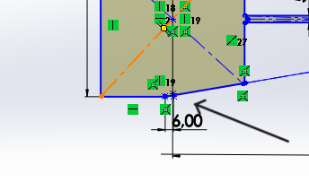

 

  

 
Et à chaque en fait qu'on essaie de corriger ces erreurs, la pièce entière se corrompt... étant donné que d'autres géométries s'étaient entre temps basées sur ces erreurs.

  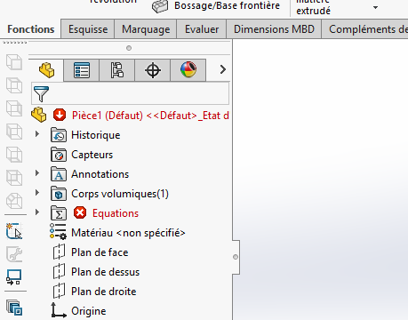

Après application des contraintes, on obtient l'esquisse suivant (Les valeurs sont elles de la question b) : 

  

### 2. Contours non fermés pour extrusion 

Les extrusions et enlèvements de matières ne se font que sur la base de contours fermés. Ce détails nous a malheureusement échapé entre temps... Et on en a fait les frais. Notre Pièce est bien jolie à la fin mais il a fallu reprendre certaines esquisse plusieurs fois avant de faire des extrusions ou des enlèvements de matières ...

  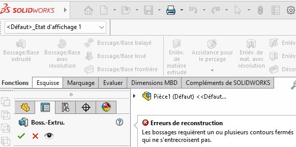

## 3. Conflit de masse 
Il faut dire que cette pièce a été réalisée à plusieurs reprises par les membres de la Team mécanique. Mais les masses ne concordaient pas. Après plusieurs analyses le problème fût révélé et il s'agissait d'une cotation mal paramétré. En fait il existe deux manière de paramétrer une côte. On prend l'exemple d'une variable notée A. On peut: 

- Sélectionner variable globale au niveau de la côte et choisir A
- Mettre ="A" au niveau de la valeur de la côte
  
Dans le 1er cas, la côte est constante et égale à la valeur actuelle de la variable et dans le second cas la côte est réellement paramétrée et changera au fur et à mesure qu'on modifie la valeur de la variable. Et bien évidemment c'est la 2e manière qui est juste. Dans notre cas , l'erreur se faisais au niveau de la variable B. Cette erreur fût ensuite corrigée et les masses se sont accordées.

## ⚡ Résultats 

Avec des recherches un peu plus avancées (et un peu de chance aussi) nous avons pu corriger les erreurs survenus lors de la modélisation et obtenu des résultats . Ces derniers se résument dans le tableau suivant : 

Valeurs des variables | Masse 
--------------------- | -----
A = 193 mm ; B = 88 mm ; W = B/2 mm ; X = A/4 mm ; Y = B+5.5 mm ; Z = B+15mm ;| 1400.64grammes
A = 205 mm ; B = 100mm ; W = B/2 mm ; X = A/4 mm ; Y = B+5.5 mm ; Z = B+15mm  | 1651.39 grammes
A = 210 mm ; B = 105 mm ; W = B/2 mm ; X = A/4 mm ; Y = B+5.5 mm ; Z = B+15mm | 1760.41 grammes

## ✅ Bilan global 

La modélisation de cette pièce à géométrie un peu complexe et dont l'utilité couvre bon nombre de domaines en dehors de la robotique était l'occasion pour nous d'appliquer les connaissances acquises lors des tests précédents en ce qui concerne la modélisation 3d. Par ailleurs, ce test nous a apporté une compétence cruciale en modélisation auquel on ne s'y attendais pas vraiment : La gestion des erreurs . En effet, La fréquence des erreurs au cours de cette modélisation nous a permis d'apprendre à comprendre les erreurs de modélisation et à les corriger afin d'aboutir à une modélisation plus ou moins correcte. 

### 🔗Annexes 
Vidéo complete de la modélisation(Telle que décrite ci _ dessus) : 
<iframe title="vimeo-player" src="https://player.vimeo.com/video/1097084914?h=ec37c4394a" width="640" height="360" frameborder="0"    allowfullscreen></iframe>

- Version modifiée avec correction des erreurs et détermination des masses 👇🏽
<iframe title="vimeo-player" src="https://player.vimeo.com/video/1097085046?h=ec37c4394a" width="640" height="360" frameborder="0"    allowfullscreen></iframe>
Pièces modélisées  : 

Retrouvez ici les fichiers sources de la modélisation des pièces ainsi que de l'assemblage :
- [Lien de téléchargement](https://www.dropbox.com/scl/fi/iuxtsnpca8n7j9621pn23/test-03.zip?rlkey=ddhqe5yqja6l5aweeoymzot13&st=zx1ykn8w&dl=0)

  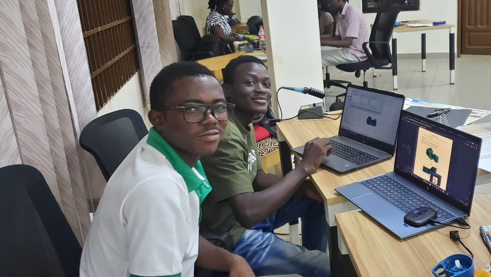

  That was us 😌 
  Peace✌🏾️

