# Test 2 Mécanique TRC 🤖 2025

## 📌 Objectifs

Toujours dans le cadre de la conception d'un bras robotique, ce test vise à mieux appréhender la mécanique d'un bras robotique en explorant des notions un peu plus avancées de la conception 3D notemment la modélisation paramétrique puis l'assemblage paramétrique de pièces un peu plus complexes.. De façon analogue au 1er test, on distinguera deux grandes parties : l'un destiné à la modélisation et l'autre à l'assemblage.

## 🧰 Le processus de réalisation

## ⚙️ La Conception

L'objectif principale de cette partie est d'explorer la modélisation paramétrique avec SolidWorks afin d'examiner les différentes géométries possibles de notre robot.

A proprement parler, la modélisation paramétrique est une approche qui consiste à créer des objets en utilisant des paramètres (dimensions, contraintes, relationsgéométriques) que l'on peut modifier à tout moment pou mettre à jour automatiquement la géométrie du modèle.
Ici, la pièce que nous devons modéliser dispose de trois paramètres qui sont des distances : A, B et C. L'objectif sera d'analyser la masse de la pièce obtenu pour chaque combinaison de valeurs proposées pour ces paramètres dans un premier temps, puis de modifier la pièce obtenu suivant les indications afin d'aboutir à une pièce un peu plis complexe.

Ici se présente la pièce primaire ainsi que ses paramètres :

L'objectif est de créer un modèle 3D paramétrique des différentes pièces, à concevoir dans le cadre du test2 du challenge Teckbot, d'assigner les propriétés de matériau correctes pour atteindre une masse cible, et d'appliquer l'apparence finale.

## 🧊 PIÈCE_1 (a)

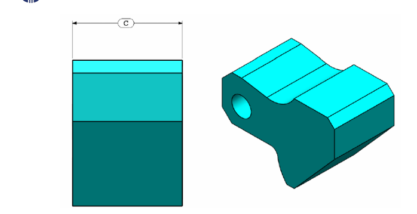

Avant de commencer la modélisation, il est nécessaire de définir les variables globales suivantes pour piloter la géométrie de la pièce. Celles-ci sont accessibles via Outils > Équations.

 <ul style="margin: 3vw; list-style-type: none;">

<li>"A" = 81</li>
<li>"B" = 57</li>
<li>"C" = 43</li>
 </ul>
  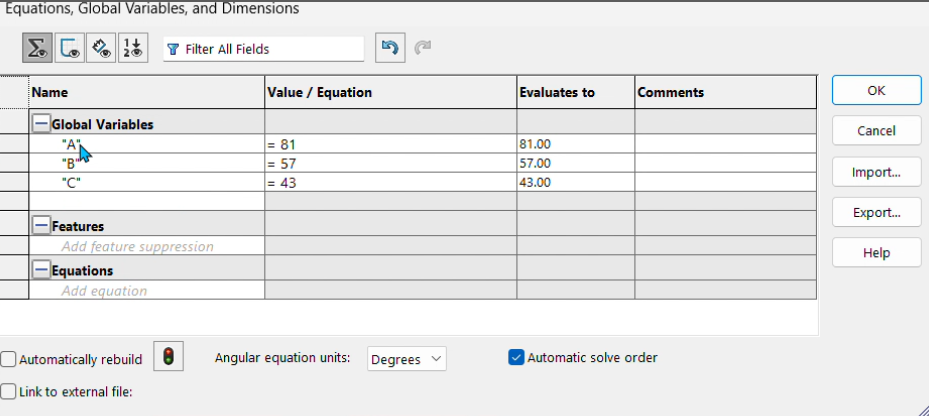
 

Ces variables rendront la conception plus facile à modifier. La variable "A" sera utilisée pour la largeur totale et la variable "C" pour l'épaisseur de la pièce.

### 1. 📐 Procédure de Modélisation

Dans un premier temps, on crée une nouvelle esquisse ✏️ (Sketch) en sélectionnant le Plan de Face (Front Plane).

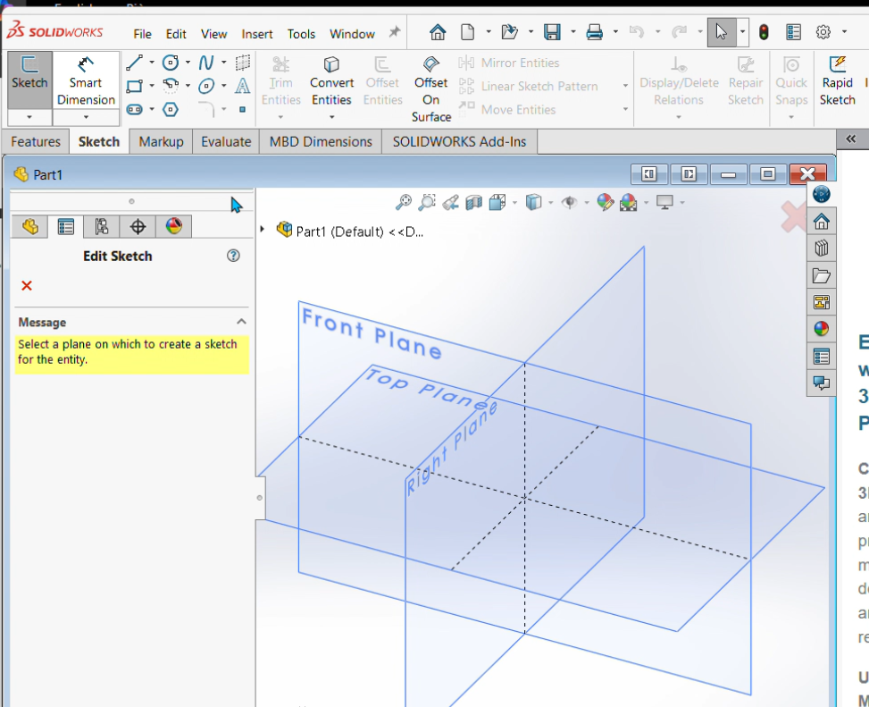

On dessine ensuite le contour de la pièce. Pour ce faire, nous allons utiliser des lignes de construction

 

pour la réalisation d'un rectangle,
 
 
  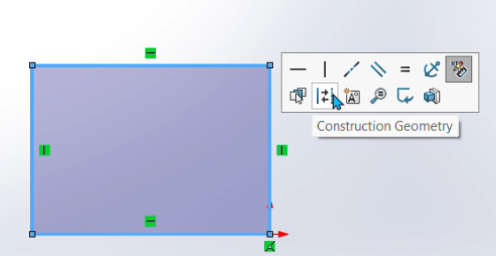
 

les cercles et l'option congé dans notre esquisse en y joutant les cotations pour positionner les éléments principaux.

 <ul style="margin-right: 3vw; list-style-type: none;">

 </ul>
  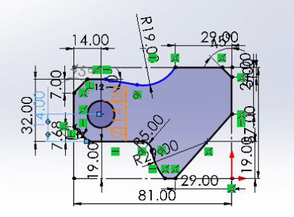
 

Une fois l'esquisse entièrement terminée, on quitte le mode esquisse, ensuite on sélectionne la fonction Bossage/Base extrudé (Extruded Boss/Base) pour donner du volume à notre esquisse.

Pour la profondeur de l'extrusion, on lie la valeur de "C=43mm".
La forme 3D de base de la pièce est maintenant créée.

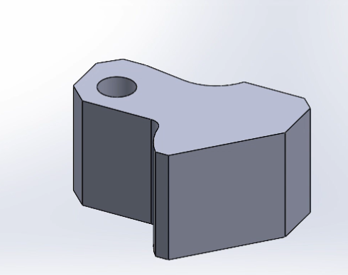

Pour que la pièce respecte les propriétés de masse requises, nous allons appliquer une densité personnalisée. Pour ce faire, on se rend dans l'arbre de création FeatureManager, ensuite à l'aide d'un clic droit sur Matériau et sélectionnez Éditer le matériau.
Dans la bibliothèque SOLIDWORKS Materials > Steel, on choisit donc acier un <b><em>acier AISI 1020</em></b> de densité : <b><em>0,0079 g/mm^3</em></b>.

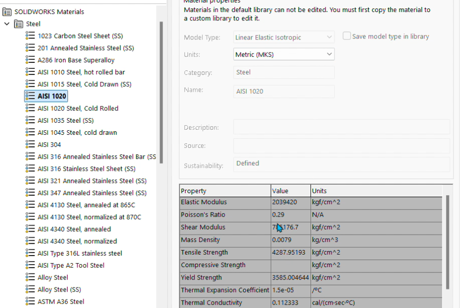

Pour correspondre à l'apparence finale du produit, on clique sur Éditer l'apparence (Edit Appearance) dans la barre d'outils. Puis dans la section couleur, on sélectionne une couleur cyan / turquoise similaire à celle de l'image de référence.

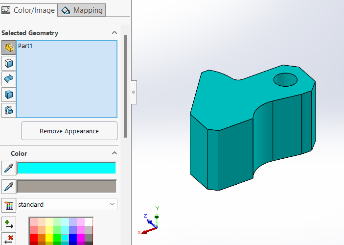

La masse de notre pièce nous est fournie dans l'outil Propriétés de masse (Mass Properties).
On obtient en fin de conception une masse de 939.54 g

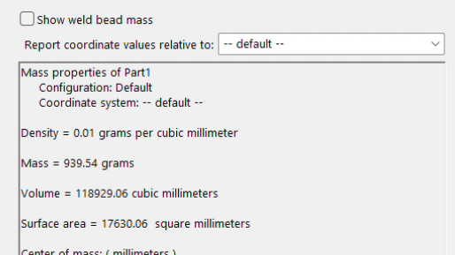

## 🧊PIÈCE1 (b)

La conception de cette deuxième pièce(b) réside en une simple modification (variables globales) de l'esquisse la pièce(a) précédemment construite.

 <ul style="margin: 3vw; list-style-type: none;">

<li> </li>
 </ul>
  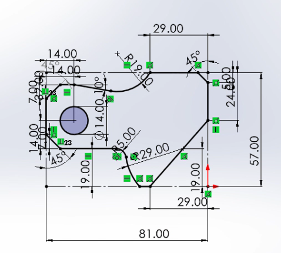
 

Pour ce faire nous allons retourner dans l'esquisse de la pièce modélisée précédemment et effectuer les modifications adéquates.

 <ul style="margin-right: 3vw; list-style-type: none;">
  <li>"A" = 84</li>
  <li>"B" = 59</li>
  <li>"C" = 45</li>
 </ul>
  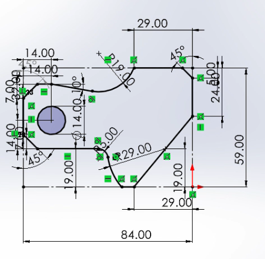
 

Après avoir enregistré les modifications effectués, on obtient comme masse :

 
 1032.32 g 

  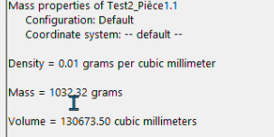
 

 

  Pièce (a) finale
 

  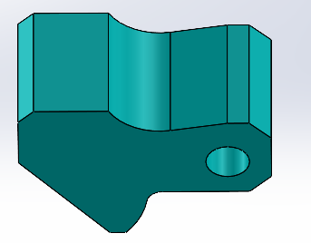
 

## 🧊 PIÈCE 2.0

La conception de cette troisième se base sur la pièce 1.0 construite. Nous allons donc commencer cette nouvelle modélisation sur la base delà pièce modélisée précédemment.

Dans un premier temps, il s'agira de modifier les variables globales de référence (v1.0) comme suit :

  

 <ul style="margin-right: 3vw; list-style-type: none;">
  <li>"A" = 86</li>
  <li>"B" = 58</li>
  <li>"C" = 44</li>
 </ul>
  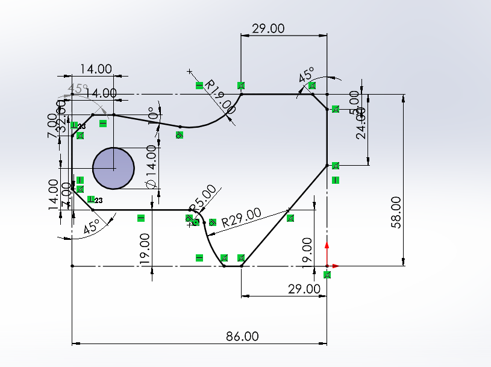
 

Ensuite, après avoir appliqué les modifications à notre pièce, nous allons sélectionner la face plane supérieure de la pièce, puis nous allons créer une nouvelle esquisse (Sketch) sur cette face. Cette nouvelle esquisse consistera en la création de deux barres :

 

 L'une verticale et l'autre horizontale puis d'un cercle de diamètre 14mm au niveau du coin supérieur le centre étant de 14.00 mm de chaque côté, nous allons ensuite effectuer une conversion d'entité autours des constructions précédentes afin d' avoir une surface :

 

  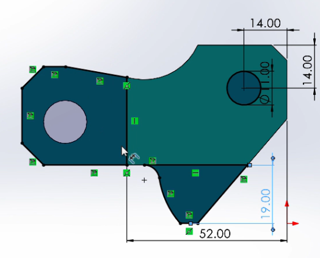
 

Une fois sortie de l'esquisse, nous allons faire un enlèvement de matière au niveau des surfaces conçues avec une profondeur de 19mm

 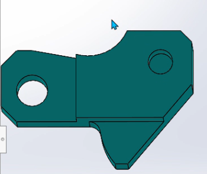

A ce stade le trou circulaire effectué n'est pas encore débouchant. Pour ce faire, nous allons à nouveau créer au niveau de la face supérieure, un cercle identique à l'ancien et suivant lequel nous allons effectuer un enlèvement de matière à travers toute la surface.

 

 On obtient donc ce qui suit.

  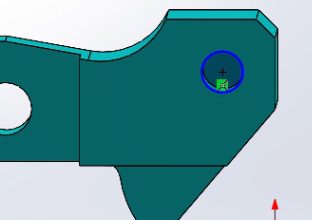
 

  
A présent, passons à la création de la poche supérieure au niveau de la pièce. Ainsi, dans un premier temps, nous allons rester sur la même face que précédemment puis nous allons réaliser une nouvelle esquisse.

 
Celle d'un arc de cercle de rayon 41mm. On
 réalise ensuite une conversion d'entité pour obtenir aux voisinage de la section une surface 
 

  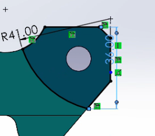
 

La dernière étape de notre conception consiste à effectuer un enlèvement de matière de 24mm au niveau la surface concernée avec un plan de décalage de 8mm.

 

Vue de la pièce finale 
 

  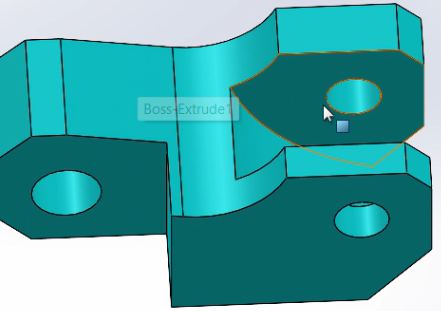
 

Tout comme dans le cadre de le pièce 1, on se dirige dans l'onglet

 

  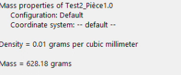
 

 Propriété de Masse pour avoir la masse finale qui est de: <b> 628.18g </b>
 

 

## Modélisation de la pièce 2.0

<iframe title="vimeo-player" src="https://player.vimeo.com/video/1095096488" width="640" height="360" frameborder="0"    allowfullscreen></iframe>

## 🧊PIÈCE 3.0

Concernant cette dernière pièce à modéliser, nous allons tout comme la précédente nous inspirer d'une autre. Cependant, nous allons nous inspirer par contre de la précédente.
Il s'agira donc à cette étape d'effectuer un certain nombre de modification sur la pièce 2.0.

 

 Nous commencerons donc dans un premier temps par
 retourner la pièce et sélectionner sa face plane latérale inférieure.
 

  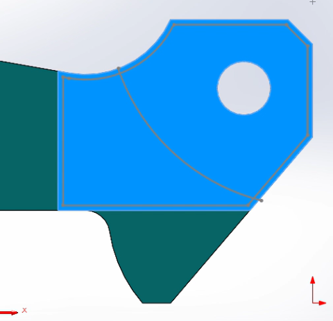
 

  
Ensuite, on utilise la fonction Décaler les entités (Offset Entities) sur le contour sélectionné, en spécifiant une direction vers l'intérieur. On fait de même pour la ligne interne extérieur.

 

  La distance de décalage étant de 1mm.
 

  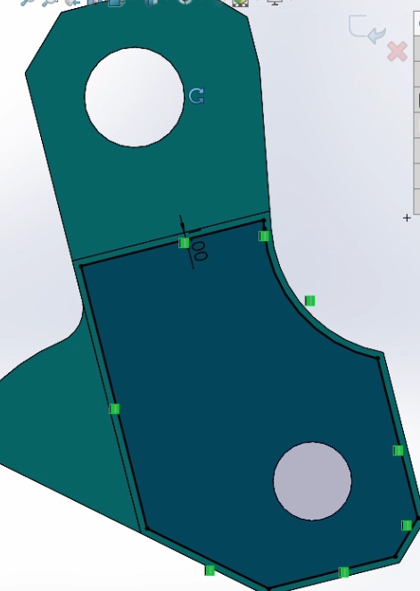
 

A présent, nous allons procéder à une conversion d'entité et des sections dans le but d'Obtenir deux différentes surfaces:

    <figure style="text-align: center;">
        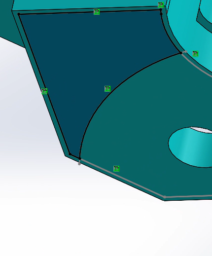
        <figcaption> Image A </figcaption>
    </figure>
    <figure style="text-align: center;">
        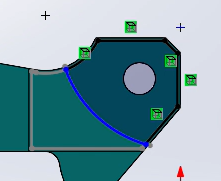
        <figcaption> Image B </figcaption>
    </figure>

Suite à cela, nous allons effectuer un enlèvement de matière de la surface sur l'Image A avec 12mm de décalage avec la face latérale opposée. De même nous allons effectuer un enlèvement de matière de la surface de l'image B avec 1mm de décalage avec la face latérale directement opposée.

::: info

  On obtient donc la pièce suivante avec une masse de <b>432,58 g </b>
  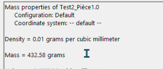
 

 :::
  
 

## Modélisation de la pièce 3

<iframe title="vimeo-player" src="https://player.vimeo.com/video/1095107889" width="640" height="360" frameborder="0"    allowfullscreen></iframe>

## Video complete des modélisations

<iframe title="vimeo-player" src="https://player.vimeo.com/video/1094677858?h=bf417bc379" width="640" height="360" frameborder="0"    allowfullscreen></iframe>

<iframe title="vimeo-player" src="https://player.vimeo.com/video/1094677836?h=7dd3e87bc5" width="640" height="360" frameborder="0"    allowfullscreen></iframe>

## 🧩 L'Assemblage

L'objectif ici est d'assembler des pièces élémentaires afin d'aboutir à un squelette de bras robotique formé de maillons ayant 5 degrés de libertés et trois paramètres géométriques angulaires nommées A,B et C.(Comme précédemment).

## 🛠️Pièces d'assemblages

Cet assemblage se compose de trois pièces que sont :

- Les maillons 🦿 (chain link): Il s'agit des éléments structurels de la chaîne: Ils servent à transmettre les les efforts de traction .Elles peuvent être intérieur (liés à deux autres maillons de part et d'autre) ou extérieur (lié aux axes long).

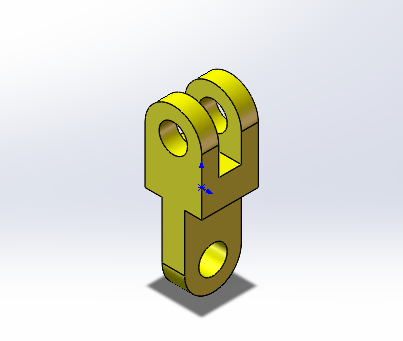

- Les axes long 🔩: Ils sont placés aux extrémités de la chaîne et peuvent servir de support pour la chaîne.

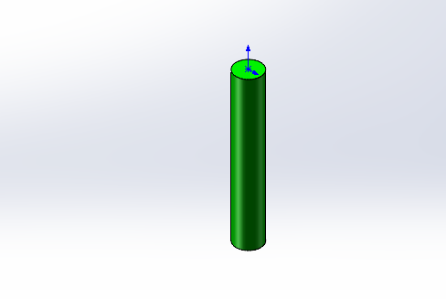

- Les petits axes 🧷 : Ce sont des petites pièces cylindriques placées entre deux maillons consécutifs afin de les maintenir ensemble.

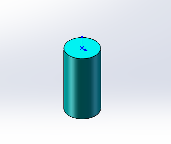

## 🔧 Différentes étapes de l'assemblage:

### - Insertion du support de la chaîne :

L'insertion se fait en appuyant sur l'outil insertion puis en sélectionnant la pièce à ajouter dans l'explorateur de fichiers.
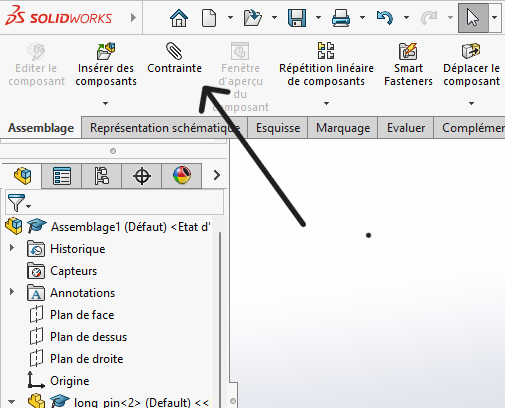

Comme on peut le remarquer sur l'assemblage le support de la chaîne doit être placé suivant l'axe Z et strictement en dessous de l'origine.
Pour ce faire, nous avons inserer la pièce puis appliqué des contraintes de coincidence entre les plans de face, de droite et de dessus de la pièces et ceux de l'assemblage. Pour le faire il suffit d'appuyer sur l'option contrainte , de sélectionner les deux plans à contraindre dans l'arbre feature manager puis de valider :

- Outil contrainte 📐

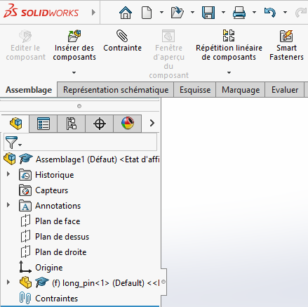

- Contrainte plan de face

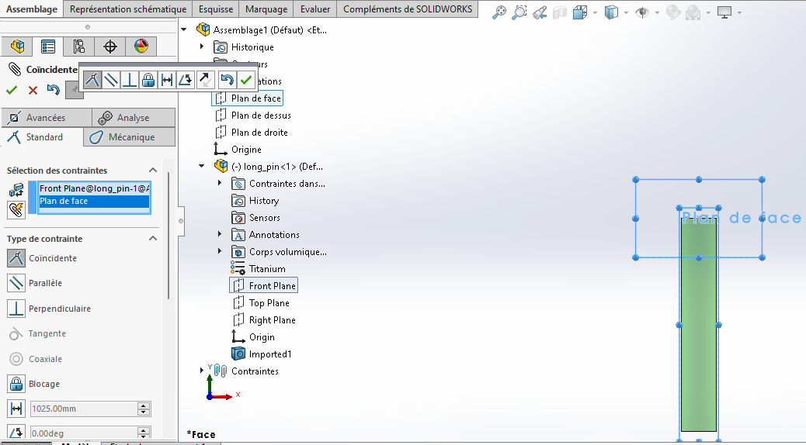

- Contrainte plan de droite

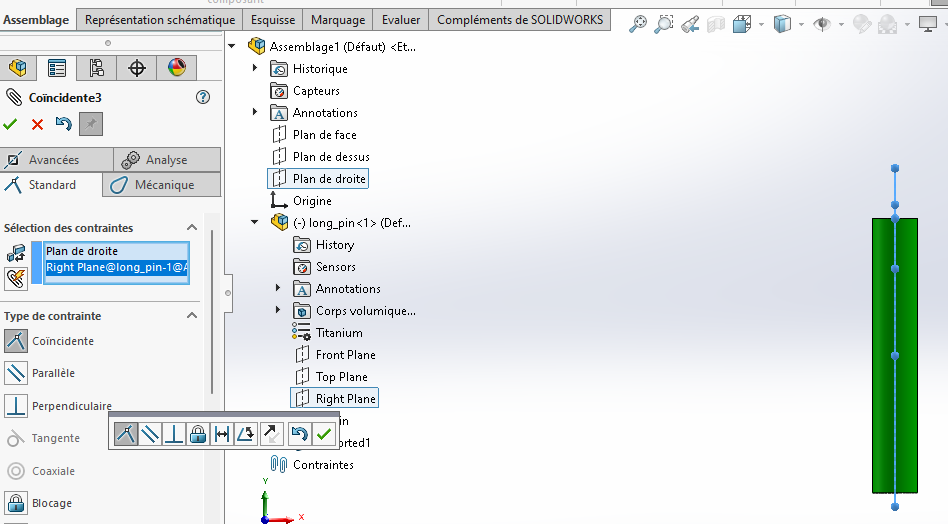

- Contrainte plan de dessous

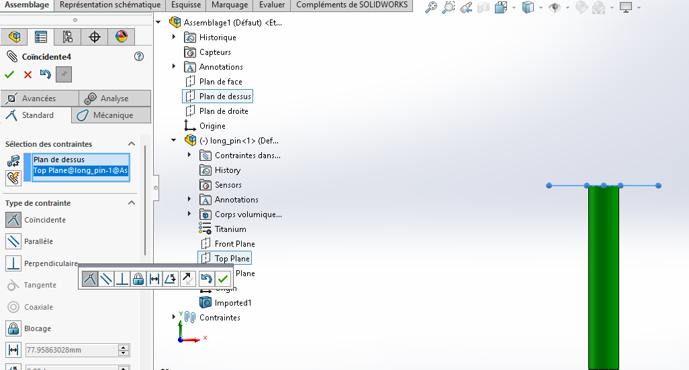

Vidéo Complete du processus 👇🏽:

<iframe title="vimeo-player" src="https://player.vimeo.com/video/1094675762?h=39308b2f97" width="640" height="360" frameborder="0"    allowfullscreen></iframe>

### - Ajout des trois variables angulaires A, B et C.

Pour le faire, nous irons dans outils/Equations comme précédemment puis au niveau de la section Equation, nous allons entrer les noms de nos variables ainsi que leus valeurs en prenant soin de choisir "degrés" comme unité.

- L'outil Equation:

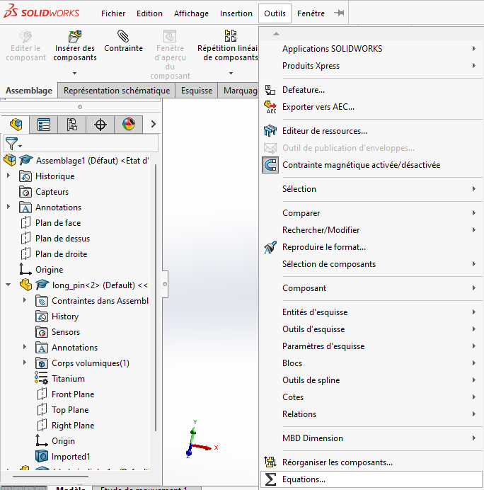

- Ajout des variables :

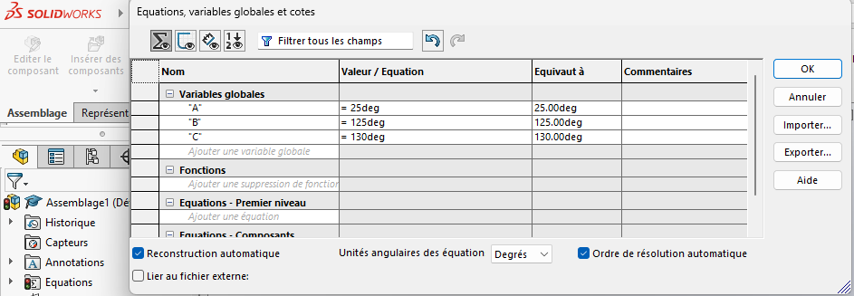

### - Insertion du premier maillon et application de contraintes :

On insère le premier maillon de la chaîne relié à l'axe inséré précédemment. Ensuite on aura à insérer tois contraintes :

- Une contrainte de coaxialité entre le trou du maillon censé acceullir l'axe et l'axe.
  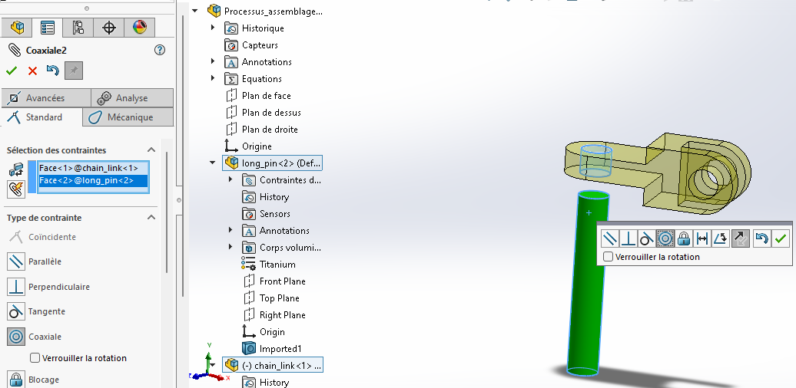

- Une contrainte de coincidence entre La face supérieur de maillon et la face supérieur de l'axe (Lesquelles sont censé être alignées dans l'assemblage)
  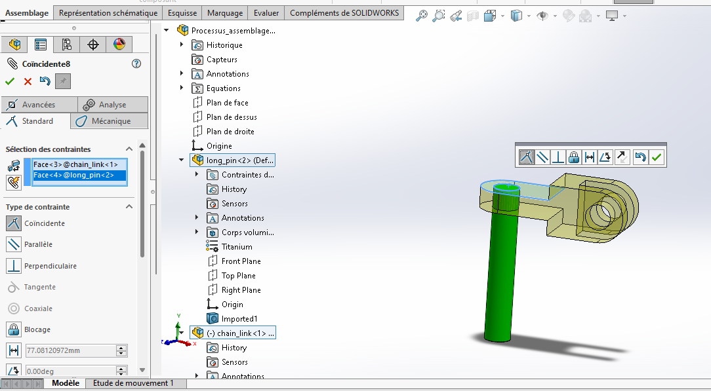

- Une contrainte de coincidence entre les plans de face du maillon et de l'assemblage.
  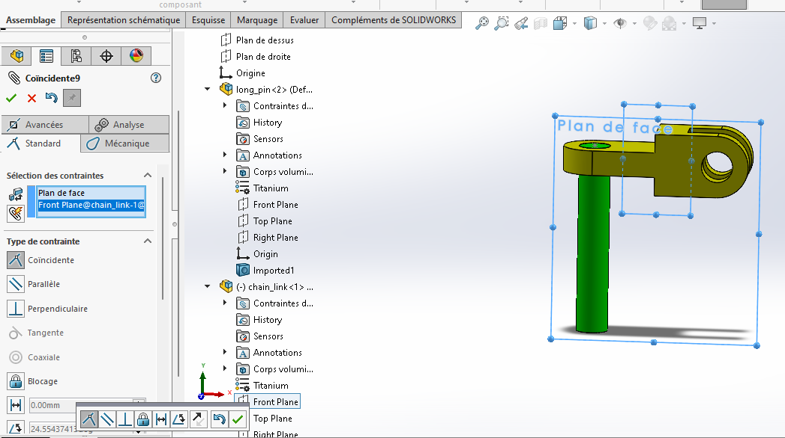

Video complete de l'insertion et de l'application des contraintes.

<iframe title="vimeo-player" src="https://player.vimeo.com/video/1094675677?h=4f9c74e736" width="640" height="360" frameborder="0"    allowfullscreen></iframe>

### - Insertion du 2e maillon et application de contraintes:

Après insertion du 2e maillon, on aura à appliquer deux contraintes et à ajouter une équation à l'assemblage afin de respecter le paramétrage angulaire imposé.

- Contrainte Coaxiale : Entre les deux trous avant du maillon précédent et le trous arrière du maillon inséré afin de rélier les deux maillons par une entretoise plus tard.
  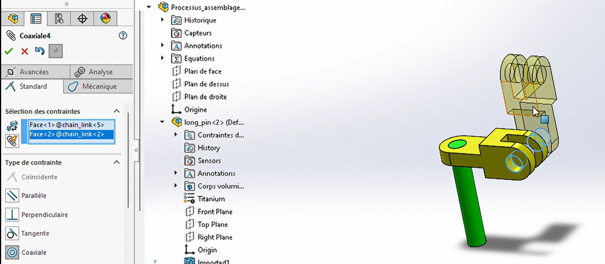
- Contrainte de coincidence entre l'une des faces intérieures du maillon précédent et une face extérieur arrière du maillon inséré.
  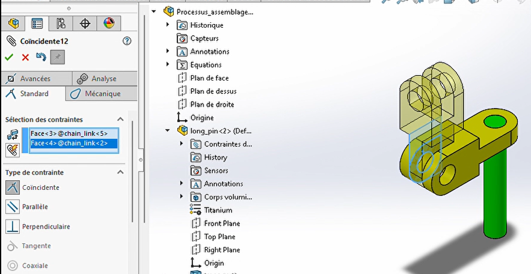

- Contrainte d'angle entre la face haute du maillon précédent et la face latérale du maillon inséré : Pour le moment l'angle sera choisi aléatoirement entre 0 et 360 degré.

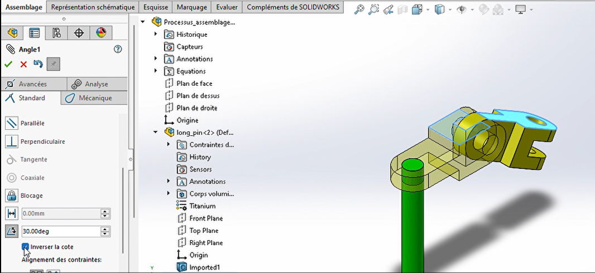

- Ajout de l'equation : Dans Equation, nous nous placerons dans l'option Equation 1er niveau, en selectionnant notre côte angulaire précedente et en lui affectant la valeur de la variable globale A.

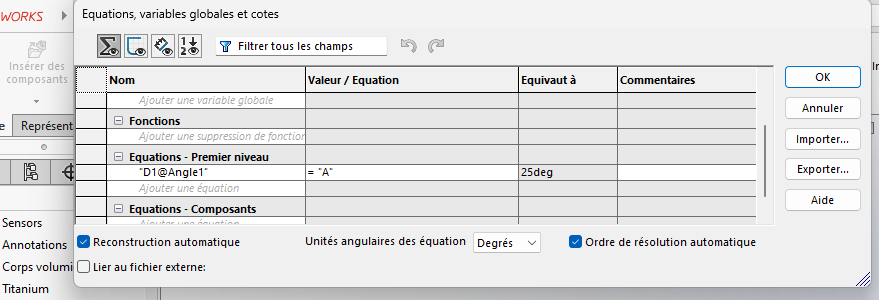

### Fixation de l'entretoise 🧷 :

Afin de maintenir les deux maillons on insère l'entretoise dans les trous alignés. Deux contraintes interviendrons ici : Une contrainte coaxiale entre l'entretoise et le trou et une contrainte de coincidence entre l'une des faces de l'entretoise et l'une des faces extérieures du 1er maillon de la chaîne:

Ici se précente la vidéo explicative de l'application de ces contraintes :

<iframe title="vimeo-player" src="https://player.vimeo.com/video/1094675718?h=7f28e584f4" width="640" height="360" frameborder="0"    allowfullscreen></iframe>

### - Insertion du 3e maillon de la chaîne et application des contraintes.

Comme précédemment, on insère le maillon, on aligne son trou arrière avec les trous avant du maillon pécedent à l'aide d'une contrainte coaxiale , on fait coincider l'une des faces interne du maillon précedent et une face externe du maillon inséré, on applique une contrainte d'angle par rapport à l'assemblage, puis on ajoute l'equation angulaire. On obtient le résultet ci après:

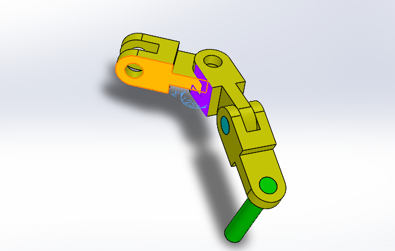

### - Insertion du 2e entretoise 🧷

Elle s'effectue de manière analogue à l'insertion précédente. On obtient Comme Résultat:

   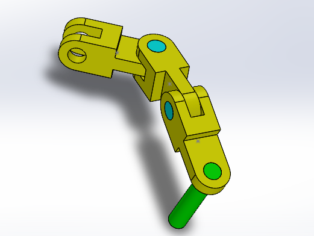

### - Insertion du 4e maillon de la chaîne et de l'entretoise:

En applicant la méthode décrite ci dessus, on réalise l'insertion en applicant les contraintes, en ajoutant l'équation puis on obtient le résultat suivant :

 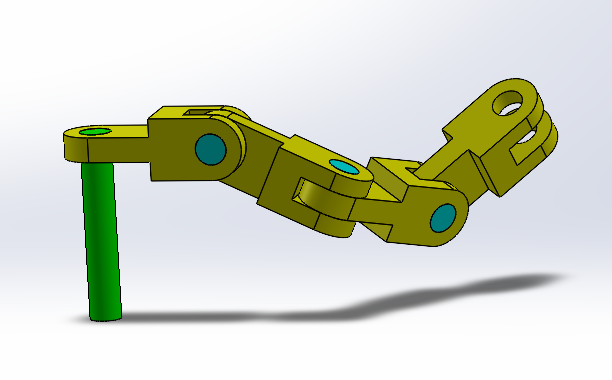

### - Insertion du Support de fin de chaîne et résultat final.

Ici, contrairement à l'insertion du 1er Support, on aura à appliquer que deux contraintes afin de faire passer l'axe dans le trou du maillon final:
Une Contrainte Coaxiale entre L'axe et le trou et une contrainte de coincidence de faces entre les faces des objets devant s'aligner:

<iframe title="vimeo-player" src="https://player.vimeo.com/video/1094675742?h=c1cee175ad" width="640" height="360" frameborder="0"    allowfullscreen></iframe>

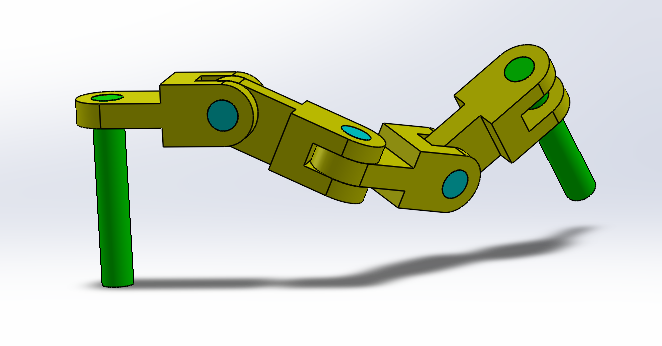

Ainsi s'achève la partie assemblage de ce test. Il s'agira maintenant de déterminer le centre de gravité de l'assemblage obtenu afin de vérifier si toutes les contraintes ont été bien réalisées.

## ⚖️Détermination du centre de masse:

Pour déterminer le centre de masse, il suffit de se placer dans l'onglet évaluer puis dans Propriété de masse.

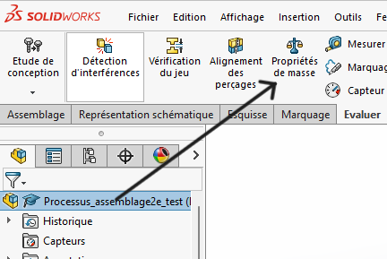

Pour les premières valeurs des angles :
A=25deg, B=125deg et C=130deg, On obtient comme centre de masse le point de coordonnées :

x = 348.66mm
y = -88.48mm
z = -91.40mm

Ensuite on modifie dans la rubrique Equation les paramètres A, B et C:
A= 30deg, B=115deg et C=135deg.
On peut voir que les angles sont automatiquement modifiés au niveau de la modélisation:

On obtient alors Comme Centre de masse le point de coordonnées:

x = 327.67mm
y = -98.39mm
z = -102.91mm

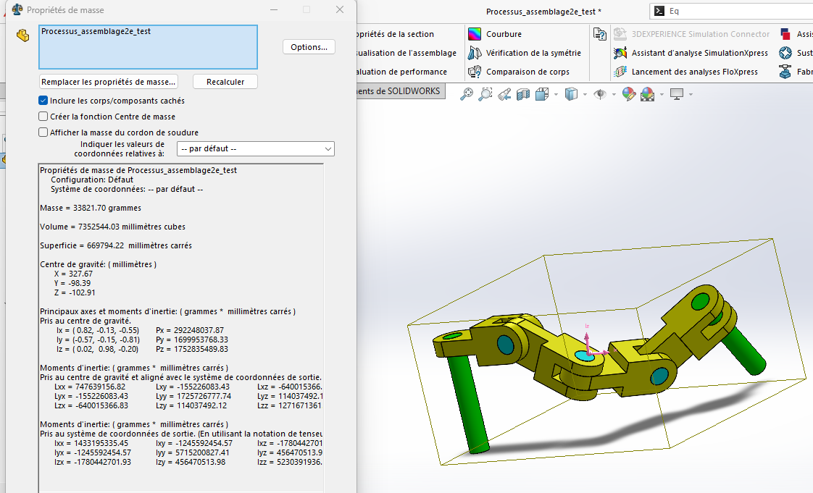

## Vidéo complete de l'assemblage :

<iframe title="vimeo-player" src="https://player.vimeo.com/video/1094675783?h=d39cf81c85" width="640" height="360" frameborder="0"    allowfullscreen></iframe>

## Quelques difficultés

## - Fixation du premier support de la chaine de façon adéquate

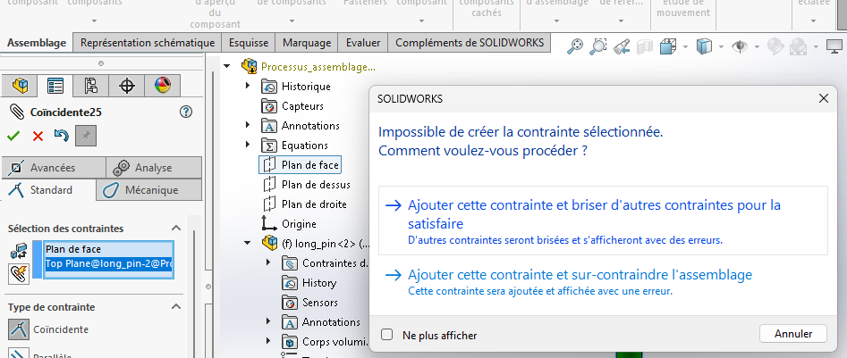

Du fait que le support après qu'on l'ait inséré s'est automatiquement fixé, on arrivais pas à appliquer des contraintes sur cette pièce. Pour régler ce problème, on a dû fait un clique droit sur le composant afin de le délier à travers l'option : libérer.

## - Assemblage désordonné:

Lors de l'attribution des valeurs correctes aux vaiables, les contraintes d'angles sélectionnées dans la rubrique équation étaient mal orienté ce qui a provoqué un croisement des pièces entre elles rendant l'assemblage entre-autre catastrophique....
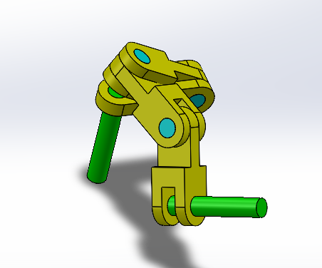

Avec des recherches un peu plus poussées, on s'est rendu compte qu'on pouvait orienter les angles de façon plus adéquates soit en inversant la contrainte soit en changeant l'alignement:

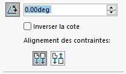

## Résultats et Bilan

A l'issu des différentes modélisations et assemblages réalisés, Les résultats se présentent comme suit :

| Pièces/Assemblages | Valeurs obtenues                                       |
| ------------------ | ----------------------------------------------------- |
| Pièce 1.0          | masse = 939.54g                                       |
| Pièce 1.1          | masse = 1032.32g                                      |
| Pièce 2.0          | masse = 628.18g                                       |
| Pièce 4.0          | masse = 432.58g,                                      |
| Assemblage 1       | Centre de Masse : x=348.66mm, y=-88.48mm, z=-91.4mm   |
| Assemblage 2       | Centre de masse : x=327.67mm, y=-98.39mm, z=-102.91mm |

Etant principalement centré autour de la modélisation paramétrique avec Solid Works, Ce test nous a principalement permis de nous familiariser avec cette fonctionnalité de SolidWorks permettant d'examiner diverses géométries d'un modèle. Ce concept nous sera plus particulièrement utile lors de la modélisation géométrique de notre futur robot.

## Annexe 
Retrouvez ici les fichiers sources de la modélisation des pièces ainsi que de l'assemblage :
- [Lien de téléchargement](https://www.dropbox.com/scl/fi/ktwjt27wiwndagh36exsq/test-02.zip?rlkey=dwhu7ppo41v6ku59dgryaxz2k&st=3j2ryar3&dl=0)

Peace✌🏾️

