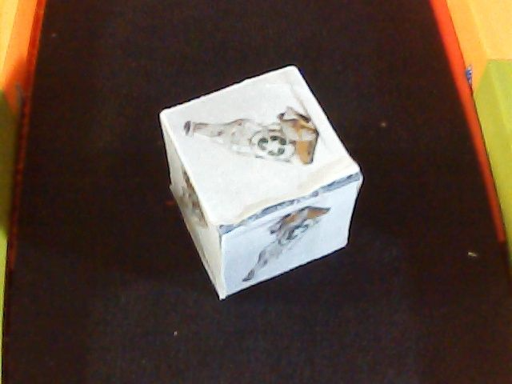
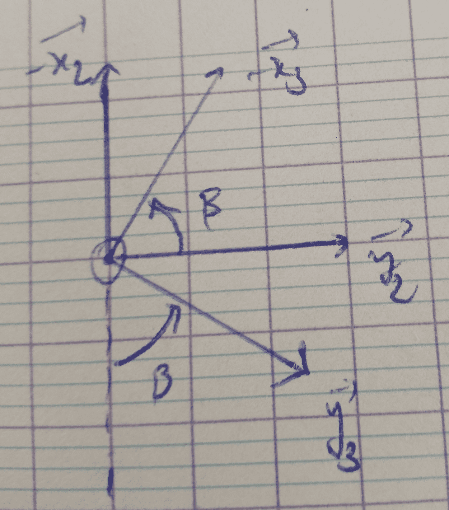
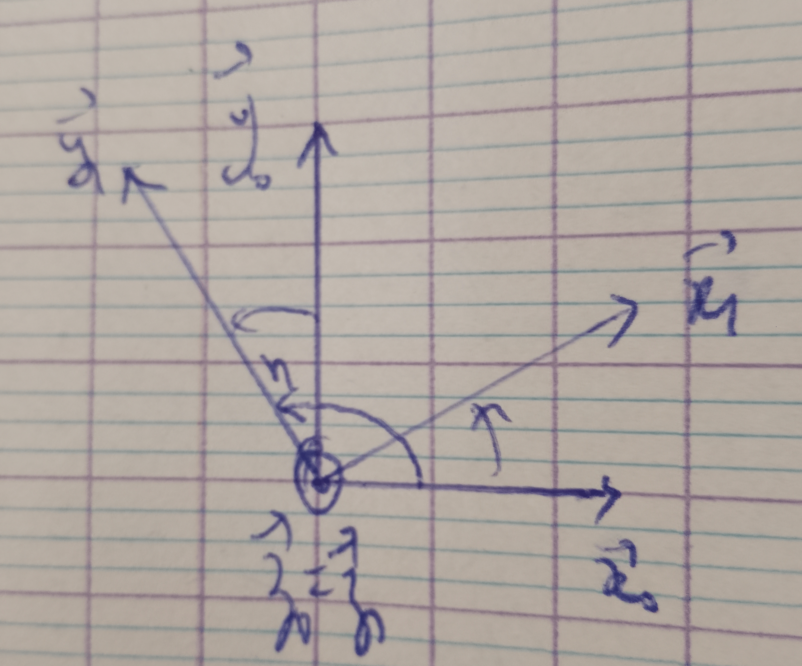
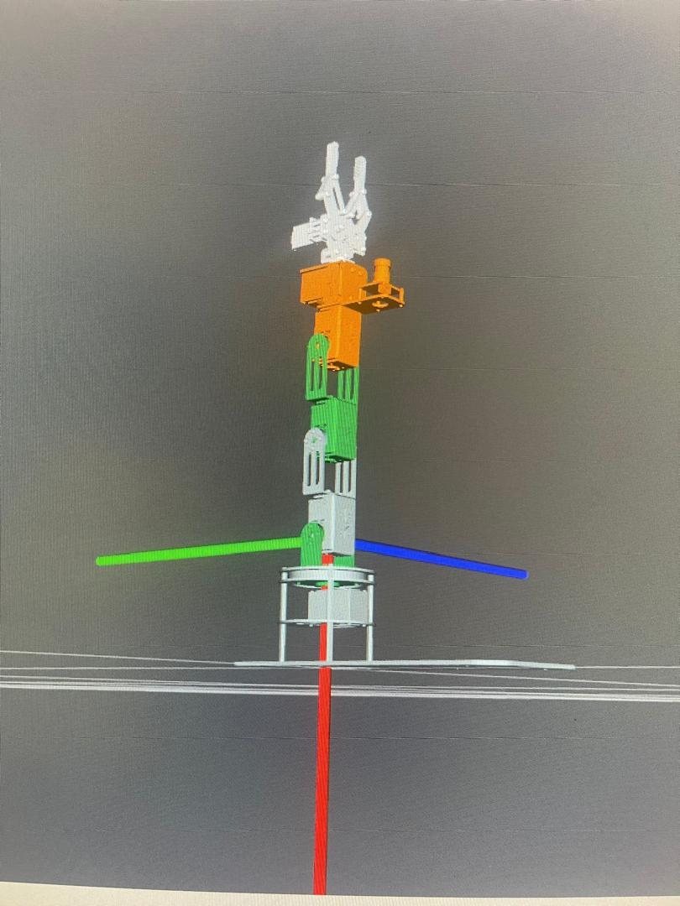
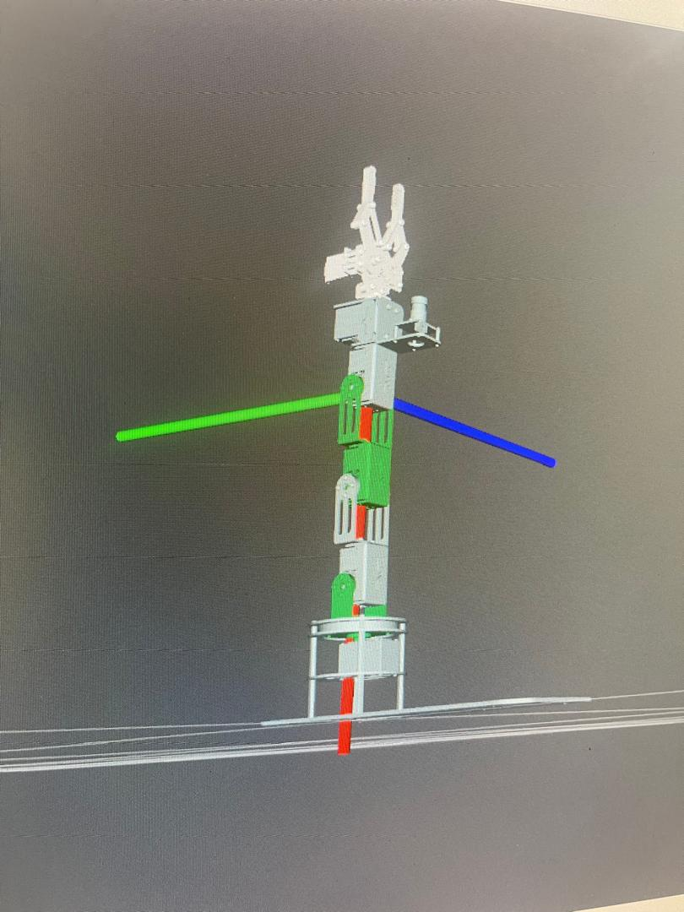
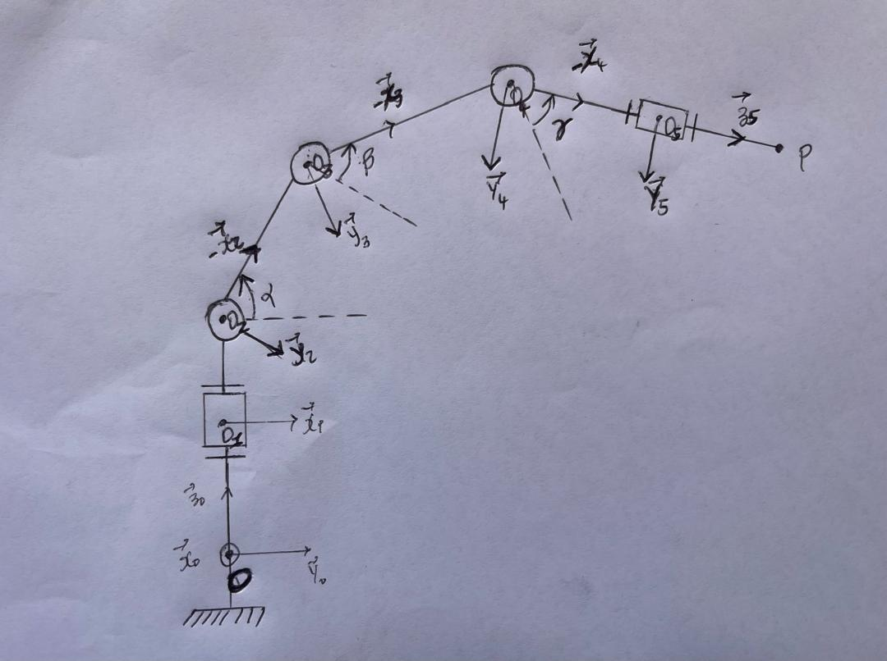

# DOFBOT JETSON NANO
                                                                       

## Abstract / Objectif

Au cœur de notre dispositif, le bras robotique **DOFBOT** orchestre les opérations de manipulation et de tri. Cette unité articulée à **5 degrés de liberté**, dotée d'une pince haute précision, est pilotée par un système de vision par ordinateur s'appuyant sur l'architecture **YOLO**. Cette synergie entre mécanique et intelligence artificielle permet une identification instantanée et un tri sélectif rigoureux des flux de déchets.

## Introduction

Dans le cadre du **TEKBOT Robotics Challenge 2025 (TRC25)**, le projet ***EcoCity*** vise à simuler un système intelligent de gestion des déchets urbains reposant sur la robotique collaborative et la vision artificielle.

Le ***DOFBOT Jetson Nano*** constitue un élément central de ce système. Il est utilisé comme **bras robotique** intelligent de tri automatique, intégré au niveau de la ***station de tri***, en interaction directe avec un robot mobile collecteur et un convoyeur de déchets.

Son rôle principal est d'*identifier, saisir et trier automatiquement les déchets* en fonction de leur catégorie, grâce à une combinaison de :

- Vision par ordinateur (YOLOv8)
- Planification de mouvements (MoveIt)
- Communication robotique (ROS)
- Calcul de position 3D dans l'espace du bras


## **1. Spécifications Techniques**

| Caractéristiques | Valeur |
| --- | --- |
| Degrés de liberté | **6 DOF** (5 articulations + 1 pince motorisée) |
| Charge utile | **200g** (poids levable bras tendu) / **500g** (poids max en manipulation/pince) |
| Rayon d'action | Environ **350 mm** (portée maximale du bras) / Rayon efficace de **300 mm** |
| Précision | **±0,5 mm** (répétabilité de positionnement) |
| Unité de calcul | **NVIDIA Jetson Nano 4GB** (CPU Quad-core A57 + GPU Maxwell 128 cœurs) |
| Framework | **ROS** (Robot Operating System), **Python 3**, OpenCV, MediaPipe |
| Vision  | Caméra **HD USB (0.3 MP)** grand angle avec traitement d'image IA en temps réel |
| Temps de cycle | **Variable** (dépend de l'algorithme d'IA utilisé ; les servos bus sont rapides avec une réponse fluide |

## 2. Mise en place matérielle et logicielle

### 2.1 Réception et assemblage du DOFBOT

Après la réception du kit **DOFBOT Jetson Nano (Yahboom)**, les opérations suivantes ont été réalisées :

### **a. Assemblage mécanique**

- Vérification de l’ensemble des composants :
    - structure mécanique,
    - servomoteurs,
    - carte d’extension,
    - pince de préhension,
    - caméra.
- Montage complet du bras robotique conformément à la **documentation officielle Yahboom**.
- Vérification du câblage et de la fixation des articulations.

### **b. Installation du Jetson Nano**

- Configuration du système d’exploitation JetPack.
- Connexion réseau et mise à jour du système.
- Installation des dépendances nécessaires au projet, notamment :
    - Python 3,
    - ROS,
    - bibliothèques de vision et d’IA (Ultralytics, OpenCV),
    - bibliothèques spécifiques au DOFBOT (Arm_lib).

### 2.2 Tests fonctionnels de base

Avant le développement des modules intelligents, plusieurs tests ont été effectués :

- Test de communication entre le Jetson Nano et la carte de contrôle du DOFBOT.
- Calibration des servomoteurs.
- Test individuel de chaque articulation :
    - rotation de la base,
    - élévation du bras,
    - flexion,
    - ouverture et fermeture de la pince.

Ces tests ont permis de **valider l’intégrité matérielle** et de garantir une base stable pour la suite du développement.

## 3. Architecture globale du système de tri

Le système de tri intelligent repose sur trois sous-systèmes principaux :

### 3.1 Convoyeur de déchets

- Conçu et fabriqué par les équipes.
- Transporte les déchets jusqu’à la zone de détection située sous la caméra du DOFBOT.
- Sert de déclencheur pour la phase de détection.

### 3.2 Bras robotique DOFBOT Jetson Nano

- Équipé d’une caméra embarquée.
- Réalise la détection, la saisie et le dépôt des déchets.
- Exécute les trajectoires calculées par MoveIt.

### 3.3 Corbeilles de tri

Trois corbeilles colorées représentent les catégories de déchets :

- **Bleue** : déchets ménagers
- **Verte** : déchets recyclables
- **Rouge** : déchets dangereux

## 4. Missions fonctionnelles du DOFBOT

Le DOFBOT exécute les tâches suivantes de manière autonome :

1. **Réception du déchet**
    - Détection de la présence d’un objet sous la caméra.
    - Synchronisation avec le convoyeur.
2. **Identification du type de déchet**
    - Acquisition d’images via la caméra.
    - Classification à l’aide d’un modèle **YOLOv8**.
3. **Détermination de la position de l’objet**
    - Utilisation de **YOLOv8 OBB (Oriented Bounding Boxes)** pour obtenir :
        - la position dans le plan (X, Y),
        - l’orientation de l’objet,
    - Estimation de la distance (axe Z) à partir du principe de la distance focale.
4. **Planification et exécution du mouvement**
    - Génération de trajectoires avec **MoveIt**.
    - Déplacement du bras vers la position de préhension.
5. **Tri et dépôt**
    - Saisie du déchet avec la pince.
    - Dépôt dans la corbeille correspondant à la catégorie détectée.
6. **Retour en position initiale**
    - Retour à la position de repos.
    - Préparation pour le déchet suivant.

## 5. Réalisation

Cette section présente l’ensemble des travaux effectués dans le cadre du développement et de l’intégration du **DOFBOT Jetson Nano** au sein de la station de tri intelligente EcoCity. Les travaux ont porté à la fois sur la **vision artificielle**, la **communication robotique**, le **contrôle du bras**, ainsi que sur la **résolution de problèmes matériels critiques**.

## 5.0 Constitution de la base de données et annotation

Cette étape constitue le **socle fondamental** du module de reconnaissance visuelle. Elle a consisté en la **collecte d’images réelles des déchets**, suivie de leur **annotation rigoureuse**, en vue de l’entraînement du modèle de détection basé sur **YOLOv8 OBB**.

### 5.0.1 Nature des déchets utilisés

Les déchets sont représentés par des **cubes de 3 cm d’arête**, sur lesquels sont collées des images de déchets courants que l’on retrouve dans l’environnement urbain. Ces visuels ont été fournis par les **organisateurs du TEKBOT Robotics Challenge** et sont présentés en annexe.

Chaque cube correspond à un **motif de déchet distinct**, permettant de simuler un large éventail de cas réels tout en conservant une géométrie compatible avec la pince du DOFBOT.

### 5.0.2 Prise des images

Les images ont été acquises **exclusivement à l’aide de la caméra embarquée du DOFBOT**, afin de garantir une parfaite cohérence entre les conditions d’entraînement et les conditions réelles de détection.

Les prises de vue ont été réalisées :

- sur le **tapis du convoyeur**,
- avec le DOFBOT placé dans sa **position réelle de détection**,
- en variant volontairement :
    - la luminosité,
    - la position du cube,
    - son orientation.

Cette diversité vise à améliorer la robustesse du modèle face aux variations environnementales.

Le modèle devant détecter **126 motifs distincts de déchets**, une première version de la base de données a été constituée avec **environ 22 images par motif**, soit un total d’environ **2772 images**.

Les images ont été capturées à l’aide d’**OpenCV**, via un script Python dédié permettant une sauvegarde manuelle contrôlée.

```python
# Capture Images Camera avec OpenCV
import cv2 
import os

# Créer dossier pour stocker les images
save_dir = 'Nom_du_dossier'  # adapte ce chemin si nécessaire (ex: 'images_dataset')
os.makedirs(save_dir, exist_ok=True)

# Initialiser la caméra USB (0 = première caméra détectée)
camera = cv2.VideoCapture(1)
camera.set(cv2.CAP_PROP_FRAME_WIDTH, 640)
camera.set(cv2.CAP_PROP_FRAME_HEIGHT, 480)
camera.set(cv2.CAP_PROP_FPS, 30)

i = 0
while True:
    ret, frame = camera.read()
    if not ret:
        print("Impossible de lire la caméra.")
        break

    cv2.imshow('Frame', frame)

    # Appuyer sur 's' pour sauvegarder une image
    key = cv2.waitKey(1) & 0xFF
    if key == ord('s'):
        filename = os.path.join(save_dir, f'image_{i:04d}.jpg')
        cv2.imwrite(filename, frame)
        print(f'Saved {filename}')
        i += 1

    # Appuyer sur 'q' pour quitter
    if key == ord('q'):
        break

# Libérer la caméra et fermer les fenêtres
camera.release()
cv2.destroyAllWindows()

```

Les images finales ont ensuite été **réparties en trois dossiers**, correspondant aux classes :

- déchets ménagers,
- déchets recyclables,
- déchets dangereux.

Voici-ci dessous quelques images prises. 

### Quelques images du dataset
<table>
  <tr>
    <td></td>
    <td></td>
    <td></td>
  </tr>
  <tr>
    <td></td>
    <td></td>
    <td></td>
  </tr>
  <tr>
    <td></td>
    <td></td>
    <td></td>
  </tr>
</table>


### 5.0.3 Annotation des données

L’annotation des images a été réalisée à l’aide de la plateforme cloud **Roboflow**, spécialisée dans la gestion des données pour la vision par ordinateur.

Dans le cadre de ce projet, Roboflow a été utilisé **uniquement pour l’annotation**, l’entraînement étant assuré localement à l’aide de YOLOv8 OBB.

Le processus d’annotation s’est déroulé selon les étapes suivantes :

- création d’un **espace de travail collaboratif** permettant d’inviter jusqu’à cinq annotateurs,
- création d’un **nouveau projet** dédié à la détection des déchets,
- téléversement des images par classe,
- annotation manuelle de chaque image par **encadrement polygonal de la face supérieure du cube**,
- assignation de la classe correspondante (ménager, recyclable ou dangereux).

Ce choix d’annotation polygonale est justifié par l’utilisation de **YOLOv8 OBB**, qui exploite des boîtes orientées afin d’améliorer la précision de la détection et de la préhension.

Une fois l’annotation terminée, les images ont été :

- ajoutées à la dataset par lots,
- réparties en ensembles :
    - 60 % pour l’entraînement,
    - 20 % pour les tests,
    - 20 % pour la validation,
- soumises à plusieurs étapes de prétraitement, notamment :
    - rotation aléatoire (±45°),
    - augmentation du contraste,
    - ajout de bruit,

ce qui a permis de **tripler la taille effective de la base de données**.

La dataset finale a ensuite été téléchargée sous forme d’archive compatible avec YOLO.

### 5.0.4 Problèmes rencontrés et améliorations apportées

Après les premiers entraînements, plusieurs limites ont été identifiées :

- une sensibilité excessive à la luminosité,
- une incapacité à détecter certains motifs,
- un déséquilibre entre les classes.

Pour corriger ces problèmes, les améliorations suivantes ont été apportées :

1. **Équilibrage du nombre d’images par objet**
    
    Le nombre d’images a été fixé à **20 images par objet**, avec un ajustement spécifique pour les déchets dangereux afin d’obtenir un nombre équivalent d’images par classe.
    
2. **Amélioration des conditions de luminosité**
    
    Les prises de vue ont été répétées sous des conditions lumineuses plus variées.
    
3. **Téléversement séparé par objet**
    
    Les images de chaque motif ont été téléversées séparément sur Roboflow, garantissant que les ensembles d’entraînement, de test et de validation contiennent des images de **tous les objets**, évitant ainsi tout biais d’apprentissage.
    

Ces ajustements ont permis d’obtenir une base de données **plus robuste, équilibrée et représentative**, améliorant significativement les performances finales du modèle.

## 5.1 Développement du module de reconnaissance visuelle

### Technologies et bibliothèques utilisées

- **Ultralytics YOLOv8**
- **YOLOv8 OBB (Oriented Bounding Boxes)**
- **Python 3**
- **OpenCV (acquisition et prétraitement des images)**

### Description du travail réalisé

Le module de reconnaissance visuelle a été conçu pour identifier automatiquement les déchets présents sur le convoyeur et déterminer leur catégorie (ménager, recyclable ou dangereux). Ce module constitue l’élément décisionnel central du système de tri.

Le choix de **YOLOv8** s’explique par sa capacité à effectuer des détections rapides et précises en temps réel, même sur une plateforme embarquée comme le **Jetson Nano**. L’utilisation de la variante **OBB** permet d’obtenir des boîtes englobantes orientées, fournissant non seulement la position de l’objet dans l’image, mais également son orientation, information essentielle pour une préhension correcte par le bras robotique.

Un modèle pré-entraîné (yolov8n-obb.pt) a été utilisé afin de bénéficier du transfert d’apprentissage. Cette approche permet d’améliorer la convergence du modèle tout en réduisant le temps d’entraînement.

### Code d’entraînement du modèle YOLOv8 OBB

```python
from ultralytics import YOLO

# Charger le modèle pré-entraîné OBB
model = YOLO("yolov8n-obb.pt")

# Lancer l'entraînement avec early stopping automatique
metrics = model.train(
    data="data.yaml",
    epochs=50,
    imgsz=640,
    batch=4,
    name="yolov8_cube_obb_model",
    patience=5
)

# Afficher toutes les métriques finales
print("Toutes les métriques :")
for k, v in metrics.items():
    print(f"{k}: {v}")
```

### Résultats obtenus

Les performances obtenues démontrent l’efficacité du modèle :

- **Precision** : 0.976
- **Recall** : 0.966

**Métriques de validation :**

- Precision : 0.9760
- Recall : 0.9658
- mAP@50 : 0.9842
- mAP@50–95 : 0.9019

Ces résultats indiquent une excellente capacité de généralisation du modèle, avec un très faible taux de faux positifs et de faux négatifs, ce qui est crucial pour un système de tri automatique.

## 5.2 Détection des déchets et calcul de leur position 3D

Après l’entraînement du modèle YOLOv8, une **architecture ROS distribuée** a été mise en place afin de transformer les résultats de détection en une position exploitable par le bras robotique.

Cette architecture repose sur **deux nœuds ROS complémentaires** :

- `yolo_node` : détection et calcul de la position du déchet dans le repère caméra
- `waste_tf_node` : transformation de cette position vers le repère du bras robotique

### 5.2.1 Nœud `yolo_node` – Détection et publication dans le repère caméra

### Rôle du nœud

Le nœud `yolo_node` est responsable de :

- la réception des images de la caméra,
- l’exécution du modèle YOLOv8,
- l’estimation de la position 3D du déchet dans le repère **camera_link**,
- la publication de la classe du déchet et de sa position.

### Topics utilisés

- **Abonnements** :
    - `/usb_cam/image_raw` (Image) – flux vidéo
    - `/dofbot/execution_status` (String) – synchronisation avec l’exécution du bras
- **Publications** :
    - `/waste/pos_cam` (PointStamped) – position du déchet dans le repère caméra
    - `/cls_publisher` (String) – classe du déchet détecté

### Principe de fonctionnement

Le nœud `yolo_node` constitue le **point d’entrée de la chaîne de perception visuelle** du système. Il assure la transition entre les données brutes issues de la caméra et une information géométrique exploitable par les modules robotiques.

Après son initialisation, le nœud se met en attente de deux flux d’information distincts :

le flux vidéo provenant de la caméra USB et le statut d’exécution du bras robotique. Cette synchronisation garantit que la détection n’est effectuée que lorsque le bras est dans un état stable, évitant ainsi des incohérences dues à des mouvements en cours.

Les images reçues sous forme de messages ROS `sensor_msgs/Image` sont converties en images OpenCV grâce à la fonction `rosimg_to_cv2`. Cette conversion gère explicitement les différents encodages possibles (`rgb8` ou `bgr8`) afin d’assurer une compatibilité totale avec la librairie de vision utilisée.

Une fois le statut `Success` reçu, le nœud applique le modèle YOLOv8 à l’image courante à l’aide de la fonction `next_waste_pos`. Cette fonction retourne :

- le vecteur de translation 3D (`tvec`) représentant la position estimée du déchet par rapport à la caméra,
- la classe du déchet détecté.

Si aucune détection valide n’est trouvée, le nœud ignore l’image et attend le cycle suivant. Dans le cas contraire, la classe du déchet est publiée sur le topic `/cls_publisher`, permettant aux modules décisionnels de connaître la nature de l’objet à manipuler.

La position 3D du déchet est ensuite encapsulée dans un message `geometry_msgs/PointStamped`. L’utilisation de ce type de message permet :

- d’associer explicitement la position au repère `camera_link`,
- d’inclure un horodatage précis,
- de faciliter les transformations ultérieures via le système TF de ROS.

Une fois la publication effectuée, le statut est réinitialisé afin d’éviter des détections multiples pour un même cycle de manipulation. Ce mécanisme assure un fonctionnement déterministe et synchronisé entre la perception et l’action.

```python
#!/home/jetson/miniforge3/envs/yolo2/bin/python3.10
# -*- coding: utf-8 -*-
import rospy
from std_msgs.msg import String
from sensor_msgs.msg import Image
from geometry_msgs.msg import PointStamped
import numpy as np
import cv2
from detect_waste_lib_v2 import next_waste_pos

pub = rospy.Publisher("/waste/pos_cam", PointStamped, queue_size=1)
pub1 = rospy.Publisher('/cls_publisher', String, queue_size=1)
rospy.loginfo("Node YOLO lancé. En attente d'images et de statut Success...")

        
def rosimg_to_cv2(msg):
    """Convert ROS Image message to OpenCV BGR image"""
    if msg.encoding not in ["rgb8", "bgr8"]:
        rospy.logwarn(f"Unexpected encoding {msg.encoding}, converting to rgb8")
    arr = np.frombuffer(msg.data, dtype=np.uint8).reshape((msg.height, msg.width, -1))
    # Convert RGB to BGR if needed
    if msg.encoding == "rgb8":
        arr = cv2.cvtColor(arr, cv2.COLOR_RGB2BGR)
    return arr

statut = "Success"
def callback(msg):
    global statut
    if msg is None:
        rospy.logwarn("Aucune image reçue encore !")
        return
    frame = rosimg_to_cv2(msg)
    if statut == "Success":
        #print(type(cls),cls)
        tvec,cls = next_waste_pos(frame)
        if tvec is None:
            return
        pub1.publish(String(cls))
        rospy.loginfo("Classe publiee apres statut success recu")
        rate = rospy.Rate(50) # 10hz
        rate.sleep()  
        point = PointStamped()
        point.header.stamp = rospy.Time.now()
        point.header.frame_id = "camera_link"
        point.point.x, point.point.y, point.point.z = tvec
        pub.publish(point)
        rospy.loginfo("Point publie dans le repere de la camera")
        statut = None

def callback_success(data):
    global statut 
    statut = data.data 

rospy.init_node("yolo_detector")
rospy.Subscriber("/usb_cam/image_raw", Image, callback, queue_size=1)
rospy.Subscriber("/dofbot/execution_status", String, callback_success, queue_size=1)
rospy.spin()
```

### 5.2.2 Nœud `waste_tf_node` – Transformation vers le repère du bras

### Rôle du nœud

Le nœud `waste_tf_node` assure le **passage entre la vision et la robotique**. Il transforme la position du déchet depuis le repère caméra (`camera_link`) vers le repère de base du bras (`base_link`).

### Technologies utilisées

- `tf.TransformListener`
- `geometry_msgs/PointStamped`
- `visualization_msgs/Marker`

### Topics utilisés

- **Abonnement** :
    - `/waste/pos_cam` (PointStamped)
- **Publications** :
    - `/waste/pose` (PointStamped)
    - `/visualization_marker` (Marker)

### Principe de fonctionnement

Le nœud `waste_tf_node` joue un rôle fondamental d’**interface entre la vision et le contrôle du bras robotique**. Il permet de convertir une position détectée dans le repère caméra en une position exprimée dans le repère de base du bras, indispensable pour la planification de trajectoires.

À la réception d’un message `PointStamped` sur le topic `/waste/pos_cam`, le nœud vérifie d’abord que le point est bien exprimé dans le repère `camera_link`. Cette vérification constitue une mesure de sécurité permettant d’éviter des erreurs de transformation liées à un mauvais référentiel.

Le nœud utilise ensuite un objet `tf.TransformListener` pour attendre la disponibilité de la transformation TF entre `camera_link` et `base_link`. Cette attente est synchronisée avec l’horodatage du message reçu, garantissant une cohérence temporelle entre la position détectée et l’état courant du système de transformation.

Une fois la transformation disponible, la position du déchet est convertie vers le repère `base_link`. Le point transformé est alors publié sur le topic `/waste/pose`, rendant cette information directement exploitable par les modules de planification et de contrôle du bras robotique.

En parallèle, un message de type `visualization_msgs/Marker` est généré. Ce marqueur, représenté sous forme de sphère, est publié dans le repère `base_link` et permet de visualiser la position cible du déchet dans RViz. Les paramètres de taille, de couleur et de position sont configurés de manière à offrir une visualisation claire et intuitive.

Ce mécanisme de visualisation constitue un outil essentiel pour le débogage et la validation expérimentale. Il permet de vérifier en temps réel la cohérence entre la détection visuelle, les transformations de repères et la position réellement utilisée par le bras robotique.

```python
#!/usr/bin/env python
import rospy
import tf
from geometry_msgs.msg import PointStamped
from visualization_msgs.msg import Marker

rospy.init_node("waste_tf_node")

pub = rospy.Publisher("/waste/pose", PointStamped, queue_size=1)
marker_pub = rospy.Publisher('/visualization_marker', Marker, queue_size=1)
listener = tf.TransformListener()

def callback(msg):

    rospy.loginfo("Frame recu : %s" % msg.header.frame_id)

    if msg.header.frame_id != "camera_link":
        rospy.logwarn("Le point recu n'est pas dans camera_link !")
        return

    try:
        # important : se synchroniser au timestamp du message
        listener.waitForTransform("base_link", msg.header.frame_id,
                                  msg.header.stamp, rospy.Duration(1.0))

        point_base = listener.transformPoint("base_link", msg)

        pub.publish(point_base)

        marker = Marker()
        marker.header.frame_id = "base_link"
        marker.header.stamp = rospy.Time.now()
        marker.ns = "target_marker"
        marker.id = 0
        marker.type = Marker.SPHERE
        marker.action = Marker.ADD

        marker.pose.position.x = point_base.point.x
        marker.pose.position.y = point_base.point.y
        marker.pose.position.z = point_base.point.z
        marker.pose.orientation.w = 1

        marker.scale.x = marker.scale.y = marker.scale.z = 0.02

        marker.color.b = 1.0
        marker.color.a = 1.0

        marker_pub.publish(marker)

    except Exception as e:
        rospy.logwarn("TF transform error: %s" % e)

rospy.Subscriber("/waste/pos_cam", PointStamped, callback, queue_size=1)
rospy.spin()
```

## 5.3 Communication et contrôle du bras robotique avec ROS

### Technologies et bibliothèques utilisées

- **ROS (Robot Operating System)**
- **rospy**
- **robot_state_publisher**
- **URDF (Unified Robot Description Format)**

### Description du travail réalisé

ROS a été utilisé comme middleware principal pour assurer la communication entre les différents modules du système robotique. Il permet une architecture modulaire et évolutive, essentielle pour l’intégration de la vision artificielle, du contrôle moteur et de la planification de mouvements.

Un nœud ROS spécifique, nommé **dofbot_state_publisher**, a été développé afin de lire les angles des servomoteurs du DOFBOT et de publier ces informations sur des topics ROS. Ces données sont utilisées pour :

- représenter l’état du bras dans l’espace,
- alimenter le modèle cinématique,
- permettre la planification de trajectoires avec MoveIt.

```python
#!/usr/bin/env python3
import rospy
from sensor_msgs.msg import JointState
import math
from Arm_Lib import Arm_Device  # Librairie officielle

# Initialisation du bras
arm = Arm_Device()

def get_servo_positions():
    """
    Lit les positions réelles des 6 servos.
    Retourne une liste d'angles en degrés.
    """
    positions = []
    for i in range(1, 6):
        angle = arm.Arm_serial_servo_read(i)  # 0-180 pour S1-S4,S6 ; 0-270 pour S5
        if angle is None:
            angle = 0
        positions.append(angle)
    return positions

def talker():
    rospy.init_node('dofbot_joint_publisher', anonymous=True)
    pub = rospy.Publisher('/joint_states', JointState, queue_size=10)
    rate = rospy.Rate(2)  # 10 Hz
    joint_names = ['joint1','joint2','joint3','joint4','joint5']

    while not rospy.is_shutdown():
        msg = JointState()
        msg.header.stamp = rospy.Time.now()
        msg.name = joint_names
        positions = get_servo_positions()
        # Conversion en radians et limitation [-pi/2, pi/2]
        msg.position = [(math.radians(p) - math.pi/2) for p in positions]
        pub.publish(msg)
        #rospy.loginfo(f"Positions publiées (radians) : {msg.position}")
        rate.sleep()

if __name__ == '__main__':
    try:
        talker()
    except rospy.ROSInterruptException:
        pass

```

Le script présenté ci-dessus implémente le nœud ROS `dofbot_state_publisher` ****chargé de publier l’état instantané des articulations du bras robotique DOFBOT sous forme de messages `JointState`. Ce nœud joue un rôle central dans la synchronisation entre le matériel réel et l’environnement logiciel ROS.

Tout d’abord, la librairie officielle `Arm_Lib` est utilisée pour établir la communication avec les servomoteurs du bras. L’objet `Arm_Device` permet d’accéder directement aux positions réelles de chaque servo via une liaison série, garantissant ainsi une lecture fidèle de l’état physique du robot.

La fonction `get_servo_positions()` interroge successivement les servomoteurs du bras et récupère leurs angles de rotation exprimés en degrés. Une valeur par défaut est appliquée lorsque la lecture échoue, afin d’assurer la continuité de fonctionnement du nœud et d’éviter des erreurs lors de la publication des données.

Le nœud ROS, nommé `dofbot_joint_publisher`, est initialisé à l’aide de `rospy.init_node`. Il publie périodiquement des messages sur le topic standard `/joint_states`, utilisé par ROS pour représenter l’état cinématique des robots. Le type de message `sensor_msgs/JointState` contient notamment :

- les noms des articulations,
- leurs positions angulaires,
- un horodatage assurant la cohérence temporelle des données.

Avant la publication, les angles mesurés en degrés sont convertis en radians, conformément aux conventions de ROS et de MoveIt. Un décalage de `π/2` est appliqué afin d’aligner le référentiel des servomoteurs avec celui du modèle cinématique défini dans l’URDF.

La boucle principale du nœud fonctionne à une fréquence définie (2 Hz), permettant une mise à jour régulière de l’état du bras tout en limitant la charge de communication. Chaque itération publie un message `JointState` actualisé, assurant ainsi une représentation cohérente du bras robotique dans les outils de visualisation tels que RViz.

Grâce à ce mécanisme, le modèle URDF, le `robot_state_publisher` et les modules de planification de trajectoires (MoveIt) disposent en permanence d’une information fiable sur l’état réel du robot. Cela garantit la cohérence entre le bras physique, sa représentation virtuelle et les algorithmes de contrôle et de planification.

Ce mécanisme est indispensable pour la cohérence entre la perception visuelle, la cinématique du bras et la planification de trajectoires.

### 5.3 Planification de trajectoires et déplacement réel du bras DOFBOT

Après avoir obtenu la **position 3D de l’objet** ainsi que sa **classe**, l’étape suivante consiste à **planifier une trajectoire valide** puis à **déplacer physiquement le bras DOFBOT** afin de saisir l’objet et le déposer dans la **corbeille correspondante**.

Cette partie est **la plus critique de tout le projet**, car elle fait le lien direct entre :

- la perception (vision + TF),
- la décision (planification),
- et l’action réelle (moteurs).

Pour cela, nous utilisons le package **MoveIt** de ROS, qui repose sur la bibliothèque **OMPL (Open Motion Planning Library)** pour la planification de trajectoires.

### 5.3.1 Planification de trajectoires avec MoveIt

### OMPL – Open Motion Planning Library

OMPL est la **bibliothèque de planification de mouvement** utilisée par défaut par MoveIt. Elle regroupe plusieurs algorithmes permettant de rechercher un chemin valide dans l’**espace de configuration (C-space)** du robot.

Ces algorithmes fonctionnent par **échantillonnage aléatoire** de configurations possibles jusqu’à trouver une trajectoire :

- atteignable cinématiquement,
- respectant les limites articulaires,
- évitant les collisions.

OMPL est stochastique : pour un même scénario, la planification peut réussir ou échouer selon les tirages aléatoires.

### Algorithme RRT-Connect

L’algorithme **RRT-Connect (Rapidly-exploring Random Tree – Connect)** est celui utilisé dans ce projet.

Principe :

- création de deux arbres de recherche :
    - un depuis la position de départ,
    - un depuis la position cible,
- tentative de connexion des deux arbres.

Cet algorithme est bien adapté aux **robots manipulateurs à 6 degrés de liberté**, comme le DOFBOT.

### 5.3.2 Première implémentation : `node_moveit_1.py`

### Objectif du nœud

Ce nœud réalise une **planification MoveIt vers un point cible fixe** afin de valider :

- la communication avec MoveIt,
- la génération de trajectoires,
- l’exécution en simulation (RViz).

### Logique générale du script

Le script :

1. Initialise un nœud ROS Python.
2. Crée une interface `MoveGroupCommander` pour le groupe **dofbot**.
3. Définit une pose cible (position + orientation).
4. Lance la planification MoveIt.
5. Publie la trajectoire calculée.
6. Réutilise la trajectoire si la cible n’a pas changé.

```python
#!/usr/bin/env python
# coding: utf-8
import rospy
from math import pi
from geometry_msgs.msg import Pose
from std_msgs.msg import String
from trajectory_msgs.msg import JointTrajectory, JointTrajectoryPoint
from moveit_commander.move_group import MoveGroupCommander
from tf.transformations import quaternion_from_euler

#convert degrees to radians
DE2RA=pi / 180

#Convert radians to degrees 
RA2DE=180 / pi

status_received = "Success"
precedent_trajectory = None
precedent_pose = Pose()

def callback(data):
    global status_received
    rospy.loginfo(" Statut d'exécution reçu : %s", data.data )
    status_received = data.data

def node_moveit_1():
    global status_received,precedent_trajectory
    #Initialize ROS node
    rospy.init_node("dofbot_motion_plan_py",anonymous=True)
    angle_pub = rospy.Publisher("/dofbot/trajectory",JointTrajectory,queue_size=10)

    #Suscribe to the execution status topic
    rospy.Subscriber("/dofbot/execution_status",String, callback)

    # Initialize the robotic arm motion planning group
    dofbot = MoveGroupCommander("dofbot")
    # Allow replanning when motion planning fails
    dofbot.allow_replanning(True)
    dofbot.set_planning_time(5)
    
    # number of attempts to plan
    dofbot.set_num_planning_attempts(10)
    
    # Set allowable target position error
    dofbot.set_goal_position_tolerance(0.01)
    
    # Set the allowable target attitude error
    dofbot.set_goal_orientation_tolerance(0.01)
    
    # Set allowable target error
    dofbot.set_goal_tolerance(0.01)
    
    # set maximum speed
    dofbot.set_max_velocity_scaling_factor(1.0)
    
    # set maximum acceleration
    dofbot.set_max_acceleration_scaling_factor(1.0)
    
    # Create a pose instance
    pos = Pose()
    diff_pos= Pose()
    # Set a specific location
    pos.position.x = 0.0
    pos.position.y = 0.0597016
    pos.position.z = 0.168051
    
    # The unit of RPY is the angle value
    roll = -140.0
    pitch = 0.0
    yaw = 0.0
    # RPY to Quaternion
    q = quaternion_from_euler(roll * DE2RA, pitch * DE2RA, yaw * DE2RA)
    # pos.orientation.x = 0.940132
    # pos.orientation.y = -0.000217502
    # pos.orientation.z = 0.000375234
    # pos.orientation.w = -0.340811
    pos.orientation.x = q[0]
    pos.orientation.y = q[1]
    pos.orientation.z = q[2]
    pos.orientation.w = q[3]
    
    while not rospy.is_shutdown() :
        while not rospy.is_shutdown() and status_received != "Success":
            rospy.loginfo(" En attente du statut Success...")
            rospy.sleep(0.1)
    
        if rospy.is_shutdown():
            return
        rospy.loginfo(" Planification du mouvement pour la position cible...")

        # Vérification si la position est la même ou n'est pas trop differente de l

        diff_pos.position.x=pos.position.x-precedent_pose.position.x
        diff_pos.position.y=pos.position.y-precedent_pose.position.y
        diff_pos.position.z=pos.position.z-precedent_pose.position.z
        diff_pos1=(diff_pos.position.x**2+diff_pos.position.y**2+diff_pos.position.z**2)**0.5        
        if  diff_pos1<0.03:
            rospy.loginfo("🔄 Même position que précédemment, réutilisation de la trajectoire précédente")
            angle_pub.publish(precedent_trajectory)
            status_received=None
            rospy.sleep(0.5)
            continue

        # set target point
        dofbot.set_pose_target(pos)
    
        # Execute multiple times to improve the success rate
        for i in range(5):
            # motion planning
            plan = dofbot.plan()
            trajectory = plan.joint_trajectory
    
            if len(trajectory.points) != 0:
                rospy.loginfo("Plan success!")
                # Run after planning is successful
                angle_pub.publish(trajectory)
                rospy.loginfo("Publish trajectory!")
                status_received =None
                precedent_trajectory=trajectory
                precedent_pose=pos
                rospy.sleep(0.5)
                break
            else:
                rospy.loginfo("Plan error")
    rospy.spin()

if __name__ == '__main__':
    try:
        node_moveit_1()
    except rospy.ROSInterruptException:
        pass    
                   
```

Ce script implémente un **nœud ROS de planification de mouvement** pour le bras DOFBOT en utilisant **MoveIt**. Le nœud, nommé `dofbot_motion_plan_py`, publie des trajectoires articulaires sur le topic `/dofbot/trajectory` et s’assure que chaque plan est exécuté uniquement après réception d’un statut `"Success"` sur `/dofbot/execution_status`, garantissant la **synchronisation avec le module d’exécution**.

Une **pose cible fixe** est définie, avec orientation calculée à partir d’angles d’Euler convertis en quaternion. Le nœud inclut un mécanisme de **réutilisation de trajectoire** pour éviter de recalculer des plans lorsque la pose cible ne change pas significativement. Chaque plan valide est publié et enregistré comme trajectoire précédente, assurant ainsi une **planification stable et efficace**.

Ce nœud constitue une **brique de base du contrôle par MoveIt**, permettant de tester et de valider la planification du bras dans des positions fixes pour le projet EcoCity.

### Vidéo de fonctionnement

<p align="center">
  <a href="https://vimeo.com/1151044989">
    
    <br>
    ▶️ <b>Démonstration du bras robotique Dofbot Jetson Nano</b>
  </a>
</p>


### Limite observée

Lors de l’exécution, on observe que :

- ce n’est pas le **bout réel de la pince** qui atteint l’objet,
- mais le **link 5** (dernier maillon de la chaîne cinématique).

Cela rend la **préhension impossible ou imprécise**.

### 5.3.3 Origine du problème de l’effecteur

Le problème provient de la **description du robot** :

- Le fichier **URDF** fourni avec le DOFBOT **ne contient pas le link de la pince**.
- Le fichier **SRDF**, généré à partir de l’URDF, **ne définit donc aucun effecteur**.

Dans ce cas, MoveIt considère automatiquement le **dernier link de la chaîne cinématique** comme effecteur.

Chaîne cinématique utilisée :

```
['base_link', 'link1', 'link2', 'link3', 'link4', 'link5']

```

Donc **link5 est considéré comme effecteur**, ce qui explique le comportement observé.

### 5.3.4 Résolution : méthode des deux planifications

### Principe général

L’objectif est de faire en sorte que le **bout réel de la pince** atteigne la position cible, même si MoveIt planifie vers **link5**.

👉 L’idée est donc de calculer une **position corrigée**, appelée **position soustraite**, telle que :

- lorsque link5 atteint cette position,
- alors la pince réelle atteint exactement l’objet.

Schéma cinématique du robot


### Modélisation mathématique

Soit :

- (P_0(x,y,z)) la position cible réelle de l’objet,
- (P_s(x_s,y_s,z_s)) la position soustraite.

Relation géométrique :

$$
\begin{cases}x_s = x - h_x \\y_s = y - h_y \\z_s = z + h_z\end{cases}
$$

Les termes (h_x, h_y, h_z) dépendent de la **géométrie du bras** et des **angles articulaires**. Considérons un vecteur **h1** qui dirige la pince et dans le meme sens que **z5**.

$$
Dans \, \,  R1, on  \, a: \\ \vec{h}_1=h_1y\,\vec{y}_1-h_1z\,\vec{z}_1 \,\ avec 
\begin{cases}
h_1y =|\ell\sin\theta|

\\[6pt]
h_1z =|\ell\cos\theta|

\end{cases}
\\Dans \, \,  R0, on  \, a: \\ \vec{h}_1=h_x\,\vec{x}_0 + h_y\,\vec{y}_0 -h_z\,\vec{z}_0 

$$

- **Relation entre les repères 3 et 4 (rotation d’angle gamma) (R34)**

.jpg)

$$
\begin{cases}-\vec{x}_4 = \cos\gamma\,\vec{y}_3 - \sin\gamma\,\vec{x}_3 \\\vec{y}_4 = \cos\gamma\,\vec{x}_3 + \sin\gamma\,\vec{y}_3\end{cases}
$$

- **Relation entre les repères 2 et 3 (rotation d’angle β) (R23)**



$$
\begin{cases}-\vec{x}_3 = \cos\beta\,\vec{y}_2 - \sin\beta\,\vec{x}_2 \\\vec{y}_3 = \cos\beta\,\vec{x}_2 + \sin\beta\,\vec{y}_2\end{cases}
$$

- **Relation entre les repères 1 et 2 (rotation d’angle α) (R21)**


$$
\begin{cases}-\vec{x}_2 = \cos\alpha\,\vec{y}_1 + \sin\alpha\,\vec{z}_1 \\\vec{y}_2 = -\cos\alpha\,\vec{z}_1 + \sin\alpha\,\vec{y}_1\end{cases}
$$

- **Relations entre les repères 4 et 5 (R45)**


$$
\begin{cases}\vec{z}_5 = -\vec{x}_4 \\\vec{y}_5 = \vec{y}_4\end{cases}
$$

- **Relation entre le repère 5 et le repère 1 (angle θ\thetaθ) (R51)**


$$
\begin{cases}\vec{z}_5 &= \sin \theta \, \vec{y}_1 - \cos \theta \, \vec{z}_1 \\\vec{y}_5 &= -\sin \theta \, \vec{z}_1 - \cos \theta \, \vec{y}_1\end{cases}
$$

- **Relation entre repère 1 et 0 ( eta)**



$$
\begin{cases}\vec{y}_1 = \cos\eta\,\vec{x}_0 + \sin\eta\,\vec{y}_0 \\\vec{z}_1 = \vec{z}_0\end{cases}
$$

### Calcul

A ce niveau, on exploite les relations entre les différents repères pour pouvoir  déterminer hx, hy et hz.

- **Relations du repère 3 exprimé dans le repère 1**

$$

\begin{cases}
\vec{x}_3
=\cos\beta\left(-\cos\alpha\,\vec{y}_1 +\sin\alpha\,\vec{z}_1\right)
+\sin\beta\left(\cos\alpha\,\vec{z}_1 +\sin\alpha\,\vec{y}_1\right)
\\[6pt]
\vec{y}_3
=\cos\beta\left(\cos\alpha\,\vec{z}_1 +\sin\alpha\,\vec{y}_1\right)
+\sin\beta\left(-\cos\alpha\,\vec{y}_1 +\sin\alpha\,\vec{z}_1\right)
\end{cases}

$$

- **Simplification**

$$

\begin{cases}
\vec{x}_3 =\sin(\alpha+\beta)\,\vec{y}_1 -\cos(\alpha+\beta)\,\vec{z}_1
\\[6pt]
\vec{y}_3 =\cos(\alpha+\beta)\,\vec{y}_1 +\sin(\alpha+\beta)\,\vec{z}_1
\end{cases}

$$

- **Repère 4 exprimé dans le repère 3 (rotation gamma)**

$$

\begin{cases}
\vec{x}_4
=\cos\gamma\left(\cos(\alpha+\beta)\,\vec{y}_1 -\sin(\alpha+\beta)\,\vec{z}_1\right)
+\sin\gamma\left(\sin(\alpha+\beta)\,\vec{y}_1 +\cos(\alpha+\beta)\,\vec{z}_1\right)
\\[6pt]
\vec{y}_4
= -\cos\gamma\left(\sin(\alpha+\beta)\,\vec{y}_1 +\cos(\alpha+\beta)\,\vec{z}_1\right)
+\sin\gamma\left(\cos(\alpha+\beta)\,\vec{y}_1 -\sin(\alpha+\beta)\,\vec{z}_1\right)
\end{cases}

$$

- **Relations entre les repères 4 et 5**

$$

\begin{cases}
\vec{z}_5 = -\vec{x}_4
\\[6pt]
\vec{y}_5 =\vec{y}_4
\end{cases}

$$

- **Repère 5 exprimé dans le repère 1**

$$
\begin{cases}
\vec{z}_5
= -\cos(\alpha+\beta+\gamma)\,\vec{y}_1
-\sin(\alpha+\beta+\gamma)\,\vec{z}_1
\\[6pt]
\vec{y}_5
= -\sin(\alpha+\beta+\gamma)\,\vec{y}_1
+\cos(\alpha+\beta+\gamma)\,\vec{z}_1
\end{cases}

$$

- **Relations trigonométriques écrites explicitement**

$$

\begin{cases}
\sin\theta = -\cos(\alpha+\beta+\gamma)
\\[6pt]
\cos\theta =\sin(\alpha+\beta+\gamma)
\end{cases}

$$

- **Obtention de h1y et h1z**

$$

\begin{cases}
h_1y =|\ell\sin\theta|
=\left| -\ell\cos(\alpha+\beta+\gamma)\right|
\\[6pt]
h_1z =|\ell\cos\theta|
=\left|\ell\sin(\alpha+\beta+\gamma)\right|
\end{cases}

$$

- **Utilisation de la relation R10**

$$
 \vec{h}_1=h_1y\,\cos\eta\,\vec{x}_0+h_1y\,\sin\eta\,\vec{y}_0-h_1z\,\vec{z}_0 =h_x\,\vec{x}_0 + h_y\,\vec{y}_0 - h_z\,\vec{z}_0 

$$

- **Obtention de hx,hy et hz**

$$

\begin{cases}
h_{x} =|\ell\cos(\alpha+\beta+\gamma)|\cos\eta
\\[6pt]
h_{y} =|\ell\cos(\alpha+\beta+\gamma)|\sin\eta
\\[6pt]
h_{z} =|\ell\sin(\alpha+\beta+\gamma)|
\end{cases}

$$

Il est important de préciser qu’on prendra **hz= hz-0.02** pour que le bras descende de 2cm afin de pouvoir aggriper l’objet avec la pince . 

Donc on a:

$$

\begin{cases}
x\_s=x-|\ell\cos(\alpha+\beta+\gamma)|\cos\eta
\\[6pt]
y\_s =y-|\ell\cos(\alpha+\beta+\gamma)|\sin\eta
\\[6pt]
z\_s =z+|\ell\sin(\alpha+\beta+\gamma)| -0.02
\end{cases}

$$

**Pourquoi le nom “deux planifications” ?**

Le nom “deux planifications dérive du fait que l’on effectue deux planifications avec Moveit . La première planification est pour obtenir les valeurs des angles **α ,β ,γ et η** lorsque le pseudo effecteur atteint la position cible et avec ces valeurs on détermine le point soustrait. La deuxième planification correspond à la détermination des angles qu’il faut pour que l’effecteur réel atteigne l’objet.

### 5.3.5 Implémentation logicielle de la correction

### `node_moveit_1_modified.py`

Ce script intègre la **méthode des deux planifications** directement dans la phase de planification MoveIt.

Fonctions principales :

- récupération des angles issus de la première planification,
- calcul automatique de la position soustraite,
- replanification vers la position corrigée,
- publication de la trajectoire finale.

```python
#!/usr/bin/env python
# coding: utf-8
import rospy
from math import pi
from geometry_msgs.msg import Pose
from std_msgs.msg import String
from trajectory_msgs.msg import JointTrajectory, JointTrajectoryPoint
from moveit_commander.move_group import MoveGroupCommander
from tf.transformations import quaternion_from_euler
from math import sin,cos
#convert degrees to radians
DE2RA=pi / 180

link5_claw=0.1 # Distance from link5 to the end effector (claw) along the Z-axis

#Convert radians to degrees 
RA2DE=180 / pi

status_received = "Success"
precedent_trajectory = None
precedent_pose = Pose()

def xyz_soustrait(trajectory):
    global link5_claw
    last_point = trajectory.points[-1]
    sum=0
    for i in range(5):
        if(i== 1 or i==2 or i==3):
            sum+=last_point.positions[i]+pi/2
        
    x_soustrait=-abs(link5_claw*cos(sum))*cos(last_point.positions[0]+pi/2)
    y_soustrait=-abs(link5_claw*cos(sum))*sin(last_point.positions[0]+pi/2)
    z_soustrait=abs(link5_claw*sin(sum))-0.02
    return x_soustrait,y_soustrait,z_soustrait

def callback(data):
    global status_received
    rospy.loginfo("Statut d'exécution reçu : %s", data.data )
    status_received = data.data

def node_moveit_1_modified():
    global status_received,precedent_trajectory,precedent_pose
    #Initialize ROS node
    rospy.init_node("dofbot_motion_plan_py",anonymous=True)
    angle_pub = rospy.Publisher("/dofbot/trajectory",JointTrajectory,queue_size=10)
    pos_substract_pub=rospy.Publisher("/dofbot/pose_substract",Pose,queue_size=10)
    #Suscribe to the execution status topic
    rospy.Subscriber("/dofbot/execution_status",String, callback)

    # Initialize the robotic arm motion planning group
    dofbot = MoveGroupCommander("dofbot")
    # Allow replanning when motion planning fails
    dofbot.allow_replanning(True)
    dofbot.set_planning_time(10)
    
    # number of attempts to plan
    dofbot.set_num_planning_attempts(10)
    
    # Set allowable target position error
    dofbot.set_goal_position_tolerance(0.01)
    
    # Set the allowable target attitude error
    dofbot.set_goal_orientation_tolerance(0.01)
    
    # Set allowable target error
    dofbot.set_goal_tolerance(0.01)
    
    # set maximum speed
    dofbot.set_max_velocity_scaling_factor(1.0)
    
    # set maximum acceleration
    dofbot.set_max_acceleration_scaling_factor(1.0)
    
    # Create a pose instance
    pos = Pose()
    pos_substract=Pose()
    diff_pos= Pose() 
    # Set a specific location
    pos.position.x =  0.00524654022755
    pos.position.y = 0.184362284878 # Modified Y position
    pos.position.z =0.132090817375

    # The unit of RPY is the angle value
    roll = -140.0
    pitch = 0.0
    yaw = 0.0
    # RPY to Quaternion
    q = quaternion_from_euler(roll * DE2RA, pitch * DE2RA, yaw * DE2RA)
    # pos.orientation.x = 0.940132
    # pos.orientation.y = -0.000217502
    # pos.orientation.z = 0.000375234
    # pos.orientation.w = -0.340811
    pos.orientation.x = q[0]
    pos.orientation.y = q[1]
    pos.orientation.z = q[2]
    pos.orientation.w = q[3]
    
    while not rospy.is_shutdown() :
        while not rospy.is_shutdown() and status_received != "Success":
            rospy.loginfo("En attente du statut Success...")
            rospy.sleep(0.1)
    
        if rospy.is_shutdown():
            return
        rospy.loginfo("Planification du mouvement pour la position cible...")

        # Vérification si la position est la même ou n'est pas trop differente de l

        diff_pos.position.x=pos.position.x-precedent_pose.position.x
        diff_pos.position.y=pos.position.y-precedent_pose.position.y
        diff_pos.position.z=pos.position.z-precedent_pose.position.z
        diff_pos1=(diff_pos.position.x**2+diff_pos.position.y**2+diff_pos.position.z**2)**0.5
        diff_pos.orientation.w=pos.orientation.w-precedent_pose.orientation.w
        if diff_pos1<0.003 and diff_pos.orientation.w<0.01 :
            rospy.loginfo("Même position que précédemment, réutilisation de la trajectoire précédente")
            angle_pub.publish(precedent_trajectory)
            status_received=None
            rospy.sleep(0.5)
            continue

        # set target point
        dofbot.set_pose_target(pos)
    
        # Execute multiple times to improve the success rate
        for i in range(5):
            # motion planning
            plan = dofbot.plan()
            trajectory = plan.joint_trajectory
    
            if len(trajectory.points) != 0:
                rospy.loginfo("Plan success!")
                x_soustrait,y_soustrait,z_soustrait=xyz_soustrait(trajectory)
                pos_substract.position.x=pos.position.x+x_soustrait
                pos_substract.position.y=pos.position.y+y_soustrait
                pos_substract.position.z=pos.position.z+z_soustrait
                pos_substract.orientation=pos.orientation
                pos_substract_pub.publish(pos_substract)
                dofbot.clear_pose_targets()
                rospy.loginfo("Publish pose substract!")
                rospy.sleep(1)
                rospy.loginfo("Planification du mouvement avec soustraction")
                dofbot.set_pose_target(pos_substract)
                while(1):
                    plan = dofbot.plan()
                    trajectory = plan.joint_trajectory
                    if len(trajectory.points) != 0:
                        rospy.loginfo("Plan with soustraction success!")
                        # Run after planning is successful
                        angle_pub.publish(trajectory)
                        rospy.loginfo("Publish trajectory!")
                        status_received =None
                        precedent_trajectory=trajectory
                        precedent_pose=pos
                        rospy.sleep(0.5)
                        break
                    
                break
            else:
                rospy.loginfo("Plan error")
    rospy.spin()

if __name__ == '__main__':
    try:
        node_moveit_1_modified()
    except rospy.ROSInterruptException:
        pass    
```

Ce script implémente un **nœud ROS de planification de mouvements** pour le bras robotique DOFBOT, basé sur **MoveIt**, avec une **pose cible fixe prédéfinie**. Le nœud, nommé `dofbot_motion_plan_py`, est utilisé principalement pour des **tests contrôlés, des démonstrations et la validation du modèle cinématique**.

Le nœud attend la réception d’un statut `"Success"` sur le topic `/dofbot/execution_status` avant de lancer une nouvelle planification, assurant ainsi une **synchronisation correcte avec le module d’exécution**. Une pose cible complète (position et orientation) est définie explicitement, l’orientation étant calculée à partir d’angles d’Euler convertis en quaternion.

Afin d’améliorer la précision de la saisie, une **correction géométrique de la pose cible** est appliquée pour compenser la distance entre le dernier lien du bras et la pince. Le nœud effectue alors une seconde planification à partir de cette pose corrigée, garantissant un positionnement plus précis de l’effecteur.

Le script intègre également un **mécanisme de réutilisation de trajectoire**, permettant d’éviter des recalculs inutiles lorsque la pose cible reste inchangée. La trajectoire articulaire finale est publiée sur le topic `/dofbot/trajectory`, tandis que la pose corrigée est diffusée à des fins de visualisation et de débogage.

Ce nœud constitue une **version expérimentale et de validation** du module de planification, facilitant l’analyse du comportement de MoveIt et l’optimisation des paramètres de mouvement dans le projet EcoCity.

### `node_planning_cmp.py`

Ce nœud :

- s’abonne au topic `/waste_pose`,
- applique la correction géométrique,
- déclenche la planification finale.

```python
#!/usr/bin/env python
# coding: utf-8
import rospy
from math import pi
from geometry_msgs.msg import PointStamped, Pose
from std_msgs.msg import String
from trajectory_msgs.msg import JointTrajectory, JointTrajectoryPoint
from moveit_commander.move_group import MoveGroupCommander
from math import sin,cos
#convert degrees to radians
DE2RA=pi / 180

link5_claw=0.1 # Distance from link5 to the end effector (claw) along the Z-axis

#Convert radians to degrees 
RA2DE=180 / pi

precedent_trajectory = None
precedent_pose = Pose()
last_object_pose=None

def xyz_soustrait(trajectory):
    global link5_claw
    last_point = trajectory.points[-1]
    sum=0
    for i in range(5):
        if(i== 1 or i==2 or i==3):
            sum+=last_point.positions[i]+pi/2
        
    x_soustrait=-abs(link5_claw*cos(sum))*cos(last_point.positions[0]+pi/2)
    y_soustrait=-abs(link5_claw*cos(sum))*sin(last_point.positions[0]+pi/2)
    z_soustrait=abs(link5_claw*sin(sum))-0.02
    return x_soustrait,y_soustrait,z_soustrait

def callback_pos(data):
    global last_object_pose
    rospy.loginfo("Objet reçu : Position{ x=%.3f, y=%.3f, z=%.3f}", data.point.x, data.point.y, data.point.z)
    last_object_pose = data  # on sauvegarde la position de l'objet

def node_planning_cmp():
    global status_received,precedent_trajectory,precedent_pose,last_object_pose
    #Initialize ROS node
    rospy.init_node("dofbot_motion_plan_py",anonymous=True)
    angle_pub = rospy.Publisher("/dofbot/trajectory",JointTrajectory,queue_size=10)
    pos_substract_pub=rospy.Publisher("/dofbot/pose_substract",Pose,queue_size=10)

    #Suscribe to the execution status topic
    rospy.Subscriber("/dofbot/execution_status",String, callback)
    rospy.Subscriber("/waste/pose",PointStamped, callback_pos)
    # Initialize the robotic arm motion planning group
    dofbot = MoveGroupCommander("dofbot")
    # Allow replanning when motion planning fails
    dofbot.allow_replanning(True)
    dofbot.set_planning_time(10)
    
    # number of attempts to plan
    dofbot.set_num_planning_attempts(10)
    
    # Set allowable target position error
    dofbot.set_goal_position_tolerance(0.01)
    
    # Set the allowable target attitude error
    dofbot.set_goal_orientation_tolerance(0.01)
    
    # Set allowable target error
    dofbot.set_goal_tolerance(0.01)
    
    # set maximum speed
    dofbot.set_max_velocity_scaling_factor(1.0)
    
    # set maximum acceleration
    dofbot.set_max_acceleration_scaling_factor(1.0)
    
    # Create a pose instance
    pos = Pose()    
    pos_substract=Pose()
    diff_pos= Pose()
    rospy.loginfo("DOFBOT Motion Planning Node Started")
    while not rospy.is_shutdown() :
        while not rospy.is_shutdown() and last_object_pose is None:
            rospy.loginfo("En attente de la position...")
            rospy.sleep(0.1)
    
        if rospy.is_shutdown():
            return
        rospy.loginfo("Planification du mouvement pour la position cible...")
        pos.position.x = last_object_pose.point.x
        pos.position.y = last_object_pose.point.y
        pos.position.z = last_object_pose.point.z
        
        
        pos.orientation.x =  0.940132
        pos.orientation.y = -0.000217502
        pos.orientation.z = 0.000375234
        pos.orientation.w = -0.340811
        # Vérification si la position est la même ou n'est pas trop differente de l
        
        if not precedent_trajectory is None:
            diff_pos.position.x=pos.position.x-precedent_pose.position.x
            diff_pos.position.y=pos.position.y-precedent_pose.position.y
            diff_pos.position.z=pos.position.z-precedent_pose.position.z
            diff_pos1=(diff_pos.position.x**2+diff_pos.position.y**2+diff_pos.position.z**2)**0.5
            if diff_pos1<0.03:
                rospy.loginfo("Même position que précédemment, réutilisation de la trajectoire précédente")
                angle_pub.publish(precedent_trajectory)
                last_object_pose=None
                rospy.sleep(0.5)
                continue
            
         
        # set target point
        dofbot.set_pose_target(pos)
    
        # Execute multiple times to improve the success rate
        while(1):
            # motion planning
            plan = dofbot.plan()
            trajectory = plan.joint_trajectory
    
            if len(trajectory.points) != 0:
                rospy.loginfo("Fisrt Plan success!")
                x_soustrait,y_soustrait,z_soustrait=xyz_soustrait(trajectory)
                pos_substract.position.x=pos.position.x+x_soustrait
                pos_substract.position.y=pos.position.y+y_soustrait
                pos_substract.position.z=pos.position.z+z_soustrait
                pos_substract.orientation=pos.orientation
                dofbot.clear_pose_targets()
                pos_substract_pub.publish(pos_substract)
                rospy.loginfo("Publish pose substract!")
                dofbot.set_pose_target(pos_substract)
                while(1):
                    plan = dofbot.plan()
                    trajectory = plan.joint_trajectory
                    if len(trajectory.points) != 0:
                        rospy.loginfo("Plan with soustraction success!")
                        # Run after planning is successful
                        angle_pub.publish(trajectory)
                        rospy.loginfo("Publish trajectory!")
                        precedent_trajectory=trajectory
                        precedent_pose=pos
                        last_object_pose=None
                        rospy.sleep(0.5)
                        break
                    
                break
            else:
                rospy.loginfo("Plan error")
    rospy.spin()

if __name__ == '__main__':
    try:
        node_planning_cmp()
    except rospy.ROSInterruptException:
        pass    
```

Ce script implémente un **nœud ROS de planification de trajectoires** pour le bras robotique DOFBOT, basé sur **MoveIt**. Le nœud, nommé `dofbot_motion_plan_py`, est chargé de convertir une **position cible détectée dans l’espace** en une **trajectoire articulaire exploitable** par le module de commande.

Le nœud s’abonne au topic `/waste/pose` afin de recevoir la position cartésienne de l’objet à saisir, exprimée dans le repère du robot. À partir de cette position, une pose cible complète (position et orientation) est définie et transmise au planificateur MoveIt via le groupe de mouvement `dofbot`.

Plusieurs paramètres de planification sont configurés afin d’améliorer la robustesse du calcul, notamment le temps de planification, le nombre de tentatives, ainsi que les tolérances sur la position et l’orientation. Le nœud intègre également un **mécanisme de réutilisation de trajectoire**, permettant de republier une trajectoire précédente lorsque la cible varie peu, réduisant ainsi le temps de calcul.

Après une première planification, une **correction de la pose cible** est appliquée pour tenir compte de la distance entre le dernier lien du bras et la pince. Cette étape génère une seconde trajectoire plus précise, adaptée à la saisie de l’objet.

La trajectoire finale, de type `JointTrajectory`, est publiée sur le topic `/dofbot/trajectory`, tandis que la pose corrigée est diffusée à des fins de débogage. Ce nœud constitue ainsi le **cœur du module de planification**, assurant le lien entre la perception de l’environnement et l’exécution des mouvements du DOFBOT dans le cadre du projet EcoCity.

### 5.3.6 Déplacement réel du bras DOFBOT

Une fois la trajectoire validée, l’exécution réelle est assurée par la librairie **Arm_Lib**, fournie avec le DOFBOT.

### Fonction clé utilisée

**`Arm_serial_servo_write6(S1,S2,S3,S4,S5,S6,time)`**

Cette fonction permet de commander **simultanément les six servomoteurs** du bras.

### 5.3.7 Nœuds de commande du bras réel

- **`dofbot_arm_lib`** : exécution simple d’une trajectoire.
- **`dofbot_arm_lib_class`** : prise de l’objet + tri automatique.

### **`dofbot_arm_lib`**

```python
#!/usr/bin/env python3
import rospy
from math import pi
from Arm_Lib import Arm_Device
from trajectory_msgs.msg import JointTrajectory, JointTrajectoryPoint
from std_msgs.msg import String
# Initialize the robotic arm
Arm=Arm_Device()

def dofbot_initial_position():
    Arm.Arm_serial_servo_write6(87,86,25,13,88,173,1000)

#convert radians to degrees 
RA2DE = 180 / pi

# Variable to store the last detected object pose
last_object_trajectory =None
# Callback function to receive the object pose
def callback(data):
    global last_object_trajectory
    rospy.loginfo("Trajectoire reçue : ")
    for i,point in enumerate (data.points):
        rospy.loginfo(f"Point {i}: {point.positions}")
    last_object_trajectory = data  # on sauvegarde la dernière détection

def dofbot_arm_lib():
    global last_object_trajectory
    #Initialize ROS node
    rospy.init_node("dofbot_arm_lib_py",anonymous=True)
    
    #Subscribe to the object pose topic
    rospy.Subscriber("/dofbot/trajectory", JointTrajectory ,callback)
    
    #Publish on the topic of execution status
    status_pub = rospy.Publisher('/dofbot/execution_status',String, queue_size=10)

    #initial position
    dofbot_initial_position()
    rospy.sleep(0.5)
    # Attente jusqu’à ce qu’un message soit reçu
    while not rospy.is_shutdown() :
        
        rospy.loginfo("En attente de la trajectoire.")
        while not rospy.is_shutdown() and last_object_trajectory is None:
            rospy.sleep(0.1)

        if rospy.is_shutdown():
            return

        trajectory = last_object_trajectory
        for i, point in enumerate(trajectory.points):
            if i > 0:
                delta_t = (point.time_from_start - trajectory.points[i-1].time_from_start).to_sec()
                rospy.sleep(delta_t)
            Arm.Arm_serial_servo_write6(
                                point.positions[0]*RA2DE+90 ,
                                point.positions[1]*RA2DE+90 ,
                                point.positions[2]*RA2DE+90 ,
                                point.positions[3]*RA2DE+90 ,
                                point.positions[4]*RA2DE+90 ,
                                0,
                                1000)
            rospy.loginfo(f"Point {i} exécutée.")
        rospy.loginfo("Trajectoire complète exécutée.")    
        rospy.sleep(0.2)
        #Ferme la pince 
        Arm.Arm_serial_servo_write(6,173,500)
        rospy.sleep(1)
        #Retour à la position initiale 
        dofbot_initial_position()
        rospy.loginfo("🏁 Retour à la position initiale.")
        rospy.sleep(1)
        status_pub.publish("Success")
        last_object_trajectory = None

    rospy.spin()

if __name__ == '__main__':
    try:
        dofbot_arm_lib()
    except rospy.ROSInterruptException:
        pass    
```

Ce script implémente un **nœud ROS de commande du bras robotique DOFBOT**, dédié à l’**exécution d’une trajectoire articulaire** reçue depuis un module de planification.

Le nœud, nommé `dofbot_arm_lib_py`, s’appuie sur la librairie matérielle `Arm_Lib` pour piloter directement les servomoteurs du bras. Il s’abonne au topic `/dofbot/trajectory` afin de recevoir une trajectoire de type `JointTrajectory`, contenant une séquence de positions articulaires horodatées.

La trajectoire reçue est exécutée **point par point**, en respectant les délais temporels définis, après conversion des angles de radians vers degrés et application d’un offset mécanique adapté au DOFBOT. Chaque point correspond à une configuration articulaire envoyée simultanément aux servomoteurs.

Une fois la trajectoire entièrement exécutée, la pince est fermée pour simuler ou effectuer la prise de l’objet, puis le bras est automatiquement ramené à sa **position initiale de référence**. Un message d’état est ensuite publié sur le topic `/dofbot/execution_status`, indiquant la réussite de l’exécution.

Ce nœud constitue une **brique de base du contrôle moteur**, assurant la transition entre la planification de trajectoires et l’action physique du bras robotique dans l’architecture ROS du projet EcoCity.

### **`dofbot_arm_lib_class`**

```python
#!/usr/bin/env python3
import rospy
from math import pi
from Arm_Lib import Arm_Device
from trajectory_msgs.msg import JointTrajectory, JointTrajectoryPoint
from std_msgs.msg import String
# Initialize the robotic arm
Arm=Arm_Device()

#convert radians to degrees 
RA2DE = 180 / pi

# Define the trajectories for each bin
trajectoire_corbeilles={
    "Menagers": [150,5,86,91,90,173],   #Gauche
    "Dangereux": [30,5,86,91,90,173],    #Droite
    "Recyclabes": [90,175,94,89,90,173]  #Arrière
}

# Variable to store the last detected object pose
last_object_trajectory =None

#Variable to store the last class of object
last_object_class =None

# Function to move the arm to its initial position
def dofbot_initial_position():
    Arm.Arm_serial_servo_write6(87,86,25,13,88,173,1000)

def tri_corbeille(classe):
    global trajectoire_corbeilles 
    Arm.Arm_serial_servo_write6(trajectoire_corbeilles[classe][0],
                                trajectoire_corbeilles[classe][1],
                                trajectoire_corbeilles[classe][2],
                                trajectoire_corbeilles[classe][3],
                                trajectoire_corbeilles[classe][4],
                                trajectoire_corbeilles[classe][5],
                                1000)
    rospy.sleep(1)
    #Lache l'objet et retourne à ta position initiale
    Arm.Arm_serial_servo_write(6,0,500)
    rospy.loginfo("Dépot de l'objet.")
    rospy.sleep(1)
    #Retour à la position initiale
    dofbot_initial_position()
    rospy.sleep(1)

# Callback function to receive the object pose
def callback_trajectory(data):
    global last_object_trajectory
    rospy.loginfo("Trajectoire reçue : ")
    for i,point in enumerate (data.points):
        rospy.loginfo(f"Point {i}: {point.positions}")
    last_object_trajectory = data  # on sauvegarde la dernière détection

def callback_class(data):
    global last_object_class
    last_object_class = data.data
    rospy.loginfo("Classe d'objet reçue : %s", data.data )

def dofbot_arm_lib_class():
    global last_object_trajectory, last_object_class
    #Initialize ROS node
    rospy.init_node("dofbot_arm_lib_class_py",anonymous=True)
    
    #Subscribe to the object pose topic
    rospy.Subscriber("/dofbot/trajectory", JointTrajectory ,callback_trajectory)
    
    #Subscribe to the object class topic
    rospy.Subscriber("/dofbot/object_class", String ,callback_class)

    #Publish on the topic of execution status
    status_pub = rospy.Publisher('/dofbot/execution_status',String, queue_size=10)

    #initial position
    dofbot_initial_position()
    rospy.sleep(0.5)
    # Attente jusqu’à ce qu’un message soit reçu
    while not rospy.is_shutdown() :

        rospy.loginfo("En attente de la trajectoire.")
        while not rospy.is_shutdown() and (last_object_trajectory is None or last_object_class is None):
            rospy.sleep(0.1)

        if rospy.is_shutdown():
            return

        trajectory = last_object_trajectory
        for i, point in enumerate(trajectory.points):
            if i > 0:
                delta_t = (point.time_from_start - trajectory.points[i-1].time_from_start).to_sec()
                rospy.sleep(delta_t)
            Arm.Arm_serial_servo_write6(
                                point.positions[0]*RA2DE+90 ,
                                point.positions[1]*RA2DE+90 ,
                                point.positions[2]*RA2DE+90 ,
                                point.positions[3]*RA2DE+90 ,
                                point.positions[4]*RA2DE+90 ,
                                0,
                                1000)
            rospy.loginfo(f"Point {i} exécutée.")
        rospy.loginfo("Trajectoire complète exécutée.")    
        rospy.sleep(2)
        rospy.loginfo("Fermeture de la pince.")
        Arm.Arm_serial_servo_write(6,173,500)
        rospy.sleep(2)
        #Remonte l'objet avant de le diriger vers la corbeille correspondante
        Arm.Arm_serial_servo_write(2,65,500)
        rospy.sleep(2)
        #Back to init
        """
        dofbot_initial_position()
        rospy.loginfo("Retour à la position initiale.")
        rospy.sleep(1)
        """
        #Tri effectif
        tri_corbeille(last_object_class)
        status_pub.publish("Success")
        last_object_trajectory = None
        last_object_class = None

    rospy.spin()

if __name__ == '__main__':
    try:
        dofbot_arm_lib_class()
    except rospy.ROSInterruptException:
        pass    
```

Ce script implémente un **nœud ROS de contrôle du bras robotique DOFBOT**, chargé d’exécuter une **trajectoire articulaire** et d’assurer le **tri automatique d’objets** vers différentes corbeilles en fonction de leur classe.

Le nœud, nommé `dofbot_arm_lib_class_py`, s’appuie sur la librairie matérielle `Arm_Lib` pour piloter directement les servomoteurs du bras. Les trajectoires de dépôt associées à chaque type d’objet (ménagers, dangereux, recyclables) sont définies sous forme d’angles articulaires prédéfinis.

Le nœud s’abonne au topic `/dofbot/trajectory` afin de recevoir une trajectoire de type `JointTrajectory`, ainsi qu’au topic `/dofbot/object_class` pour récupérer la classe de l’objet détecté. La trajectoire reçue est exécutée point par point, avec un respect des délais temporels, après conversion des angles de radians vers degrés et application d’un offset mécanique.

Une fois la trajectoire terminée, la pince est fermée pour saisir l’objet, puis le bras est repositionné avant d’être dirigé vers la corbeille correspondant à la classe détectée. L’objet est ensuite relâché et le bras revient à sa position initiale.

Enfin, un message d’état est publié sur le topic `/dofbot/execution_status`, indiquant la bonne exécution du cycle de tri. Ce nœud constitue ainsi le **lien opérationnel entre la perception, la planification et l’action**, assurant un tri autonome et cohérent des déchets dans le cadre du projet EcoCity.

### 5.3.8 Erreurs rencontrées et solutions

```python
**/usr/bin/env: ‘python3\r’: No such fileor directory**
```

- Problème CRLF Windows → `sed -i 's/\r$//' fichier.py`

```python
**rosrun dofbot_moveit node_moveit.py
import-im6.q16: unable to open X server `' @ error/import.c/ImportImageCommand/358.
from: can't read /var/mail/math
from: can't read /var/mail/geometry_msgs.msg
from: can't read /var/mail/std_msgs.msg
from: can't read /var/mail/trajectory_msgs.msg
from: can't read /var/mail/moveit_commander.move_group
from: can't read /var/mail/tf.transformations
/home/jetson/imsp_trc/src/dofbot_moveit/scripts/node_moveit.py: line 12: /: Is a directory
/home/jetson/imsp_trc/src/dofbot_moveit/scripts/node_moveit.py: line 15: /: Is a directory
/home/jetson/imsp_trc/src/dofbot_moveit/scripts/node_moveit.py: line 17: status_received: command not found
/home/jetson/imsp_trc/src/dofbot_moveit/scripts/node_moveit.py: line 19: syntax error near unexpected token `('
/home/jetson/imsp_trc/src/dofbot_moveit/scripts/node_moveit.py: line 19: `def callback(data: String):'**
```

- Mauvais shebang → `#!/usr/bin/env python3`

```python
**[INFO] [1761961747.928841218]: Loading robot model 'dofbot'...
Traceback (most recent call last):
File "/home/jetson/imsp_trc/src/dofbot_moveit/scripts/node_moveit.py", line 112, in <module>
dofbot_motion_plan()
File "/home/jetson/imsp_trc/src/dofbot_moveit/scripts/node_moveit.py", line 33, in dofbot_motion_plan
dofbot = MoveGroupCommander("dofbot")
File "/opt/ros/melodic/lib/python2.7/dist-packages/moveit_commander/move_group.py", line 66, in init
name, robot_description, ns, wait_for_servers
RuntimeError: Unable to connect to move_group action server 'move_group' within allotted time (5s)**
```

- MoveGroup non lancé → `roslaunch dofbot_config demo.launch`

### 5.3.9 Remarques importantes

La planification MoveIt peut échouer occasionnellement en raison de son caractère stochastique.

Un échec fréquent indique généralement :

- une cible hors d’atteinte,
- une orientation irréalisable,
- une collision,
- des contraintes trop strictes.

**Code de visualisation de la cible dans Rviz**

```python
#!/usr/bin/env python
import rospy
from visualization_msgs.msg import Marker
from geometry_msgs.msg import Point
from tf.transformations import quaternion_from_euler
from math import pi

DE2RA=pi / 180

rospy.init_node('target_marker_publisher')
pub = rospy.Publisher('/visualisation_marker', Marker, queue_size=10)
rate = rospy.Rate(1)

while not rospy.is_shutdown():
    marker = Marker()
    marker.header.frame_id = "base_link"
    marker.header.stamp = rospy.Time.now()
    marker.ns = "target_marker"
    marker.id = 0
    marker.type = Marker.SPHERE  # ou SPHERE, CUBE, etc.
    marker.action = Marker.ADD

    marker.pose.position.x = 0
    marker.pose.position.y =0.205
    marker.pose.position.z =0.125704576 

    roll = -140.0
    pitch = 0.0
    yaw = 0.0

    q = quaternion_from_euler(roll * DE2RA, pitch * DE2RA, yaw * DE2RA)
    marker.pose.orientation.x = q[0]
    marker.pose.orientation.y = q[1]
    marker.pose.orientation.z = q[2]
    marker.pose.orientation.w = q[3]

    marker.scale.x = 0.02  # rayon de la sphere
    marker.scale.y = 0.02
    marker.scale.z = 0.02

    marker.color.r = 0.0
    marker.color.g = 0.0
    marker.color.b = 1.0
    marker.color.a = 1.0  # opacite

    pub.publish(marker)
    print("Marker affiche")
    rate.sleep()

```

Ce script implémente un **nœud ROS de visualisation** permettant d’afficher une **cible spatiale dans RViz** sous forme de marqueur 3D. Le nœud, nommé `target_marker_publisher`, publie des messages `visualization_msgs/Marker` sur le topic `/visualisation_marker` à une fréquence de 1 Hz.

Le marqueur est exprimé dans le repère `base_link`, assurant la cohérence avec le modèle cinématique du bras DOFBOT. Il est représenté par une **sphère**, utilisée pour matérialiser un point cible dans l’espace, défini par des coordonnées cartésiennes fixes (x,y,z)(x, y, z)(x,y,z).

L’orientation du marqueur est spécifiée à l’aide d’angles d’Euler (roll, pitch, yaw), convertis en quaternion afin de respecter les conventions ROS. Bien que la cible soit principalement positionnelle, cette orientation permet également de représenter une orientation de référence de l’effecteur.

La taille et la couleur du marqueur sont configurées pour garantir une bonne visibilité dans RViz. À chaque itération, le marqueur est republié, assurant son affichage continu tant que le nœud est actif.

Ce nœud constitue un **outil simple et efficace de validation visuelle**, facilitant le débogage et l’analyse des calculs de cinématique inverse et des trajectoires du bras robotique.

### 5.3.10 Récapitulatif des nœuds

| Nœud | Rôle |
| --- | --- |
| node_planning_cmp | Planification avec correction |
| dofbot_arm_lib_class | Préhension et tri |

### 5.3.11 Liens utiles

- [https://wiki.ros.org/ROS/Tutorials/WritingPublisherSubscriber%28python%29](https://wiki.ros.org/ROS/Tutorials/WritingPublisherSubscriber%28python%29)
- [https://wiki.ros.org/ROS/Tutorials/CreatingPackage](https://wiki.ros.org/ROS/Tutorials/CreatingPackage)
- [https://www.yahboom.net/study/Dofbot-Jetson_nano](https://www.yahboom.net/study/Dofbot-Jetson_nano)

## 5.4 Cinématique inverse

Initialement, la planification de trajectoires du bras **DOFBOT Jetson Nano** devait être entièrement assurée par **MoveIt**. Toutefois, lors des phases de tests et d’intégration, cette approche ne s’est pas révélée suffisamment fiable ni précise pour notre cas d’usage, notamment en raison :

- des contraintes géométriques spécifiques du poste de tri,
- de la précision requise pour atteindre la zone d’arrêt des déchets sur le convoyeur,
- et des difficultés rencontrées pour obtenir des trajectoires stables et répétables adaptées au cycle de tri.

Afin de garantir un positionnement robuste et maîtrisé de la pince, nous avons donc opté pour une **approche analytique basée sur la cinématique inverse**, directement dérivée du modèle géométrique du robot fourni par le constructeur (**URDF officielle Yahboom**).

### 5.4.1 Objectif

L’objectif de cette partie est de déterminer les **angles des six servomoteurs** du bras robotique afin que la pince atteigne une position cible définie par les coordonnées cartésiennes , exprimées dans le **repère de base du robot** (`base_link`).

Ce repère est celui défini dans l’URDF officielle fournie par **Yahboom**, et il est considéré comme fixe et assimilable au repère terrestre.

### 5.4.2 Méthode adoptée

La démarche suivie pour établir la cinématique inverse repose sur les étapes suivantes :

1. **Identification et définition explicite des repères cinématiques** associés à chaque segment du robot à partir de l’URDF.
2. **Élaboration du schéma cinématique du bras**, mettant en évidence les liaisons et les degrés de liberté.
3. **Établissement de la cinématique directe**, permettant d’exprimer la position de l’effecteur en fonction des angles articulaires.
4. **Validation expérimentale** du modèle à partir de mesures réelles effectuées sur le robot.
5. **Exploitation de la cinématique directe pour dériver analytiquement la cinématique inverse**.

### 5.4.3 Schéma cinématique du robot

En se basant sur l’URDF officielle du DOFBOT, on distingue **six repères** successifs permettant de définir la position et l’orientation de chaque segment du bras dans l’espace.

- **Repère 0 – `base_link`** : repère principal du robot, immobile, dans lequel sont exprimées les coordonnées des objets à saisir.


Pour rappel l’axe des x est en rouge, l’axe des y en bleu et l’axe des z en vert. 

- **Repère 1** : situé au niveau du moteur de rotation de la base.


- **Repère 2** : associé au premier moteur levant et au premier segment du bras.



- **Repère 3** : associé au second moteur levant et au second segment du bras.


- **Repère 4** : associé au troisième moteur levant et au troisième segment du bras.



- **Repère 5** : associé au moteur commandant l’orientation de la pince.


Les repères étant correctement définis, il est alors possible de dresser le **schéma cinématique global du robot**, utilisé pour l’écriture de la cinématique directe.



### 5.4.4 Paramètres géométriques et notations

Les longueurs des différents segments du bras sont définies comme suit :

$$
\begin{cases}\theta = \operatorname{mes}(\vec{x}_0,\vec{x}_1) \\\alpha = \operatorname{mes}(\vec{x}_1,-\vec{x}_2) \\\beta = \operatorname{mes}(\vec{y}_2,-\vec{x}_3) \\\gamma = \operatorname{mes}(\vec{y}_3,-\vec{x}_4)\end{cases}
\\[0.3cm]
\begin{split}
                             \\l_1 &= OO_2 = 0.1275~\text{m} \\l_2 &= O_2O_3 = 0.08285~\text{m} \\l_3 &= O_3O_4 = 0.08285~\text{m} \\l_4 &= O_4O_5 = 0.02385~\text{m} \\l_5 &=O_5P= 0.1~\text{m (mesuré manuellement sur le robot)}\end{split}
$$

Les angles articulaires sont définis à partir des relations géométriques entre les axes des différents repères : alpha, beta , gamma et teta.

### 5.4.5 Cinématique directe du bras

La cinématique directe permet d’exprimer les coordonnées  de l’effecteur (point ) dans le repère  en fonction des longueurs des segments et des angles articulaires.

$$
\begin{align*}\text{D'après   la relation de chasles , on a}
\\\overrightarrow{OP} = \overrightarrow{OO_2} + \overrightarrow{O_2O_3} + \overrightarrow{O_3O_4} + \overrightarrow{O_4O_5} + \overrightarrow{O_5P}
\\ = l_1 \overrightarrow{3}_1 - l_2 \overrightarrow{x}_2 - l_3 \overrightarrow{x}_3 + l_4 \overrightarrow{z}_5 + l_5 \overrightarrow{z}_5
\\\overrightarrow{OP} = l_1 \overrightarrow{z}_1 - l_2 \overrightarrow{x}_2 - l_3 \overrightarrow{x}_3 + (l_4 + l_5) \overrightarrow{z}_5   \
\end{align*}
$$

 Figures géométrales de changement de repères entres les différentes bases .


Les expressions finales obtenues sont :

$$
\begin{align}
-\vec{x}_2 &= \cos\alpha\,\vec{y}_1 + \sin\alpha\,\vec{z}_1 \\
-\vec{x}_3 &= \sin(\alpha+\beta)\,\vec{y}_1 - \cos(\alpha+\beta)\,\vec{z}_1 \\
\vec{z}_{5} &= -\cos(\alpha+\beta+\gamma)\,\vec{y}_1 - \sin(\alpha+\beta+\gamma)\,\vec{z}_1 \\[1em]
\overrightarrow{OP} &= \ell_1 \vec{z}_1 + \ell_2 \big(\cos\alpha\,\vec{y}_1 + \sin\alpha\,\vec{z}_1\big)+ \ell_3 \big(\sin(\alpha+\beta)\,\vec{y}_1 - \cos(\alpha+\beta)\,\vec{z}_1\big) \\&\quad + (\ell_4 + \ell_5)\big(\cos(\alpha+\beta+\gamma)\,\vec{y}_1 + \sin(\alpha+\beta+\gamma)\,\vec{z}_1\big) \\[1em]
&= \Big(\ell_2 \cos\alpha + \ell_3 \sin(\alpha+\beta) - (\ell_4+\ell_5)\cos(\alpha+\beta+\gamma)\Big)\vec{y}_1 \\&\quad + \Big(\ell_1 + \ell_2 \sin\alpha - \ell_3 \cos(\alpha+\beta) - (\ell_4+\ell_5)\sin(\alpha+\beta+\gamma)\Big)\vec{z}_1 \\[1em]
&= -\sin\theta \Big(\ell_2 \cos\alpha + \ell_3 \sin(\alpha+\beta) - (\ell_4+\ell_5)\cos(\alpha+\beta+\gamma)\Big)\vec{x}_0 \\&\quad + \cos\theta \Big(\ell_2 \cos\alpha + \ell_3 \sin(\alpha+\beta) - (\ell_4+\ell_5)\cos(\alpha+\beta+\gamma)\Big)\vec{y}_0 \\&\quad + \Big(\ell_1 + \ell_2 \sin\alpha - \ell_3 \cos(\alpha+\beta) - (\ell_4+\ell_5)\sin(\alpha+\beta+\gamma)\Big)\vec{z}_0 \\[1em]
x &= \cos\theta \Big(\ell_2 \cos\alpha + \ell_3 \sin(\alpha+\beta) - (\ell_4+\ell_5)\cos(\alpha+\beta+\gamma)\Big) \\
y &= \sin\theta \Big(\ell_2 \cos\alpha + \ell_3 \sin(\alpha+\beta) - (\ell_4+\ell_5)\cos(\alpha+\beta+\gamma)\Big) \\
z &= \ell_1 + \ell_2 \sin\alpha - \ell_3 \cos(\alpha+\beta) - (\ell_4+\ell_5)\sin(\alpha+\beta+\gamma)
\end{align}
$$

### 5.4.6 Cinématique inverse

Le système obtenu comporte **trois équations pour quatre inconnues**. Afin de rendre le problème solvable, un angle est fixé.

L’angle choisi est  (premier moteur levant). Sa valeur a été fixée à **83°**, correspondant à la position réelle de tri du robot, avec une orientation de la pince adaptée à la zone d’arrêt des déchets sur le convoyeur.

> ⚠️ Cette valeur dépend de la configuration physique du poste de tri et peut être ajustée si la position du robot est modifiée.
> 

Les angles correspondant à la rotation et à l’ouverture de la pince ne sont pas pris en compte dans les calculs, leur influence sur la position du point  étant négligeable. Ils sont donc fixés directement dans le code.

$$
\begin{align*}\text{avec } \ell_2 = \ell_3 \\[0.5em]\begin{cases}x = \cos\theta \Big(\ell_2\cos\alpha + \ell_2\sin(\alpha+\beta) - (\ell_4+\ell_5)\cos(\alpha+\beta+\gamma)\Big) \\y = \sin\theta \Big(\ell_2\cos\alpha + \ell_2\sin(\alpha+\beta) - (\ell_4+\ell_5)\cos(\alpha+\beta+\gamma)\Big) \\z = \ell_1 + \ell_2\sin\alpha - \ell_2\cos(\alpha+\beta) - (\ell_4+\ell_5)\sin(\alpha+\beta+\gamma)\end{cases}\\\
\Rightarrow\;  \frac{y}{x} = \tan\theta\qquad\\\Longrightarrow\qquad\theta = \arctan\!\left(-\frac{y}{x}\right)\\[1em]\begin{cases}\ell_2\big(\cos\alpha + \sin(\alpha+\beta)\big) - (\ell_4+\ell_5)\cos(\alpha+\beta+\gamma) = \dfrac{y}{\sin\theta} \\[0.5em]\ell_1 + \ell_2\big(\sin\alpha - \cos(\alpha+\beta)\big) - (\ell_4+\ell_5)\sin(\alpha+\beta+\gamma) = z\end{cases}\\[1em]\begin{cases}\cos(\alpha+\beta+\gamma)= \dfrac{\ell_2(\cos\alpha + \sin(\alpha+\beta)) - \dfrac{y}{\sin\theta}}{\ell_4+\ell_5} \\[1em]\sin(\alpha+\beta+\gamma)= \dfrac{\ell_1 + \ell_2(\sin\alpha - \cos(\alpha+\beta)) - z}{\ell_4+\ell_5}\end{cases}\\[1em]\text{En utilisant } \sin^2(\cdot) + \cos^2(\cdot) = 1 : \\[0.5em]\left(\dfrac{\ell_2(\cos\alpha + \sin(\alpha+\beta)) - \dfrac{y}{\sin\theta}}{\ell_4+\ell_5}\right)^2+\left(\dfrac{\ell_1 + \ell_2(\sin\alpha - \cos(\alpha+\beta)) - z}{\ell_4+\ell_5}\right)^2= 1\\[1em]\Rightarrow\;\big(\ell_2(\cos\alpha + \sin(\alpha+\beta)) - \tfrac{y}{\sin\theta}\big)^2+\big(\ell_1 + \ell_2(\sin\alpha - \cos(\alpha+\beta)) - z\big)^2= (\ell_4+\ell_5)^2\end{align*}
$$

L’inconnu ici étant beta , en développant , on trouve une équation de la forme : 

$$

a \sin\beta + b \cos\beta = A
\\\text{       avec }
\\
\\
A = -2l_2^2 - l_1^2 - \frac{y^2}{\sin^2\theta} + \frac{2yl_2\cos\alpha}{\sin\theta} - z^2
+ (2l_2 z - 2l_1 l_2)\sin\alpha + 2l_1 z + (l_4 + l_5)^2

\\
a = 2l_2^2 - \frac{2yl_2\cos\alpha}{\cos\theta} + (-2l_2 z + 2l_1 l_2)\sin\alpha

\\

b = -\frac{2yl_2}{\sin\theta}\sin\alpha + (2l_2 z - 2l_1 l_2)\cos\alpha
 
$$

Cette équation équivaut successivement à : 

$$
\frac{a}{A} \sin \beta + \frac{b}{A} \cos \beta = 1.
\\
\frac{a}{\sqrt{\frac{a^2}{A^2} + \frac{b^2}{A^2}}}\sin \beta + \frac{b}{\sqrt{\frac{a^2}{A^2} + \frac{b^2}{A^2}}} \cos \beta = 1
\\
\cos (\beta - \phi) = \frac{A}{\sqrt{a^2 + b^2}} \\
\text{avec }  \phi \text{ tel que } 
\sin \varphi = \frac{a}{\sqrt{a^2 + b^2}}
\\
\text{ et} 

\cos \varphi = \frac{b}{\sqrt{a^2 + b^2}}

$$

Une condition d’accessibilité est imposée afin de garantir l’existence d’une solution :

$$
\left| \frac{A}{\sqrt{a^2 + b^2}} \right| <= 1
$$

Si cette condition n’est pas respectée, la position cible  est considérée comme **inatteignable** par le bras robotique.

$$
\beta = \cos^{-1} \left( \frac{A}{\sqrt{a^2 + b^2}} \right) + \varphi

$$

Une fois la condition vérifiée, les angles  et  sont calculés analytiquement, en tenant compte des contraintes mécaniques et des limites angulaires du robot.

$$
\tan(\alpha + \beta + \gamma) = \frac{l_1 + l_2 (\sin\alpha - \cos(\alpha + \beta)) - z}{l_2 (\cos\alpha + \sin(\alpha + \beta)) - \frac{y}{\sin\theta}}
\\ \text{ Donc } \gamma= \tan^{-1} \left( \frac{l_1 + l_2 (\sin\alpha - \cos(\alpha + \beta)) - z}{l_2 (\cos\alpha + \sin(\alpha + \beta)) - \frac{y}{\sin\theta}} \right) -\alpha - \beta
$$

### 5.4.7 Implémentation logicielle

L’ensemble de la cinématique inverse présentée ci-dessus a été implémenté sous forme de code, utilisé directement pour le pilotage du bras lors du tri automatique.

```python
import math

def IK(x,y,z):
    pi=3.14
    l1=0.1075
    l2=0.08285
    l3=0.17385 # l3 représente ici l4+l5
    alpha=83*pi/180  # alpha etant succeptible de modification 

    #Calcul de teta
    
    teta = math.atan(y/x)
    if (teta<=0):
        teta=teta+pi
    elif teta>=pi:
        teta=teta-pi

    #Calcul de beta 

    a=2*(l2**2)-2*y*l2*math.cos(alpha)/math.sin(teta) +(-2*l2*z+2*l1*l2)*math.sin(alpha)
    b=-2*y*l2*math.sin(alpha)/math.sin(teta) +(2*l2*z-2*l1*l2)*math.cos(alpha)
    A=-2*l2**2-l1**2-(y**2)/((math.sin(teta))**2)+ 2*y*l2*math.cos(alpha)/math.sin(teta)- (z**2) + (2*l2*z-2*l1*l2)*math.sin(alpha) +2*l1*z+(l3**2)
    phi = math.acos(b/((a**2+b**2)**(1/2)))
    
    if (round(math.sin(phi),4)!= round(a/((a**2+b**2)**(1/2)),4)):
        phi=-phi
    
    if A/((a**2 + b**2)**(1/2)) > 1 or A/((a**2 + b**2)**(1/2))<-1:
        print("Pas de solution trouvée")
        return None
    print(A/((a**2 + b**2)**(1/2)))
    print(round(A/((a**2 + b**2)**(1/2)),2))
    beta = math.acos(A/((a**2 + b**2)**(1/2))) + phi
    

    
    if (round(math.sin(beta)*a/A +math.cos(beta)*b/A, 6) !=1):
        print("Solution mal trouvé")
        return None
    
    if beta>=pi/2 or beta<=0:
        beta = -math.acos(A/((a**2 + b**2)**(1/2))) + phi

    #Calcul de gamma 

    sin= (l1+l2*(math.sin(alpha)-math.cos(alpha+beta)) -z)/l3
    cos=(l2*(math.cos(alpha)+ math.sin(alpha+beta))- y/math.sin(teta))/l3
    somme_angle= math.acos(cos) # On aurait pu utiliser directement la tangante comme décrit dans la documentation
    if round(math.sin(somme_angle),4)!=round(sin,4):
        somme_angle=-somme_angle
    gamma=somme_angle-alpha-beta
    if gamma<=0: # Assurance que gamma est bien entre 0 et 2 pi 
        gamma=gamma+2*pi
    elif gamma>2*pi:
        gamma=gamma-2*pi

    return (round(teta*180/pi,0) - 4, round(alpha*180/pi,0), round(beta*180/pi,0),  round(gamma*180/pi,0) ) # Convertion en degrés
```

Le script présenté ci-dessus implémente une **fonction de cinématique inverse (Inverse Kinematics – IK)** destinée à calculer les **angles articulaires du bras robotique DOFBOT** à partir d’une **position cible cartésienne** (x,y,z)(x, y, z)(x,y,z) de l’effecteur final. Cette fonction constitue un élément fondamental pour la planification de mouvements et le pilotage précis du bras dans l’espace.

La fonction `IK(x, y, z)` repose sur un **modèle géométrique du DOFBOT**, défini à partir des longueurs physiques des segments du bras (`l1`, `l2`, `l3`) ainsi que d’un **angle d’inclinaison fixe** `alpha`, exprimé en radians. Ces paramètres traduisent la structure mécanique réelle du robot et permettent d’établir une correspondance entre l’espace cartésien et l’espace articulaire.

Dans un premier temps, le script calcule l’angle **θ (teta)** correspondant à la **rotation de la base** du bras autour de l’axe vertical. Cet angle est obtenu à partir de la relation trigonométrique `atan(y/x)`, puis ajusté afin de garantir sa validité dans l’intervalle [0,π][0, \pi][0,π]. Cette étape assure une orientation correcte du bras vers la cible dans le plan horizontal.

Ensuite, le calcul de l’angle **β (beta)** est effectué à l’aide d’une formulation trigonométrique avancée, intégrant les paramètres géométriques du bras et la position cible. Les coefficients intermédiaires `a`, `b` et `A` permettent de résoudre l’équation issue de la loi des cosinus. Des **vérifications de cohérence mathématique** sont appliquées afin de détecter les cas où aucune solution physique n’existe, garantissant ainsi la robustesse du calcul. En cas d’incohérence, le script signale explicitement l’absence de solution.

Une attention particulière est portée à la **sélection de la bonne branche trigonométrique**, via la variable `phi`, afin d’éviter les ambiguïtés liées aux fonctions inverses. Des contrôles numériques supplémentaires permettent de confirmer la validité de la solution retenue avant de poursuivre le calcul.

Le script détermine ensuite l’angle **γ (gamma)**, correspondant à l’orientation du dernier segment du bras (effecteur). Ce calcul s’appuie sur les relations trigonométriques reliant les contributions des segments précédents à la position finale désirée. L’angle obtenu est ensuite normalisé dans l’intervalle [0,2π][0, 2\pi][0,2π] afin de respecter les contraintes mécaniques et logicielles du bras robotique.

Enfin, la fonction retourne un **tuple d’angles articulaires exprimés en degrés**, prêts à être utilisés par les servomoteurs du DOFBOT ou par un nœud ROS de commande. Une correction fixe est appliquée à l’angle de base afin d’aligner le résultat avec le **référentiel réel du robot**, tenant compte des offsets mécaniques observés expérimentalement.

En résumé, cette fonction de cinématique inverse permet de **convertir une consigne cartésienne en commandes articulaires exploitables**, jouant ainsi un rôle clé dans l’intégration du DOFBOT avec les modules de planification de trajectoires, de contrôle moteur et de visualisation sous ROS et MoveIt.

### Remarque

Cette approche par cinématique inverse analytique nous a permis d’obtenir un **contrôle plus précis, plus rapide et plus stable** du bras robotique que l’approche basée uniquement sur MoveIt, tout en restant cohérente avec l’architecture ROS globale du projet EcoCity.

**Incident technique : perte des identifiants des servomoteurs**

Lors de la phase initiale de tests du **Dofbot Jetson Nano**, un incident technique est survenu au niveau du **contrôleur des servomoteurs** .

En effet, **tous les identifiants (IDs) des servomoteurs** ont été redéfinis à **6** suite à une **erreur de communication** entre le Jetson Nano et le module de contrôle.

Cette panne a entraîné l’impossibilité de lire les angles des servo moteurs (indispensable pour enregistrer la position du bras au niveau des corbeilles et aussi pour calculer la position des déchets dans le repère du bras avec le nœud robot_state_Publisher )

**Diagnostic :**

- Les mouvements du bras étaient désordonnés et incontrôlés.
- Lorsqu’on essayaient de lire les angles des servomoteurs en utilisant les identifiants le code retournait none
- Lorsqu’on essayait de modifier les angles des servomoteurs en utilisant les identifiants de 1 à 5 ça ne marchait pas mais par contre avec 6 comme identifiant, tout les servo moteurs bougeaient et allaient à l’angle spécifié.

**Solution essayées mais sans résultat**

- **Utilisation du logiciel PC de yahboom conçu pour réinitialiser les identifiants des servo moteurs :** a trouvé la fonction Arm_set_servo_id () qui a pour rôle de redéfinir les IDs des servos.
- Après installation du logiciel nous avons essayé de le lancé mais celui ci n’arrivait pas à communiquer avec la jetson nano parce que apparemment la jetson nano lançait un serveur tcp tandis que le logiciel voulait communiquer par http.
- **Recherche de la commande précise à envoyer au servo afin de réécrire leurs identifiants.**

Nous avons recherché la documentation officielle des servomoteurs afin de déterminer la commande à envoyer pour réécrire leurs identifiants mais le code qu’on leur envoyait ne marchait pas et les identifiants étaient toujours à 6 .

**Solution**

La solution était plus simple qu’on l’imaginait apparemment car la fonction qui permettait de remettre les identifiants était dans la bibliothèque Arm_lib venu avec le dofbot la même bibliothèque qui permettait de lire et de modifier les angles des servo moteurs. Nous avons en effet contacté yahboom qui nous a envoyé un code mais qui utilisait la bibliothèque Rosmaster_lib qui n’est pas adapté à la version de robot qu’on avait. Il nous suffisait juste de trouver l’équivalent de la fonction qu’ils ont utilisé dans notre bibliothèque : Arm_serial_set_id(id).

Il suffisait donc de brancher chaque servo moteur à la carte d’extension séparément et d’utiliser cette fonction pour remettre l’identifiant. Ici se présente le code utilisé: