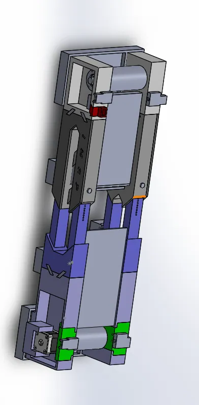

# SYSTÈME CONVOYEUR

**[ACCUEIL](../README.md)  -                                                                                                               [SYSTEMES](../README.md)**                                                                                                                                                                       

# SYSTÈME CONVOYEUR : CONCEPTION ET OPTIMISATION

> Note de l'équipe : Cette section détaille les itérations techniques effectuées entre le test de présélection et la finale pour garantir la fiabilité et la précision du transfert des déchets.
> 

---

## I. Objectif du Système

Le convoyeur constitue le lien logistique indispensable entre la **zone de dépôt** et la **zone de tri**. Son rôle est d'acheminer les flux de déchets de manière fluide afin de permettre au bras **Dofbot** d'effectuer une manipulation précise et efficace.

---

## II. Diagnostic : Analyse des défaillances (Test 4)

Lors des phases de test précédentes, plusieurs points critiques ont été identifiés, empêchant une exploitation continue :

- **Structure :** Absence de supports internes provoquant un affaissement de la bande.
- **Transmission :** Perte de puissance motrice due au glissement des courroies.
- **Mécanique :** Montage instable des roulements et alignement approximatif des tambours.
- **Électronique :** Gestion des câbles (cable management) inexistante et Veroboard exposé aux courts-circuits.
- **Thermique :** Surchauffe critique du driver moteur, entraînant sa destruction répétée.

---

## III. Optimisations Mécaniques et Structurelles

Pour pallier ces défauts, une refonte partielle de la structure a été opérée :

1. **Fiabilisation de l'Axe de Rotation :** Adoption d’un **montage de roulements en X** pour une meilleure répartition des charges et une rotation fluide.
2. **Transmission Directe :** Suppression des courroies intermédiaires. Les tambours ont été remodélisés (surfaces lisses) pour un entraînement direct par friction, optimisant le couple moteur.
3. **Renforcement du Tablier :** Ajout de supports rigides sous le tapis pour stopper l’affaissement et garantir une surface de transport plane.
4. **Mise à niveau Ergonomique :** Intégration de supports de base pour fixer la hauteur du tapis à **100 mm du sol**, alignant parfaitement le convoyeur avec le champ d'action du Dofbot.
5. **Protection des Capteurs :** Modélisation et impression 3D de boîtiers de protection pour les émetteurs et récepteurs laser.

---

## IV. Ingénierie Électronique et Fiabilisation

L'unité électronique a été entièrement reconstruite pour garantir la durabilité du système.

### 4.1. Connectique et Intégrité du Signal

L'utilisation de fils Dupont (jumpers) a été abandonnée au profit de **câbles gainés soudés**, bien plus résistants aux vibrations mécaniques. Un code couleur strict a été instauré pour faciliter la maintenance :

- ⚫ **Noir :** Masse (GND)
- 🟡 **Jaune :** Signal (Data)
- ⚪ **Blanc :** Alimentation (5V)

### 4.2. Gestion Thermique et Protection du Driver A4988

Le driver A4988 subissait des pics d'intensité thermique lors du pilotage du moteur Nema 17, provoquant des courts-circuits et des dommages collatéraux sur l'Atmega 328p.

- **Refroidissement Actif :** Installation d'un ventilateur 12V alimenté via la broche VMOT pour une dissipation thermique continue.
- **Filtrage des Pics de Tension :** Ajout d'un **condensateur céramique de 100 nF** en parallèle du condensateur de **100 µF** existant entre VMOT et GND. Cette combinaison permet d'absorber les pics de tension haute fréquence et de stabiliser le courant.

### 4.3. Système d'Alimentation et Régulation

Le système est autonome grâce à un pack de **batteries LiPPo** (4 cellules en série) délivrant une tension nominale de **15.2V**.

- **Régulation Fixe :** Remplacement des modules ajustables (instables) par des régulateurs de tension fixes :
    - **L7805 :** Délivre un 5V stable pour l'ATmega et les capteurs.
    - **L7812 :** Délivre un 12V stable dédié à la puissance du driver moteur.
- **Sécurité :** Intégration d'interrupteurs de sectionnement pour isoler les circuits lors des phases de maintenance.

---