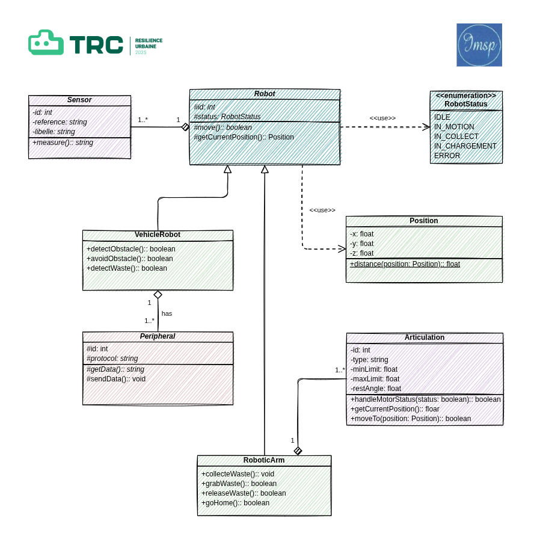

# Test 1: Création d’une classe pour un Robot
## Introduction

Notre robot de collecte de déchet se déplace dans un environnement urbain et industriel en toute autonomie. Pour permettre son déplacement et la collecte autonome des déchets, il est doté de fonctionnalités telles que la détection et l’évitement des obstacles. Il **détecte les déchets au sol**, les **ramasse** et les **trie automatiquement** . L’ensemble de ces fonctionnalités se retrouvent respectivement dans le *Rosmaster X3* pour la mobilité intelligente, et dans le *Dofbot Jetson Nano* pour la vision et la préhension. Nous avons donc opter pour l’agencement complémentaire de ces deux robots afin de constituer un système unifié et performant de collecte et de tri automatisé des déchets.

## Fonctionnement du Robot

Le fonctionnement du robot collecteur et trieur de déchets se décompose en plusieurs étapes séquentielles :

1. **Navigation autonome** : Le robot se déplace dans l’environnement grâce à son système SLAM qui assure la cartographie et la localisation.
2. **Détection des obstacles** : Durant son parcours, le LiDAR du robot identifie les obstacles et ajuste sa trajectoire pour les éviter.
3. **Détection des objets**  : Grâce à l’une de ces caméras  il scrute l’environnement pour localiser les objets au sol.
4. **Analyse et classification** : Dès qu’un objet est repéré, les algorithmes de Deep learning permettent de l’analyser pour déterminer si c’est un déchet ou un obstacle afin de le classifier pour la collecte ou l’évitement .
5. **Collecte du déchet** : Le déchet identifié est saisi par le bras robotisé, qui utilise ses 6 degrés de liberté pour exécuter des mouvements précis.
6. **Tri sélectif** : Le déchet est placé dans le compartiment dédié de la corbeille posée sur la plateforme du robot, selon sa classification, après que ce dernier s’est assuré que la corbeille n’était pas pleine.

Ce cycle opère en continu, permettant au robot d’assurer un nettoyage efficace de la zone tout en effectuant un tri automatisé des déchets.

## Diagramme de classe UML

Au cœur de notre système de collecte des déchets se trouve la classe abstraite **Robot**. Cette classe définit les fonctionnalités de base communes à tous les types de robots du système, notamment le déplacement via la méthode move(). Pour percevoir son environnement, elle utilise des capteurs (**Sensors),**établissant ainsi une relation d'association fondamentale entre les robots et leurs systèmes de perception.

La classe **VehicleRobot**, quant à elle, est une spécialisation concrète d’un Robot. Elle hérite des fonctionnalités de base et ajoute des capacités de navigation autonome avancées. Elle implémente des méthodes de détection et d’évitement d’obstacles, ainsi que d’identification des déchets. Pour accomplir ces tâches, le robot véhicule utilise une collection de périphériques ( **Peripherals**), créant une relation d’agrégation qui permet l’intégration de divers équipements spécialisés.

Parmi  ces périphériques on peut avoir une corbeille pour recueillir les déchets collectés. Le bras robotique représenté (**RoboticArm)** est lui aussi modélisé comme un robot à part entière, capable de se mouvoir de manière autonome et disposant de son propre état et permet la manipulation physique des déchets. Notre architecture se veut ainsi modulaire et hiérarchisée, permettant une gestion efficace et évolutive du processus de collecte.

### **Description textuelle du diagramme de classe**

### Classe **Robot** (abstraite)

La classe `Robot` est au cœur de l’architecture. Elle regroupe les **comportements de base** communs aux différents robots de notre système ( ce qui justifie le fait qu’elle soit abstraite ), notamment :

- `move()`: déplacement autonome basé sur les informations des capteurs.

Elle **compose la classe `Sensor`**, c’est-à-dire qu’un robot intègre nécessairement un ou plusieurs capteurs pour interagir avec son environnement. Cette relation de **composition forte** signifie qu’un capteur n’a pas d’existence fonctionnelle sans le robot auquel il est intégré.

### Classe **Sensor**

La classe `Sensor` modélise les différents **capteurs embarqués**, qu’ils soient visuels (caméra du Dofbot ou du *Rosmaster X3*), de distance (LiDAR du Rosmaster), ou autres. Chaque capteur possède :

- un identifiant,
- un libellé  (camera, LiDAR , etc.),
- une référence,
- une valeur mesurée,

L’encapsulation privée des attributs des capteurs s’explique par le fait qu’ils constituent les caractéristiques uniques d’un capteur.

- une méthode `measure()` pour obtenir une nouvelle lecture.

Elle est **composée dans `Robot`** car tout comportement intelligent repose sur une perception du monde extérieur. Le robot y accède pour prendre ses décisions de mouvement ou de collecte.

### Classe **VehicleRobot** (spécialisation de `Robot`)

La classe `VehicleRobot` hérite de la classe `Robot`. Elle **représente le robot mobile principal**, qui assure le transport, la navigation et la coordination des actions.

En plus de la méthode héritée `move()` qui est surchargée, elle possède ses propres capacités spécifiques comme :

- `detect_obstacle()` : détection d’un obstacle.
- `avoid_obstacle()` : manœuvre d’évitement.
- `detect_waste()` : localisation des déchets au sol.

Elle joue aussi un rôle central en **agrégeant des périphériques** (relation d’agrégation avec la classe `Peripherals`). Cette agrégation reflète une **connexion souple et modulaire** : les périphériques (corbeille, etc.) peuvent être associés ou dissociés du robot véhicule sans affecter sa structure fondamentale.

### Classe **RobotStatus** (Enumération)

C’est une classe qui permet d’énumérer les différents états possibles du robot.

Les etats possibles du robot sont :

### Classe **RoboticArm** (spécialisation de `Robot`)

`RoboticArm` est une spécialisation concrète de la classe `Robot`. Elle représente un **bras articulé avec intelligence embarquée** .

Elle implémente  :

- `grabWwaste()` : pour saisir un déchet.
- `releaseWaste()` : pour déposer le déchet dans un compartiment.
- `collecteWaste()` : pour collecter un déchet.

et elle surcharge `move()` héritée de `Robot`. 

Fonctionnellement, cette classe incarne la **manipulation physique des déchets**, en se basant sur les informations fournies par les capteurs de vision. Elle reçoit des commandes du véhicule robot pour la collecte des déchets venant compléter sa mission de détection des déchets.

### Classe **Peripherals** (abstraite)

`Peripherals` est une classe abstraite qui regroupe les **éléments externes connectés au robot mobile**. C’est une **généralisation** des composants qu’on peut ajouter au véhicule comme la corbeille. Elle comprend des attributs techniques :

- `identifiant` , `protocol,` etc.
- une méthode `getData()` pour recevoir des données du robot mobile.
- et une autre `sendData()` pour envoyer des informations au robot mobile.

Le protocole, qui est le moyen par lequel les périphériques et le véhicule communiquent, est propre à chaque périphérique et doit être utilisable par le `VehicleRobot` grâce à des getters et des setters. Donc il  est protégé.

La **relation d’agrégation** avec `VehicleRobot` est essentielle : le robot mobile gère dynamiquement ses périphériques et leur envoie des commandes selon le contexte (détection de déchet, tri). Cela reflète l’organisation réelle de ton système : le Rosmaster sert de plateforme centrale à laquelle sont rattachés des modules spécialisés.

### **Récapitulatif des relations**

- **Héritage** :
    - `VehicleRobot` et `RoboticArm` héritent de `Robot` car ce sont des versions spécialisées du robot général, conçues pour se déplacer et interagir dans l’environnement.
- **Composition** :
    - `Robot` est en composition avec `Sensor` car les capteurs font partie intégrante du robot : sans eux, il ne peut percevoir son environnement. Ils sont indispensables à son fonctionnement.
- **Agrégation** :
    - `VehicleRobot` est en agrégation avec `Peripherals` car il peut intégrer différents périphériques comme des extensions amovibles, sans que ceux-ci dépendent entièrement de lui.

---

---

---

---

---

---

---